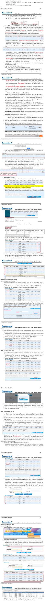

# Huóng dan sur dung:

# Di dën sheet có thông tin lién kêt:

Nhng ni dung có lièn kêt dén sheet chúa thòng tin khi dua chut dën s hin thi bi€u

tugng:

Click chut vào ni dung dó se dn dën sheet chúa thòng tin cän tim.

# Quay tr lai So dò ban däu

# HOME

Click vào bieu tugng quay ve so do ban dau.

phía trên cung góc trái các sheet chúa thông tin de

# 3Zoom in / Zoom out

Nguòi dùng có thé zoom in (phóng to) / zoom out (thu nh) màn hinh d€ thun tin xem các thông tin trong sheet bng cách:

Cách 1: Dé chut  vi trí cän zoom trên màn hình: Zoom in: Gi' phím Ctrl $^ +$ Ln chut lèn. Zoom out: Gi phím Ctrl $^ +$ Ln chut xung.

Cách 2: S dung chúc nng zoom  góc phái duói cung màn hinh

4.Truòng hgp click chut vào màn hình nhieu ln làm toàn màn hinh trång, khòng hin thi thông tin $= >$ Nhn phím "ESC" dé hin thi lai thông tin.

<table><tr><td rowspan=23 colspan=2>2.1.Chuyn tin nhp khu dch </td><td></td></tr><tr><td rowspan=1 colspan=1>HOA HONG MOI GIÓI</td></tr><tr><td rowspan=1 colspan=1>PHI MOI GIÓI VAN CHUYEN</td></tr><tr><td rowspan=1 colspan=1>CUÓC PHI VAN CHUYEN HANG</td></tr><tr><td rowspan=1 colspan=1>PHÍ THUÉ NGOAI LAM THU TUC XNK</td></tr><tr><td rowspan=1 colspan=1>PHI GIA CONG</td></tr><tr><td rowspan=1 colspan=1>TT HOA HONG/THU/ CHI H CUÓC PHI VAN CHUYÉN</td></tr><tr><td rowspan=1 colspan=1>MUA/VN CHUYÉN LINH KIN, VÄT TU, HÁI DO, XÄNG DÄU...</td></tr><tr><td rowspan=1 colspan=1>PHÍ DAI LY LAM THU TUC CHO TAU TAI CÁNG NUÓC NGOAI</td></tr><tr><td rowspan=1 colspan=1>TT CHO THUYÉN TRUÖNG, THUYÉN VIÉN THÔNG QUA DAI LY</td></tr><tr><td rowspan=1 colspan=1>PHÍ THÔNG TIN LIEN LAC CÚA TAU CHO NHA CUNG CÁP D!CH VU</td></tr><tr><td rowspan=1 colspan=1>PHI SúA CHÜA CON TAU</td></tr><tr><td rowspan=1 colspan=1>CHI PHÍ LIÉN QUAN HQP TÁC DU HQC</td></tr><tr><td rowspan=1 colspan=1>PHI/HOA HONG D!CH VU/DAI LY DU L!CH / BÁN VÉ MÁY BAY</td></tr><tr><td rowspan=1 colspan=1>TT HQP DONG TÁI BÁO HIEM</td></tr><tr><td rowspan=1 colspan=1>PHÍ CHUYÉN GIAO CÔNG NGHE</td></tr><tr><td rowspan=1 colspan=1>THANH TOÁN TIÉN BÁN QUYÉN (S DUNG PHÁN MÉM, PHÁT HANH SÁCH, PHÁT SÓNG PHIM ÁNH .)</td></tr><tr><td rowspan=1 colspan=1>TIEN LIEN QUAN DÉN KHAI THÁC TRO CHOI DIN TU</td></tr><tr><td rowspan=1 colspan=1>PHÍ CHUYÉN NHUQNG BÁN QUYÉN S DUNG HINH ÁNH / LOGO / TRADEMARK</td></tr><tr><td rowspan=1 colspan=1>PHI NHUQNG QUYÉN THUONG MAI</td></tr><tr><td rowspan=1 colspan=1>PHI MÒI DI TUYÉN/DN VIEN/CA SI NUÓC NGOAI BIEU DIÉN</td></tr><tr><td rowspan=1 colspan=1>í H V KHÁC (Kim tra chát lung hng/ Dánh gi h thng/Giám djnh tn tht/ Qung co trén Wel</td></tr><tr><td></td></tr><tr><td rowspan=10 colspan=2>2.2.Chuyén tién cuóc phí/lé phíchiphi khac</td><td rowspan=1 colspan=1>CUC PHI GÜI HANG MÄU VE</td></tr><tr><td rowspan=1 colspan=1>HOA HONG MÔI GIÓI XUÁT KHÁU LAO DNG</td></tr><tr><td rowspan=1 colspan=1>PHI CAP CHUNG CHI DI BIEN CHO THUYEN VIEN</td></tr><tr><td rowspan=1 colspan=1>PHí C TAU</td></tr><tr><td rowspan=1 colspan=1>PHI QUA EO BIEN</td></tr><tr><td rowspan=1 colspan=1>CHI PHí Cú NGUÒI CÔNG TÁC / HQC TÅP / KHÁO SÁT /THAM DU HI THÁO / CUC HQP QUÓC TE</td></tr><tr><td rowspan=1 colspan=1>TT PHI HI VIEN CHO TO CHUC QUÓC TE</td></tr><tr><td rowspan=1 colspan=1>CHI PHÍ THAM GIA HI CHQ / TRIÉN LÄM DO DV NUÓC NGOAI TÓ CHUC</td></tr><tr><td rowspan=1 colspan=1>CHUYÉN TIEN PHUC VU HOAT DNG CÚA VP DAI DIN  NUÓC NGOAI</td></tr><tr><td rowspan=1 colspan=1>PHÚY THÁC TU PHÁP RA NUÓC NGOÀI</td></tr><tr><td></td><td></td><td></td></tr><tr><td rowspan=4 colspan=2>Chuyen tien thanh toán cáckhoan lai phat/boi thuòng/hoànúng lién quan XK, NK hang hóa/ich vu</td><td rowspan=1 colspan=1>LI PHAT / LÄI TRÁ CHAM THANH TOÁN</td></tr><tr><td rowspan=1 colspan=1>BÔI THUòNG XUÁT KHÁU HH/DV</td></tr><tr><td rowspan=1 colspan=1>HOAN TRÁ TIEN ÚNG TRUÓC</td></tr><tr><td rowspan=1 colspan=1></td><td rowspan=1 colspan=1>TIEN PHAT BOC/DÖ HANG CHAM</td></tr><tr><td rowspan=5 colspan=2>Chuyn tiên 1 chiêu</td><td rowspan=1 colspan=1>CHUYÉN THU NHAP VÉ NUÓC CHO NGUÖI NUÓC NGOAI LAM VIC TAI VN</td></tr><tr><td rowspan=1 colspan=1>TAI TRQ, VIEN TRQ THEO CÁC CAM KÉT, THÖA THUN GIÜA NHÀ NUÓC, CHÍNH PHU, CÁC CÁP CHíNH QUYE</td></tr><tr><td rowspan=1 colspan=1>TR, VI TRQ KC PHC HU Q THI TAI, DCH BH CHI TRANH.</td></tr><tr><td rowspan=1 colspan=1>TAI TRQ CHO ÁC CHUONG TRINH, CÁC QU, DÁN DO T CHUC TRONG NUC VA/HOC T CHUC  NUÓC</td></tr><tr><td rowspan=1 colspan=1>NGUON THU HQP PHÁP CHO NGUI KHÔNG CU TRU TU SÓ DU TREN TAI KHOÄN</td></tr><tr><td rowspan=2 colspan=2>CHUYEN TIEN LIEN QUAN VAY, TRÁ CHO NUÓC NGOAI VAYNO</td><td></td></tr><tr><td rowspan=1 colspan=1>VAY, TRÁ NQ NUÓC NGOAI</td></tr><tr><td rowspan=2 colspan=2>CHUYEN TIEN LIEN QUAN HOATDONG DAU TU</td><td rowspan=1 colspan=1>DÁU TU NUÓC NGOAI VAO VN</td></tr><tr><td rowspan=1 colspan=1>DÁU TU RA NUÓC NGOAI</td></tr></table>

# HOME

Quy djnh chung 8. Khung thòi gian xúr ly hò sd   

<table><tr><td rowspan=1 colspan=1>Stt</td><td rowspan=1 colspan=1>Hò sd/Chúmg tir</td><td rowspan=1 colspan=1>Th gian DV güi ò sdhoàn chinh dénTT.NVNHGD/TT.NVNHBB</td><td rowspan=1 colspan=1>Thòi gian TT.NVNHGD/TT.NVNHBBg két qàhon tt x sau khi nhnhò sd hoàn chinh tùDV</td></tr><tr><td rowspan=3 colspan=1>1</td><td rowspan=3 colspan=1>Hò so chuyéntièn di TTTMBG</td><td rowspan=1 colspan=1>Ngày làm viéc tù thú 2 dénthú 6, truóc 14h30</td><td rowspan=1 colspan=1>Truôc 15h30 =&gt; Sacombank CNBG xúly trong ngay lam viec.</td></tr><tr><td rowspan=1 colspan=1>Ngày làm vic tù thú 2 énthú 5, sau 14h30</td><td rowspan=1 colspan=1>Ngay lam viec tiép theo=&gt; Sacombank CNBG x ly truác 9hngay lam vic tiép theo.</td></tr><tr><td rowspan=1 colspan=1>Ngày làm vic thú 6, sau14h30</td><td rowspan=1 colspan=1>Ngay làm vic dàu tién cùa tun tiéptheo =&gt; Sacombank CNBG x ly truc9h cúa ngày làm vic dàu tién cua tuntiép theo.</td></tr><tr><td rowspan=4 colspan=1>5</td><td rowspan=4 colspan=1>Hò so TtQtvà BLQT khác</td><td rowspan=1 colspan=1>Ngy làm victù thú 2 dnthú 6, truác 16h.</td><td rowspan=1 colspan=1>Trong ngay làm viéc.</td></tr><tr><td rowspan=1 colspan=1>Ng làm vic t thú2 dénthúr 5, sau 16h.</td><td rowspan=1 colspan=1>Ngày làm vic tiép theo.</td></tr><tr><td rowspan=1 colspan=1>Ngay làm vic thúr 6, sau16h</td><td rowspan=1 colspan=1>Ng am i u ién a tn iétheo</td></tr><tr><td rowspan=1 colspan=2>Ctrug hp goai l Hsd (gia han  sug chúg  huphí gia han; (ii) hach toán chuyén ngun/tra phi; (iv) cháp nhn/hoàntrå/hùy BCT: TT.NVNHGD/TT.NVNHBB xú ly trong vòng 01 ngày làmvic ké tu sau ngày nhn hò so hoàn chinh túDV.</td></tr></table>

# Quy định chung - 1.1. Giao nhận hồ sơ/chứng từ TTQT/BLQT Khi

ĐV thu thập đầy đủ chứng từ phù hợp với mục đích chuyển tiền/nhu cầu khác của KH theo quy định. Nghiêm cấm chỉnh sửa, lập hồ sơ/chứng từ chứng minh mục đích TTQT hộ KH.   
Ký nhận và ghi rõ ngày giờ nhận.

ĐV chịu trách nhiệm kiểm tra và xác thực chữ ký, mộc dấu/chữ ký điện tử trên các văn bản yêu cầu/chỉ thị/phản hồi của KH đảm bảo phù hợp với bộ chữ ký hữu quyền của chủ tài khoản/thông tin chữ ký số đã đăng ký với Sacombank (cá nhân không cần dấu mộc). Nếu có phát sinh chỉnh sửa, đảm bảo có chữ ký xác nhận của KH trên nội dung chỉnh sửa.

Trường hợp cùng 1 hợp đồng/bộ hồ sơ nhưng KH chia nhỏ thành nhiều lần giao dịch, ĐV có thể sử dụng lại chứng từ không thay đổi và có giá trị giao dịch để chứng minh mục đích giao dịch ở các lần giao dịch tiếp theo trên cơ sở KH xác nhận trên Giấy đề nghị/Lệnh chuyển tiền/đề nghị chuyển tiền trên IB/...: “Đề nghị Sacombank sử dụng lại chứng từ phát sinh theo Giấy đề nghị/Lệnh chuyển tiền/... ngày…. trị giá…” đồng thời yêu cầu KH bổ sung các chứng từ còn thiếu theo quy định tại Quy trình này, miễn là ĐV kiểm tra đảm bảo hồ sơ lưu trữ tại NH phù hợp và tổng giá trị các lần giao dịch không vượt quá giá trị hợp đồng/giá trị thanh toán của hồ sơ. b. Khi giao hồ sơ/chứng từ TTQT/BLQT cho KH:

Yêu cầu KH ký nhận, ghi rõ họ tên người nhận và ngày giờ nhận lên chứng từ lưu;

Người nhận hồ sơ/chứng từ với Sacombank phải là chính KH (đối với KHCN) hoặc người đại diện hợp pháp (đối với KHTC) hoặc người được ủy quyền bằng văn bản hợp pháp. Trường hợp thông tin người nhận hồ sơ/chứng từ của KHTC chưa được đăng ký với Sacombank, phải thu thập thêm Giấy giới thiệu ký bởi người đại diện hợp pháp và Giấy tờ tùy thân của người nhận, scan lưu đầy đủ Giấy giới thiệu và Giấy tờ tùy thân trên Omnidocs cùng với hồ sơ/chứng từ liên quan.

c. Hồ sơ/chứng từ TTQT/BLQT chuyển từ ĐV về TT.NVNHGD/TT.NVNHBB và ngược lại không cần đóng dấu mộc tròn, chỉ cần thể hiện tên và chức danh của người ký duyệt;

d. Người giao nhận hồ sơ/chứng từ TTQT/BLQT với KH phải là chuyên viên phụ trách TTQT/BLQT tại ĐV hoặc CV/NV Hỗ trợ tại TT.NVNHBB/NVNHGD. Các chức danh khác không phụ trách TTQT/BLQT không được ký giao nhận hồ sơ/chứng từ TTQT/BLQT.

# Quy định chung - 2. Phân định trách nhiệm khi xử lý hồ sơ TTQT/BLQT

2.1. Trách nhiệm ch

Tuân thủ hướng dẫn, phân quyền xử lý hồ sơ TTQT được Ban Tổng giám đốc ban hành trong từng thời kỳ.   
2.2 Trách nhiém cua Dn  tiép nhn

ơn vị tiếp nhận Xác định đúng đối tượng KH sử dụng dịch vụ (vd: tổ chức/cá nhân, người cư trú/không cư trú...).

Đảm bảo KHTC còn hoạt động tại thời điểm thực hiện giao dịch (tham khảo website của Tổng cục thuế http://tracuunnt.gdt.gov.vn). Tìm hiểu kỹ giao dịch, KH đảm bảo giao dịch thanh toán cho hàng hóa/dịch vụ có thật và tuân thủ quy định PCRT trước khi chuyển hồ sơ TTQT về TT.NVNHGD/TT.NVNHBB.

Thực hiện đầy đủ quy định về mua bán ngoại tệ, nộp ngoại tệ theo quy định KDTT.   
Đảm bảo TK đã có đủ nguồn để thực hiện chuyển tiền/thanh toán.   
Mở, sử dụng tài khoản đúng Quy định Nghiệp vụ Huy động vốn.

Đảm bảo KH điền đúng biểu mẫu và đầy đủ thông tin trước khi thực hiện TTQT/BLQT.

Đối với hồ sơ TTQT/BLQT ngoài quy định, ĐV cần tư vấn hồ sơ Trước khi gửi yêu cầu tư vấn, ĐV:

Tìm hiểu đầy đủ các thông tin về số tiền chuyển, người thụ hưởng, mục đích chuyển tiền… đảm bảo hiểu rõ nhu cầu của KH.   
Thu thập và kiểm tra chứng từ KH cung cấp với quy định/hướng dẫn hiện hành và chỉ gửi yêu cầu tư vấn đối với các trường hợp không thỏa quy định hoặc chưa được quy định/hướng dẫn.

Khi gửi yêu cầu tư vấn, ĐV ghi rõ: Nhu cầu của KH;

Vướng mắc/nội dung không phù hợp quy định của hồ sơ/chứng từ/giao dịch;   
Đánh giá, đề xuất sơ bộ của ĐV (nếu có).

Khi nhận kết quả tư vấn, ĐV đảm bảo hiểu rõ nội dung tư vấn trước khi trao đổi, thông tin đến KH.

Quy dinh chung -4. Thé thúc chúng t   

<table><tr><td rowspan=1 colspan=1>Loai chúmg tur</td><td rowspan=1 colspan=1>The thúrc</td></tr><tr><td rowspan=1 colspan=1>a. Chi   thi/yeucàu/de nghi hocphàn hòi bångvn bån cúa KH</td><td rowspan=1 colspan=1>Ban giây có chu ky và däu mc truc tip (ngoai trù chúng tù cúakhách hàng cá nhân không bát buc phâi có dåu mc hoc cóquy dinh khác); hocBan din tù có ch ky s cua KH (dö vói KH ky hop döng su dung&quot;Dich vu giao dich qua email kèm chúng tu da duqc ky só theoThông báo 548/2022/TB-CS&amp;PTSPDN, hoc các vn bân suadi, b sung, thay thé). DV gúi Bán chup màn hinh kët quà kimtra chúng tu có trang thái da duyt ve TT.NVNHGD/TT.NVNHBBthé hin thông tin ve hiu luc cua ch ky só trên h thng Qunly giao dich qua fax (DV dåm båo tt ca các chúng tu KH cungcap có chü ky só dèu duc kiém tra hop lé truôc khi gui chúng tuvè TT.NVNHGD/TT.NVNHBB).</td></tr><tr><td rowspan=1 colspan=1>b. Chúng tù chúngminh muc dichgiao dich</td><td rowspan=1 colspan=1>Ban chính/bân sao y (ngoai tru có quy dinh khác). Khi tiép nhnchúng tu, DV kiém tra ni dung và thé thúc chúng tù KH cungcâp, dam bào dúng quy dinh truóc khi scan hò sd dé luu tru; hocBan din t có s dung chú ky só thay vi chü ky tay và dóng däumc công ty. DV luu y kiém tra thông tin KH và hiu luc ch kysó trèn chúng tu KH cung câp.</td></tr></table>

# Quy định chung - 5. Ngôn ngữ của chứng từ xuất trình

ngôn ngữ là tiếng Việt hoặc tiếng Anh). 5.2 Nếu Chứng từ KH cung cấp khác các ngôn ngữ nêu trên:

a. ĐV hướng dẫn KH xuất trình bản dịch thuật được công chứng/chứng thực bởi cơ quan/tổ chức có thẩm quyền tại VN; hoặc KH tự dịch thuật và xác nhận bản dịch này là đúng và chính xác với chứng từ gốc (ký, ghi rõ họ tên, ngày, nếu tổ chức phải đóng dấu mộc). KH chỉ xuất trình bản dịch lần đầu tiên đối với mỗi mục đích giao dịch.

b. Trường hợp chứng từ dưới 2 trang, KH không xuất trình được các chứng từ theo yêu cầu tại mục (a) và ĐV được phân quyền/TT.NVNHGD/TT.NVNHBB có đủ cơ sở để hiểu, kiểm soát toàn bộ nội dung của chứng từ: ĐV được phân quyền/TT.NVNHGD/TT.NVNHBB xử lý hồ sơ cho KH và không cần dịch thuật.

# 473CV_TTQT_25.02.2019 - V/v mở mã khách hàng/tài khoản trước khi chuyển tiền/thanh toán quốc tế

PHỤ LỤC 1 - I. GIẢI THÍCH TỪ NGỮ  

<table><tr><td>8</td><td>Nguòi cu trú là tó chúc</td><td>a.T chúc tín dung (TCTD), chi nhánh ngân hàng nuóc ngoài dugc thành låp, hoat dng tai Vit Nam theo quy dinh cua Lut Các tó chúc tín dung; bTó chúc kinh té khòng phâi là TCTD duc thành lap, hoat dng kinh doanh tai Vit Nam (sau dåy goi là to chúc kinh t); c. Co quan nhà nuóc, don vi luc lung v trang, tó chúc chính tri, tó chúc chính tri - x hi, tó chúc chính tri x hi - nghè nghip, tó chúc x hi, tó chúc x hi - nghe nghip, quy x hi, quy tù thin cua Vit Nam hoat dng tai VN; d. Vn phòng dai din tai nuóc ngoài cua các tó chúc quy dinh tai các diém a, b và c; e. Co quan dai dien ngoai giao, co quan dai dien lanh su, co quan dai din tai to chúc quôc té cua VN nuóc ngoài; fChi nhánh tai VN cua tó chúc kinh té nuóc ngoãi, các hinh thúc hin din tai VN cua bén nuóc ngoài tham gia hoat dng dau tu theo quy dinh cua pháp lut ve dàu tu, vn phòng dieu hành cua nhà thàu nuóc ngoài</td></tr><tr><td>9</td><td>Nguòi không cu&#x27; trú là tô chúc</td><td>Tó chúc không thuc khoan 8.</td></tr></table>

Yéu cu khách hàng thanh toán quc té (TTQT) mò må khách hàng (KH) và m tài khoàn thanh toán tai Sacombank (bát buc - ké cà KH cá nhn) truác khi cung cáp dich vu TTQT cho KH ngoai tru các truòng hgp sau (khng båt buc m tài khoan):

- Chuyén tien ra nuóc ngoài cho myc dich chuyén thu nhp hgp pháp cua nguài không cu trú mà nguài chuyén là nguòi có thu nhp hgp pháp. - Chuyén tièn dinh cu mà nguòi chuyén là nguòi di dinh cu. -Chuyén tièn du hoc di Nht và Hàn Quc mà nguòi chuyén là du hc sinh.

QUY ĐỊNH CHUNG - GIẢI THÍCH TỪ NGỮ   

<table><tr><td rowspan=1 colspan=1>Stt</td><td rowspan=1 colspan=1>Tü ngr</td><td rowspan=1 colspan=1>Giai thích</td></tr><tr><td rowspan=1 colspan=1>1</td><td rowspan=1 colspan=1>Ban chinh</td><td rowspan=1 colspan=1>(Bån có dóng dáu &quot;Original&quot;; hogic(b) Ban in trén giay tièu de mau cúa don vi phat hành chúng tù;hoäcBan gidy c6 ch k và dàu mc tryc tiép;hoicBndinth  s p g tch.</td></tr><tr><td rowspan=1 colspan=1>2</td><td rowspan=1 colspan=1>Bin sao</td><td rowspan=1 colspan=1>(a) Bán dóng dáu &quot;Copy&quot;; hoäic(Ban photocopy tù ban chinh có xác nhân dä di chiéu banchinh cua CKS; hocBan fax/scan/chup.</td></tr><tr><td rowspan=1 colspan=1>3</td><td rowspan=1 colspan=1>Ban sao y</td><td rowspan=1 colspan=1>(a) Bán dóng dau &quot;Chúng thyc ban sao dúng vdi ban chinh&quot;cua co quan có thâm quyen; hojic(b) Bán dóng dáu xác nhån bån sao dúng vói ban chinh cüaDoanh nghiép lp ban chinh.</td></tr></table>

  
Chứng từ (\*) tại B10: Phiếu thu thập thông tin (BM-TTQT.TT.11)/Xác nhận của ĐV về việc KH đã được cấp tín dụng (mục đích bổ sung vốn lưu động/kinh doanh ngắn hạn)/Phiếu đề xuất hạn mức chuyển tiền ra nước ngoài (BM-TTQT.TT.06)/Phiếu đề xuất hạn mức chuyển tiền ra nước ngoài (Áp dụng đối với KH do PGD giới thiệu) (BM-TTQT.TT.08) (nếu phát sinh theo hướng dẫn ban hành trong từng thời kỳ).

# Ghi chú:

Quy trình này áp dụng đối với giao dịch tại quầy.

Trường hợp giao dịch trực tuyến (IB)/chuyển tiền qua Moneygram (MG), quy trình thực hiện tương tự, ngoại trừ:

B1: Yêu cầu chuyển tiền của KH trên kênh giao dịch trực tuyến thay thế Lệnh chuyển tiền bản chính (BM_TTQT.TT.01)/LCT Moneygram (BM-TTQT.CTNNMG.01 theo QĐ 68/2019/QĐ-VBLQ và/hoặc các văn bản sửa đổi bổ sung, thay thế trong từng thời kỳ).   
B11: Trường hợp giao dịch trực tuyến:

au khi hồ sơ đã được kiểm tra phù hợp, CV tại ĐV chuyển giao dịch chuyển tiền trên IB về TT.NVNHG và CV tại TT.NVNHGD duyệt giao dịch trên IB.

Tài liệu: “Hướng dẫn sử dụng Hệ thống Chuyển tiền Quốc tế trực tuyến – e.FT” B12: Trường hợp chuyển tiền qua MG:

CV nhập thông tin giao dịch, hạch toán thu phí, hạch toán chuyển tiền trên T24 rare và giao dịch chuyển tiền đi trên Agent Portal, xuất hóa đơn và lưu Omni (sau khi CKS kiểm tra hồ sơ phù hợp). CKS kiểm tra lại thông tin CV nhập liệu trên Agent Portal, số tham chiếu MG và duyệt giao dịch trên T24 rare.

Tài liệu: Hướng dẫn sử dụng chương trình Agent Portal và QĐ 68/2019/QĐ-VBLQ v/v ban hành Dịch vụ chuyển tiền ra nước ngoài qua Moneygram và hoặc các văn bản sửa đổi bổ sung, thay thế trong từng thời kỳ.

Trường hợp Giao dịch không thành công: NHNNg hoàn trả tiền về do không đúng tên, số tài khoản, không phù hợp chính sách riêng của NHNNg, theo yêu cầu của người thụ hưởng…: ĐV được phân quyền/TT.NVNHGD thực hiện tại B15:

Lưu điện hoàn tiền của NHNNg vào Omnidocs ứng với số ref của hồ sơ đã chuyển;   
Cập nhật trạng thái hồ sơ trên Chương trình QLHSTT và ĐNTT theo quy định tại Phụ lục 1.4.   
ĐV xử lý ngoại tệ trả về (nếu có) theo Quy trình Kinh doanh tiền tệ.

PHỤ LỤC 1.2 - I. PHẠM VI KIỂM TRA VÀ PHÂN ĐỊNH TRÁCH NHIỆM   

<table><tr><td rowspan=2 colspan=1>Stt</td><td rowspan=2 colspan=1>Pham vi kiém tra</td><td rowspan=1 colspan=2>Trách nhim</td><td rowspan=2 colspan=1>Ghi chú</td></tr><tr><td rowspan=1 colspan=1>DV</td><td rowspan=1 colspan=1>TT.NVNHGD</td></tr><tr><td rowspan=1 colspan=1>Thô</td><td rowspan=1 colspan=1>Thông tin chung</td><td rowspan=1 colspan=1></td><td rowspan=1 colspan=1></td><td rowspan=1 colspan=1></td></tr><tr><td rowspan=1 colspan=1>1</td><td rowspan=1 colspan=1>Kiém tra thng tin vPCRT,   TTKB,TTPBVKHDHL</td><td rowspan=1 colspan=1>x</td><td rowspan=1 colspan=1></td><td rowspan=1 colspan=1>Khoàn 3 Muc IV Quy dinhchung cúa Quy trinh nay.</td></tr><tr><td rowspan=1 colspan=1>2</td><td rowspan=1 colspan=1>Xác dinh tu cách cutrú cùa KH</td><td rowspan=1 colspan=1>x</td><td rowspan=1 colspan=1>$x(</td><td rowspan=1 colspan=1>Muc I cüa Phy luc 1.</td></tr><tr><td rowspan=5 colspan=1>3</td><td rowspan=1 colspan=1>H so chúng tùkhách hàng cungcáp:</td><td rowspan=1 colspan=1></td><td rowspan=1 colspan=1></td><td rowspan=1 colspan=1></td></tr><tr><td rowspan=1 colspan=1>Theé thúc chúng tr</td><td rowspan=1 colspan=1>x</td><td rowspan=1 colspan=1></td><td rowspan=1 colspan=1>Khoaàn 4 Muc IV Quy dinhchung cua Quy trinh nay.</td></tr><tr><td rowspan=1 colspan=1>Ngôn ng cùa chúngtu</td><td rowspan=1 colspan=1>$x(</td><td rowspan=1 colspan=1>$×()</td><td rowspan=1 colspan=1>Khoãn 5 Muc IV Quy dinhchung cua Quy trinh nay.</td></tr><tr><td rowspan=1 colspan=1>Duloai chúng tù theomuc dich chuyén tien</td><td rowspan=1 colspan=1>x</td><td rowspan=1 colspan=1>$x()</td><td rowspan=1 colspan=1>Phy luc 1.1.</td></tr><tr><td rowspan=1 colspan=1>Tinh hop ly cua cácchúng tù</td><td rowspan=1 colspan=1>$ (</td><td rowspan=1 colspan=1>$x(</td><td rowspan=1 colspan=1>- Khoàn 6 Muc II cùa Phy lucnày- Diém 1.4 Khoan 1 Muc IV Quydinh chung cua Quy trinh nay.</td></tr><tr><td rowspan=1 colspan=1>4</td><td rowspan=1 colspan=1>Tai khoan su dung</td><td rowspan=1 colspan=1>x</td><td rowspan=1 colspan=1>$x()</td><td rowspan=1 colspan=1>Khoan 5 Muc II cùa Phy lucnay.</td></tr><tr><td rowspan=1 colspan=1>5</td><td rowspan=1 colspan=1>Yéu càu dac biet khichuyén tièn lièn quanvay, traà no nuócngoà và dau tu</td><td rowspan=1 colspan=1> (</td><td rowspan=1 colspan=1>$x(</td><td rowspan=1 colspan=1>Khoàn 7 Muc II cùa Phy lucnày.</td></tr><tr><td rowspan=1 colspan=1>Di</td><td rowspan=1 colspan=1>Di vói KH cá nhân</td><td rowspan=1 colspan=1></td><td rowspan=1 colspan=1></td><td rowspan=1 colspan=1></td></tr><tr><td rowspan=1 colspan=1>67</td><td rowspan=1 colspan=1>Han múc chuyén tiènra nuóc ngoài cua cánhånThong tin nguòi thyhuàng à nuác ngoài</td><td rowspan=1 colspan=1>xx</td><td rowspan=1 colspan=1>$x×()</td><td rowspan=1 colspan=1>Diem 3.1 Khoan 3 Muc II cuaPhy luc nay.Diém 4.1 Khoàn 4 Muc II cùaPhy luc nay.</td></tr><tr><td rowspan=1 colspan=1>Di</td><td rowspan=1 colspan=1>Di vói KH to churc</td><td rowspan=1 colspan=1></td><td rowspan=1 colspan=1></td><td rowspan=1 colspan=1></td></tr><tr><td rowspan=1 colspan=1>6</td><td rowspan=1 colspan=1>Dieu kien thanh toán,chuyen tièn ra nuócngoài lien quan hoatdng ngoai thuongqua bien giói</td><td rowspan=1 colspan=1>x</td><td rowspan=1 colspan=1></td><td rowspan=1 colspan=1>Khoan 1 Muc II cúa Phy lucnày.</td></tr><tr><td rowspan=1 colspan=1>7</td><td rowspan=1 colspan=1>Dieu kien thanh toán,chuyén tien trà truócra nuóc ngoài di vóiKH t chúc</td><td rowspan=1 colspan=1>x</td><td rowspan=1 colspan=1></td><td rowspan=1 colspan=1>Khoan 2 Muc II cúa Phy lucnày.</td></tr><tr><td rowspan=1 colspan=1>8</td><td rowspan=1 colspan=1>Han múc cáp cho KHthyc hièn TT tràtruóc và TT thanhtoán tien mua hàngcó lièn quan hoatdng ngoai thuangqua bien giói</td><td rowspan=1 colspan=1>x</td><td rowspan=1 colspan=1></td><td rowspan=1 colspan=1>Tit 3.2.1 Diém 3.2 Khoàn 3Muc Il cúa Phy luc nay.</td></tr><tr><td rowspan=1 colspan=1>9</td><td rowspan=1 colspan=1>S du khà dung cuaTKHQ di vói hò sachuyén tièn hànghóa tra sau</td><td rowspan=1 colspan=1>×</td><td rowspan=1 colspan=1></td><td rowspan=1 colspan=1>Tit 3.2.2 Diém 3.2 Khoàn 3Muc II cúa Phy luc này.</td></tr><tr><td rowspan=1 colspan=1>10</td><td rowspan=1 colspan=1>Thòng tin nguài thuhuàng à nuác ngoài</td><td rowspan=1 colspan=1>x</td><td rowspan=1 colspan=1>$x()</td><td rowspan=1 colspan=1>Diém 4.2 Khoân 4 Muc II cúaPhy luc nay.</td></tr><tr><td rowspan=1 colspan=1>11</td><td rowspan=1 colspan=1>Hò sa gia han TT tratruóc</td><td rowspan=1 colspan=1>$x(</td><td rowspan=1 colspan=1>$x()</td><td rowspan=1 colspan=1>Phy luc 1.4.</td></tr><tr><td rowspan=1 colspan=1>12</td><td rowspan=1 colspan=1>Ho so b sung TT tratruóc</td><td rowspan=1 colspan=1>$x(</td><td rowspan=1 colspan=1>$x()</td><td rowspan=1 colspan=1>Phy luc 1.4.</td></tr></table>

ng vDVuc phn qun kim  theo hy lucy hoc theoThng   
Ban Tng giám döc trong tùng thài ky.   
(\*) TT.NVNHGD không kiêm tra néu DV dugc phân quyen kim tra hò sα.

DV duoc phân quyen: là Tát cà các CN

Pha vi pn qun: muc ích chué tindu hoc, hang hóa ta truc, ng hóa t sau nhp kháu vào trong nuóc. Ghi chú: DV phåi låp PHIÉU KIÉM TRA (theo huóng dn cua TT.NVNHGD), ky xác nhán Hò sa hgp lé theo quy dinh" bao gòm chú ky cúa nguòi lap và nguòi kiém soát. Hò so chuyén vè TT.NVNHGD phåi bao göm PHIÉU KIÉM TRA.

<table><tr><td>Loai sai bit</td><td>Hinh thúc giái quyét</td></tr><tr><td>Chúng tù không thé hin/thé hin sai: sö/ngày Hgp dông, s/ngày Hóa don, tên/dja chi nguòi XK/NK, tên/dja chi nguòi chuyén tién/nguòi thu hung trên báo có qua Vietcombank/ngân hàng khác, phuong thúc thanh toán, ... mà các sai bit này không làm thay di bân chât ho so (muc dích, ni dung giao djch), nhâm lân vói hô sσ khác và các thòng tin còn lai khóp dúng. Tr! giá trên TKHQ, Chúng tù báo có, .. cao hon/tháp hon</td><td>Châp nhn cn cú giái trình hgp ly cûa KH bång vn</td></tr><tr><td>so vói Lnh chuyén tién/Hóa don/Hgp dông/Thôa thun hoàn trâ tién/... (hoc nguc lai) do làm tròn sô thp phân hoc không quá 100 usD (hoc ngoai t khác tuong duong).</td><td>bán (hoc trên LCT/Giáy dé nghi/Giáy yêu câu/...).</td></tr><tr><td>TKHQ b sung cho ho sσ TT trå truóc hàng hóa thé hin ngày hoan thành kiém tra và/hoc ngày thòng quan truóc ngàay thanh toán trá truóc.</td><td></td></tr></table>

# OME Quy định chung - 3. Quy định về kiểm tra thông tin liên quan đến phòng, chống, rửa tiền, tài trợ khủng bố, tài trợ phổ biến vũ khí hủy diệt hàng loạt ĐV, TT.NVNHBB kiểm tra thông tin trong hồ sơ TTQT trước/trong khi thực hiện giao dịch và hồ sơ KH bổ sung với thông tin mới trên cơ sở:

Đảm bảo thoả điều kiện về PCRT, TTKB, TTPBVKHDHL: đối tượng tham gia vào giao dịch và/hoặc bất kỳ thông tin có liên quan trong giao dịch (bao gồm nhưng không giới hạn các thông tin như: tên cá nhân/tổ chức có liên quan, ngân hàng, quốc gia, hàng hóa/dịch vụ, nơi/cảng đi, nơi/cảng đến, nguồn gốc xuất xứ của hàng hóa, tên con tàu/cờ tàu/quốc tịch tàu, …) đều không thuộc danh sách đen; danh sách trì hoãn giao dịch; danh sách cấm vận, trừng phạt và/hoặc bất kỳ danh sách nào khác có nội dung cấm/phong tỏa/ngăn chặn/hạn chế vì có liên quan đến PCRT, TTKB, TTPBVKHDHL được ban hành bởi cơ quan có thẩm quyền tại Việt Nam và/hoặc bởi các cơ quan/tổ chức quốc tế, quốc gia khác bao gồm nhưng không giới hạn: Liên Hợp Quốc (UN), Lực lượng đặc nhiệm tài chính quốc tế (FATF), Hoa Kỳ (US), Cộng đồng chung Châu Âu (EU) và bất kỳ các cơ quan/tổ chức khác mà Sacombank đã thực hiện cam kết tuân thủ trong từng thời kỳ.

b. ĐV/TT.NVNHGD/TT.NVNHBB kiểm tra hồ sơ trên cơ sở phù hợp Quy định PCRT, TTKB, TTPBVKHDHL hiện hành và/hoặc các văn bản sửa đổi, bổ sung, thay thế trong từng thời kỳ.

<table><tr><td rowspan=1 colspan=1>Stt</td><td rowspan=1 colspan=1>Ni dung</td><td></td></tr><tr><td rowspan=1 colspan=1>1</td><td rowspan=1 colspan=1>Trách nhim kiém tra</td><td rowspan=1 colspan=1>CN/PGD (TT.TTQT không hu kiém)</td></tr><tr><td rowspan=1 colspan=1>2</td><td rowspan=1 colspan=1>Kénh kiém tra</td><td rowspan=1 colspan=1>Chuong trinh AML Express (User Viewer)</td></tr><tr><td rowspan=1 colspan=1>3</td><td rowspan=1 colspan=1>Ni dung kiém tra</td><td rowspan=1 colspan=1>Tát cà thông tin trên tt cà các chúng tù cùa hö so chuyén tièn ra nuóc ngoài, bao gömnhung không giói han:Quóc gia (nhp kháu, xuát kháu, trung chuyén, xuát xú hàng hóa, ...)Tó chúc/cá nhân: Nguòi mua/chuyén tièn, nguòi bán/nhn tién, ngân hàng trunggian/nhn tin, hng vn chuyén, nhà sån xuát, .Con tàu, cò tàu, Cáng/Noi di/dén/trung chuyénTén hàng nhp kháu.</td></tr><tr><td rowspan=1 colspan=1>4</td><td rowspan=6 colspan=1>Nguyên tâc x ly</td><td rowspan=10 colspan=1>Kiém tra nhanh có bát ky thông tin nào trong chúng tù liên quan dén quóc gia cám,han ché giao dich theo Thông báo 806/2019/TB-KTrNB ngày 18/3/2019 và các vnbàn sa dói, bó sung, thay thé trong tùng thòi ky hay không? Néu có lièn quan thìchuyén hö sd ve Phòng Tuân thu dé tham muu vë PCRT.Néu không có thông tin liên quan dén quóc gia cám, han ché giao dich thì kiém trachi tiét tát cà các thông tin trèn chúng t (nhu de cp å muc 3) trèn Chuong trinhAML Express:Néu két quà kiém tra là &quot;KHONG TRÜNG&quot;, CN/PGD chuyén hô so ve TT.TTQTthuc hién giao dich theo quy dinh hién hånh;Néu két quà kiém tra là &quot;TRUNG&quot; hoc CN/PGD không có cd s dé nhn dinhlà &quot;TRÜNG&quot; hoc &quot;KHóNG TRÜNG&quot;, cN/PGD phÀi chuyén hö so vê PhòngTuân Thù dé tham muu vé PCRT;Két quà kiém tra chi có giá tri trong ngày chuyén tièn (bao göm cà két quà kiém tracúa CN/PGD và két quà kiém tra cúa Phòng Tuân thu) Vi ly do nào dó mâ hò so chuyn tièn thuc hin sau ngày kim tra PCRT,CN/PGD phâi kiém tra PCRT lai trên Chuong trinh AML Express vâo ngàychuyên tiên ra nuóc ngoài.Sau khi da có két quà kiém tra PCRT, néu khách hàng bó sung/thay thé chúng tutrong dó có thém mói/thay dói các thông tin ve quóc gia, tó chúc/cá nhân, ..(nhudé câp  mc 3), cN/PGD phài kiém tra các thông tin thêm mói/thay dói trên Chuongtrinh AML Express , dàm bào két quà kiém tra &quot;KHONG TRÜNG&quot; truóc khi chuyénh so ve TT.TTQT dé chuyén tièn ra nuâc ngoài.</td></tr><tr><td rowspan=1 colspan=1></td></tr><tr><td rowspan=1 colspan=1></td></tr><tr><td rowspan=1 colspan=1></td></tr><tr><td rowspan=1 colspan=1></td></tr><tr><td rowspan=1 colspan=1></td></tr><tr><td rowspan=1 colspan=1></td><td rowspan=1 colspan=1></td></tr><tr><td rowspan=1 colspan=1></td><td rowspan=3 colspan=1></td></tr><tr><td rowspan=1 colspan=1></td></tr><tr><td rowspan=1 colspan=1></td></tr><tr><td rowspan=1 colspan=1>5</td><td rowspan=1 colspan=1>Tài liéu tham kho</td><td rowspan=1 colspan=1>Quyét dinh 90/2019/QD-VBLQ ngày 31/07/2019 v/v ban hành Quy dinh v Phòng,chóng rùa tiên;Huóng dân s dung Chuong trinh AML Express và Compliance Link cúa PhòngTuàn thu.(Hoc các VB súa dói, bó sung, thay thé khác trong tüng thòi ky)</td></tr></table>

PHY LUC DANH SÁCH QUOC GIAVUNG LNH TH B! CÁM VAN HOC HAN CHE GIAO DICH ("SANCTIONED COUNTRY) (Ban hånh kèm Thöng báo s63.3.66./2020/QD-TB ngày29/410/2020)   

<table><tr><td rowspan=1 colspan=1>STT</td><td rowspan=1 colspan=1>Quóc gia</td><td rowspan=1 colspan=1>STT</td><td rowspan=1 colspan=1>Quóc gia</td></tr><tr><td rowspan=1 colspan=1>1.</td><td rowspan=1 colspan=1>Afghanistan</td><td rowspan=1 colspan=1>20.</td><td rowspan=1 colspan=1>Moldova</td></tr><tr><td rowspan=1 colspan=1>2.</td><td rowspan=1 colspan=1>Albania</td><td rowspan=1 colspan=1>21.</td><td rowspan=1 colspan=1>Montenegro</td></tr><tr><td rowspan=1 colspan=1>3.</td><td rowspan=1 colspan=1>Belarus</td><td rowspan=1 colspan=1>22.</td><td rowspan=1 colspan=1>Myanmar/Burma</td></tr><tr><td rowspan=1 colspan=1>4.</td><td rowspan=1 colspan=1>Bosnia and Herzegovina</td><td rowspan=1 colspan=1>23.</td><td rowspan=1 colspan=1>North Korea/ Democratic People&#x27;sRepublic of Korea</td></tr><tr><td rowspan=1 colspan=1>5.</td><td rowspan=1 colspan=1>Burundi</td><td rowspan=1 colspan=1>24.</td><td rowspan=1 colspan=1>North Macedonia/Macedonia</td></tr><tr><td rowspan=1 colspan=1>6.</td><td rowspan=1 colspan=1>Central African Republic</td><td rowspan=1 colspan=1>25.</td><td rowspan=1 colspan=1>Republic of Guinea</td></tr><tr><td rowspan=1 colspan=1>7.</td><td rowspan=1 colspan=1>Croatia</td><td rowspan=1 colspan=1>26.</td><td rowspan=1 colspan=1>Republic of Nicaragua</td></tr><tr><td rowspan=1 colspan=1>8.</td><td rowspan=1 colspan=1>Cuba</td><td rowspan=1 colspan=1>27.</td><td rowspan=1 colspan=1>Russia</td></tr><tr><td rowspan=1 colspan=1>9.</td><td rowspan=1 colspan=1>DemocraticRepublicof theCongo</td><td rowspan=1 colspan=1>28.</td><td rowspan=1 colspan=1>Serbia</td></tr><tr><td rowspan=1 colspan=1>10.</td><td rowspan=1 colspan=1>Egypt</td><td rowspan=1 colspan=1>29.</td><td rowspan=1 colspan=1>Somalia</td></tr><tr><td rowspan=1 colspan=1>11.</td><td rowspan=1 colspan=1>Guinea-Bissau</td><td rowspan=1 colspan=1>30.</td><td rowspan=1 colspan=1>South Sudan</td></tr><tr><td rowspan=1 colspan=1>12.</td><td rowspan=1 colspan=1>Haiti</td><td rowspan=1 colspan=1>31.</td><td rowspan=1 colspan=1>Sudan</td></tr><tr><td rowspan=1 colspan=1>13.</td><td rowspan=1 colspan=1>Hong Kong</td><td rowspan=1 colspan=1>32.</td><td rowspan=1 colspan=1>Syrian Arab Republic (Syria)</td></tr><tr><td rowspan=1 colspan=1>14.</td><td rowspan=1 colspan=1>Iran</td><td rowspan=1 colspan=1>33.</td><td rowspan=1 colspan=1>Tunisia</td></tr><tr><td rowspan=1 colspan=1>15.</td><td rowspan=1 colspan=1>Iraq</td><td rowspan=1 colspan=1>34.</td><td rowspan=1 colspan=1>Turkey</td></tr><tr><td rowspan=1 colspan=1>16.</td><td rowspan=1 colspan=1>Kosovo</td><td rowspan=1 colspan=1>35.</td><td rowspan=1 colspan=1>Ukraine</td></tr><tr><td rowspan=1 colspan=1>17.</td><td rowspan=1 colspan=1>Lebanon</td><td rowspan=1 colspan=1>36.</td><td rowspan=1 colspan=1>Venezuela</td></tr><tr><td rowspan=1 colspan=1>18.</td><td rowspan=1 colspan=1>Libya</td><td rowspan=1 colspan=1>37.</td><td rowspan=1 colspan=1>Yemen</td></tr><tr><td rowspan=1 colspan=1>19.</td><td rowspan=1 colspan=1>Mali</td><td rowspan=1 colspan=1>38.</td><td rowspan=1 colspan=1>Zimbabwe</td></tr></table>

NGAN HANG THUONG MAI CO PHANSAI gON THUONG TINS: 3366/2020/TB-TT

CNG HOA XA HI CHU NGHIA VIET NAM Dc lp - Ty do - Hanh phúc Tp.HCM, ngày29 tháng10 nm 2020

# THONG BAO

un thu quy dinh lién quan dén quóc gia/vùng länh th bi câm vn hoc han ché giac

Cän cú Quyét dinh s6 90/2019/QD-VBLQ ngåy 31/712019 v/v ban hånh Quy dinh v png,chngr tn (QD 90/209/D-VBLQ);

Nhm tun th c quy dinh ca Lut phòng, chng r tèn, cam két a Sacombank vi cc  quan/t chú quc té trong tg thδi k v quy dinh tai QD 90/2019/QD-VBLQ, Tng Giám dc yèu cu các Don vi nghièm túc trién khai và thyc hin các ni dung sau:

Tun thù vic kiém tra thng tin khách hàng và các bén lèn quan trong  sd/giao djch theo quy dh MB.h u tri ph tRT c 0//-BL; uy dinh ni b v PCRT cua NH con/Công ty con (néu phát sinh tai NH con/Công ty con).

Khi kiém tra thng ti khách hàng và các bén lin quan trong  sd/gio dich,éu cóthòng tin trg vi danh sách quóc gia/vúng lånh thó bj ám vn hoc han ché giao dich ("Sanctioned Country" - chi tiét tai Phy luc dinh kèm Thông báo này), Ddn vi luu y thyc hien nhu sau:

Trong quá trinh m må khách hàng và cap nhat thong tin khách

# Truàng hqp ap dyng:

M må khách hàng chuán/vng lai; hoc Cap nht thòng tin khách hàng iDon vi gui hò sd pháp ly cúa khách hång và các thông tin b sung v BP. PCRT - Phòng Tun thé trinh Hi dng Phòng,chng a tien duyt thun truc hi thyc hin.

<table><tr><td rowspan=1 colspan=1>STT</td><td rowspan=1 colspan=1>Thong tin</td><td rowspan=1 colspan=1>Cá nhan</td><td rowspan=1 colspan=1>TO chúrc</td></tr><tr><td rowspan=1 colspan=1>1</td><td rowspan=1 colspan=1>Tén dày du</td><td rowspan=1 colspan=1>x</td><td rowspan=1 colspan=1>x</td></tr><tr><td rowspan=1 colspan=1>2</td><td rowspan=1 colspan=1>Dia chl tai Vit Nam</td><td rowspan=1 colspan=1>x</td><td rowspan=1 colspan=1>x</td></tr><tr><td rowspan=1 colspan=1>3</td><td rowspan=1 colspan=1>Dia chi tai quóc gia mà khách hàng mang quôc tich</td><td rowspan=1 colspan=1>×</td><td rowspan=1 colspan=1></td></tr><tr><td rowspan=1 colspan=1>4</td><td rowspan=1 colspan=1>Ngh nghip</td><td rowspan=1 colspan=1>×</td><td rowspan=1 colspan=1></td></tr><tr><td rowspan=1 colspan=1>5</td><td rowspan=1 colspan=1>Ngành ngh kinh doanh</td><td rowspan=1 colspan=1></td><td rowspan=1 colspan=1>×</td></tr><tr><td rowspan=1 colspan=1>6</td><td rowspan=1 colspan=1>Myc dich thiét låp quan h vói Sacombank (thyc hin sân phám/dich vygi, bao gm sn phám/dich vy có y dinh s dung trong tudng lai)</td><td rowspan=1 colspan=1>x</td><td rowspan=1 colspan=1>×</td></tr><tr><td rowspan=1 colspan=1>7</td><td rowspan=1 colspan=1>Khách hàng có nhu càu thyc hin giao djch thanh toán quc té (TTQT)khòng? Néu có, vui lòng néu r các quc gia lièn quan, mói quan h gianguòi chuyén và nguài nhn, myc dich chuyén tièn</td><td rowspan=1 colspan=1>×</td><td rowspan=1 colspan=1>x</td></tr><tr><td rowspan=1 colspan=1>8</td><td rowspan=1 colspan=1>Néu nguài thành lap/nguài dai din/chù s hu hung lqi/thành vién gópvn cùa t6 chúc,.. có thông tin lièn quan dén quδc gia trong danh sáchSanctioned Country&quot;: thu thap thèm thong tin cua các bén lien quan, baogom: tén dày du, só h chiéu/só dång ky kinh doanh, ngày cáp, noi cáp.quOc tich/qu6c gia noi dang ky kinh doanh, dja chi</td><td rowspan=1 colspan=1></td><td rowspan=1 colspan=1>x</td></tr></table>

Trong quá trinh thuc hièn giao djch mà không bát buc md må khách hàng: Don vi thyc hin tuong ty quy dinh tai Muc 2.a nêu trên.

Trong quá trinh cung cáp san phám djich vy cho khách hång, dc bit làa giao djch TTQT: Néu có bát ky thông tin nào trong hò sd/chúng tu nhu nguài mua, nguòi bán, don vi vn chuyén, càng, ngán hàng chuyén tien/trung gian/thy huòng, phuong tin vn chuyén, hàng hóa,.. có lién quan dén quóc gia trong danh sách Sanctioned Country, Ddn vi gui bân scan hò sd/chúng tù ve BP. PCRT - Phòng Tuân thù dé duc h trq kiém tra và tu vân;

Quy dinh lién quan dén Hong Kong; Russia & Ukraine (tru vüng Crimea và Sevastopol:

i. Ddn vi chù dng quyét djnh m Må khách hàng vång lai hoc thyc hin giao dich cho khách hàng trong truàng hgp khng bát buc m Ma khách hàng;   
ii. Truòng hgp khách hàng c nhu cu s dung sn phám/dich vy theo quy dinh phái mò Ma khách hang chuán, Ddn vi thyc hin tuong ty nhu Muc 2.a nêu trèn;   
iii. Riéng dói vói hò sd TTQT có thòng tin lièn quan dén Hong Kong, Don vj chù dng kiém tra (bng chuang trinh AML Express) và chju trách nhim ve các thông tin trong hò sd/chúng t truác khi chuyén hò sq ve TT. TTQT dé xr ly giao dich.

# Mt s6 luu :

i. Quy dih tai Muc 2.a khngap dg trng truòg hqp hách hng cpht thòng tihg khòng làm phát sinh mói bát ky quóc gia trong danh sách Sanctioned Country.

iQuy dinh tai Muc 2.c không ap dng dói vi các giao djch báo có tu nuác ngoài da dugc kiém tra theo quy dinh tai Myc B..2 Phy luc chudng trinh phòng, chóng ra tin cua QD 90/2019/QD-VBLQ & các h sα TTQT da dugc kiém tra trén chuong trinh Compliance Link.

iiDon vi dc bit luu y dé xác dinh có båt ky thòng tin lién quan dén quóc gia trong danh sách Sanctioned Country hay không và xr ly giao dich theo dúng quy dinh hin hânh trong mt só truòng hqp sau:

Thông tin trén hò sd/chúng tu không néu cy thé tén quóc gia mà thay thé bâng các cum tùr tudng dudng có nghia rng hon (vi dy: "Port of Loading: Any port in Persian Gulf", khu vc Persian Gulf bao göm nhieu quóc gia trong dó có Iran, Iraq...); Thông tin trong h sd/chúng tur không nèu day dù tén quóc gia dn dén nhàm ln gia các quóc gia có tén gn gióng nhau (vi du: "Korea": Republic of Korea và Democratic People's Republic of Korea, "Congo": Democratic Republic of the Congo và Republic of the Congo, ..).

Hò sd/chúg tu gi v BP. PCRT - Phòng Tuân thù theo các kénh sau:

a)Email: bp.pcrt@sacombank.com; hoc

nlttps:/qurhonlie.acobank.comthi éhaithéthe h cúa Tóng giám dôc)   
S din thoai ni b: 2080; 2081; 2082; 2085

Thông báo này có hiu lyc ké tur ngày ky và thay thé cho Thông báo só 806/2019/TB-KTrNB ngày 18/03/2019 v/v tuân thù quy djinh lién quan dén quóc gia/vùng länh th6 bj cám vn hoc han ché giao dich.

Dinh kèm Phy luc Danh sách quóc gia/vüng länh thó bi cám van hoc han ché giao dich.

Trán trong,

Noi nhan:   
- DV.NVNH, CN/PGD, Còng ty/Ngan hàng con "d6 thμc hin Sao kinh gfi:   
- HDQT, BKS, TGD "dé báO cAO   
Lusu Van thu.

NGAN HANG THUONG MAI CO PHANsAI gon tHuOng tInS6:373 /2022/TB-TT

# THONG BAO

# V/v tuán thù các quy dinh vè cám vn

CcThgbá3362020/TB-TT gày 2/102020 vv tn th quy inh l quan n quc aüg  th bj cám van hoc han ché giao dich,

Cukhúg hoång chính tr gia Nga  Ukraine dang din bién phúc tap. Do dó, hm dâm båo tun thùcc quy dinh v m vn cúa các c quan t chúc quc t Tg Giám dc u cu c Don vghm tc tri khai và thyc hin các ni dung sau:

Dic TQT trcòu y qua u tri Copla Lnk:Dgh Don bo sd chúng tuv P.Tuån thú dé dugc tu ván trong tung truòng hgp cu thé néu có thòng tin LiEN QUAN (\*) dén quc gia và/hoc vùng länh thó sau:

(i) Belarus (ii) Russia (ii) Ukraine (iv) Donetsk (v) Luhansk (hoc Lugansk)

Ké tu ngày 28/02/2022, tu chδi/ không thuc hién các giao djch có LIEN QUAN (\*) dén các DC u ú länh thó, to chúc bj cám vän/ han ché giao dich.

<table><tr><td rowspan=1 colspan=1>Tén to chúc tài chinh</td><td rowspan=1 colspan=1>Qu6c gia</td></tr><tr><td rowspan=1 colspan=1>Belarussian Bank of Development and Reconstruction Belinvestbank Joint Stock Company</td><td rowspan=4 colspan=1>Belarus</td></tr><tr><td rowspan=1 colspan=1>Limited Liability Company Belinvest-Engineering</td></tr><tr><td rowspan=1 colspan=1>CJSC Belbizneslizing</td></tr><tr><td rowspan=1 colspan=1>Bank Dabrabyt Joint-Stock Company (Bank Dabrabyt)</td></tr><tr><td rowspan=1 colspan=1>VTB Bank Public Joint Stock Company (VTB Bank)</td><td rowspan=1 colspan=1>Russia</td></tr></table>

Lin tp nht vàtheo di c Thg báo mói tP.Tuánthvhoc T.t v cácyèu cu n tun thú khi thuc hin giao dich TTQT (Luu y: Ké t ngày 26/03/2022, các dinh ché tài chinh và to chúc th

Phu luc 1 và Phu luc 2 dinh kèm Thông báo này s chính thúc bj cäm vân/ han ché giao

Kinh de nghi các Don vi nghiém túc thyc hien theo ni dung Thông báo này. $; \mu ^ { \star }$

Dinh kèm: Phu luc 1 - Danh sách các djnh ché tài chinh bj cám vån hoc han ché giao djch ké tú ngay 26/03/2022; Phy luc 2 - Danh sach các tó chúc kinh té bj cám vån hoc han ché giao djch ké tu ngày 26/03/2022.

Noi nhan:   
- DV. NVNH, CN/PGD, "dé thuc hin", Công ty/ Ngån hàng con   
Sao kinh gùi:   
- HDQT, BKS, TGD "dé báo cáo" Luu vn thu.

PHU LUC 1 DANH SACH CAC DINH CHÉ TAI CHINH B! CÁM VAN HOC HAN CHE GIAO DICH KÉ TU NGAY 26/03/2022 (Ban hånh kèm Thông báo s 31.3.12022/TB-TT ngày:28./2./2022)   

<table><tr><td rowspan=1 colspan=1>STT</td><td rowspan=1 colspan=1>Ten dinh ché tài chinh</td><td rowspan=1 colspan=1>Quoc gia</td></tr><tr><td rowspan=1 colspan=1>1</td><td rowspan=1 colspan=1>PUBLIC JOINT STOCK COMPANY SBERBANK OF RUSSIA</td><td rowspan=5 colspan=1>Russia</td></tr><tr><td rowspan=1 colspan=1>2</td><td rowspan=1 colspan=1>GAZPROMBANK JOINT STOCK COMPANY</td></tr><tr><td rowspan=1 colspan=1>3</td><td rowspan=1 colspan=1>JOIN STOCK COMPANY ALFA-BANK</td></tr><tr><td rowspan=1 colspan=1>4</td><td rowspan=1 colspan=1>JOINT STOCK COMPANY RUSSIAN AGRICULTURAL BANK</td></tr><tr><td rowspan=1 colspan=1>5</td><td rowspan=1 colspan=1>CREDIT BANK OF MOSCOW PUBLIC JOINT STOCK COMPANY</td></tr></table>

# PHU LUC 2

DANH SACH CAC TO CHúC KINH TÉ B! CAM VAN HOC HAN CHE GIAO DICH KÉ TU NGAY 26/03/2022 (Ban hånh kèm Thông báo s631.3./2022/TB-TT ngày:2./2./2022)

<table><tr><td rowspan=1 colspan=1>STT</td><td rowspan=1 colspan=1>Ten cong ty</td><td rowspan=1 colspan=1>Quc gia</td></tr><tr><td rowspan=1 colspan=1>1.</td><td rowspan=1 colspan=1>ARIMERO HOLDING LIMITED</td><td rowspan=23 colspan=1>Russia</td></tr><tr><td rowspan=1 colspan=1>2.</td><td rowspan=1 colspan=1>IKS JOINT STOCK COMPANY</td></tr><tr><td rowspan=1 colspan=1>3.</td><td rowspan=1 colspan=1>INSURANCE COMPANY SBERBANK INSURANCE LIMITED LIABILITY COMPANY</td></tr><tr><td rowspan=1 colspan=1>4.</td><td rowspan=1 colspan=1>INSURANCE COMPANY SBERBANK LIFE INSURANCE LIMITED LIABILITY COMPANY</td></tr><tr><td rowspan=1 colspan=1>5.</td><td rowspan=1 colspan=1>JOINT STOCK COMPANY RASCHETNIYE RESHENIYA</td></tr><tr><td rowspan=1 colspan=1>6.</td><td rowspan=1 colspan=1>JOINT STOCK COMPANY SBERBANK</td></tr><tr><td rowspan=1 colspan=1>7.</td><td rowspan=1 colspan=1>JOINT STOCK COMPANY SBERBANK AUTOMATED TRADE SYSTEM</td></tr><tr><td rowspan=1 colspan=1>8.</td><td rowspan=1 colspan=1>JOINT STOCK COMPANY SBERBANK LEASING</td></tr><tr><td rowspan=1 colspan=1>9.</td><td rowspan=1 colspan=1>JOINT STOCK COMPANY SBERBANK PRIVATE PENSION FUND</td></tr><tr><td rowspan=1 colspan=1>10.</td><td rowspan=1 colspan=1>LIMITED LIABILITY COMPANY MARKET FUND ADMINISTRATION</td></tr><tr><td rowspan=1 colspan=1>11.</td><td rowspan=1 colspan=1>LIMITED LIABILITY COMPANY MARKET FUND ADMINISTRATION</td></tr><tr><td rowspan=1 colspan=1>12.</td><td rowspan=1 colspan=1>LIMITED LIABILITY COMPANY PROMISING INVESTMENTS</td></tr><tr><td rowspan=1 colspan=1>13.</td><td rowspan=1 colspan=1>LIMITED LIABILITY COMPANY SBERBANK CAPITAL</td></tr><tr><td rowspan=1 colspan=1>14.</td><td rowspan=1 colspan=1>LIMITED LIABILITY COMPANY SBERBANK CIB HOLDING</td></tr><tr><td rowspan=1 colspan=1>15.</td><td rowspan=1 colspan=1>LIMITED LIABILITY COMPANY SBERBANK FACTORING</td></tr><tr><td rowspan=1 colspan=1>16.</td><td rowspan=1 colspan=1>LIMITED LIABILITY COMPANY SBERBANK FINANCIAL COMPANY</td></tr><tr><td rowspan=1 colspan=1>17.</td><td rowspan=1 colspan=1>LIMITED LIABILITY COMPANY SBERBANK INSURANCE BROKER</td></tr><tr><td rowspan=1 colspan=1>18.</td><td rowspan=1 colspan=1>LIMITED LIABILITY COMPANY SBERBANK INVESTMENTS</td></tr><tr><td rowspan=1 colspan=1>19.</td><td rowspan=1 colspan=1>LIMITED LIABILITY COMPANY YOOMONEY</td></tr><tr><td rowspan=1 colspan=1>20.</td><td rowspan=1 colspan=1>OPEN JOINT STOCK COMPANY BPS-SBERBANK</td></tr><tr><td rowspan=1 colspan=1>21.</td><td rowspan=1 colspan=1>SB SECURITIES SA</td></tr><tr><td rowspan=1 colspan=1>22.</td><td rowspan=1 colspan=1>SBERBANK EUROPE AG</td></tr><tr><td rowspan=1 colspan=1>23.</td><td rowspan=1 colspan=1>SETELEM BANK LIMITED LIABILITY COMPANY</td></tr></table>

Quy định chung - 7.1. Lưu hồ sơ TTQT   

<table><tr><td rowspan=1 colspan=1>Stt</td><td rowspan=1 colspan=1>H so/chúng tùr luu</td><td rowspan=1 colspan=1>Quy djnh luu tr</td><td rowspan=1 colspan=1>Thòi gian luu</td></tr><tr><td rowspan=1 colspan=1>1</td><td rowspan=1 colspan=1>LC/tu chinh LC XK gôc;BL/tu chinh BL göc;BCT LC/NT gôC;BCT dòi tién theo BL göc;</td><td rowspan=1 colspan=1>Luu vào két sát/kho quy.</td><td rowspan=1 colspan=1>Cho dên khi giao cho KH hocchuyén dén nguòi nhn tiép theo.</td></tr><tr><td rowspan=1 colspan=1>2</td><td rowspan=1 colspan=1>Bán göc Bién lai CPN gi BCT di,có ky nhn cúa nhân viên CPN.</td><td rowspan=1 colspan=1>Tam luu vào file riêng dé kiém tra, dichiéu vói Hóa don dòi tiên cúa Don vi CPNvà xú l các phát sinh (néu có);Dugc phép húy sau thòi gian luu.</td><td rowspan=1 colspan=1>Cho dén khi då thanh toán phícho Don v! CPN.</td></tr><tr><td rowspan=1 colspan=1>3</td><td rowspan=1 colspan=1>Din swift di/dén</td><td rowspan=1 colspan=1>Luu truc tiép trên h thông Swift</td><td rowspan=1 colspan=1>10 nm.</td></tr><tr><td rowspan=1 colspan=1>4</td><td rowspan=1 colspan=1>H sσ TTQT/BLQT khác</td><td rowspan=1 colspan=1>Chung tu giây bán chính: luu cungChúng tur ké toán (CTKT) theo quy dnhtrong các luu dô tác nghip, khoân 7.2muc này, hoc luu Bia ho so/file riêng,bao gôm:Tò trình dê xuât/tham muu và Phduyt cúa CTQ(*);Vn bân yêu cáu/xác nhn/cam két/kynhn cúa KH/NH khác.*) Truòng hp CTQ phé duyt chúng tùdöng thài là nguòi duyt giao dich liènquan trên úng dung dùng trong TTQT(T24, Omni, E-portal, Quytrinhonline...)thì khòng cn luu bn chính.Chúng tù bân sao: Luu toàn b trênOmnidocs/E-potal.Chúng tù din t (Dè nghi cúa KHtrên IB, Tà trình câp thm quyèn, Báo cáotrên chuong trình Tò trình online...): Luutruc tiép trên h thöng và luu file pdf trênOmnidocs.</td><td rowspan=1 colspan=1>10 nm.</td></tr><tr><td rowspan=1 colspan=1>5</td><td rowspan=1 colspan=1>Diéu khoân và diéu kin sur dungdich vu chuyén tién quóc té (BM-TTQT.TT.14)</td><td rowspan=1 colspan=1>Bn chính luu Bia hó so/file riêng; vàBán scan luu trên Omnidocs theo só refhô so.</td><td rowspan=1 colspan=1>10 nm.</td></tr></table>

Quy định chung - 7.2. Lưu chứng từ kế toán -Cách thức và thời gian lưu: heo quy định Tài chính kế toán.   

<table><tr><td rowspan="2"></td><td colspan="2"></td></tr><tr><td></td><td>Chúng tù luu</td></tr><tr><td>Nghip v 1. Chuyén tién ra nuóc ngoài</td><td>DV</td><td>TT.NVNHGD/TT.NVNHBB</td></tr><tr><td colspan="3">BKCT chuyén khoân ngoài han múc theo GDV</td></tr><tr><td rowspan="8">Chuyén tién ra nuóc ngoài</td><td>(néu có bán ngoai t). BKCT chuyén khoân (TTQT)</td><td>(Di vói chuyén tién bang din swift phát sinh tai DV Bâng kê bút toán chuyn tin 1H (Dôi vói</td></tr><tr><td>Bân chính LCT/Dé ngh! chuyn tiên trên IB/LCT</td><td>chuyén tién Dông Duong) Bang kê giao dich chuyén tién di qua MG (Di</td></tr><tr><td>Moneygram;</td><td>vói chuyén tién MG) BKCT chuyén khoân ngoài han múc giao dich</td></tr><tr><td>Phiéu tiép nhn</td><td>theo GDV (Dôi vói giao dich hoàn tra, chuyén tién h Lào/Cam), trâ phí cho NHNNg, ...)</td></tr><tr><td>Di vói hô sσ TT.TMBG, Sacombank CNBG luu:</td><td>Phiéu chuyn khoân (Di vói giao dich hoàn tra, chuyén tién h Lào/Cam, trà phí cho NHNNg, ..)</td></tr><tr><td>Phiéu CK chuyén nguôn vào TK NHNNg CBG; phiéu CK trâ phí cho NHNNg CBG (néu có)</td><td></td></tr><tr><td>Ban din thanh toán; bân din trâ phí (néu có) trên web có ch k cúa TDV</td><td></td></tr><tr><td>Truòng hp hô sα CNPS khác Sacombank CNBG: Phiéu CK chuyén phí vé CNBG dé trâ cho NHNNg CBG do TT.NVNHGD hach toán (nêu có).</td><td></td></tr><tr><td rowspan="2">Thu phí chinh/tra soát/gia han</td><td>BKCT chuyén khoán (TTQT) Phiéu tiép nhn</td><td rowspan="2"></td></tr><tr><td>Tu Bân chính Giây dé nghi/Dé nghi tu chinh chuyén tién trên IB.</td></tr><tr><td>Xác nhn mang ngoai t mt, dong Vit Nam tién mt ra nuóc ngoài (XNMNT)</td><td>Din tu chinh trên web có ch ky cúa TDV BKCT chuyén khoán ngoài han múc theo GDV BKCT chuyén khoân (TTQT) Giây dé ngh! XNMNT</td><td></td></tr></table>

<table><tr><td rowspan=1 colspan=2>Quy djnh chung - IV. HÖ SO LUU</td></tr><tr><td rowspan=1 colspan=2>CHUNG CHO CÁC NGHIÉP VU</td></tr><tr><td rowspan=1 colspan=1>Bìa h sσ TTQT</td><td rowspan=1 colspan=1>BM-TTQT.01</td></tr><tr><td rowspan=1 colspan=1>Thu thòng báo</td><td rowspan=1 colspan=1>BM-TTQT.02</td></tr><tr><td rowspan=1 colspan=1>Giáy dé nghi tu chinh/húy/tra soát/gia han hò so</td><td rowspan=1 colspan=1>BM-TTQT.03</td></tr><tr><td rowspan=1 colspan=1>Phiéu tiép nhn kiém châp nhn bán ngoai t</td><td rowspan=1 colspan=1>BM-TTQT.04</td></tr><tr><td rowspan=1 colspan=2>CHUYEN TIÉN DI</td></tr><tr><td rowspan=1 colspan=1>Lénh chuyén tién</td><td rowspan=1 colspan=1>BM-TTQT.TT.01</td></tr><tr><td rowspan=1 colspan=1>Bién bán làm vic</td><td rowspan=1 colspan=1>BM-TTQT.TT.02</td></tr><tr><td rowspan=1 colspan=1>m ni hinuóc ngoai truóc khi dugc cap phép dau tu]</td><td rowspan=1 colspan=1></td></tr><tr><td rowspan=1 colspan=1>Giáy dé ngh! xác nhn mang ngoai t, dông vit nam tiénmt ra nuóc ngoài</td><td rowspan=1 colspan=1>BM-TTQT.TT.04</td></tr><tr><td rowspan=1 colspan=1>Giay xác nhn mang ngoai t, dông vit nam tién mt ranuóc ngoai</td><td rowspan=1 colspan=1>BM-TTQT.TT.05</td></tr><tr><td rowspan=1 colspan=1>Phiéu dé xuát han múc chuyén tién ra nuóc ngoài</td><td rowspan=1 colspan=1>BM-TTQT.TT.06.</td></tr><tr><td rowspan=1 colspan=1>  G -T.Tthhiu]</td><td rowspan=1 colspan=1>BM-TTQT.TT.07</td></tr><tr><td rowspan=1 colspan=1>di vói KH do PGD giói thiu]</td><td rowspan=1 colspan=1></td></tr><tr><td rowspan=1 colspan=1>Báo cáo kiém tra hoat dng</td><td rowspan=1 colspan=1>BM-TTQT.TT.09</td></tr><tr><td rowspan=1 colspan=1>Báo co danh sách KH dugc cáp han múc chuyén tién ra nuócngoai</td><td rowspan=1 colspan=1>BM-TTQT.TT.10</td></tr><tr><td rowspan=1 colspan=1>Phiéu thu thap thông tin</td><td rowspan=1 colspan=1>BM-TTQT.TT.11</td></tr><tr><td rowspan=1 colspan=1>Báo cáo tinh hình b sung hô sσ TT trá truóc</td><td rowspan=1 colspan=1>BM-TTQT.TT.12-</td></tr><tr><td rowspan=1 colspan=1>Báo cáo vé tinh hình mua, chuyén, mang ngoai t ra nuócngoài cúa nguòi cu trú Ià t chúc cho muc dích tài trq, vinBM-TTQT.TT.13trq ra nuóc ngoài</td><td rowspan=1 colspan=1>BM-TTOT.T.13</td></tr><tr><td rowspan=1 colspan=1>Diéu khoan và diéu kien sur dung dich vu chuyén tién quóc té[Luu y: KH chi ky 1 lan mu bieu này truóc khi sur dung dichvu chuyen tien và áp dung cho toàn b quá trinh giao dichsau</td><td rowspan=1 colspan=1>BM-TTQT.TT.14</td></tr><tr><td rowspan=1 colspan=1>Diéu khoan và diéu kin su dung dich v chuyén tién quc ttruc tuyén</td><td rowspan=1 colspan=1>BM-TTQT.TT.15</td></tr></table>

  
Các ngoai t khác (USD, EUR, ..) khng giói han thòi gian Cut Off Time trong ngày làm viéc   
vụ Chuyển tiền quốc tế - CN/PGD tự quản lý trang ĐKĐK đã ký của KH, đảm bảo khi cần thì có thể cung cấp ngay. -CN/PGD tự cập nhật phiên bản ĐKĐK mới nhất theo quy định

Tgp Bnucihon qu:kimaug

y  heu t18Quy iu cua Quyt dinh nay.

# Sacombank

TERMS AND CONDITIONS FOR REQUEST FOR OVERSEAS FUNDS TRANSFER

3.Mua, chuê ngoi t phù hop vói các míc mua, chuyn ngoai t ra nuó ngoãi quy dinh tai Thg r 20/2022/T-NHN vàcc n bn sia  b su trong timg thòi ky/To purcase foreign currencies abroad specified in Circular No. 20/2022/TT-NHNN and its relevant amendments, or supplements from time to time.

4tèn dingémua, chuyén ngoai t theo Lnh chu tièn có nguòn góc hop pháp và cug cpchimg tir chúmg minh nguòn góc nguòn tièn theo y cà cia Sacombank/The amoumt of money used to purchase and transfer foreign currencies umder the Payment Order is from as required by Sacombank.

7. Giao dich gita chúng tôi và nguòi có lin quan là có giá tri pháp ly, phù hop quy dinh ni b cua chúng tôi, quy dinh pháp lut Vit Nam và quy dinh cüa quóc gia cóliên quan/Transactions between us and related people are valid, in accordance with our internal regulations, Vietamee laws and regulations of the relevant cotry.

2. Tuân thú quy dinh vè dièu kin vay nuóc ngoài quy djnh tai thông tr 08/2023/TT-NHNN và giói han vay, nguyên tc sir dung vón vay ..)/To comply with the regulations in terms of foreign borrowing conditions stipulated in Circular No. 08/2023/TT-NHNN and its relevant amendments, or supplements from time to time (including but not limited to: loan purpose, loan limit, rules of using loan, etc.).

11. Sacombank có quyèn lra chon Ngån hàng dai ly/Ngän hàng tug gian dé thrc hin chuyên tièn dén Ngan hang nguoi hurong/Sacombank is entitled to choose correspondent banks/intermediary banks to effect the remittance to beneficiary banks.

Tôi/Chúng tôi cam két và cháp nhn các Dièu khoán và Dièu kin sau:/ I/We assure and accept the following Terms and Conditions:

money laumdering, combating the financing of terrorism and combating the financing of proliferation of weapons of mass destruction policy of Sacombank, Socialist Republic of Vietnam and other nations. Not to purchase and transfer foreign currencies for purposes of money laumdering, terrorism financing and the financing of proliferation of weapons of mass destruction.

9. Hang hóa/dich vu nhãp khãu không thuc danh muc hàng cám nhp, chura thanh toán duói bát ky hinh thuc nào/The imported goods/services are not prohibited and have not been paid through any form yet.

t  t ht  t  pc t   h ; nhu tinh dày du, chinh xác và hop l cüa các thông tin, chúmg tir cung cáp cho Sacombank/To be responsible for the legitimacy and authentication of the transaction; completeness, correctness and conformity of information and documents presented to Sacombank.

5. Khòng sir dung mt b hò so chúmg tir dê mua, chuyén ngoai t vuot quá só tièn ghi trén giy tò, chúmg tir có liên quan, các múrc mua, chuyén theo quy dinh tai Thòng tur 20/2022/TT-NHNN vàcác vn bån sira dòi, b sung trong timg thòi ky/Not to use the same document to purchase or transfer foreign currencies in excess of the amoumt stated in relevant papers and documents, limits of purchasing and transferring foreign currencies abroad specified in Circular No. 20/2022/TT-NHNN and its relevant amendments, or supplements from time to time.

DIU KHOÄN VÄ DIU KIN S DNG DICH V CHUYÉN TIÈN QUÓC TÉ . OUR/To pay surcharge from foreign banks (if any) in case the detail of charges is OUR.

8. Chju trách nhim vè mi rüi ro/ tòn thât xây ra do thay di ty gi (néu có) và các ni dug trn 1/3

1/3 arising from fluctuation of exchange rate (if any), the information contained in the Payment Order and documents presented to Sacombank.

10. Cug câp các chúmg tir lèn quan dn vic xut khu/xut khu san phâm gia công hoc thay ich  cu t th  d tho   c Scoban oc theo y u cua ca quan có thäm quyen/To provide documents related to the export/export of processed products or change of uses purposes, transfer of domestic consmption at the request of 'Sacombank or competent authorities.

13. Trong tuòg hop ti/chíg tôi khng b sug chímg tirnhu cam két, Sacombank du quyèn thg bo den co quan co tham quyen/In case I/we do not supplement documents as committed Sacombank is entitled to notify the competent authorities.

14. D hoàn thành ngha vu thué lièn quan (néu có) vói Nhà nuóc Vit Nam và dòng y cung cáp chimg tir chúmg minh vic hoân thành dó khi Sacombank co yeu càu/To have fulfilled all the relevant tax obligations (if any) to the State of Vietnam and agree to provide Sacombank with e  h   S.

15. Bòi thuòng toàn b thit hai/ton thát mà Sacombank gánh chju phát sinh tir/lièn quan dén vic Sacombank thrc hin Lnh chuyn tien/To compensate for all damages/losss incurred by Sacombank arising from/related to Sacombank's execution of the Payment Order.

16. Tòi/Chúng tôi dòng  toàn b (khong kèm theo dièu kin) và da thu nhn sur dòng y cua tr d Sacombank thu thãp, xir ly Dir Liu Cá Nhân theo Dièu Khoân Chung Vè Bâo V Và Xür Ly Dir Liu Cá Nhân nièm yét tai website Sacombank/I/We completely agree (without conditions) and have obtained the consent of the child regarding Sacombank's collection and processing of Personal Data in accordance with the General Terms on Protection and Processing of Personal Data listed at Sacombank's website.

Tuân thu quy dinh hin hành vê quân l ngoai hói, phòng, chóng nra tièn, tài trg khung bó, tài try phò bien vi khi huy dit hâng loat cüa Sacombank, nuóc CHXHCN Vit Nam và cc quóc gia trèn thé giói. Khòng mua, chuyn ngoai t cho các mc dich rira ten, ti tr khung bo, tài tr phò bién vi khi húy dit hàng loat, lira däo, gian ln và các hành vi vi pham pháp lut khác/To comply with the prevailing regulations in terms of foreign exchange control and anti

17. Tôi/Chúng tôi da dugc thòng báo chinh xác, dày du thong tin vè djch vu và các Dièu khon và service and these Terms and Conditions before the transaction.

18. Vic dang ky sr dung dich vu theo các Dièu khon và Dièu kin ny là hon ton tr nguyn, y service umder these Terms and Conditions is completely volumtary, without any coercion, deception, confusion, threat, orfrce.

19. Cc Diu khon vàD kn ny  hi l v gti áp dug tir ngy k vàc gti thay te tn  thoa thun tu y c c ben ln quan en diho  di k un d  chun tn qu é u /TheTr ndConn take fec n app fom te signing date and supersede all previous agreements between the parties concerning terms and conditions for overseas fumds transfer service, if any.

phãi thòng báo cho tôi/chúng tôi chãm nhát 01 (mt) ngày lam vic tuóc khi có hiu lc bng mt trong các hinh thúrc: nhn tin dén só din thoai di dng dà dang ky hoc giri thu hoc båt cúr phuong thúrc nào phu hop vói quy djnh pháp lut. Trong truròng hop Tôi/Chúng tôi khòng dòng y vói các sira dòi, bo sung thi co quyen chám dint sir dung dich vu bng cách thng báo g  ba ho Sac tru 03 (ba ny.Cc s  ò s    g bu

21.Nidug tng Anhti vn bnny àbn dich và chic gáti tham kho. / The English content in this document will be treated as a translation and used for reference only.

néu tôi/chúng tôi tiép tuc sir dung dich vu chuyén tièn quóc té sau khi sira dôi, bo sung có hiu lutc /Sacombank is entitled to modify or supplement these Terms and Conditions at any time provided that Sacombank shall notify me/us 01 (one) working day prior to its implementation at the latest by one of the following methods: SMS to the mobile phone mmber registered or sending letter or any other methods in accordance with the laws. In case I/We do not agree with the modifications and supplementations, IWe have the right to terminate use of the service by notifying Sacombank in writing 03 (three) days in advance. The modifications or supplementations shall be binding on me/us if I/We continue using the overseas fumds transfer service after the effective date of such modifications and supplementations.

Nguòi dai din hqp pháp/ Lawful Representative (Ky và ghi rò ho tèn, dong dâu néu là tó chirc/ Sign and write full name, stamp if organization)

# Đối với hồ sơ TTQT/BLQT ngoài quy định, ĐV cần tư vấn hồ sơ

Trước khi gửi yêu cầu tư vấn, ĐV:

Tìm hiểu đầy đủ các thông tin về số tiền chuyển, người thụ hưởng, mục đích chuyển tiền… đảm bảo hiểu rõ nhu cầu của KH.

Thu thập và kiểm tra chứng từ KH cung cấp với quy định/hướng dẫn hiện hành và chỉ gửi yêu cầu tư vấn đối với các trường hợp không thỏa quy định hoặc chưa được quy định/hướng dẫn.

Khi gửi yêu cầu tư vấn, ĐV ghi rõ:

Nhu cầu của KH;

Vướng mắc/nội dung không phù hợp quy định của hồ sơ/chứng từ/giao dịch;   
Đánh giá, đề xuất sơ bộ của ĐV (nếu có).

Khi nhận kết quả tư vấn, ĐV đảm bảo hiểu rõ nội dung tư vấn trước khi trao đổi, thông tin đến KH.

CN/PGD tạo mã TV trên chương trình S-Helpdesk, để Phòng Tư vấn hỗ trợ tư vấn hồ sơ có điểm vướng mắc Đường dẫn: s-helpdesk.sacombank.com

# Sacombank Dashboards U'ng Dung Tim Kiém Báo cáo Tao Yéu Cau

#

Chuyén tièn thu nhp hp pháp có nguòn góc tù tài sn chung

#

# Chi tiét

<table><tr><td>Loai Yêu Câu:</td><td>$ TTQT Trang Thái:</td><td>HOAN TAT</td></tr><tr><td>Din Thoai:</td><td>0971</td><td></td></tr><tr><td>Don Vi:</td><td>KV TP.Hô CHI MINH - NGUYENVANTROI-CAUKIEU</td><td></td></tr><tr><td>Nghip Vu TTQT-Loai Hinh:</td><td>CHUYÉN TIÉN DI - CHUYÉN THU NHÄP HQP PHÁP</td><td></td></tr><tr><td>Ni Dung Trích Yéu: Só Tham Chiéu:</td><td>Chuyn tièn thu nhp hop pháp c nguòn góc t ti sn chung NONREF</td><td></td></tr><tr><td>Tên Nguòi Chuyên:</td><td></td><td></td></tr><tr><td>Må Khách Hång:</td><td></td><td></td></tr><tr><td>Nguòi Huòng:</td><td></td><td></td></tr><tr><td>Só Tièn Chuyèn:</td><td></td><td></td></tr><tr><td>Loai Tièn:</td><td>USD</td><td></td></tr><tr><td>Ni Dung Cân Tu Ván:vÖng</td><td>s tièn trén là tu bán tài sn chung cúa Öng KIÉT,</td><td>KIT (KH) có nhu câu chuyn só tièn 170,00o$ sang tåi khoån cúa KH tai nuóc ngoâi. Nguòn gôc TUÁN và HUY, tri giá tài sân</td></tr><tr><td></td><td>là VND và duc chia dèu cho các dòng sò hu.</td><td></td></tr><tr><td></td><td>Theo nhu HD-346, PGD cóhuóng dn KH lp Cam két rng tai PGD vê vic ác nhn li túcnhn duc caác</td><td></td></tr><tr><td></td><td>chù s hüu nêu trén vå s khng phát sinh tranh cháp, tuy nhién ni dung xác nhn không dúng theo HD-346.</td><td></td></tr><tr><td></td><td>Kinh nhò BP Tu ván kiêm tra ni dung cam két theo file dinh kèm có phù hop không</td><td></td></tr></table>

# Hồ sơ không thỏa / chưa được quy định chứng từ Hồ sơ không thỏa / chưa được quy định chứng từ trong quy trình  ĐV lập tờ trình TT.TTQT tham mưutrong quy trình  ĐV lập tờ trình TT.TTQT tham mưu  B.TGĐ phê duyệt  ĐV thực hiện thông báo  B.TGĐ phê duyệt  ĐV thực hiện thông báo 1136/2022/TB-TTQT - V/v Triển khai Chương trình Tờ1136/2022/TB-TTQT - V/v Triển khai Chương trình Tờ trình Thanh toán quốc tế trực tuyếntrình Thanh toán quốc tế trực tuyến

Pham vi trién khai:   

<table><tr><td rowspan=1 colspan=1>Stt</td><td rowspan=1 colspan=1>Don vi tao tà trinh</td><td rowspan=1 colspan=1>Câp duyet</td><td rowspan=1 colspan=1>Loai tà trinh</td></tr><tr><td rowspan=1 colspan=1>1</td><td rowspan=1 colspan=1>PGD duc tryc tiép nhnho so thanh toán quóc t(TTQT) và chuyn vTT.TTQT xù&#x27; ly</td><td rowspan=1 colspan=1>- Tng giám döc/Nguòi ducphân quyen</td><td rowspan=3 colspan=1>Tò trinh thanh toán T/Ttrå truóc lån dåu;Tò trinh thanh toán T/T(cd ché/tung lan);Tò trinh dóng hò so T/Ttra truóc;Tò trinh PGD chuyn hso trc tiêp vè TT.TTQT$x ly;Tò trinh khác lién quanhò sd TTQT.Ghi chú: CN/PGD lâp to</td></tr><tr><td rowspan=1 colspan=1></td><td rowspan=1 colspan=1>PGD không dugc truc tiépnhn hö sd TTQt vàchuyn v TT.TTQT x ly</td><td rowspan=1 colspan=1>Giám döc CN/ Nguòi dugcphân quyen;Tng giám döc/Nguài ducphân quyèn.</td></tr><tr><td rowspan=1 colspan=1>3</td><td rowspan=1 colspan=1>CN</td><td rowspan=1 colspan=1>Giám döc CN/ Nguòi dugcphân quyen;Tng giám dôc/Nguài dugcphán quyen.</td></tr><tr><td rowspan=1 colspan=1>4</td><td rowspan=1 colspan=1>TT.TTQT</td><td rowspan=1 colspan=1>Tng giám döc/Nguài dugcphân quyèn (có/không có chuong trinh gp su c.tham muu tu DV.NVNH)</td><td rowspan=1 colspan=1>trinh bng vn bån khiphân quyèn (có/không có chuong trinh gp su c.</td></tr></table>

<table><tr><td rowspan=1 colspan=3></td><td rowspan=1 colspan=3></td><td rowspan=1 colspan=1></td><td rowspan=1 colspan=3> t  </td><td rowspan=1 colspan=1></td></tr><tr><td rowspan=2 colspan=3></td><td rowspan=2 colspan=3></td><td rowspan=2 colspan=1>Enot </td><td rowspan=1 colspan=2></td><td rowspan=1 colspan=2></td></tr><tr><td rowspan=1 colspan=3></td><td></td></tr><tr><td rowspan=2 colspan=3></td><td rowspan=2 colspan=3></td><td rowspan=2 colspan=1></td><td rowspan=2 colspan=3></td><td rowspan=7 colspan=1></td></tr><tr><td rowspan=1 colspan=3></td></tr><tr><td rowspan=5 colspan=3></td><td rowspan=4 colspan=3></td><td rowspan=4 colspan=1></td><td></td><td></td><td></td><td></td></tr><tr><td rowspan=4 colspan=1></td><td></td><td></td><td></td></tr><tr><td rowspan=3 colspan=2></td><td></td><td></td><td></td></tr><tr><td rowspan=2 colspan=3></td></tr><tr><td rowspan=1 colspan=1></td></tr><tr><td rowspan=1 colspan=3></td><td rowspan=1 colspan=3>wod d as mns oam pe</td><td rowspan=1 colspan=1></td><td rowspan=1 colspan=3></td><td rowspan=1 colspan=1></td></tr><tr><td rowspan=1 colspan=3></td><td rowspan=1 colspan=3></td><td rowspan=1 colspan=1> Cing din VW ();</td><td rowspan=1 colspan=3>    ia</td><td rowspan=2 colspan=1>110</td></tr><tr><td rowspan=1 colspan=3></td><td rowspan=1 colspan=3></td><td rowspan=1 colspan=1></td><td rowspan=1 colspan=3></td></tr><tr><td rowspan=1 colspan=3></td><td rowspan=1 colspan=3></td><td rowspan=1 colspan=1></td><td rowspan=1 colspan=3>ang cam a   r</td><td rowspan=3 colspan=1></td></tr><tr><td rowspan=2 colspan=3></td><td rowspan=2 colspan=3></td><td rowspan=2 colspan=1></td><td rowspan=2 colspan=3></td></tr><tr><td rowspan=1 colspan=2></td></tr><tr><td rowspan=3 colspan=3></td><td></td><td></td><td></td><td></td><td></td><td></td><td></td><td></td></tr><tr><td></td><td></td><td></td><td></td><td></td><td></td><td></td><td></td></tr><tr><td rowspan=3 colspan=3></td><td rowspan=3 colspan=1>e ig t ha</td><td rowspan=2 colspan=3> ia   eHee ing the</td><td rowspan=8 colspan=1> </td></tr><tr><td rowspan=2 colspan=3></td></tr><tr><td rowspan=2 colspan=3>Hee ing the</td></tr><tr><td rowspan=3 colspan=3></td><td rowspan=3 colspan=3></td><td rowspan=3 colspan=1>pa i d  the hien the yb</td></tr><tr><td rowspan=2 colspan=2>hindn    dh o a</td><td rowspan=1 colspan=2></td></tr><tr><td rowspan=1 colspan=3>hindn    dh o a </td></tr><tr><td rowspan=1 colspan=3></td><td rowspan=1 colspan=3></td><td rowspan=1 colspan=1>Tu   </td><td rowspan=1 colspan=3> 5 lung  loa m n</td></tr><tr><td rowspan=1 colspan=3></td><td rowspan=1 colspan=3></td><td rowspan=1 colspan=1></td><td rowspan=1 colspan=3>m   oo    eoe </td></tr><tr><td rowspan=1 colspan=3></td><td rowspan=1 colspan=3></td><td rowspan=2 colspan=1>e    a ah0 th ci </td><td rowspan=1 colspan=3>  n</td><td rowspan=2 colspan=1></td></tr><tr><td rowspan=1 colspan=3></td><td rowspan=1 colspan=3></td><td rowspan=1 colspan=3>a   hy as g </td></tr><tr><td rowspan=3 colspan=3>Pe   </td><td rowspan=3 colspan=3>Pe   </td><td rowspan=3 colspan=1>nie m    o nruinghop 2: si at to  thata</td><td rowspan=2 colspan=3> Nes    nhe sCa h n</td><td rowspan=3 colspan=1></td></tr><tr></tr><tr><td rowspan=1 colspan=3>+  a  ae  nEdingi  an s o d</td></tr><tr><td rowspan=2 colspan=3></td><td rowspan=2 colspan=3>moN TNE CO.</td><td rowspan=2 colspan=1>4 rg othe the h ae</td><td rowspan=1 colspan=3> a  f</td><td rowspan=2 colspan=1></td></tr><tr><td rowspan=1 colspan=3>h y AFe  </td></tr><tr><td rowspan=2 colspan=3></td><td rowspan=2 colspan=3>prr  p prat oan</td><td rowspan=1 colspan=1>h</td><td rowspan=1 colspan=3>  h ak</td><td rowspan=2 colspan=1></td></tr><tr><td rowspan=1 colspan=1></td><td rowspan=1 colspan=3> nT  ok</td></tr><tr><td rowspan=1 colspan=3></td><td rowspan=1 colspan=3></td><td rowspan=2 colspan=1></td><td rowspan=2 colspan=3>h  T [oe    e n </td><td rowspan=2 colspan=1></td></tr><tr><td rowspan=1 colspan=3></td><td rowspan=1 colspan=3></td></tr><tr><td rowspan=1 colspan=3></td><td rowspan=1 colspan=3></td><td rowspan=1 colspan=1></td><td rowspan=1 colspan=2></td><td rowspan=1 colspan=2></td></tr><tr><td rowspan=1 colspan=3></td><td rowspan=2 colspan=3></td><td rowspan=2 colspan=1></td><td rowspan=1 colspan=3> </td><td rowspan=2 colspan=1></td></tr><tr><td rowspan=1 colspan=3></td><td rowspan=1 colspan=3>Fr he s y y</td></tr></table>

# PHỤ LỤC 1.4

DV dugc phân quyen/TT.NVNHGD kiem tra hò so KH b sung theo Nguyên tac xú ly sai bit thòng tin trèn chúng tù tai diem 1.4 khoån 1 muc IV Quy dinh chung cua Quy trinh này và Huóng dân kiém tra hò so chuyén tien ra nuóc ngoài tai Phu luc 1.2.

Nguyên tắc xử lý sai biệt

Hướng dẫn kiểm tra hồ sơ

#

# Ghi chú:

Nếu KH bổ sung chứng từ trong thời gian cam kết thì quy trình bắt đầu từ B7.

Nếu ĐV không được phân quyền kiểm tra hồ sơ, ĐV:

ân chuyển hồ sơ về TT.NVNHGD để phối hợp xử lý theo quy định từng thời kỳ;

sung thêm Phiếu tiếp nhận (BM-TTQT.04) đã được ký bởi TĐV trước khi thực hiệ

Trong qua trình theo dõi, thu thập hồ sơ KH bổ sung, nếu KH không hợp tác giải trình hồ sơ/không bổ sung/bổ sung thiếu chứng từ/… :

chủ động cân nhắc và áp dụng việc tạm ngưng cung cấp dịch vụ theo từng giao dịch phát sinh.

Xem xét, đánh giá sau giao dịch, trường hợp nhận thấy thông tin, giao dịch của KH có dấu hiệu liên quan rửa tiền, lừa đảo, gian lận, vi phạm pháp luật, ĐV thực hiện các biện pháp phù hợp:

Nếu KH và giao dịch của KH có dấu hiệu gian lận, lừa đảo, vi phạm pháp luật khi sử dụng tài khoản thanh toán, ĐV thực hiện Báo cáo theo Công văn 3346/2024/CV-KVH ngày 01/11/2024 hoặc các văn bản sửa đổi, bổ sung, thay thế trong từng thời kỳ.

Nếu ĐV xác định KH và giao dịch của KH có dấu hiệu đáng ngờ về RT, TTKB, TTPBVKHDHL, ĐV thực hiện đánh giá tăng cường theo hướng dẫn trong từng thời kỳ. Trường hợp có cơ sở hợp lý để nghi ngờ tài sản trong giao dịch liên quan đến RT, TTKB, TTPBVKHDHL, ĐV gửi thông tin giao dịch đáng ngờ về TT.KSTT theo Quy định PCRT, TTKB, TTPBVKHDHL hiện hành.

#

tu chu Cutine

Lai ngwel k rah JY

T

Prangy Juk Chua chaylin   
F4ode 5 He ae o hodm

K. HUONG DAN SO DUNG 1rende choc slng to mong pacdh

Ls To SaemhanSy

Ong thmg C 77OTC 770) C T  y Mp ngphn gonrd dg t

Trid h fwcombark eng img indla o8)

B i t man chs Nowe'

wa/Nd ar 7707?   
POD IM M CN

1.4. the nding "Then dayer

Trg

VN0012242-TEST-09/87/202 4

I vit treng the Khdng id tin rlding my

Hdch Than ning Tha nt

yobs

2 Tih ndirg H"

E

V2242-TEST-097/2024

hen "Hh sin isinh thdt I ndlip che "Trish dodr

in nding YLiy we phak ing niky sil dung ks

VN0224-TEST-097/2024

Hd

sing "Dover Chp H th    (T sd

BIL. CHOC NAMO KHAC

Tisdn ning niky whl dp iTTCT thaL THnie M

Bn() rohdin Estw

-

.5

ding aos tnd nal the n ho

# PHIÉU TIÉP NHÁN KIÉM CHÁP NHÁN BÁN NGOAI T

<table><tr><td colspan="2">Thông tin chung</td><td colspan="3">Thông tin phí thu dy kién</td></tr><tr><td colspan="2">Tén khách hàng</td><td colspan="3">Tài khoán thu phí</td></tr><tr><td>Ma KH:</td><td></td><td colspan="3">Ty giá quy di (néu có):</td></tr><tr><td>Ma AO</td><td></td><td>Loai phí (Chua gòm VAT)</td><td>Ngoai te</td><td>Quy di VND</td></tr><tr><td>Sales ID (6 ky tu)</td><td></td><td></td><td></td><td>(néu có)</td></tr><tr><td>Loai hö so</td><td></td><td rowspan="2">Dich vu Dien phí</td><td rowspan="2"></td><td rowspan="2"></td></tr><tr><td>Tri giá</td><td></td></tr><tr><td>Só ref</td><td></td><td rowspan="2">PhíOUR</td><td rowspan="2"></td><td rowspan="2"></td></tr><tr><td>Khác</td><td></td></tr><tr><td></td><td></td><td></td><td></td><td></td></tr><tr><td></td><td></td><td>Phí khác:</td><td></td><td></td></tr><tr><td></td><td></td><td></td><td></td><td></td></tr></table>

# Dánh giá chung ve khách hàng

H so pháp ly cúa khách hàng (KH) còn hieu luc, dày du, hop lé Khác:

# 4Chi tiét ho so/chúng tu tiép nhan

<table><tr><td></td><td>Hàng hóa mua bán vói nuóc ngoài phù hop vói ngành nghè, SPDV kinh doanh cúa KH: □ Có Không KH  thuc  không thuc nhóm KH có liên quan (cùng ch s hüu, cùng</td></tr><tr><td></td><td>nguòi dai dien theo pháp luât, cùng nguòi dai dién giao dich) dang quá han b sung chúng tù/bi dinh chí T/T trå truóc tai Sacombank Diu kin chuyn tièn trâ truóc:  Thôa  Chua thôa Hô so T/T trà truóc quá han: □ C Không</td></tr><tr><td></td><td>KH då dugc câp tín dung (muc dích b sung vôn luu dng/kinh doanh ngan han) còn hiêu luc: □ Có Không</td></tr><tr><td></td><td>Han múc TTr trá truóc: Ngày câp:</td></tr><tr><td></td><td></td></tr><tr><td></td><td>Só du TTr trá truóc: (tính dên ngày hin tai)</td></tr><tr><td></td><td>S tièn trà truóc (Néu TTr vùa trå truóc vùa trå sau)(*):</td></tr><tr><td></td><td></td></tr><tr><td></td><td>TTr thanh toán tiènDiu kin chuyén tièn ra nuóc ngoài lién quan hoat dng ngoai thuong qua</td></tr><tr><td>mua hàng có liên</td><td>biên giói:  Thôa Chu&#x27;a thôa</td></tr><tr><td></td><td></td></tr><tr><td>quan dên hoat dngHan múc chuyén/nm.</td><td>Ngày câp:</td></tr><tr><td></td><td></td></tr><tr><td></td><td></td></tr><tr><td></td><td></td></tr><tr><td></td><td></td></tr><tr><td></td><td>ngoai thuong quaDoanh sô phát sinh lüy ké nm:</td></tr><tr><td></td><td></td></tr><tr><td></td><td></td></tr><tr><td></td><td></td></tr><tr><td></td><td></td></tr><tr><td></td><td></td></tr><tr><td></td><td></td></tr><tr><td></td><td></td></tr><tr><td></td><td></td></tr><tr><td></td><td></td></tr><tr><td></td><td></td></tr><tr><td>bièn giói</td><td></td></tr><tr><td></td><td></td></tr><tr><td></td><td></td></tr><tr><td></td><td></td></tr><tr><td></td><td></td></tr><tr><td></td><td></td></tr><tr><td></td><td></td></tr><tr><td></td><td></td></tr><tr><td></td><td></td></tr><tr><td></td><td></td></tr><tr><td></td><td></td></tr><tr><td></td><td></td></tr><tr><td></td><td></td></tr><tr><td></td><td></td></tr><tr><td></td><td></td></tr><tr><td></td><td></td></tr><tr><td></td><td></td></tr><tr><td></td><td></td></tr><tr><td></td><td></td></tr><tr><td></td><td></td></tr><tr><td></td><td></td></tr><tr><td></td><td></td></tr><tr><td></td><td></td></tr><tr><td></td><td></td></tr><tr><td></td><td></td></tr><tr><td></td><td></td></tr><tr><td></td><td></td></tr><tr><td></td><td></td></tr><tr><td></td><td></td></tr></table>

# Sacombank

CN/PGD:

Mâs : BM-TTQT.04 Ban hành: 8.0 (16/12/2024)

<table><tr><td rowspan=1 colspan=1>TTr cho Bên thú 3</td><td rowspan=2 colspan=1>DV da tim hiéu thêm thông tin Bén thú ba và xác nhn: Bén Bán và Bén thú ba có môi quan he kinh doanh/hop tác; hoc Linh vuc kinh doanh/hoat dng cúa Bên thú ba có lién quan dén hàng hóamua bán/dich vu cung cäp.Tén/Quôc gia cúa Bên bán (&quot;):.NH Nostro Ià □ Kookmin Bank, Korea □ Woori Bank, Vit Nam</td></tr><tr><td rowspan=1 colspan=1>TTr KRW</td></tr><tr><td rowspan=1 colspan=1>TTr du hoc (&quot;)</td><td rowspan=2 colspan=1>Tên/Só PP cúa Du hc sinh:.Han múc chuyên tiên □ Thôa  Chua thôaSó tièn vay: Ngån han: .         Trung-dài han: .Loai hiình NK:A11       □ G11    □C11 Chuyén khâu, không qua cúa khâu VN Khác (ghi mã loai hình/tên TKHQ):Hàng mua du&#x27;gc giao tai KVBG VN -    □Trung Quôc Lào CamHàng mua dugc xuât bán tai KVBG VN - □ Trung Quôc  Lào □ CamSó tièn báo có/se nhn báo có cho hàng chuyén khâu:</td></tr><tr><td rowspan=1 colspan=1>TTr hàng hóa (&quot;)</td></tr></table>

# 5.Thông tin bán ngoai t

Châp nhan bán ngoai té theo de nghi cúa KH tai Lénh chuyén tièn ngày   
Châp nhn bán ngoai te theo de nghi cúa KH tai Lénh chuyén tien ngay ..sau khi TT.NVNHGD thông báo döng y cung cäp dich vu cho KH.   
Só ngoai te chuyén ra nuóc ngoài se chuyén vào tài khoan so:

# | 6. Khác

DV xác nhn da kiém tra thông tin hò so trèn AML ngày   
Khác:   
Kính chuyén TT.NVNHGD xem xét cung cäp dich vu thanh toán quôc té cho Khách hàng.

<table><tr><td>TRUÓNG DON V!/ NGUOI DUQC PHN QUYEN</td><td></td><td>Ngày....thng...nm... LAP BIÉU</td></tr></table>

() Chi bt buc döi vói DV hoc Giao dich phân quyèn cho DV tu kim tra hò so TT

Hợp đồng hàng hóa/dịch vụ và các Phụ lục (nếu có)   

<table><tr><td colspan="1" rowspan="1"></td><td colspan="1" rowspan="1">thanh toán, ..; vàDóng dåu mc treo cúa KH trên mi trang hoc dóng dáu giáp lai (néu có nhiéu trang).</td></tr><tr><td colspan="1" rowspan="1">Hiéu luc</td><td colspan="1" rowspan="1">Thòi dim KH thuc hin thanh toán, HD còn hiu luc.Truòng hqp HD då hét hiu luc tai thòi diém thanh toán, KH cån cung cäp cho NH (i) Phuluc HD gia han thòi han hiu luc cúa HD hoc (ii) Chúng tùr yêu cáu thanh toán do Bên bánlp sau thòi han hiu luc cúa HD (thòi diem lap chúng tu yu cáu thanh toán và thòi diémKH thuc hin thanh toán khòng vuqt quá 30 ngày).</td></tr><tr><td colspan="1" rowspan="1">Só trangDia chi cua</td><td colspan="1" rowspan="1">Khòng bát buc cung cáp dåy dú hσp dòng và phy luc (néu có) min là phån hqp dòngcung cäp da có các tièu chí can kiém tra.</td></tr><tr><td colspan="1" rowspan="1">BénBán/cung</td><td colspan="1" rowspan="1">Thé hin dåy du hoc ít nhát thé hin duc tên quöc gia trú dóng.Cháp nhn không thé hin dja chi néu chúng tù khác trong ho so có thé hin.</td></tr><tr><td colspan="1" rowspan="1">ngpach vu</td><td colspan="1" rowspan="1">Phâi phù hop vói só tién chuyén.</td></tr><tr><td colspan="1" rowspan="1">Mò tâ hànghóa/dich vu</td><td colspan="1" rowspan="1">Bát buc thé hin.</td></tr><tr><td colspan="1" rowspan="1">Phuongthuc thanhtoan</td><td colspan="1" rowspan="1">Thé hin cum tù: TTR/TT/Telegraphic transfer, By remittance, Funds transfer, OpenAccount, Payment to account no, cash ... hoc cum tù có y nghia tuong tu.Di vói TT trâ truóc:Hgp dông phâi thé hin thanh toán trá truóc bng nhng cum tù nhu: "TT in advance","TTR in advance", "Cash in advance", "Down Payment", "Deposit", "TT against copydocuments", "Payment before shipment", "Shipment will be effected right after/within .days after payment" hoc cum tù khác có y nghia tuong tu.Néu HD chua dú co s xác dinh là trá truóc, NH châp nhn thanh toán trá truóc néu:/ KH cung cáp thém Phu luc HD diéu chinh thành thanh toán trá truóc hoc chúng tùchúng minh hàng hóa chua dugc thông quan (B/L, Thông báo hàng dén, TKHQ chua thôngquan...)/dich vu chua hoàn tát; hoc KH cam két trên LCT hàng hóa chua giao/chua vé dén Vit Nam/chua hoàn tåt thú tucHái quan/dich vu chua hoàn tåt.Châp nhn Hçp dông không thé hin phuong thúc thanh toán néu hó so chuyén tién cókèm theo Hóa don/Hóa don tam hoc chúng tù khác có lién quan thé hin phuong thúcthanh toán nhu nêu trên.</td></tr><tr><td colspan="1" rowspan="1">Noi/cángan</td><td colspan="1" rowspan="1">Truòng hgp thanh toán tién chuyén khâu hàng hóa chuyén thång tù nuóc XK dén nuócNK khòng qua cúa khu VN: HD quy dinh noi nhn/câng dén khác VN và có tính hqp ly vóihp dóng bán hang.Néu HD quy djnh noi/cáng dén khác Vit Nam, trên LCT cúa hô sσ TT trá truóc KH khôngcam két b sung TKHQ, thay vào dó là cam két b sung chúng tù döi vói mua bán hàngduói hình thúc chuyên kháu</td></tr><tr><td colspan="1" rowspan="1">Ch ky</td><td colspan="1" rowspan="1">Vn bán thôa thun có dåy du phán ch ky cúa các bên, trong dó:Bên trong nuóc (KH): có dû ch ky và con däu/ch ky sô.Bên nuóc ngoài: có ch ky (tay/dáu/dánh máy) và/hoc dâu mc.Don dt hang/Form dng ky theo mâu cúa Bên nuóc ngoài/Hóa don tam tính:Bên trong nuóc (KH): tuong ty Vn bån thôa thun.Bên nuóc ngoài: không bât buc.Email thôa thun: có ch ky email (email signature) thé hin tén/logo cúa các bén/djachi email vói tên email/tên mién là tén cúa các bén hoc KH ky và dóng dåu trén email.</td></tr><tr><td colspan="2" rowspan="1">Hóa don thuong mai</td></tr><tr><td colspan="1" rowspan="1">Tiêu   chíkim tra</td><td colspan="1" rowspan="1">Ni dung kim tra</td></tr><tr><td colspan="1" rowspan="1">Bén     dòitièn</td><td colspan="1" rowspan="1">Là Nguòi bán hoc Bên thú 3 duc dé câp trong Hp dòng vói vai trò là Nguòi thuhung/Nguòi giao hàng (Shipper/Consignor)/Nhà sân xuât/...</td></tr><tr><td colspan="1" rowspan="1">Bén trá tiên</td><td colspan="1" rowspan="1">Là Nguòi mua.</td></tr><tr><td colspan="1" rowspan="1">Mô tá hànghóa/dich vu</td><td colspan="1" rowspan="1">Phù hp vói HD và TKHQ (néu có)Ho sσ thanh toán hoa hong, thu chi h cuóc vn chuyen và chi phí khác lién quan vnchuyén: thé hin thòng tin phù hgp vói chúng tu vn tái (tên tàu/s hiu tàu/l trinh/sôchg s ntoan chi phí lien quan den hgp tác du hc, trao di hoc sinh/lién két dàotao: thé hin tên don vi dào tao, só lung du hc sinh tham du và múc phí cho mi du hcsinh</td></tr><tr><td colspan="1" rowspan="1">Tri giá hóadon</td><td colspan="1" rowspan="1">Phù hp vói HD và TKHQ (néu có)</td></tr></table>

Tờ khai Hải quan nhập khẩu mậu dịch   

<table><tr><td rowspan=1 colspan=1>Luu y: néu Két quå tra cúu thông tin TKQ chua du co s dé thanh tán (ví du: khng thé hinphívn chuyén, båo him, các khoan dieu chinh tng/gim tri giá TKHQ, các khon min phí thanhtoán &quot;FOC&quot;.), DV yéu cäu KH cung cäp thém ban in TKHQ dé kiém tra.Truòng hgp thòng tin kim tra thé hin không dåy d/khòng thé kiém tra thòng tin TkHQ trên CtrNSNN, chäp nhn:(i) Bån in TKHQ tù chuong trình (có dóng dåu mc treo/dáu giáp lai/dáu &quot;Sao y bån chính&quot; cúa DN); và() Bt ky chúg btrg ào khác  c the cung cp chúg minh hànga dugc thg quan Quétdinh thòng quan có dáu mòc cúa hái quan, bån chup màn hình có ch &quot;Da thông quan&quot;    ). Hoc DV th in thòng tin TKHQ da thòng quan trén web cúa C quan hi quan và ky xác nhn, dóng dau ténca NV x ly tai DV.</td></tr><tr><td rowspan=1 colspan=1>Loai hìnhTKHQ</td><td rowspan=1 colspan=1>Cháp nhån loai hình:&quot;Nhâp kinh doanh tièu dung&quot;(A11), &quot;Nhâp kinh doanh sån xuát&quot;(A12),, &quot;Chuyenti thu ni dja tunguon tam nhâp&quot; (A21), &quot;Nhap kinh doanh cua doanh nghip thuc hien quyén nhpkh(A41) (doi i doanh ghie c o dau tu nuc ngoai, &quot;Thay doi muc dich sdung hocchun tiu thu ni dja tù c loai hinh khác, trutam hp&quot; (A42), &quot;Nhp ngun liu ca D ùnu ngoai&quot; (E11), &quot;Nhp nguyen liu, vat tu de gia cóng cho thuong nhan nuóc ngoa&quot; (E21), &quot;Nhpnuyén liu, vt tu gia cóng tu hgp dong khác chuyen sang&quot; (E23), &quot;Nhp nguyen liu sn xuat xuatkhau&quot; (E31), &quot;Nhp nguyén liu vao kho bao thue&quot; (E33).</td></tr><tr><td rowspan=1 colspan=1>Nguòi xuâtkhau</td><td rowspan=1 colspan=1>Tén và dja chi cúa Bên bán hàng  nuóc ngoài (thé hin trén HD); hocTén và dja chi cúa nguòi giao hàng (shipper/consignor)/Nhà sán xuåt(Manufacturer/Maker/Producer)/Nhà cung câp (Supplier)/.. trén chúng tù vn chuyén (B/L, AWB,Delivery Order, ..) hoc HD NK hàng hóa hoc Hóa don dòi tién.</td></tr><tr><td rowspan=1 colspan=1>Nguài nhapkhau</td><td rowspan=1 colspan=1>Tén và dja chi cúa nguòi NK.</td></tr><tr><td rowspan=1 colspan=1>Só và ngàyHóa don</td><td rowspan=1 colspan=1>Phù hgp vói Hóa don thuong mai; hocPhu hp vói Bång ké hóa don thuong mai hàng hóa xuát NK do KH láp (döi vói lò hàng có nhiéu hóadon trén mt TkHQ, yêu cáu KH cung cáp các hóa don duc dån chiéu trén Bång ké).</td></tr><tr><td rowspan=1 colspan=1>So và ngayHop dong(néu có)</td><td rowspan=1 colspan=1>Phù hp vói HD.</td></tr><tr><td rowspan=1 colspan=1>Phuongthúc thanhtoán</td><td rowspan=1 colspan=1>TT&quot; hoc &quot;TTR&quot; hoc &quot;Open Account&quot; hoc &quot;KC&quot; (là &quot;khác&quot;, bao gom cá thanh toán bång hìnhth T). éu phug thúc thanh tán à C, H phi khai phug thúc thanh toán àTT/TR vào&quot;Chi tiét khai tr! giá&quot; hoc tai phån &quot;Ghi chú&quot; trén TKHQ hoc hp dông/hóa don thé hin phuong thúcthanh toán là Tt (hoc cum tù có y nghia tuong tu).Truòng hqp TKHQ khai phuong thúc thanh toán là &quot;BlENMAU&quot;, KH phái cam két trên LCT lô hàngchua dugc thanh toán tai diém giao nhn hàng gia hai bên mua bán.Truòng hgp TKHQ thé hin phuong thúc thanh toán là &quot;CANTRU/DP/LC&quot; theo quy dinh trén HDnhung KH dé nghi thanh toán bng phuong thúc TT: DV tu vån KH khai b sung. Châp nhn KH khôngb sung TKHQ sura doi trén co s KH cung cäp phu luc hgp dong thay di phuong thúc thanh toánth TT. Di vi TKHQ thé hin phuog thúc &quot;ATR, phu luc hqp dng phi thé hin huóng x lydi vói sô tién cän tru.Truòng hop TKHQ không khai phuong thúc thanh toán thi chi cháp nhån néu Ma phân loai giá hóadon the hin &quot;A&quot; (Giá hóa don cho hàng hóa phai tra tin) hoc &quot;C&quot; (Giá hóa don cho hàng hoa baogom phåi trá tién và khòng phi tra tién), Hgp döng/Hóa don có the hin Phuσng thúc thanh toán T(hoc tuong tu) và KH có gii trinh ly do khòng khai Phuong thúc thanh toán bng vn bán hoc trènLCT.Không chäp nhn phuong thúc thanh toán là &quot;KHonGTT&quot;.</td></tr><tr><td rowspan=1 colspan=1>Tri giáTKHQ/Tong tri giaphân bo</td><td rowspan=1 colspan=1>Phù høp vói tr! giá Hóa don thuong mai.Có thé châp nhn TKHQ thé hin tri giá cao hon tr! giá Hóa don thuong mai trong các truòng hp:TKHQ b sung các khoån diéu chinh cng (phí båo hiém, phí vn chuyn, ..) hoc ké khai tri giáhàng miên thanh toán (free of charge)/hàng khuyén mi theo quy djnh cúa Hái quan; hocKH cung cäp chúng tù hoc có vn bån giái trinh nguyén nhân cao hon tri giá Hóa don (do Co quanHi quan tham vån giá, nguòi bán giao hàng nhiéu hon só lugng hàng hóa trn hóa don và min thanhiha  heo  .Châp nhân TKHQ thé hin tri giá bng VND thay vi ngoai t theo Hóa don thuong mai néu KH cóvn bân gii trnh ly do khai báo VNd và ty giá áp dung hoc cung câp tò khai có tham vån giá.Cháp nhn TKHQ thé hin tr! giá tháp hon tr! giá Hóa don thuong mai néu tách riéng theo tùngmui giá hàng hóa;Phí vn chuyén;Phí bâo hiém;Trj giá khoãn diéu chinh cng (AD): phí dóng gói, phí hoa hông bán hàng, phí mòi giói, phí bânquyen, phí giáy phép,.. (neu có).</td></tr><tr><td rowspan=1 colspan=1>Khai bsung TKHQ</td><td rowspan=1 colspan=1>Truòng hp KH cån súa di/b sung thòng tin TKHQ, DV hung dån KH thc hin th tc &quot;Khai bsung hó so hái quan&quot;.Chúng tu KH cán cung cäp khi chuyén tién: &quot;Phiéu tiép nhn ho so dich vu công truc tuyén&quot; théhin két quå x ly &quot;Chäp nhn&quot; có dóng dáu mc treo va giáp lai các trang cua KH/Man hinh chup cóthé hin tinh trang &quot;Då chäp nhn&quot; có mc treo cúa KH.</td></tr><tr><td rowspan=1 colspan=1>Ngày hoànthành kiémta trénTKHQ</td><td rowspan=1 colspan=1>Truòng hop thanh toán cho TKHQ có ngày hoàn thanh kim tra &gt;1 nm tính dén thòi diém thanhtoán, KH cán cung câp bán chup màn hinh báo co tinh hình vay trá ng nuóc ngoài ngán/trung/dài hancûa ky báo cáo gån nhát trên Trang din t (có xác nhn cúa KH) thé hin thông tin phù hp.Truòng hqp báo có cho TKHQ có ngày hoàn thành kiém tra &gt;1 nm tính dén thòi diém báo có, KHcån cung câp Chúng tù yéu cáu thanh toán do Bén bán låp thé hin s và ngày hóa don trén TKHQ(thòi dim lâp chúng tù yéu cåu thanh toán và thòi diém báo có khòng vuqt quá 30 ngày).</td></tr></table>

TKHQ NK phi mậu dịch   

<table><tr><td rowspan=1 colspan=1>Tiêu chí kim tra</td><td rowspan=1 colspan=1>Ni dung kiém tra</td></tr><tr><td rowspan=1 colspan=1>a.Tò khai hàng hóaNK vói mâ loai hìnhH11 (Bån chính/bânin tù h thöng khaibáo hi quan din tu)</td><td rowspan=1 colspan=1>(Tham khâo huóng dân kiém tra TKHQ NK tai muc 6.4)</td></tr><tr><td rowspan=1 colspan=1>b.Luuy</td><td rowspan=1 colspan=1>Không châp nhân phuong thúc thanh toán Ià &quot;KHoNGTT&quot;.Néu TKHQ không thé hin s HD hoc sô Hóa don, chi châp nhn TKHQ tr! giá khôngquá 1,000 usD (hoc ngoai t khác tuong duong) và có thé hin só AwB/Courier Receipt(KH cung câp thêm AWB/Courier Receipt).</td></tr></table>

# Tờ khai hải quan nhập kho ngoại quan

b.Tờ khai hàng hóa NK với mã loại hình C11 (Bản chính/Bản in từ hệ thống khai báo hải quan   

<table><tr><td rowspan=1 colspan=1>Tièu chíim tra</td><td rowspan=1 colspan=1>Ni dung kim tra</td></tr><tr><td rowspan=1 colspan=2>PHÁN KHAI HANG NHAP KHO</td></tr><tr><td rowspan=1 colspan=1>Nguòi thuékho ngoaiquan</td><td rowspan=1 colspan=1>Nguòi NK.</td></tr><tr><td rowspan=1 colspan=1>Mô ta hànghóa</td><td rowspan=1 colspan=1>Phù hp vói Hóa don.</td></tr><tr><td rowspan=1 colspan=1>Lugng hàng</td><td rowspan=1 colspan=1>Phù hp vói Hóa don</td></tr><tr><td rowspan=1 colspan=1>Tri gia</td><td rowspan=1 colspan=1>Phù hp vói Hóa don</td></tr><tr><td rowspan=1 colspan=1>Nguòi khaihâi quan</td><td rowspan=1 colspan=1>Nguòi thuê kho hoc chú kho ngoai quan néu nguòi thuê kho úy quyén (có ky tên vàdóng dåu)</td></tr><tr><td rowspan=1 colspan=1>PHAN DAN</td><td rowspan=1 colspan=1>PHÄN DANH CHO CO QUAN HÁI QUAN</td></tr><tr><td rowspan=1 colspan=1>xacnhnnhap.ngoai quan</td><td rowspan=1 colspan=1>khoCó ky tên và dóng dáu cúa công chúc Hái quan.</td></tr><tr><td rowspan=1 colspan=1>PHAN THE</td><td rowspan=1 colspan=1>PHÁN THEO DÖI HANG XUÁT KHO NGOAI QUAN</td></tr><tr><td rowspan=1 colspan=1>Ten hang</td><td rowspan=1 colspan=1>Phù hσp vói mò tá hàng hóa tai Phán khai nhp kho.</td></tr><tr><td rowspan=1 colspan=1>Lugng hàng</td><td rowspan=1 colspan=1>Phù hp vói mò tá hàng hóa tai Phân khai nhp kho. Tuy nhién néu lung hàng xuát khoít hon lugng hàng nhp kho, DV luu y huóng dån KH cam két b sung Phån theo döi hàngxuát kho ngoai quan cho so lugng hàng chua xuát kho (châp nhn KH bo sung TKHQ NKnéu hàng xuât kho NK vào ni dja).</td></tr><tr><td rowspan=1 colspan=1>Håi   quanxac nhanxuât kho.</td><td rowspan=1 colspan=1>Có ky tên và dóng dáu cúa công chúc Hái quan (néu hàng hóa då xuát kho tai thòi diémchuyen tién).</td></tr><tr><td rowspan=1 colspan=1>Thanhkhoan hangnhap, xuatkho ngoaiquan.</td><td rowspan=1 colspan=1>Có ky tén và dóng dáu cúa công chúc Håi quan (néu lung hàng nhp kho dugc xuát hétxét tai thòi diém chuyén tién).</td></tr></table>

<table><tr><td rowspan=1 colspan=1>Tiéu chíkim tra</td><td rowspan=1 colspan=1>Ni dung kim tra</td></tr><tr><td rowspan=1 colspan=1>Tièu dé&amp; khai</td><td rowspan=1 colspan=1>Tò khai hàng hóa Nk kho ngoai quan (cho phép dua hàng vào kho).</td></tr><tr><td rowspan=1 colspan=1>Nguàihpkhau</td><td rowspan=1 colspan=1>Tên và dja chi cúa nguòi NK; hocTên và dja chi cûa chú kho ngoai quan; hocTên cúa dai ly làm thú tuc hi quan.</td></tr><tr><td rowspan=1 colspan=1>Nguòtxuåtkhaw</td><td rowspan=1 colspan=1>Tên và dja chi cúa nguòi XK; hocTên và dja chi cúa chú hàng nuóc ngoài.</td></tr><tr><td rowspan=1 colspan=1>tranghai tkhai</td><td rowspan=1 colspan=1>Tuong tu muc 6.4 cúa Phu luc này.</td></tr></table>

# Tờ khai vận chuyển

<table><tr><td rowspan=1 colspan=1>Tièu chíkim tra</td><td rowspan=1 colspan=1>Ni dung kim tra</td></tr><tr><td rowspan=1 colspan=1>Tiéu dé tàkhai</td><td rowspan=1 colspan=1>Thông tin phé duyt khai báo vân chuyn/Thông tin phé duyt lai khai báo vn chuyn.Di vói xuåt kho ngoai quan: Néu KH khòng cung câp tò khai vân chuyén, KH có thécung câp Biên ban Bàn giao hàng hóa vn chuyn có su giám sát cúa Hái quan(Mâu 10/BBBG/GSQL ban hành kèm theo Thông tu so 38/2015/TT-BTC ngày 25/03/2015 vàcác vn bån sua doi b sung có lièn quan dugc câp nhat theo tùng thòi ky) có xác nhncúa Chi cuc HQ noi hàng hóa vn chuyén di và Chi cuc HQ noi hàng hóa vn chuyén dén.</td></tr><tr><td rowspan=1 colspan=1>Trang thaità khai</td><td rowspan=1 colspan=1>Bán giáy: Có ch ky và dóng dáu cúa công chúc Hái quan.Bån in tù chuong trinh: Tuong tu muc 6.4 cúa Phu luc này.</td></tr><tr><td rowspan=1 colspan=1>Muc   díchvn chuyen</td><td rowspan=1 colspan=1>Phù hp vói giao dich.</td></tr><tr><td rowspan=1 colspan=1>Nguài xutkhau</td><td rowspan=1 colspan=1>Tén và dja chi cúa KH - nguòi XK; hocTén và dja chi cúa chú hàng nuóc ngoài.</td></tr><tr><td rowspan=1 colspan=1>Nguòi nhapkhau</td><td rowspan=1 colspan=1>Nguòi mua lò hàng (khòng châp nhn truòng hgp tái xuât cho chính Nguòi XK).</td></tr><tr><td rowspan=1 colspan=1>Giá tién</td><td rowspan=1 colspan=1>Phù hgp vói hóa don bán hàng.</td></tr><tr><td rowspan=1 colspan=1>Ghi chú</td><td rowspan=1 colspan=1>Di vói NK kho ngoai quan: Néu trén bé mt TKHQ không xác djnh dugc su gan két giatò khai hàng nhp kho ngoai quan và tò khai vn chuyén, KH có thé xác nhn bng vnbán/trèn LCT ni dung &quot;Tò khai vn chuyén sô .. lién quan dén hàng nhp kho theo Tòkhai hàng nhp kho ngoai quan sô ...&quot; (hoc tuong tu).</td></tr></table>

Tờ khai NK hàng cư dân biên giới (Bản chính)   

<table><tr><td>Tiéu chí</td><td>Ni dung kim tra</td></tr><tr><td>km tra PHÄN KHAI BÁO CUA CU DÄN</td><td></td></tr><tr><td></td><td>Thé hin tèn hàng, lung hàng, don giá, tr! giá (don giá và tr! giá có thé dugc quy di ra</td></tr><tr><td>Hàng hóa Nguòi khai</td><td>VND).</td></tr><tr><td>HQ</td><td>Ho tên cu dån, S giây thông hành/CmnD, ky và ghi r ho tên.</td></tr><tr><td>PHÄN KIÉM TRA VÀ TíNH THUÉ CUA HÁI QUAN</td><td>Truòng hp do Chi cuc Hái quan cúa kháu xác nhn:</td></tr><tr><td>Tinh trang ca tò khai</td><td>Có Dáu và ch ky cúa công chúc Hái quan kiém tra thuc té, dáu và ch ky cúa công chúc tính và thu thue. Truòng hgp khòng có dáu/ch ky cúa công chúc håi quan tính và thu thué. DV có the châp nhn TKHQ này trên cσ s thué suât thé hin trên TKHQ bng không (không có thué).</td></tr></table>

Chứng từ báo có (liên quan cung ứng hàng hóa/dịch vụ)   

<table><tr><td rowspan=1 colspan=1>Tiéu chikim tra</td><td rowspan=1 colspan=1>Ni dung kiém tra</td></tr><tr><td rowspan=1 colspan=1>Hinh thúc</td><td rowspan=1 colspan=1>S phu/Báo có vé Sacombank (in tùr Swift/T24/lB); hocVn bán xác nhn báo có cúa NH khác (có dóng dáu mc cúa NH)/KH in s phu/báo cótù IB cûa NH khác có dóng däu mc cúa KH.</td></tr><tr><td rowspan=1 colspan=1>Nguòichuyen tién</td><td rowspan=1 colspan=1>Là Bén mua/Bén sur dung dich vu hoc Bén thú 3 dugc chi djnh trong Hgp dòng/Vn bånthôa thuân liên quan.Dói vói Tf thanh toán tin mua hàng hóa duói hình thúc &quot;Tam nhâp sau dó xuát bánqua biên giói&quot;/nhp kho ngoai quan sau dó xuåt bán qua biên giói, châp nhn thêm bênthú 3 là:Bén thú ba dugc Bén mua trén hqp dòng xuát khâu úy quyèn bng vn bån và có théhin rö vai trò cûa Bên thú ba; hocTrung tâm thanh toán (Tô chúc dugc câp phép kinh doanh dc bit hi doái ngoai t)theo quy dinh cúa nuóc nhp khu (DV kiém tra và ky xác nhn bng vn bån hoc trénPhiu tiép nhn</td></tr><tr><td rowspan=1 colspan=1>s tien</td><td rowspan=1 colspan=1>Phù hop giao dich.</td></tr><tr><td rowspan=1 colspan=1>Loai tién t</td><td rowspan=1 colspan=1>Bán hàng cho nuóc ngoài: ngoai t/dong tién nuóc có chung bièn giói theo quy dinh véthanh toán biên mâu.Bán hàng trong nuóc: VND.Bán hàng cho DNCX: ngoai t/VND.Truòng hgp thanh toán hàng hóa lièn quan TNtx và chuyén kháu theo hinh thúc hànghóa có qua cúa kháu VN và dua vào kho ngoai quan, sau dó xuât ra nuóc ngoài/hàng hóacó qua cúa kháu VN nhung khòng gúi vào kho ngoai quan: khòng cháp nhn VND (ngoaitrù bán hàng cho DNCx) và dóng tién chung biên giói.</td></tr><tr><td rowspan=1 colspan=1>Chi tiêtthanh toán</td><td rowspan=1 colspan=1>Thé hin sô Hqp dòng bán hàng/cung cäp dich vu hoc só tham chiéu cúa chúng tùkhác mà chúng tù này có thé hin sô Hgp dông bán hàng/cung úng dich vu.Truòng hp chúng tù báo có khòng thé hin/thé hin sai só Hgp dòng/s tham chiéu, KHcó vn bån xác nhn chúng tù báo có này là thanh toán cho Hgp dong bán hàng/cung úngdich vu và cam két chju trách nhim truóc pháp lut vé ni dung xác nhn.</td></tr></table>

# Biên lai chuyển phát nhanh

Bản chính/bản in từ trang web/hệ thống công ty chuyển phát nhanh. Có thông tin bên gửi, bên nhận, tên hàng nói chung, trị giá hàng hóa phù hợp với hồ sơ thanh toán. Trường hợp Biên lai không thể hiện/thể hiện sai thông tin trên, KH cung cấp thêm thỏa thuận giữa các bên, xác nhận lại nội dung sai sót này.

Thỏa thuận vay nước ngoài   

<table><tr><td></td><td>các du án da dugc câp Giy chúng nhn dang ky dau tu thành von vay nuóc ngoài theo quy djnh cúa pháp lut vé quân ly ngoai höi dôi vói hoat dng vay trâ ng nuóc ngoài và hoat dng dau tu truc tiép nuóc ngoài vào Vit Nam. Khoán vay nuóc ngoài ngán han phát sinh tù các nghip vu thu tín dung cúa tô chúc tín</td></tr><tr><td>Dong tien vay nuóc ngoài</td><td>dung, chi nhánh ngân hàng nuóc ngoài Ngoai t; Dông Vit Nam, chi dugc thuc hin trong các truòng hgp sau: Bên di vay là t chúc tài chính vi mô. Bên di vay là doanh nghip FDl vay tù nguòn lqi nhun tù hoat dng dåu tu truc tiép trên länh tho Vit Nam cúa bên cho vay là NDTNN góp vön tai bên di vay. Bên di vay rút vn, trâ ng bång dòng ngoai t và nghia vu ng cúa khoån vay duc xác</td></tr><tr><td>Bén di vay Benr cho vay</td><td>dinh bng dòng Vit Nam. KH/bên dugc dåm báo (trong truòng hgp thanh toán liên quan nghia vu dåm báo). Nguòi không cu trú Ngán han:</td></tr><tr><td>Muc dích vay</td><td>Co câu lai khoán ng nuóc ngoài. Thanh toán các khoán nq ngán han phái trá: bng tién (không bao gom ác khoãn ng gôc cúa khoán vay trong nuóc). Phuc vu hoat dng nghiép vu cúa bén di vay có thòi han su dung vön không quá 12 tháng ké tùr thòi diém rút vn (bén di vay thuc dôi tung phái dåm báo các chi tiéu tài chính theo pháp lut chuyên ngành). Trung, dài han: Thuc hin dy án dau tu cúa bén di vay. Thuc hin ké hoach sân xuât, kinh doanh, du án khác cúa bên di vay. Co câu lai khoân nq nuóc ngoài cúa bên di vay. Vay nuóc ngoài dé thanh toán hgp dong nhp khâu hàng hóa trá châm phuc vu thuc hin dy án dau tu hoc ké hoach san xuåt kinh doanh, dy án khác cúa bên di vay phù hqp vói quy dinh vé muc dích vay ngân han/ trung, dài han Vay nuóc ngoài dé thanh toán hgp dông nhp kháu hàng hóa (bao góm cá vic trá ng</td></tr><tr><td>Tri giá khoan vay Lai suåt</td><td>phát hanh Khoán vay ngan han: Co cáu lai khoån vay nuóc ngoài cúa bên di vay: Sô tién vay nuóc ngoài tôi da không vugt quá tong giá trj du ng göc, só tién låi, phí chua thanh toán cúa khoan ng nuóc ngoài hin hüu va phí cúa khoân vay mói dugc xác djnh tai thòi diém cσ câu, phù hqp Phuong án co câu lai khoân vay nuóc ngoài. Thanh toán các khoãn ng ngán han phái trå bång tién: Tr! giá khoãn vay phù hqp Báng kê nhu cáu su dung vön vay ngán han nuóc ngoài. Phuc vu hoat dng nghiép vu cúa bên di vay thuc di tung phái dåm báo các chi tiêu tài chính theo pháp lut chuyén ngành: Tr! giá khoán vay phù hgp Báng kê nhu câu sú dung vön vay ngan han nuóc ngoài. Khoãn vay trung dài han: phù hqp Vn bån xác nhn däng ky/dng ky thay dôi khoãn vay cúa NHNN.</td></tr><tr><td>vay, chi phí vay khác Thòi han</td><td>Theo thôa thun cúa các bén hoc Quyét dinh cúa Thöng döc Ngân hàng Nhà nuóc Vit Nam liên quan múc trån chi phí vay nuóc ngoài trong tùng thòi ky (néu có).</td></tr><tr><td>vay</td><td>Phù hgp thòa thun vay vàhoc Vn bån xác nhn dng ky/dng ky thay di khoån vay ca NHNN. Vn bân thòa thun có dåy d phán ch ky cúa các bén, trong dó:</td></tr><tr><td>Ch ky</td><td>Bén trong nuóc (KH): có dú ch ky và con dáu hoc ch ky sô theo quy djnh tai khoån 4 muc IV Quy dinh chung Quy trinh này. Bén nuóc ngoài: có ch ky (tay/dau/dánh máy) và/hoc däu mc.</td></tr></table>

Phương án sử dụng vốn vay đối với bên đi vay không phải TCTD (đối với khoản vay nước ngoài ngắ   

<table><tr><td rowspan=1 colspan=1>feu   CHT   kiem</td><td rowspan=1 colspan=1>Nôi dung kiém tra</td></tr><tr><td rowspan=1 colspan=1>Thông tin vé bêndi vay</td><td rowspan=1 colspan=1>Tên doanh nghip.Loai hinh doanh nghiêp.Vön diéu l.Dia chi.Giáy phép thành lap/Giy chúng nhãn dang ky doanh nghip/Giáy chúng nhn dng kykinh doanh/Giy dang ky hqp tác xa, lién hiép hqp tác xå và các vn bån sua doi bo sung(néu có) hoc các giây tò khác có giá tr! tuong duong.Pham vi ngành nghé sân xuåt, kinh doanh hgp pháp liên quan dén muc dích sú dungvön vay cúa bên di vay.</td></tr><tr><td rowspan=1 colspan=1>Thông    tin    vékhoan vay du kiénthuc hin</td><td rowspan=1 colspan=1>Tén bên cho vay.Dia chi.Sô/ngày thôa thun/hp dòng vay (néu có).Só tién vay.</td></tr><tr><td rowspan=1 colspan=1>Muc dích và quymô   vay    nuócngoài</td><td rowspan=1 colspan=1>Thé hin muc dích vay ngán han:Thanh toán các khoån ng ngan han phåi trá phuc vu thuc hin du án dåu tu/ké hoachsân xuãt kinh doanh, du án khác cúa bén di vay: bng tién (khòng bao gôm các khoán nggôc cúa khoân vay trong nuóc), hgp dong nhâp khâu hàng hóa trâ chm;Thanh toán hgp dóng nhp khau hàng hóa theo thu tín dung dugc phát hành bi ngånhàng phát hanh;Trå ng bát buc di vói ngân hàng phát hành theo thu tín dung dugc phát hành bi ngårhang phát hành lièn quan hgp dong nhp kháu hàng hóa;Phuc vu hoat dng nghip vu cúa bên di vay có thòi han sr dung vön khòng quá 12tháng ké tù thòi dim rút vôn (bén di vay thuc dôi tung phâi dåm båo các chi tiéu tàichính theo pháp lut chuyên ngành).Có dính kèm Bång ké nhu câu su dung vôn theo mâu quy dinh tai Phu luc ban kèm theoThông tu 08/2023/TT-NHNN và các vn bán súa di b sung, thay thé trong tùng thòi ky.-Khòng châp nhn muc dích vay nq nuóc ngoài de trâ nq vay trong nuóc.</td></tr><tr><td rowspan=1 colspan=1>Bin pháp quån tr!ri ro phát sinh tù-khoan vay</td><td rowspan=1 colspan=1>Thé hin néu có</td></tr><tr><td rowspan=1 colspan=1>Tham quyen pheduyt Phuong ansir dyng vön vay</td><td rowspan=1 colspan=1>Cap có thm quyén phé duyt.Cn cú xác dinh tham quyén phê duyt.</td></tr><tr><td rowspan=1 colspan=1>Cam kêt ca bêndi vay</td><td rowspan=1 colspan=1>Tuân thú các quy djnh cúa pháp lut vé dièu kin vay nuóc ngoai; vé quân ly ngoai hidi vói vic vay, trâ ng nuóc ngoài; và quy djnh khác có lién quan khi ky và thuc hinkhoán vay nuóc ngoài.Moi thông tin trong Phuong án vay là chính xác.Phuong an vay da dugc cap có tham quyén phé duyét theo quy dinh tai Diéu l cúa Béndi vay và quy djnh có lièn quan cúa pháp lut Vit Nam vé diéu kin vay, trá ng nuócngoài</td></tr></table>

<table><tr><td rowspan=1 colspan=1>Phuong án co câu</td><td rowspan=1 colspan=1>Phuong an co cáu lai khoán nq nuóc ngoai dôi vói bén di vay khöng phái TcTD</td></tr><tr><td rowspan=1 colspan=1>Tiéu chí kim tra</td><td rowspan=1 colspan=1>Ni dung kiém tra</td></tr><tr><td rowspan=1 colspan=1>Thông tin vé bên divay</td><td rowspan=1 colspan=1>Tén doanh nghiép.Loai hinh doanh nghip.Vôn diéu lé.Dia chi.Giay phép thành lap/Giáy chúng nhan dang ky kinh doanh/Giay däng ky hgp tác xa, liènhiép hqp tác xå và các vn bån sua dôi bo sung (néu có) hoc các giy tò khác có giá trituong duong.Pham vi ngành nghé sân xuåt, kinh doanh hqp pháp lièn quan dén muc dích sú dungvön vay cúa bên di vay.</td></tr><tr><td rowspan=1 colspan=1>Thông tin vé khonvay và du nq khoanvay nuóc ngoài hinhu</td><td rowspan=1 colspan=1>Tên bên cho vay.Dia chi.Sö/ngày thôa thun/hgp dòng vay (néu có).Só tién vay.Dông tién vay.Thòi han vay.Chi phí vay.Muc dích vay.Tinh hình rút vôn, trá n.Du nq cûa khoân vay tai thòi diém lâp Phuong án co câu nq (gôc, läi).Giá tri du kjen co cau.Ma so khoan vay (ap dung doi vói khoãn vay nuóc ngoài hin hu là khoan vay trung,dài han).Bng ké vic sú dung vön vay ngán han cúa khoån vay nuóc ngoài hin hu (áp dungdôi vói khoån vay nuóc ngoài hin hu là khoân vay ngán han).</td></tr><tr><td rowspan=1 colspan=1>Thông tin vé khoânvay nuóc ngoài mói</td><td rowspan=1 colspan=1>Tên bên cho vay.Dia chi.Sö/ngày thôa thun/hp dông vay (néu có).Só tién vay.Dong tién vay.Thòi han vay.Chi phí vay.Ké hoach rút vön.Ké hoach thanh toán du ng khoán vay nuóc ngoài hin hu.</td></tr><tr><td rowspan=1 colspan=1>Thamquyèn  pheduyt Phuong án cocau ng</td><td rowspan=1 colspan=1>Cáp thám quyén phé duyt.Cn cú xác dinh tham quyén phé duyét.</td></tr><tr><td rowspan=1 colspan=1>Cam két cúa bên divay</td><td rowspan=1 colspan=1>Tuân thú các quy djnh cúa pháp luât vé diéu kin vay nuóc ngoài; vé quán ly ngoai hidoi vói vic vay, tra ng nuóc ngoài; và quy dinh khác có lién quan khi ky va thyc hinkhoán vay nuóc ngoài.Moi thông tin trong Phuong án co câu là chính xác.Phuong an co cau da dugc cap có tham quyen phé duyet theo quy dinh tai Diéu l cuaBén di vay và quy dinh có lièn quan cúa pháp lut Vit Nam vé diéu kin vay, trá ng nuócngoài</td></tr></table>

Bảng kê nhu cầu sử dụng vốn đối với bên đi vay không phải TCTD   

<table><tr><td rowspan=1 colspan=1>Tiêuchíkim tra</td><td rowspan=1 colspan=1>Ni dung kiém tra</td></tr><tr><td rowspan=1 colspan=1>Hinh thúc</td><td rowspan=1 colspan=1>Chúng tù dugc lp theo mâu Báng kê nhu câu su dung vön quy dinh tai Phu luc bankèm theo Thông tu 08/2023/Tt-NHNN và các vn bån súa dôi bô sung.</td></tr><tr><td rowspan=1 colspan=1>Ni dung</td><td rowspan=1 colspan=1>Các thòng tin tuong úng vói muc dích vay vôn dugc dién dåy du theo Huóng dån lap taiBang kê nhu cäu sur dung vön quy djnh tai Phu luc ban kèm theo Thòng tu 08/2023/TT-NHNN và các vn bân súa di bô sung.</td></tr></table>

Báo cáo tình hình vay trả nợ nước ngoài ngắn hạn   

<table><tr><td rowspan=1 colspan=1>Tiéu chikiem tra</td><td rowspan=1 colspan=1>Ni dung kiém tra</td></tr><tr><td rowspan=1 colspan=1>Hinh thúc</td><td rowspan=1 colspan=1>Chúng tù bao gom 2 màn hình chup: Màn hình các báo cáo då thuc hin (Màn hinh 1)và Báo cáo tinh hinh vay tra ng ngan han khòng dugc chính phú båo lanh (Màn hinh 2).</td></tr><tr><td rowspan=1 colspan=1>Màn hình 1</td><td rowspan=1 colspan=1>Tén KH.Tinh trang: Då kiém soát/Chò kiém soát/Chua kiém soát.</td></tr><tr><td rowspan=1 colspan=1>Màn hình 2</td><td rowspan=1 colspan=1>Tiéu dé Báo cáo tinh hinh thuc hin vay, trá ng nuóc ngoài ngán han khòng dugc chính phúbåo lånh, ky báo cáo gan nhat.</td></tr></table>

Lưu ý:

Trường hợp KH chưa từng phát sinh khoản vay, trả nợ nước ngoài đến kỳ báo cáo gần nhất trước thời điểm thanh toán tại Sacombank/hoặc KH không còn dư nợ vay nước ngoài hiện hữu: tại lần rút vốn/trả nợ qua ngân hàng, KH có Văn bản cam kết về việc chưa từng phát sinh khoản vay, trả nợ nước ngoài ngắn hạn/không còn dư nợ vay nước ngoài hiện hữu và không cung cấp màn hình chụp báo cáo. ĐV không chịu trách nhiệm kiểm tra chi tiết số liệu trên Báo cáo tình hình thực hiện vay, trả nợ nước ngoài ngắn hạn của KH.

Khi chuyển tiền thanh toán biên mậu với Trung Quốc, NH Trung Quốc yêu cầu Lệnh chuyển tiền phải thể hiện:

$\checkmark$ Tén nguòi chuyen: Tiéng Anh/Tiéng Viet không dåu. Ngån hàng thu huòng: Tiéng Anh/Tiéng Vit khòng dåu và Tiéng Trung (bt buc) $\checkmark$ Tén nguòi thu hung: Ting Anh/Tiéng Vit không dåu và Tiéng Trung (bt buc).

Phí TTQT: Share $50 \%$ phí dịch vụ thu được (không bao gồm VAT, điện phí) cho ĐỐI TÁC NGÂN HÀNG NƯỚC NGOÀI vào mục PHÍ OUR.

# Phụ lục 1.2 - II. HƯỚNG DẪN KIỂM TRA

Dieu kien thanh toán, chuyén tien ra nuóc ngoài lien quan hoat dong ngoai thuong qua bien giói Viet Nam-Trung Quôc/Campuchia/Lào.

1.1Mua hàng có lién quan dén hoat dng ngoai thuong qua bien giói Trung Quöc/Campuchia/Lào dugc hieu là bao gom

Mua hàg qua bin giduói hih thú Nhp kh, trong o Nguòi bán hng hóa là thug nhân cua nuóc có chung bièn giói, cu dån bièn giói;   
Mua qua b thúhg g ángóa à nhn cua các quôc gia khác nuóc chung bièn giói;   
c.Mua hàng qua bièn giói duói hinh thúc Tam nhâp - Tái xut/Chuyén khâu (ngoai trù hình thúc quá canh);   
d. Tam nhâp hàng/Hàng gui vào kho ngoai quan, sau dó xuåt bán qua bièn giói.

.2. Dieu kien

<table><tr><td>Tiêu chí Khách hàng</td><td>Dièu kin xem xét</td></tr><tr><td></td><td>- KH da dugc DV dánh giá và tim hiêu các thông tin liên quan dén KH, chi cung cäp dich vu sau khi hiêu rö hoat dng kinh doanh, bân chät giao dich, quy mô kinh doanh phu hop doanh sô chuyen tien ra nuóc ngoài ca KH. KH KHôNG thuc nhóm KH có lién quan (cung chú s hu, cung nguòi dai din theo pháp lut, cung nguòi dai din giao dich) dang quá han b sung chúng tù/bi dinh chi TT trå truóc tai Sacombank. KH KHôNG thuc danh sách CQNN gui dën Ngân hàng yéu cäu ngn chn giao dich tài khoân, yêu câu ngung/tam dùng/phong tóa hoc các cum tu có y nghia tuong tu (di vói bt ky tài khon nào hoc di vói chính KH); hoc danh sách KH bi dinh chi TT trå truóc dugc câp nht trên Chuong trinh quân ly hö so TT và dt nguön thanh toán. Truòng hgp KH thuc danh sách CQNN gui Ngân hàng yêu cäu cung cap thong tin h tr dieu tra xác minh vói dåu hieu vn chuyen trái phép tien qua bien giói, buòn lu, rua tien, tài trg khúng bo, tài trg ph bien v khí húy dit hàng loat hoc các thòng tin bt li khác ve KH nhung khòng có ni dung trén (sau dåy goi tat là danh sách CQNN yéu cau cung cäp thông tin) thi KH phâi dugc GDCN/nguòi dugc phân quyen quyet dinh tiép tuc giao dich theo quy dinh hien hành trong tung thòi</td></tr><tr><td>Hàng hóa</td><td>Các dieu kin khác lièn quan giao dich thanh toán thuong mai biên giói dugc Tong giám döc ban hành trong thòi ky. - Không thuc hàng cäm NK hoc tam ngùng NK. Phi có Giây phép NK/Han ngach NK döi vói mt hàng NK theo giy phép/han ngach.</td></tr><tr><td>Muc dích giao</td><td>Giá NK không quá cao/quá thäp so vói giá thi truòng Muc dích thanh toán phu hgp vói loai hinh doanh nghiep/ngành nghe</td></tr><tr><td>dich Bén thu hung (nhn tièn)</td><td>kinh doanh/pham vi hoat dng/nhu cäu hop pháp cúa DN Là Bén bán trèn HD mua bán hàng hóa/Ben thú 3 theo quy dinh tai diêm 4.2 khoån 4 muc II cúa Phu luc này.</td></tr></table>

Quy dinh chung 8. Khung thòi gian x ly hò sd   

<table><tr><td rowspan=1 colspan=1>Stt</td><td rowspan=1 colspan=1>Hò solChúng tù</td><td rowspan=1 colspan=1>Thòi gian DV gùi hò sohoàn   chinh   dénTT.NVNHGD/TT.NVNHBB</td><td rowspan=1 colspan=1>Thòi gian TT.NVNHGD/TT.NVNHBBgi két quà/hoàn tt xú ly sau khi nhnhò so hoàn chinh tù DV</td></tr><tr><td rowspan=3 colspan=1>1</td><td rowspan=3 colspan=1>Hò so chuyntièn di TTTMBG</td><td rowspan=1 colspan=1>Ngày làm viéc tù thú 2 dénthú 6, truóc 14h30</td><td rowspan=1 colspan=1>Truóc 15h30 =&gt; Sacombank CNBG xuly trong ngày làm viec.</td></tr><tr><td rowspan=1 colspan=1>Ngày làm viec tù thú 2 denthú 5, sau 14h30</td><td rowspan=1 colspan=1>Ngày làm vic tiép theo=&gt; Sacombank CNBG x ly truóc 9hngày lam vic tiép theo.</td></tr><tr><td rowspan=1 colspan=1>Ngày làm vic thú 6, sau14h30</td><td rowspan=1 colspan=1>Ngày làm vic dàu tièn cua tuàn tiéptheo =&gt; Sacombank CNBG xù ly truóc9h cúa ngày làm vic dàu tièn cúa tuàntiép theo.</td></tr></table>

TT TMBG: thanh toán thương mại biên giới Sacombank CN BG: CN của Sacombank có trụ sở hoạt động tại vùng biên giới, khu kinh tế cửa khẩu VN – Trung Quốc hoặc tỉnh biên giới của VN - Campuchia được phép thực hiện thanh toán thương mại biên giới (TT TMBG) theo Thông báo của TGĐ trong từng thời $\mathsf { k } \grave { \mathsf { y } }$ .

Lưu ý: Đơn vị thường xuyên cập nhật email từ TT.NVNHGD về "Cập nhật Danh sách KH bị chặn giao dịch TK/CQNN yêu cầu cung cấp thông tin", theo đó:   
1. Không cung cấp dịch vụ TTQT cho KH thuộc DS chặn giao dịch TK; 2. Chỉ cung cấp dịch vụ thanh toán thương mại biên giới cho KH thuộc DS CQNN yêu cầu cung cấp thông tin khi GĐCN đã đánh giá KH và quyết định tiếp tục giao dịch theo quy định tại CV 1684/2024/CVTT.PTSPDN-TT.TTQT - V/v thực hiện giao dịch thanh toán thương mại biên giới và T/T trả trước.

# PHY LUC HUONG DAN CUNG CAP DICH VU TT.TMBG VA T/T TRÁ TRUÓC

Huóng dån cung cáp djch vy TT.TMBG và T/T trå truc:   

<table><tr><td rowspan=1 colspan=1>STT</td><td rowspan=1 colspan=1>Hang myc</td><td rowspan=1 colspan=1>TT.TMBG</td><td rowspan=1 colspan=1>T/T trà truóc</td></tr><tr><td rowspan=1 colspan=1>1</td><td rowspan=1 colspan=1>Pham vi apdung</td><td rowspan=1 colspan=2>Mt KH chi giao dich TT.TMBG và/hoc T/T trå truóc tai mt DV.Di vói giao dich TT.TMBG, DV chi cung cäp dich vu di vói KH có try scung dja bàn Tinh/thành phô và là ngi hoat dng chinh cúa KH cn cú vàomt trong các dja chi: (i) dng ky kinh doanh, (ii) nhà xung, kho bi, (i) vnphòng dai din. Truòng hdp KH khác dia bân có nhu cäu giao dich, DV gióithiu KH dén giao dich tai diem giao dich Sacombank có trú dong tai dia bàndo dé thun tin trong vic xác minh, giám sát hoat dng.</td></tr><tr><td></td><td></td><td></td><td></td></tr><tr><td rowspan=1 colspan=1>STT</td><td rowspan=1 colspan=1>Hang myc</td><td rowspan=1 colspan=1>TT.TMBG</td><td rowspan=1 colspan=1>T/T tra trubc</td></tr><tr><td rowspan=1 colspan=1>4.2.1</td><td rowspan=1 colspan=1>NhómKHdoanh sóthâp</td><td rowspan=1 colspan=1>KH có doanh s TT.TMBG (bao gömtrà truóc và trà sau) ≤ 5 triu USD taiSacombank trong nm tài chính (tinhtu 01/01 dén 31/12): DV dánh giá KHvà lp Phiu thu thp thng tin (BM-TTQT.TT.10e) cho giao dich ln dauhoc KH ngung giao dich TT.TMBGtrên 1 nm, ngoai tru truòng hgp KHda dugc cáp tin dung (myc dich bsung vn luu dng/kinh doanh ngánhan) còn hiu luc, DV không cän lapphiéu này trén cd s dánh giá quy mòchuyén tien phù hgp quy mò kinhdoanh cúa KH truác khi tiép tuc thuchin giao dich.</td><td rowspan=1 colspan=1>KH có só du T/T tr truóc (baogm TT.TMBG trå truóc) chua bsung chúng tu ≤ 2 triu USD: DVdánh giá KH dua vâo Tiêu chidánh giá giao dich chuyén tièn trtruóc và lap Phiéu thu thp thongtin (BM-TTQT.TT.10e) cho giaodich lan dau hoc KH ngung giaodich T/T trå truóc trèn 1 nm, ngoaitrü truòng hgp (i) KH da dugc cäptin dung (muc dich b sung vön luudng/ kinh doanh ngán han) conhiu luc hoc (ii) KH da phát sinhT/T trà truóc trudc ngày hiu luccua Công vn nay.</td></tr><tr><td rowspan=1 colspan=1>4.2.2</td><td rowspan=1 colspan=1>Nhóm KH códoanh scao</td><td rowspan=1 colspan=1>KH có doanh s TT.TMBG vut múctrén: DV xác dinh dugc nhu cäu KHtrong quá trinh thu thâp thông tinhoc vào bt ky thòi diém nào khi luyké giá tri giao dich (trong nm tàichinh) cua KH cham ngung xácdinh nhóm doanh so cao, DV de xuthan múc TT.TMBG nhu sau:</td><td rowspan=1 colspan=1>Nhóm KH có s du T/T trå truôcvut múc trên: DV xác dinh dugcnhu câu KH trong quá trinh thuthp thòng tin hoc vào bt ky thòidiem nào khi só du T/T tra truccua KH cham ngung xác dinhnhóm doanh s cao, DV d xuthan múc T/T trà truóc nhu sau:</td></tr><tr><td rowspan=1 colspan=1>a</td><td rowspan=1 colspan=1>Phån lung$x ly hanmúc nhómKH    códoanh scao</td><td rowspan=1 colspan=2>+Truòng hdp h sd tip nhn tai CN: P.DN p Phiéu de xut han múcchuyén tien ra nuóc ngoài (BM-TTQT.TT.10), trinh GDCN/nguòi dugcphân quyen phé duyt han muc.+Truòng hgp hò sd tiép nhn tai PGD: PGD lam Phiéu giói thiu thòng tin(BM-TTQT.TT.10a), chuyén P.DN lap Phiu de xuát han múc chuyén tinra nuóc ngoài (Hò sα PGD giói thiu) (BM-TTQT.TT.10b), trinhGDCN/nguòi duqc phân quyen phé duyt han muc.+ Han múc phê duyt chi có hiu luc trong nm tài chinh.</td></tr></table>

<table><tr><td></td><td>Kiém tra tInh trang b6 sung ho s TT.TMBG tr truc: Bt ky truàn hop nào chm b6 sung TKHQ so vo cam kt thi DV ngüng cung cáp djic vu TT.TMBG (bao göm trà sau v t truc) cho dën khi KH b sun day du theo cam ket. Ngày hoàn thành kiém tra cù TKHQ: + Chi thyc hin thanh toán di v TKHQ có ngay hoàn thành kién tra ≤ 1 näm tinh dén thòi dién thanh toán. + Di vói TKHQ có ngày hoà thành kiém tra &gt; 1 nm tinh de thòi diém thanh toán, KH c cung cäp: Ban chup màn hin Báo cáo tinh hinh vay tra ng nuó ngoài ngän/trung/dài han cua k báo cáo gän nht trén Trang di t (ó xác nhn cua KH) thé hi thông tin phù hp.</td></tr></table>

Ki6m tra tinh trang ho so T/T trå truóc: Bät ky truòng hop nào châm b sung TKHQ so vói cam két thi DV ngùng cung câp dich vu T/T trà truóc cho dén khi KH b sung day du theo cam két.

+ Néu thòi gian cam kt b sung chúng tù/thòi gian gia han trèn 90 ngày, dinh ky 3 tháng DV trao dói vói KH v tinh trang hò so, thu thâp và lu'u Omnidoc chúng tù tur KH nhu: email KH phân höi DV v tinh trang hö so, hoc email trao di vói di tác/câp nhat thông tin ve tinh trang giao hang/hoan tr tien, hoc chúng tù giao hàng, .. d dam bào KH vn dang hoat dong và theo döi tién d dé b sung chúng t cho Ngân hang nhu da cam két.

# Chuyén tien cúa KH là to chúc

a. Theo chi thi thanh toán trên chúng tù chúng minh muc dích chuyén tien b. Truòng hqp thanh toán cho bén thú ba không phåi là Bén bán/cung cäp dich vu trèn HD mua bán hàng hóa/dich vu: - Chi nhn xù ly TT Bén thú ba khác vói Bén bán/Bén cung cäp dich vu khi:

Hò so/chúng tù thé hin vai tròmi quan he cua Bén thú ba có lièn quan dën hàng hóa mua bán/dich vu dugc cung úng:

<table><tr><td>Di vói thanh toán hàng hóa</td><td>Di vói thanh toán dich vu</td></tr><tr><td>Nguài giao/vân chuyén hàng; hoc hoc Nhà sn xut; hoc C Dai ly cùa Bén bán/Nhà sàn xuåt/Nguòi xuät khâu/cung cäp hàng hóa; hoc T chúc có mi quan hê Me - Con/cùng group vói Bén bán/Nhà</td><td>Bén thuc té cung cäp dich vu; hoc Nguòi xuät khâu/cung cäp hàng hóa; •Dai ly cua Bén cung câp dich vu tren Hop döng; hoc • T chúc có mi quan hê Me - Con/cùng group vói Bên cung câp dich vu trên Hop döng; hoc Nguòi dai dien hop pháp cua Bên cung cáp dich vu (Representative) ky</td></tr></table>

(i)DV tim hiéu thém thòng tin Bén thú ba tù nhieu ngun khác nhau (khách hàng, Sacombank Lào/Cam, các website, ..) và xác dinh dugc:

. Bén Bán và Bén thú ba có mi quan he kinh doanh/hqp tác; hoc   
• Linh vuc kinh doanh/hoat dng cua Bén thú ba có lièn quan dén hàng hóa mua bán/dich vu cung cp.   
Nhàm han ché tinh trang thanh toán không dúng nguòi nhn tien do hacker tån công, döi vói các truàng hgp thanh toán cho (i) Bén thú 3 hoc (i) Bên bán/cung câp dich vu nhung có TK tai NH khác quôc gia vói Bén bán/cung cäp dich vu, DV luu y KH kiém tra phát hién các thay di bât thuòng cua dia chi email trong quá trinh trao di thông tin vói di tac, goi dien thoai cho di tac dé xác minh các thay di thông tin thanh toán.

- Chúng tù thé hien vai trò cua Bén thú ba bao göm nhung khòng giói han:

(i) Hgp döng mua bán hàng hóa/Hgp döng cung câp dich vu; hoc (i)B chúng tù giao hàng/cung cäp dich vu: Hóa don, Chúng tù vn chuyén hàng, Chúng nhn xuât xú, Chúng nhn cht lugng/s lung; hoc iTà khai hàng hóa nhâp khâu/Bièn ban ban giao dich vu.

Phụ lục 1.4 - III - CẬP NHẬT TRẠNG THÁI HỒ SƠ TT TRẢ TRƯỚC VÀ KHÁCH HÀNG TRÊN CHƯƠNG TRÌNH QLHSTT&ĐNTT

DV duqc phân quyèn/TT.NVNHGD cäp nht trén Chuong trinh QLHSTT&DNTT nhu sau:

<table><tr><td>Stt</td><td>Truòng hap</td><td>Trang thai cap nht</td></tr><tr><td>1</td><td>- KH b sung chúng t nhu cam két trén LCT phù hgp h si sogn heé ly sai biet tai diém 1.4 khoan 1 myc IV Quy dinh chung cia Quy trinh này. - Giao dich khgthàh cng, NHghoàn tratnv.</td><td>B sung&quot;</td></tr><tr><td>2</td><td>KH b sug chúg tà khac cam két theo m Ica Phu luc nay.</td><td rowspan="2">&quot;B sung khác cam kët&quot; và ghi chú theo Huóng dån su dung Chuong trinh QLHSTT&amp;DNTT.</td></tr><tr><td>3</td><td>ht có sai sót khong thé diu chinh.</td></tr><tr><td>4 5</td><td>KH b sung chúng t thiéu hon USD100 hoc ngai t khac tuang duong. KH khóng bó sung chúng tù.</td><td>Chua b sung&quot; và ghi chú theo Huóng din si dung Chuang trinh QLHSTT&amp;DNTT.</td></tr></table>

DV dugc phân quyèn/TT.NVNHGD cáp nhät trén Chuang trinh QLHSTT&ENTT nhu sau:

KH có phát sinh h sa phåi låp Báo cáo trong nâm (tinh ti tháng 1 dén thang 12) vói 5 Bén bán/cung úng dich vu khác nhau; hoãc

Truòng hqp sau khi bi dinh chi thyc hin TT trå truc, KH b sung chúng tù: X ly chúng tù b sung theo quy dinh tai khoan 3, muc I1 cùa Phy luc 1; và •Tiép tuc dinh chi KH hoãc cåp nhåt lai trang thái KH "binh thuàng" tùy tinh trang bδ su h sa chúng tú, tm näng giao dich trong tuong lai...

sung h sa TT tåtru

# Cp nhåt thng tin TKHQ

\*\*\* Đối với các hồ sơ do TT.NVNHGD kiểm bổ sung:

Sau khi thu thập đủ chứng từ bổ sung, Đơn vị gửi chứng từ lên TT.NVNHGD xử lý thông   
qua Omniscan,   
+ Chọn Business Type: FT_Supplement và,   
+ Nhập thông tin vào trường Transaction ID theo cú pháp: SỐ REF.BS   
(Lưu ý: TT.NVNHGD sau khi xử lý gia hạn/bổ sung sẽ cập nhật trên chương trình Quản lý   
hồ sơ TT. Đơn vị không cập nhật chương trình)

<table><tr><td rowspan=1 colspan=1>Trang thái cp nht h so theo QT TTQT</td><td rowspan=1 colspan=1>Trang thái cp nht tuong úng trên Chuongtrinh QLHSTT&amp;DNTT</td></tr><tr><td rowspan=1 colspan=1>B sung</td><td rowspan=1 colspan=1>Dä b sung hò sa</td></tr><tr><td rowspan=1 colspan=1>B sung khác cam két</td><td rowspan=1 colspan=1>Dóng có chúng t</td></tr><tr><td rowspan=1 colspan=1>Chua b sung</td><td rowspan=1 colspan=1>Dóng không chúng tu</td></tr></table>

-DV càp nhât thöng tin TKHQ trong chúng tù b sung (néu có).

- Sau khi cåp nhåt thông tin TKHQ, DV in/xuát file pdf Bang ké TKHQ trén Chuong trinh QLHSTT&DNTT.

# Câp nht Trang thái ho so:

n ly t h    → Ch g thù t droplist, nhp "Nguyn nhn", "Hung xú ly", "Ma TV/Tu dóng → Chon "Dög ".

Ni dung can nhâp liu

Truàng

Ni dung nhåp liu   

<table><tr><td rowspan="8">Trang hái</td><td rowspan="8"></td><td colspan="2">Chon trang thái cãn câp nht</td></tr><tr><td>Trang thái</td><td>Chò b sung hò so V</td></tr><tr><td>Chò bò sung hò so</td><td></td></tr><tr><td></td><td>Gia han laàn 1</td></tr><tr><td></td><td>Gia han lan 2</td></tr><tr><td></td><td>Gia han lan 3</td></tr><tr><td></td><td>Gia han nhiéu làn</td></tr><tr><td></td><td>Quá han</td></tr><tr><td></td><td>Då bò sung hò so</td></tr><tr><td></td><td>Dóng có chúng tir</td></tr><tr><td></td><td>Dóng khòng chúng tir</td></tr></table>

<table><tr><td rowspan=1 colspan=1>Trang thái cp nht hò sdtheo QT.TTQT</td><td rowspan=1 colspan=1>Trang thái cp nht tuong úng trèn chuong trinhQLHSTT&amp;DNTT</td></tr><tr><td rowspan=1 colspan=1>Bo sung</td><td rowspan=1 colspan=1>D b sung hò so</td></tr><tr><td rowspan=1 colspan=1>B sung khác cam két</td><td rowspan=1 colspan=1>Dóng có chúng tu</td></tr><tr><td rowspan=1 colspan=1>Chu&#x27;a bo sung</td><td rowspan=1 colspan=1>Dóng không chúng tu</td></tr></table>

yên Nhp nguyên nhân KH gia han/không bó sung/b sung thiu hò sσ, trong dó luu y: Nhâp liéu theo cáu trúc "Có báo cáo/Không báo cáo";tèn nguòi bán;só tièn thiu;nguyên nhân; Quy dôi tri giá bó sung thiéu sang loai ngoai t thanh toán. Khi nhâp liu: không khoâng cách truóc, sau dáu ";" và không dugc su dung dáu "; à bt ky ch nào khác. Ví du: hò sα b sung thiéu USD7,500.50 do nguài bán CARLESSO SRL Ia dåo Nhp liu: Có báo cáo;CARLESSO SRL;7,500.50;nguòi bán lua dåo.

can nhap lièu.

<table><tr><td rowspan=11 colspan=1>dóng</td><td rowspan=1 colspan=3>Khoán myc theo quy trinh</td><td rowspan=1 colspan=1>Ma phân loai ho sd</td></tr><tr><td rowspan=1 colspan=1>3.1.1</td><td rowspan=1 colspan=2>Bncg ichhchiHphoàn tra tien.</td><td rowspan=1 colspan=1>1</td></tr><tr><td rowspan=1 colspan=1>3.1.2</td><td rowspan=1 colspan=2>KH và bèn bán/bên cung cäp dich vy thoa thun cntru s tin da úng truóc sang Hgp dòng khác.</td><td rowspan=1 colspan=1>2</td></tr><tr><td rowspan=1 colspan=1>3.1.3</td><td rowspan=1 colspan=2>KH cung cáp cho NH chúng t b sung là TKHQ phi mudich thay vi TKHQ mu dich</td><td rowspan=1 colspan=1>3</td></tr><tr><td rowspan=3 colspan=1>3.1.4</td><td rowspan=3 colspan=1>KH thay doi hinh thúcmua bán hàng hóa</td><td rowspan=1 colspan=1>Thay di sang chuyén kháu</td><td rowspan=1 colspan=1>5</td></tr><tr><td rowspan=1 colspan=1>Thay di sang tam nhp tái xut</td><td rowspan=1 colspan=1>6</td></tr><tr><td rowspan=1 colspan=1>Thay di sang NK vào VN</td><td rowspan=1 colspan=1>7</td></tr><tr><td rowspan=1 colspan=1>3.1.5</td><td rowspan=1 colspan=2>KH b sung Bién lai chuyén phát nhanh thay vi TKHQ</td><td rowspan=1 colspan=1>4</td></tr><tr><td rowspan=1 colspan=1>3.1.6</td><td rowspan=1 colspan=2>KH bó sung chúng tù không dúng cam kêt nhung phuhqp vói quy dinh vè chúng tu chúng minh myc díchchuyen tin</td><td rowspan=1 colspan=1>9</td></tr><tr><td rowspan=1 colspan=1>3.2</td><td rowspan=1 colspan=2>Chúng t b sung d tri giá/chènh lch 100 UD hongoai te tuong duong và có sai sót khác quy dinh taiQuy dinh chung, muc 15 - Nguyên tác giâi quyêt saibit thông tin trên chúng tu</td><td rowspan=1 colspan=1>10</td></tr><tr><td rowspan=1 colspan=1>3.4</td><td rowspan=1 colspan=2>KH không hgp tác vói Sacombank b sung chúng tunhu då cam kët/KH b sung thiu chúg tù/KH b sungchénh l€ch hon 100 UsD hoc ngoai te khác tuongduong</td><td rowspan=1 colspan=1>8</td></tr></table>

# Duyt giao dich cp nht:

<table><tr><td rowspan=1 colspan=1>Truòng hop</td><td rowspan=1 colspan=1>Nhp liu &quot;Ma TV/Ty dóng&quot;</td><td rowspan=1 colspan=1>Ghi chú</td></tr><tr><td rowspan=1 colspan=1>Hò sd cp nht theo muc 3.1.1 phy luc 6 (hoàntrà tien)</td><td rowspan=1 colspan=1>1/TV...</td><td rowspan=4 colspan=1>Phân cách gia mphn loai hò sd và må tuvân bàng däu &quot;&quot;Phân cách gia các mphân loai hò so bangdâu &quot;,&quot;Nhâp lièn tuc khòngkhoang trang</td></tr><tr><td rowspan=1 colspan=1>Hò sd cp nht theo muc 3.1.1 và 3.1.3 phuluc 6 (1 phn hoàn tra tièn + phän còn lai bôsung TKHQ phi mu dich)</td><td rowspan=1 colspan=1>1,3/TV...</td></tr><tr><td rowspan=1 colspan=1>Hò sd cp nht theo myc 3.1.4 phy luc 6 (thaydi tu nhap kháu sang tam nhp tái xuåt)</td><td rowspan=1 colspan=1>6/TV...</td></tr><tr><td rowspan=1 colspan=1>Hò sd cp nht theo muc 3.4 phy luc 6</td><td rowspan=1 colspan=1>8/TV-...</td></tr></table>

  
Cáp duyt nhâp "Må giao dich" → nháp nút Tim kiém   
Nháp dôi vào hò sd cn duyt và chon "Dng y".

  
  
Xem tinh hinh bó sung hò sα TT trå truóc

Sau khi lua chon dieu kiên tim kiém, nhâp nút "Tim kiêm" → Nguòi dung chon nút "Xuåt Excel".

<table><tr><td rowspan="2">TONG LUONG NGOAI TE</td><td rowspan="2">Xubt Bao Cao</td><td></td><td>Xude BC  ng hor Xuit BC Chi nhain</td><td></td><td>Xudt Excel</td><td>Tim kikim</td></tr><tr><td></td><td></td><td></td><td></td><td></td></tr><tr><td>USD: 17,85.00Tit c</td><td></td><td></td><td></td><td></td><td></td><td></td></tr><tr><td></td><td>TONG SO LUONG TRANG THÁI HO SO</td><td></td><td></td><td></td><td></td><td></td></tr><tr><td>Tong: 1</td><td>Dong co chung tir: 1</td><td></td><td></td><td></td><td></td><td></td></tr></table>

Vi du: DV cn xác dinh s lugng hò sd lp Báo cáo tinh hinh b sung hò sα TT tra truóc cúa KH vi ct nguyên nhân dé xác dinh só lugng ho so lap báo cáo, tèn nguòi bán, ngày cp nht.

<table><tr><td rowspan=1 colspan=1>Må Giao dich</td><td rowspan=1 colspan=1>Trang thai</td><td rowspan=1 colspan=1>Nguyên nhån</td><td rowspan=1 colspan=1>Ngày cp nht</td></tr><tr><td rowspan=1 colspan=1>FT222665VYV0</td><td rowspan=1 colspan=1>Dóng khôngchúng tu</td><td rowspan=1 colspan=1>Có báo cáo;ABC;Sai phuong thúcthanh tán;Sai sót trong qutrikhai báo hai quan</td><td rowspan=1 colspan=1>11/01/2023</td></tr><tr><td rowspan=1 colspan=1>FT22250F3MFH</td><td rowspan=1 colspan=1>Dóng khongchúng tù</td><td rowspan=1 colspan=1>Có báo cáo, XYZ;USD3000;Nguòibán lú&#x27;a dåo</td><td rowspan=1 colspan=1>20/12/2022</td></tr></table>

# Quy dinh chung - 4. Thé thúc chúng tù

<table><tr><td rowspan=1 colspan=2>Loai chúng tù</td><td rowspan=1 colspan=1>The thúc</td></tr><tr><td rowspan=1 colspan=2>a. Chi          thi/yèu</td><td rowspan=5 colspan=1>Ban giy có chu ky và däu mc truc tiép (ngoai trù chúng tù cuakhách hàng cá nhân không bt buc phâi có däu mòc hoc cóquy dinh khác); hocBn din tu có ch ky sö cúa KH (döi vói KH ky hop döng su dung&quot;Dich vu giao dich qua email kèm chúng tù da dugc ky sô theoThông báo 548/2022/TB-CS&amp;PTSPDN, hoc các vn bân suadi, b sung, thay the). DV gui Bân chup màn hinh két quà kiémtra chúng tù có trang thái då duyt ve TT.NVNHGD/TT.NVNHBB,thé hin thông tin ve hiu luc cúa ch ky s trèn he thöng Qunly giao dich qua fax (DV dåm båo tät cá các chúng tu KH cungcâp có chu ky só dëu duc kiém tra hop lé truóc khi gúi chúng tuvè TT.NVNHGD/TT.NVNHBB).</td></tr><tr><td rowspan=1 colspan=2>càu/dè nghi hoc</td></tr><tr><td rowspan=1 colspan=2>phn hòi bng</td></tr><tr><td rowspan=1 colspan=1>vn bân cua KH</td><td rowspan=1 colspan=1>vn bân cua KH</td></tr><tr><td rowspan=1 colspan=2></td></tr><tr><td rowspan=1 colspan=2>b. Chúng tù chúng - minh muc díchgiao dich</td><td rowspan=1 colspan=1>Bân chính/bân sao y (ngoai trù có quy dinh khác). Khi tiêp nhnchúng tù, DV kiém tra ni dung và thé thúc chúng tù KH cungcäp, dam bâo dúng quy dinh truóc khi scan hö so dé luu tr; hocBan din tú có s dung ch ky s thay vi ch ky tay và dóng däumc công ty. DV luu y kiém tra thòng tin KH và hiu luc ch kysô trèn chúng tù KH cung cäp.</td></tr></table>

# Quy định chung - 5. Ngôn ngữ của chứng từ xuất trình

5.1 Chứng từ KH xuất trình phải bằng tiếng Việt hoặc tiếng Anh hoặc song ngữ (trong đó có 01 ngôn ngữ là tiếng Việt hoặc tiếng Anh).

5.2 Nếu Chứng từ KH cung cấp khác các ngôn ngữ nêu trên:

a. ĐV hướng dẫn KH xuất trình bản dịch thuật được công chứng/chứng thực bởi cơ quan/tổ chức có thẩm quyền tại VN; hoặc KH tự dịch thuật và xác nhận bản dịch này là đúng và chính xác với chứng từ gốc (ký, ghi rõ họ tên, ngày, nếu tổ chức phải đóng dấu mộc). KH chỉ xuất trình bản dịch lần đầu tiên đối với mỗi mục đích giao dịch.

b. Trường hợp chứng từ dưới 2 trang, KH không xuất trình được các chứng từ theo yêu cầu tại mục (a) và ĐV được phân quyền/TT.NVNHGD/TT.NVNHBB có đủ cơ sở để hiểu, kiểm soát toàn bộ nội dung của chứng từ: ĐV được phân quyền/TT.NVNHGD/TT.NVNHBB xử lý hồ sơ cho KH và không cần dịch thuật.

# GIA HAN THòI HAN B SUNG CHUNG TU CHO Hò SO TT TRÁ TRUÓC

Truòng hop KH chua thé b sung chúng tù cho hò sα TT trà truóc vì ly do khách quan, DV /TT.NVNHGD x ly trên c s:

<table><tr><td rowspan=1 colspan=1>Tiéu chí</td><td rowspan=1 colspan=1>Yêu cau</td></tr><tr><td rowspan=1 colspan=1>Dieu kién KH</td><td rowspan=1 colspan=1>DV tim hiéu dam båo:- KH còn hoat dng.- KH còn tài khoãn tai Sacombank.- Ly do và thòi gian de ngh! gia han hp ly.</td></tr><tr><td rowspan=1 colspan=1>Chúng tù</td><td rowspan=1 colspan=1>- Giây d€ ngh! gia han hò so (BM-TTQT.03); và- Chúng tù/tài liu chúng minh (Ví du: Phu luc Hgp döng/Email thòa thunkéo dài thòi gian giao hàng/hoàn tra tien ve, ...).</td></tr><tr><td rowspan=1 colspan=1>Thm quyen xétduyêt gia han</td><td rowspan=1 colspan=1>DV dugc phân quyen /TT.NVNHGD dugc xét duyét gia han töi da 90 ngày.- Vut thòi gian nêu trèn, DV chuyen hö so ve TT.NVNHGD dé tham muutrinh P.TGD phy trách Khi vn hành theo quy dinh tùng thòi ky.</td></tr><tr><td rowspan=1 colspan=1>Giám sát sau taiDV</td><td rowspan=1 colspan=1>Néu thòi gian cam kët b sung chúng tù/thòi gian gia han trên 90 ngày:dinh ky 3 tháng, DV trao di vói KH ve tinh trang hò so, thu thâp và luuOmnidoc cùng Thu thông báo, email nhác KH các chúng tù dugc KHcung cäp nhu: email KH phn höi DV ve tinh trang hô so, hoc emailtrao di vói di tác/cãp nht thòng tin ve tinh trang giao hàng/hoàn tråtièn, hoc chúng tù giao hàng, . de dam båo KH vân dang hoat dngvà theo döi tién d dé bo sung chúng tù cho Ngån hàng nhu da cam ket.Khi KH b sung chúng tù/b sung khác cam kët/gia han/không b sungchúng tù, DV thuc hin theo Quy trinh theo döi và xù ly hö sσ TT tråtruóc tai khoân 3 Muc II Phy luc 1 Quy trinh này.</td></tr></table>

Só ngày cam két b sung chúng tù dugc tính nhu sau và tôi da không quá 120 ngày. Truòng hop cam kët b sung chúng tù trèn 120 ngày, DV chuyen hò so vè TT.NVNHGD dé tham muu trinh P.TGD phu trách Khöi vn hành:

S ngày tính tù ngày Thòi gian vån chuyen tien dën ngay   
S ngày cam chuyen $^ +$ thòi gian giao hàng/cung cäp   
kët b sung = + thông quan/tái xuät dich vu chm nhät   
chúng tù (A) hàng/thòi gian giao quy dinh trong hö so nhn dich vu (C) chuyen tièn (B)

$\mathrm { ( C ) } \leq 6 0$ ngày. Truòng hop $\left( \mathsf { C } \right) > 6 0$ ngày và/hoc (B) không xác dinh duc do hò so chuyen tien khòng thé hien ngày giao hàng/cung cäp dich vu chm nht, DV huóng dn KH ghi rö co s tính (A) trên LCT (muc "Khác") nêu KH cam kët b sung chúng tù trèn 90 ngày.

Ngoài các điều kiện nêu tại điểm 1.2 khoản 1 mục II của Phụ lục này, bổ sung thêm các quy định sau:

Gồm các điều kiện nêu tại điểm 1.2 khoản 1 mục II của Phụ lục 1.2 như sau:   

<table><tr><td>Tiéu chí Khách hàng</td><td>Dieu kin xem xét</td></tr><tr><td></td><td>- KH da dugc DV dánh giá và tim hiéu các thông tin lièn quan dén KH, chi cung cäp dich vu sau khi hiéu rö hoat dng kinh doanh, bn chât giao dich, quy mô kinh doanh phù hop doanh sô chuyen tiën ra nuóc ngoài cua KH. KH KHôNG thuc nhóm KH có lièn quan (cùng ch s hüu, cùng nguòi dai dien theo pháp luat, cung nguòi dai dien giao dich) dang quá han b sung chúng tù/b! dinh chi TT trâ truóc tai Sacombank. KH KHóNG thuc danh sách CQNN gui dén Ngân hàng yèu câu ngn chn giao dich tài khoãn, yéu cäu ngung/tam dùng/phong tôa hoc các cum tù có y nghia tuong tu (di vói bt ky tài khon nào hoc di vói chính KH); hoc danh sách KH bi dinh chi TT trå truóc dugc câp nht trèn Chuong trinh quân ly ho so TT và dt nguön thanh toán. Truòng hgp KH thuc danh sách CQNN gui Ngån hàng yêu cäu cung cap thong tin h trg dieu tra xác minh vói dåu hieu vn chuyen trái phép tièn qua bièn giói, buôn lu, rúa tien, tài trg khúng bó, tài trg ph bién v khí húy dit hàng loat hoc các thòng tin bät lqi khác ve KH nhung không có ni dung trèn (sau dåy goi tat là danh sách CQNN yêu cäu cung cäp thông tin) thi KH phâi dugc GDCN/nguài dugc phân quyen quyét dinh tiép tuc giao dich theo quy dinh hin hành trong tùng thòi ky.</td></tr><tr><td>Hàng hóa</td><td>dugc Tong giám döc ban hành trong thòi ky. Không thuc hàng cäm NK hoc tam ngùng NK. Phâi có Giây phép NK/Han ngach NK döi vói mt hàng NK theo giây phép/han ngach.</td></tr><tr><td>Muc dích giao dich</td><td>Giá NK không quá cao/quá thäp so vói giá thi truòng Muc dích thanh toán phù hop vói loai hinh doanh nghiep/ngành nghe kinh doanh/pham vi hoat dng/nhu cäu hop pháp cúa DN</td></tr><tr><td>Bén thu hung (nhn tièn)</td><td>Là Bén bán trèn HD mua bán hàng hóa/Bén thú 3 theo quy dinh tai diem 4.2 khoån 4 muc Il cúa Phu luc này.</td></tr></table>

<table><tr><td colspan="2">2.1. Diéu kin dói vói KH län dâu giao djch</td></tr><tr><td colspan="2">Tièu chí Khách</td></tr><tr><td rowspan="4">hàng</td><td>Dieu kien xem xét aQuy mô, doanh so, thòi gian thành låp DN dåm båo phù hop vói tri giá giao dich và so tien thanh toán tra truóc.</td></tr><tr><td>b.Có kinh nghim thanh toán, chuyen tien tra truóc/XNK dua trên co s:</td></tr><tr><td>- KH da và dang giao dich TTQT vói Sacombank tù 03 tháng tr lèn; hoc -KH da có kinh nghiem thanh toán TT trå truóc ti thiu 01 lan (da bo sung</td></tr><tr><td>dugc chúng tù cho ho so TT trà truóc thanh toán qua NH ban); hoc Ban Lnh dao DN có kinh nghim XNK hàng hóa/dich vu töi thiéu 03 tháng.</td></tr><tr><td rowspan="6">Muc dích giao dich thúc sau:</td><td>c. KH da dugc câp tin dung (muc dich bo sung vön luu dng/kinh doanh ngan han) còn hiu luc</td></tr><tr><td>* Truòng hop DV chua dánh giá dugc kinh nghiem cúa KH theo tièu chí neu trèn, DV dánh giá uy tin, khå nng b sung chúng tù cúa KH và lap Phiu</td></tr><tr><td>thu thap thòng tin de GDCN/nguòi dugc phån quyèn xem xét và quyet dinh. Khng thuc hin TT trå truóc dé thanh toán tien mua hàng hóa theo các hinh</td></tr><tr><td>a. Tam nhâp, sau do tái xuãt qua bièn giói Trung Quôc/Campuchia/Lào.</td></tr><tr><td>b. Hàng gui kho ngoai quan, sau dó xuät bán qua bièn giói Trung Quôc/Campuchia/Lào.</td></tr><tr><td>aLà dôi tác mói hay thuàng xuyén cúa KH? Néu là dôi tác mói, DV tim hieu them:</td></tr><tr><td>Bèn bán/Bén cung câp dich vu (döi tac)</td><td>- KH tim dugc thòng tin ve Bén bán/cung cäp dich vu tu nguòn nào? Nguòn thòng tin này có dáng tin cây khòng? Bén bán/cung cäp dich vu da có thuong hiu/uy tín trên thi truòng khòng? Ngành nghè kinh doanh/Dich vu cúa Bén bán/cung cäp dich vu có phu hop mt hàng NK/dich vu không? DV han ché nhn hò so TT trå truóc neu KH lan dåu thanh toán TT trá truóc, mua hàng hóa/dich vu qua internet, qua trung gian môi giói, giao</td></tr><tr><td>hóa/dich vu nhàp khu Cam kët b sung chúng tù</td><td>a. Hàng hóa: - Tuong tu tiu chí hàng hóa tai diém 1.2 khon 1 mc Il cúa Phu luc này. Dich vu: khòng bi cm su dung trèn lanh tho VN. aCam kët bng vn bån (hoc trèn LCT), bao göm: tén chúng tù và s ngày</td></tr><tr><td>b sung</td><td>b.S ngày cam kët b sung chúng tù dugc tính nhu sau và ti da khòng quá 120 ngày. Truòng hp cam kët b sung chúng tù trên 120 ngày, DV chuyen hò so ve TT.NVNHGD dé tham muu trinh P.TGD phu trách Khöi vn hành:</td></tr><tr><td>S ngay cam kët b sung = chúng tù (A) do hò so chuyen tien khòng thé hin ngày giao hàng/cung cäp dich vu chm nht, DV huóng dn KH ghi rö co s tính (A) trèn LCT (muc &quot;Khác&quot;) néu KH</td><td>S ngày tính tù ngay Thòi gian vân chuyen tièn den ngay chuyen + thòi gian giao hàng/cung cäp thông quan/tái xuät dich vu chm nht hàng/thòi gian giao quy dinh trong hò so nhn dich vu (C) chuyen tièn (B) C) ≤ 60 ngày. Truòng hop (C) &gt; 60 ngày và/hoc (B) khòng xác dinh dugc</td></tr></table>

# 2.2. Điều kiện đối với KH giao dịch từ lần 2 trở lên

DV dánh giá:

(i) KH KHôNG thuc nhóm KH có lièn quan (cùng chu s hüu, cùng nguòi dai dien theo pháp lut, cung nguòi dai dien giao dich) dang quá han bo sung chúng tù/bi dinh chi TT tra truóc tai Sacombank;   
(ii)Khòng dang phát sinh ho so quá han bo sung chúng tu TT tra truóc theo nhu cam kët vói NH;   
(iiKhông bi dinh chi TT trå truóc cúa Sacombank;   
(ivMt hàng/dich vu nhp khu, döi tác, ben thu hung nhm dåm bo kh nng b sung chúng tù sau thanh toán.

# HƯỚNG DẪN ĐV KIỂM TRA THÔNG TIN KHÁCH HÀNG CÓ THUỘC DANH SACH BỊ ĐÌNH CHỈ/HẠN CHẾ GIAO DỊCH:

NHẬP TÊN KHÁCH HÀNG / TÊN NGƯỜI BÁN (CHỮ HOA,KHÔNG DẤU) ĐỂ KIỂM TRA TRẠNG THÁI:

DANH SÁCH KHÁCH HANG

<table><tr><td rowspan=1 colspan=8>Them mói      Xuat Excel</td></tr><tr><td rowspan=1 colspan=1>Må khách hàng</td><td rowspan=1 colspan=1>Loai khách hàng</td><td rowspan=1 colspan=1>Tên khách hàng chuyén/mang NT</td><td rowspan=1 colspan=1>Dia chi</td><td rowspan=1 colspan=1>Må don vi</td><td rowspan=1 colspan=1>Tn don viv</td><td rowspan=1 colspan=1>Trang thái KH</td><td rowspan=1 colspan=1>Tinh trang</td></tr><tr><td rowspan=1 colspan=1></td><td rowspan=1 colspan=1>Y</td><td rowspan=1 colspan=1>DICH VU                       </td><td rowspan=1 colspan=1></td><td rowspan=1 colspan=1></td><td rowspan=1 colspan=1></td><td rowspan=1 colspan=1>7</td><td rowspan=1 colspan=1></td></tr><tr><td rowspan=1 colspan=1>2359744</td><td rowspan=1 colspan=1>Nguòi mua</td><td rowspan=1 colspan=1>CONG TY TNHH VAN TAI VA DICH VUNam Phu</td><td rowspan=1 colspan=1></td><td rowspan=1 colspan=1>VN0012541</td><td rowspan=1 colspan=1>CHI NHANHHAI PHONG</td><td rowspan=1 colspan=1>KH bi dinh chi</td><td rowspan=1 colspan=1>D duyt</td></tr><tr><td rowspan=1 colspan=1>5429088</td><td rowspan=1 colspan=1>Ngui mua</td><td rowspan=1 colspan=1>CONG TY CO PHAN DAU TU PHAT TRIENTHUONG MAI VA DICH VU KINH BAC</td><td rowspan=1 colspan=1></td><td rowspan=1 colspan=1>VN0011855</td><td rowspan=1 colspan=1>PGD LY NAMDE</td><td rowspan=1 colspan=1>Binh Thuòng</td><td rowspan=1 colspan=1>D duyt</td></tr><tr><td rowspan=1 colspan=1>532899</td><td rowspan=1 colspan=1>Ngu mua</td><td rowspan=1 colspan=1>CONG TY TNHH THUONG MAI VA DICHVU PHUONG HOAN</td><td rowspan=1 colspan=1></td><td rowspan=1 colspan=1>VN0012483</td><td rowspan=1 colspan=1>PGD HA TAY</td><td rowspan=1 colspan=1>KH bi dinh chi</td><td rowspan=1 colspan=1>D duyt</td></tr></table>

Dng nhâp theo duòng dân: http:/thanhtoanquocte.sacombank.com.

Nhâp user/password.

Luu y: Mò/dng nhâp chuong trinh, máy tinh cn dugc cài dat phân mèm Internet explorer 8 và su dung mang ni b.

# Däng ky nguon ngoai t FT

Chon "DNG KY NGUòN "Dng ky nguòn ngoai te FT"

# Chon Loai hinh thanh toán: Cá nhån

Nhp du các truòng thòng tin bat buc (dugc dánh dåu)

Sau khi chon "Ngoai t", h thng s hien thi "Ngy giátr", dy là ngay ngoai t dng ky dugc chp hn hg muón".

  
Däng ky nguòn ngoai t FT   
Chon "Luu và them mó" dé hoàn tt dat nguòn

Man hình hién thi thông báo Thém mói thành công" Chon "Thoát".

! Luu y

"Ngoai te", "Lugng ngoai té": nhp chính xác loai tien và só tièn theo tùng hö so.   
hhoh tien cùa khách hàng sang UsD theo ty giá do Phòng Kinh doanh ngoai hi ban hành)

Di vói ngoai t có qui dinh già Cut-ff time (AUD, CAD, CHF, EUR, GBP, JPY, SGD, USD):

$^ +$ Tt  ác gio dich dng ky: he thg lun mc dinh trang thai "Dng "v "Ngày gitr

ngay. Néu NV dng ky:   
Lúc 9h10 ngày 05/12/2012 → h thng mc dinh trang thái "Döng " và ngày giá tr! "06/12/2012".   
Lú 15h10 ngy 05/12/2012→ hthg mc dinh trang thái Dngvngày gtri 07/12/20.

xem xét".

VD: NV däng ky SGD lúc 9h10 ngày 05/12/2012, chon ngày giá tri mong mun là "05/12/2012" h thng mc dinh trang thái "Chò xem xét" và ngày giá tri là "06/12/2012". Néu P.KDV:

$\checkmark$ "05/12/2012".   
Khng duyt:gun t dng chuyn sang trang thi Dgvngày gtr

Di vói ngoai t không qui dinh già Cut-offtime (CNY, HKD, KHR, LAK, NZD, THB):

$^ +$ Tt cà các ngun dng ky: he thöng luòn mc dinh trang thái "Chò xem xét" và "Ngày giá tri!".

+ Truòng hgp ngun dng ky có chon "Dinh ngày giá tri" và "Ngày giá tri mong mun". Néu P.KDV: u. Kg duyt: trang thai Chò xem é g thay

# 2. Tra cúu ngun da däng ky

Va man hinh dang ky ngun ngoai t FT, hp thông tn cn tim vào cáctruòng locd li chon "Tim kiém" he thng cho ra két qua.

# 3. Cap nhat nguon da dang ky

Vào màn hinh dng ky nguòn ngoai t FT, tra cúu nguòn cn chinh súa chn nguòn chon "Cap nht" sau khi chinh sa thng tin, chn "Luu hé thng cp nht thông tin mói.

4. Hy nguon da dang ky

Va màn hinh dang ky nguòn ngoai t FT, ta cúu nguòn cn hy chon nguon chon "Hùy däng ky" ghi ly do huy chon "Luu".

# 5. Xut d liu ngun da dng ky

Vào man hinh dang ky nguòn ngoai té FT, nhp thòng tin can tim vào các truòng loc du liéu chon "Tim kiem" he thng dua ra kët qua chon Xuât Excel → hé thng xuât dü liéu ra file Excel.

<table><tr><td colspan="2">Workflow Don vi</td><td colspan="2">Phong giao djich Trang this</td><td colspan="2">Mi khich hing CMNDPassport Ngiy ding ki</td><td colspan="2">Ngiy gi tri</td><td colspan="4">Ngiy gi tri mong mobn Ngoai t Lurng ngogi t</td></tr><tr><td></td><td>CHI NHANH TRUNG TAM PGD CMT8</td><td></td><td>Dongy</td><td>1032563</td><td></td><td>27/10/2014 09:09</td><td>27/10/2014 15:00</td><td>USD</td><td>1,000.00</td><td>TEST02</td><td>Nguroi ding ki</td></tr><tr><td>WF-0000294673-2</td><td>CHI NHANH TRUNG TAM</td><td>PGD NAM KY KHOI NGHIADongy</td><td></td><td></td><td></td><td>27/10/2014 09:11</td><td>27/10/2014 15:00</td><td></td><td>USD 2,000.00</td><td></td><td>TEST02</td></tr><tr><td></td><td>CHI NHANH TRUNG TAM</td><td>PGD BACH DANG</td><td>Dbngy</td><td></td><td></td><td>27/10/2014 09:12</td><td>27/10/2014 15:00</td><td></td><td>USD 3,000.00</td><td></td><td>TEST02</td></tr><tr><td></td><td>CHI NHANH TRUNG TAM</td><td></td><td>Dbngy</td><td>1148206</td><td></td><td>27/10/2014 09:21</td><td>27/10/2014 15:00</td><td></td><td>USD 5,000.0</td><td></td><td>TEST02</td></tr></table>

I. Huóng dn s dung OmniScan tai Chi nhánh, Phòng giao dich Dång nháp, lién két máy san và thiét lap cáu hinh scan Nháp chuot vâo biéu tugng Omniscan tren man hinh desktop

Iháp chut våo muc "Job", chon "Select scanner" → à cúa s "Select Source", chon máy scan dang két nδi vói máy tinh có cài dt Omniscan.

<table><tr><td rowspan=1 colspan=1>cYananmaGentaYellowb</td></tr></table>

Luu y khi xr ly trén Chuong trinh Omni/Quy trinh Online: - Nháp chut vâo muc "Job", chon "New" → à cúa s "New Job", h thông mâc dinh sän:

<table><tr><td rowspan="2">Loai h sd</td><td>Omni (trug Transactin D)</td><td rowspan="2">Vi du</td></tr><tr><td>Quytrinhonline (trug Tát)</td></tr><tr><td>Chuyeén tièn 1 già</td><td>[Loai ngoai t thanh toán]-[1H]-[BOxx] ( S thty s g phát sinh trong ngay)</td><td>USD-1H-80 1</td></tr><tr><td>Can xi l1 gp</td><td>[i ngo thanh tén]-(GAP]</td><td>AUD-GAP</td></tr><tr><td>Khác</td><td>Loai ngoqi t thanh toán</td><td>JPY</td></tr></table>

st ta  y tùg  o, hi diu ph cué t gi,V ti TT.GD nhp s ef tai tru Trann ID di Tm t -i Qy tinh nlheo uén c+YDs thúys ghat si (3 s). V: Hshú 3 hå  y15/10/24 cu  T Ni, CV nhâp TNH241015003.

Template: SacombankBranch.ini Document Location; ngi luu file scan

Operator: user domain cua máy tinh duqc cài OmniScan   

<table><tr><td</table>

Nháp chut vào nút OK" dé hoàn tát thiét lap cáu hinh scan.

# 2. Scan chúng túr vào h thông 2.1. Scan chúng tir tryc tiép trèn C

- Nháp chut vào muc "Job", chon "Import", chon "Scan" → à cua só máy Scan, chon cá

thng só Scan phu hqp: do phán giái, scan màu/tráng den, Scan 2 m...

  
Nháp chut vào nút "Start" dé bát dåu sca

úlu s

l

# Xác lap thng tin giao dich và loai chúng t 3 Xác ap thong tin giao dich

2005TB_TT.TTQT_11.08.2022   

<table><tr><td>STT</td><td>Tén truòng</td><td>Y nghia nhp liu</td><td>Lusuy</td></tr><tr><td>01</td><td>TransactionID</td><td>Só tham chiéu cua giao dich</td><td>Nhp só tham chiéu cúa giao dich hoc luu y dc bit dånh cho TT.TTQT (néu chua có só tham chiéu giao dich)</td></tr><tr><td>02</td><td>UserID</td><td>M sb nhån vièn (MSNV) cùa nhán su thyc hin dé phyc vu tinh KPI</td><td>Nhp ti thiéu 4 ch s, truòng hop MSNV khng du 4 ch s phâi nhp thm s 0  dàu cho dù 4 ch s VD: nhân sy thuc hin có MSNV 560 → nhâp 0560;</td></tr><tr><td>03</td><td>BusinessType</td><td>Loai hinh giao dich</td><td>MSNV 11849 → nhp 11849 Chon già tri tuong úng vi túng loai hinh nghip v và theo quy uãc nhu huöng dn bén dudi (thay dδi theo tung thòi ky)</td></tr></table>

<table><tr><td>STT</td><td>Tèn truòng</td><td>Y nghia nhp liu</td></tr><tr><td>01</td><td>RegionCode</td><td rowspan="5">Khòng nhp, he thng mc djnh giá tri theo cáu hinh da thiét lap ban dau</td></tr><tr><td>02</td><td>BranchName</td></tr><tr><td>03</td><td>BranchCode</td></tr><tr><td>04</td><td>TransactionOfficeName</td></tr><tr><td>05</td><td>TransactionCode</td></tr><tr><td>06</td><td>Scan date</td><td>Kghpthgdihtth h hành cúa máy tinh</td></tr></table>

Phân loai Business Type theo tümg loai hinh nghiép vu

B6 sung truàng mói

<table><tr><td rowspan=15 colspan=1>CHUYÉNTIEN DI</td><td rowspan=1 colspan=1>FT1_ADVANCEFT2_ADVANCE</td><td rowspan=1 colspan=1>Chuyén tièn hång hóa t truc cúa DV dugcphân quynChuyén tin hång hóa trå truc cùa DV chuaphân quyn</td></tr><tr><td rowspan=1 colspan=1>FT1_AFTER</td><td rowspan=1 colspan=1>Chuyén tn hàng hóa tr sau cua DV dugcphân quyn</td></tr><tr><td rowspan=1 colspan=1>FT2_ AFTER</td><td rowspan=1 colspan=1>Chuyén tièn hàng hóa t sau cua DV chuaphân quyèn</td></tr><tr><td rowspan=1 colspan=1>FT1_STUDY ABROAD</td><td rowspan=1 colspan=1>Chuyén tièn du hoc cúa DV duqc phân quyèn</td></tr><tr><td rowspan=1 colspan=1>FT_SERVIGES</td><td rowspan=1 colspan=1>Chuyen tièn-dich-v!</td></tr><tr><td rowspan=1 colspan=1>FT1_FROM 5 CUSTDECLAR</td><td rowspan=1 colspan=1>Chuyén tin hång hóa t sau tu 5 TKHQ cúaDV dudc phán quyen</td></tr><tr><td rowspan=1 colspan=1>FT2_FROM 5 CUSTDECLAR</td><td rowspan=1 colspan=1>Chuyén tin hång hóa t sau tu 5 TKHQ cúaDV chua phán quyèn</td></tr><tr><td rowspan=1 colspan=1>FT1_FROM 10 CUSTDECLAR</td><td rowspan=1 colspan=1>Chuyén tièn hång hóa trå sau tú 10 TKHQ cúaDV dudc phân quyèn</td></tr><tr><td rowspan=1 colspan=1>FT2_FROM 10 CUSTDECLAR</td><td rowspan=1 colspan=1>Chuén tn ng hóa t sau tu 10THQ caDV chua phân quyèn</td></tr><tr><td rowspan=1 colspan=1>FT1_FROM 15 CUSTDECLAR</td><td rowspan=1 colspan=1>Chuyén tin hång hóa trå sau tú 15 TKHQ cúaDV dugc phân quyèn</td></tr><tr><td rowspan=1 colspan=1>FT2_FROM 15 CUSTDECLAR</td><td rowspan=1 colspan=1>Chuyén tin hng hóa t sau t 15 TKHQ cúaDV chua phân quyèn</td></tr><tr><td rowspan=1 colspan=1>FT1_FROM 20 CUSTDECLAR</td><td rowspan=1 colspan=1>Chuyén tin hng hóa t sau tu 20 TKHQcúaDV dugc phán quyen</td></tr><tr><td rowspan=1 colspan=1>FT2_FROM 20 CUSTDECLAR</td><td rowspan=1 colspan=1>Chuyén tièn hàng hóa trà sau tu 20 TKHQ cúaDV chua phán quyen</td></tr><tr><td rowspan=1 colspan=1>FT_MONEYGRAM</td><td rowspan=1 colspan=1>Chuyén tièn di thng qua di tac Moneygram</td></tr><tr><td rowspan=1 colspan=1>FT_TRACER/AMEND/EXTEND</td><td rowspan=1 colspan=1>Tra soát/tu chinh/gia han h sd chuyén tin</td></tr></table>

<table><tr><td rowspan=1 colspan=1>Tån truàng</td><td rowspan=1 colspan=1>Y nghia</td><td rowspan=1 colspan=1>Ghi chú</td></tr><tr><td rowspan=1 colspan=1>Currency</td><td rowspan=1 colspan=1>Loai tèn hδSd TTQT</td><td rowspan=1 colspan=1>Chon loai tièn tr danh sách san có.Trung hqp thanh toán bång loai ngoai te màSacombank chua có TK Nostro, CN/PGD quy dδi stièn thanh toán tuong duong USD theo ty giá doTTDTT ban hånh, chn loai tèn USD cho truògnày và nhp só tièn USD tudng úng vào truòng&quot;Amount&quot;.</td></tr><tr><td rowspan=1 colspan=1>Amount *</td><td rowspan=1 colspan=1>Tri giáà hδSd TTQT</td><td rowspan=1 colspan=1>Nhap só tièn theo nguyén tác só thåp phán sr dungdáu.&#x27; Vi du: 12345.67</td></tr><tr><td rowspan=1 colspan=1>Value Date *</td><td rowspan=1 colspan=1>Ngày dtngunmong muón</td><td rowspan=1 colspan=1>Chuong trinh mc djnh theo ngày hin hånh tai thòidiém scan hò sd dàu tien.Riéng dδi vi giao djch thanh toán T/T, LC và Nhαthu, CN/PGD có thé dièu chinh &quot;Value date&quot; phùhpthyc té. (Chi tiét sé dugc huóng dån khi trién khaigiái pháp diu phói hò sa và dt ngun tr döng).</td></tr><tr><td rowspan=1 colspan=1>PaymentRegisterStatus</td><td rowspan=1 colspan=1>Trang tháingunthanh toán</td><td rowspan=1 colspan=1>Chuong trinh s ty dng hién thj thông tin trang tháingun tuong úng vi gio djch có phát sinh dt ngun.Luuy:CN/PGD khóng nhép thóng tin vào trung nåy.T y   dliu cho dénhitién igii pháp diu phi  sàdt nty dng.</td></tr><tr><td rowspan=1 colspan=1>Priority</td><td rowspan=1 colspan=1>Hò sα TTQTdc biet</td><td rowspan=1 colspan=1>B sung thém các giá tri trong danh sách sån có:1H_BM_XNMNT_DA-TE: s dung dδi vói hò sq T/T1H/Bién mu/Da t, XNMNT.DA-U-Y: s dyng dδi vói hò sq da duc TT.TTQTh trg x ly truc khi CN/PGD gi chúng tr day duqua Omni.</td></tr></table>

Có thé xác låp loai chúng t bång 1 trong 2 cách: . Cach 1:

- Nháp chut vâo myc "Job", chon "Set Doc"

Loai chúng tú tuong úng vói chúng tr dà scan

Vti trang trong ton bchúg tsn

<table><tr><td colspan="5">I Eole Jtb Nare Repent Seerch Help</td></tr><tr><td colspan="5">New.. CateN 00 Open. Cl Record io # 1/1 File Mame: NG-Ltf</td></tr><tr><td>Close New Recard Delete e</td><td>TUNG 8</td><td>Omalican Ovder</td><td>1-3</td><td>OO</td></tr><tr><td>Set Dioc</td><td>HC RESON</td><td></td><td></td><td>AAc E</td></tr><tr><td>Impent</td><td>HHANH GUAN&#x27;S</td><td>i Other,Doen</td><td>4-17</td><td></td></tr><tr><td>Suanr to ie sairy</td><td></td><td></td><td></td><td></td></tr><tr><td>PropetieL..</td><td></td><td></td><td></td><td></td></tr><tr><td>Manage Tlemplace Ce1+M</td><td></td><td></td><td></td><td>Kb</td></tr><tr><td>Expor To Oresiflew</td><td></td><td>ADWANE</td><td></td><td>Kinh gdsne: Nplin hleng TMCS</td></tr><tr><td>Select Scomrne.. Scassw Setting.</td><td></td><td>1122211</td><td></td><td></td></tr><tr><td>bd</td><td></td><td></td><td></td><td>th hing ro ljri</td></tr><tr><td>PGVWILOS</td><td></td><td></td><td></td><td></td></tr><tr><td colspan="3"></td><td></td><td></td><td></td></tr><tr><td></td><td></td><td></td><td></td><td></td><td>CMND/CCCD/H) chu ad6 (g</td></tr><tr><td> OtheL_Doce</td><td></td><td></td><td>mm Fag 10</td><td></td><td></td></tr><tr><td colspan="3"></td><td></td><td>Te Pape17</td><td></td></tr></table>

-Nháp chut vào nút "OK" dé hoàn tát. Cách 2:

# 3.2. Xác låp loai chúng tr

-Nháp chut vào myc "View" → chon "Default View" → chuong trinh hién thi thanh công cy bén duói màn hinh Nhâp chut nào nut "Set Doc" dé tién hånh xác låp loai chúng tu nhu hung dån ben trên.

- Nháp chut vào biéu tugng "Export to Omniflow".

i o se   ho s

<table><tr><td colspan="6">HXED 54480</td></tr><tr><td></td><td colspan="3"></td><td colspan="2">Enges lingn</td></tr><tr><td></td><td colspan="2"></td><td colspan="2"></td><td>Ban sae 4.1 1</td></tr><tr><td></td><td colspan="2"></td><td colspan="3"></td></tr><tr><td></td><td colspan="2">M604 GoANS</td><td colspan="3"></td></tr><tr><td></td><td colspan="2"></td><td colspan="2">Kian Pridlu rus b</td></tr><tr><td>Otfoafions</td><td colspan="2"></td><td colspan="2"></td></tr><tr><td></td><td colspan="2"></td><td colspan="2"></td></tr><tr><td></td><td colspan="2"></td><td colspan="2">G NBACTRA CA SERVICE CO, LT</td></tr><tr><td></td><td colspan="2">PTLADVACE 120M</td><td colspan="2"></td></tr><tr><td colspan="2"></td><td colspan="2"></td><td colspan="2">WWRD, OHT I, HOMC, VAEINMAE</td></tr><tr><td colspan="2"></td><td colspan="2"></td><td colspan="2">1. US</td></tr><tr><td colspan="2">OOR_Ds</td><td colspan="2"></td><td colspan="2">1.2240 M</td></tr></table>

Sau khi nhp dung User vå Password, giao dich s dugc xuát vào OmniApp vå mån hinh hién thi thông báo "Record(s) exported successfully. Do you want to see report?"("D liu xut thånh công. Ban có mun xem báo cáo không?") → Nháp chut chon "Yes" dé xuåt báo cáo thông tin giao dich.

Ghi nhn lai s Workflow hién thj trong báo cáo va xuát dé tin cho vic tra cúu tinh x y hoc chinh sa/b s dich (néu có).

<table><tr><td colspan="6">c8-11-200 +-166-40 c- Noleped</td></tr><tr><td colspan="6">Doo 1uaber- OC389308 Templaten Sacontlanitiranch</td></tr><tr><td colspan="6"></td></tr><tr><td colspan="2">ctLon lecord</td><td>Record No. ourt States</td><td></td><td>Creation Dat4/TIm</td><td>Expert Datx/Time Renark(s)</td></tr><tr><td colspan="6">01/31/220 9:0:66 LF-4001169797</td></tr><tr><td colspan="6">.</td></tr><tr><td colspan="6">Export 5tart Time : 83/11/2806 e9:56:48</td></tr><tr><td colspan="6"></td></tr><tr><td colspan="6">boort End Time : 03/11/2820 09:58:45 Total record(s) : 1</td></tr></table>

# 2005TB_TT.TTQT_11.08.2022

B sung các Business Type sau:   
F1_Services: TTr Dich vy_DV duqc phân quyn   
FT2_Services: TTr Dich vy_DV không dugc phán quyèn   
FT_Supplement: TTr_B sung HH trå truóc_DV khong dugc phàn quyn

# HOME LINK CHƯƠNG TRÌNH: https://ibps.sacombank.com/omniapp

# THEO DOI TINH TRANG XU'LY HO SO' QUA CHUONG

HUONG DN THEO DOI VA BO SUNG CHUNG TU DOIVOI WORKFLOW DUGC RAISE V CHO DON VI.

Workflow (WF) dugc raise vè bó sung s nàm trong My Queue cua Don vi (DV).

Dé xem ni dung raise cn bó sung, DV click vào WF.

Mn hn WF mò ln, DV chon the "Excpt oi thé hin thg n TTTQT d rise.

  
Dé add chúng t bó sung, DV click vào biéu tugng à góc phåi ben duói nhu hinh

  
→ Hién ra man hinh "Import Document" dé add file, chon "Browse from Computer"

  
→ Chon Phân loai cho chúng tu → Upload

  
→ Dé dáy WF nåy lén cho TT.TTQT tiép tuc xú ly, DV click chon "Clear

  
→ Nhap ni dung càn Comment → Click OK → Commit.

  
Sau khi Commit, tinh trang WF s là "Cleared" (Truòng hgp mun chinh sua ni dung comment,

  
Su hi Clear→ DV chn ai thé "For→ Chn umi→ W  uyé o My Que a TTV/CV tai TT.TTQT då tiép nhn.

Dtrg hop WF ducrais v hu n, DV ph clck chon o phn  Stats Raisd thi màn hinh mói có nút "Clear"

các tiéu chi tra cúu khác nhu:

S  clerhét tVc si u   . y .

  
Giới thiệu các thông tin hiển thị trên màn hình IBPS.

# Tra ciu giao dich

1.Tra ciu nhanh giao dich theo s6WF (registration no.) hoc s ref (transaction ID):

Ngubi dung có thé tra cúu giao dich theo s6 WF hoc s ref baàng cách: + Chon ProcessInstanceld →dièn só WF cua giao dich can tim theo cáu trúc dày du

dong hoc nhán enter

  
2. Tra cíu náng cao (Advanced search) tai cúa s6 Search Workitems:

"Branch code" "Business Type" "Region code"

:må chi nhánh (ví du: TPU,SGN,SMH.. Lo gio dich (V :Import Payment, mport collectin input måkhu vyc (vi du: HCMC Region, Ha noi region..)

III. Huróng dån s dung OmniDocs tai Chi nhánh, Phòng glao dich Dang nhp

Chon 1 trong 2 cách dang nhãp OmniDocs

  
Dughttps:/ibps.sacombank.com/onidcs å thna n User Name  asod ca CN/GC

  
Nháp chut vào biéu tudng kinh lup → mân hinh hien ra "System Defined" có 4 lua chon,

chon "Folder Search" dé tim theo só tham chiéu.

Cach 1

Nháp chut vào nut "Search" dé båt dau tin

Két quà tim kiém s hin ra trong phn "Folder Search > Result"  nhâp chu

<table><tr><td>GwDoor</td><td></td><td></td></tr><tr><td>Nare H20U</td><td></td><td></td><td></td></tr><tr><td rowspan="2">P</td><td></td><td></td></tr><tr><td></td><td></td></tr><tr><td colspan="2">Nme v</td><td></td></tr><tr><td>: Fl800t8</td><td></td><td></td></tr><tr><td></td><td></td></tr></table>

Luu y: Két quà tim kiém sé khòng thé hin dugc "Business Type" và "Branch Code"

Truòng "Select Data Class", chon "Archived" Truòng "Transaction ID", nhp só tham chiéu (cách nhp tuong ty cách 1)

Luu y: Két quà tim kiém s thé hin dugc "Business Type" và "Branch Code

# 3Thao tác trên thu myc luu tr chúng tr

3.1. Tác dng dén thu myc (Thèm chúng tir/thu myc con, Xem lich sr giao djch) a. Add Document - Thêm mói chúng tu vào thu muc

Nhâp chut vào biéu tugng kinh lúp  màn hinh hin ra "System Defined" có 4 lua chon, chon "Folder Search" dé tim thu muc cn thèm chúng tu.

Tai màn hinh thu myc, nháp chut vào biéu tuqng "Add Document → màn hinh hién thi ca só "Add Document"

Nháp chut chon nút "Browse" bén phãi mân hinh → chon duòng dn luu file cn thêm. Sau khi chon, chúng t cn thêm s hièn ra bên trái, muón thay di tén thi nháp chuô vào tên chúng tú và di tên.

Co 2 câch luu chúng ti Cch 1:

Dánh dáu chon ( ) vào ò vung bên canh chúng tu cn thèm -> bén dui s hin Nút "Done" -> Nhâp chut våo nút "Done" và nút "Save and Close". hoc   
Chi nháp chut vâo nút "Save and Close" khi hoàn tát må khng dánh dáu chon () vâo ò vung bn canh chúng tú cn thêm.   
Cách 2:   
Nhâp chut vâo nút "Save and Upload More" → mân hinh s hién thi "Documents added successfully" (có thé thèm tiép chúng tu).

# - Luu y:

Có thé chon 1 hoc nhiu chúng tür thém vào cung 1 lúc.

- Kiém tra lai chúng tu thém våo d có trong thu myc chua truöc khi hoân tát thao ta Properties - Xem lich sur giao dich

Dung chúc nng "Folder Search" dé tim thu muc cn xem. Tai mân hinh thu muc chinh → nháp chut vào dáu 3 châm → chon "Properties"

<table><tr><td></td></tr><tr><td>H0475412594</td></tr><tr><td></td></tr><tr><td>1T36478068 5401/009 13704541 Modflod Das</td></tr><tr><td></td></tr><tr><td></td></tr><tr><td></td></tr><tr><td></td></tr><tr><td></td></tr></table>

# 3.2. Tác dng dén chúng t trong thu muc

- Các thao tác chinh trén chúng tu bao

"Properties": xem lich sur tác dông dén chúng tu   
"Print": in chúng tu   
"Download": ti/luu file chúng tu vè máy tinh   
Move/copydi chuyén/sao chép chúng t   
Luu y: Chúng tr dugc archived tu OmniApp vâo OmniDocs thi không thé xóa.   
Dv cc go djch d dugc Archived vo OmnDocs, chúg tdugc themoi don vi nào thi chi có thé dugc xóa bòi don vi do

<table><tr><td rowspan="11">2 M</td><td></td><td></td><td></td><td></td><td></td><td></td><td></td><td></td><td>To</td><td></td><td></td></tr><tr><td>FT2046753125.PH</td><td></td><td>Tud: Polder</td><td></td><td></td><td></td><td></td><td></td><td>o</td><td>111</td><td></td></tr><tr><td></td><td>Q</td><td></td><td></td><td></td><td></td><td></td><td></td><td></td><td>2</td><td></td></tr><tr><td>06675215/9</td><td>O</td><td>Nisse A</td><td>Duta Cacs</td><td>Meeted Dote v Ouner W</td><td></td><td>1ee v</td><td></td><td></td><td></td><td></td></tr><tr><td>oUte Uiser</td><td></td><td></td><td>J_TTGT,25412017 </td><td>31/43/000 (3:80</td><td>SGN</td><td>46.24 0</td><td></td><td></td><td></td><td></td></tr><tr><td>C 02U/81/7820 173T</td><td></td><td></td><td></td><td></td><td></td><td>12.66 </td><td></td><td></td><td></td><td></td></tr><tr><td>odifed Dwte</td><td>O 42</td><td></td><td>Ncm</td><td>11/88/33 1339</td><td></td><td>41711</td><td></td><td></td><td></td><td></td></tr><tr><td>01/84/7020 13-49</td><td></td><td>a4d og </td><td></td><td>11/3/3X0010</td><td></td><td>12.J1 6</td><td></td><td></td><td></td><td></td></tr><tr><td>Full Tert Sewrch</td><td>ceers</td><td></td><td></td><td></td><td></td><td>471 M9</td><td>&quot;</td><td></td><td></td><td></td></tr><tr><td>inabdoa</td><td></td><td></td><td>Nm</td><td>Revee i98 (umr</td><td></td><td></td><td></td><td></td><td></td><td>…</td></tr><tr><td></td><td></td><td></td><td></td><td></td><td></td><td></td><td></td><td>it mperies</td><td></td><td></td></tr><tr><td></td><td></td><td></td><td></td><td></td><td></td><td></td><td></td><td></td><td></td><td></td></tr><tr><td></td><td></td><td></td><td></td><td></td><td></td><td></td><td></td><td></td><td></td><td></td></tr><tr><td></td><td></td><td></td><td></td><td></td><td></td><td></td><td></td><td></td><td></td><td></td></tr><tr><td></td><td></td><td></td><td></td><td></td><td></td><td></td><td></td><td>P lir</td><td></td><td></td></tr><tr><td></td><td></td><td></td><td></td><td></td><td></td><td></td><td></td><td>G chws ovt</td><td></td><td></td></tr><tr><td></td><td></td><td></td><td></td><td></td><td></td><td></td><td></td><td>0 4</td><td></td><td></td></tr><tr><td>Business7ype</td><td></td><td></td><td></td><td></td><td></td><td></td><td></td><td></td><td></td><td></td></tr></table>

# Phụ lục 1.2. Hạn mức chuyển tiền TT trả trước và mua hàng có liên quan ngoại thương qua biên giớ

Han múc câp cho KH thuc hin TT trå truóc và TT thanh toán tien mua hàng có lién quan dën hoat dng ngoai thuong qua bièn giói Vit Nam-Trung Quöc/Campuchia/Lào (\*)

<table><tr><td rowspan=1 colspan=1>Stt</td><td rowspan=1 colspan=1>Loai hinh TT</td><td rowspan=1 colspan=1>Han múc cäp/Khách hàng</td><td rowspan=1 colspan=1>Cp thm quyènphè duyt</td></tr><tr><td rowspan=1 colspan=1>1</td><td rowspan=1 colspan=1>TT tr truóc (bao gòm TT thanhtoán tien mua hàng có lièn quanden hoat dng ngoai thuong quabièn giói</td><td rowspan=1 colspan=1>S du TT trà truóc (**) &gt; 2triu USD (hoc ngoai tkhác tuong duong)</td><td rowspan=2 colspan=1>Giámdöcchinhánh/nguài ducphân quyen</td></tr><tr><td rowspan=1 colspan=1>2</td><td rowspan=1 colspan=1>TT thanh toán tien mua hàng cólièn quan dën hoat dng ngoaithuong qua bièn giói (bao gömTT trà truóc) (***)</td><td rowspan=1 colspan=1>Doanh sô tai Sacombanktrong nm tài chính (tính tu01/01 dën 31/12) &gt; 5 triuUSD (hoc ngoai t kháctuong duong)</td></tr></table>

# Lưu ý:

Đối với trường hợp Mua hàng qua biên giới dưới hình thức NK, trong đó Người bán hàng hóa là thương nhân của các quốc gia khác nước chung biên giới, ĐV cần tăng cường nhận biết, đánh giá thông tin KH và bản chất giao dịch giữa các bên nhằm hạn chế và nhận diện sớm các rủi ro về rửa tiền, tài trợ khủng bố, tài trợ phổ biến vũ khí huỷ diệt hàng loạt.

# ạn mức TT cấp cho khách hàng chỉ có hiệu lực trong năm tài chính.

(\*)Chi tiết hướng dẫn thực hiện được quy định tại thông báo của Tổng giám đốc ban hành trong từng thời kỳ.   
(\*\*) Số dư TT trả trước là Số dư TT trả trước chưa bổ sung chứng từ sau khi thanh toán $=$ trị giá hồ sơ TT trả trước có trạng thái “Chờ bổ sung”, “Gia hạn …” và “Quá hạn” trên chương trình QLHSTT&ĐNTT $^ +$ trị giá trả trước KH đề nghị chuyển lần này.   
$( ^ { \ast \ast \ast \ast ) }$ ĐV tạo báo cáo doanh số thanh toán của KH trên MIS (http://mis.sacombank.com) theo đường dẫn: Dashboard \ RBI Sacombank \ TÀI TRỢ THƯƠNG MẠI \ CHUYỂN TIỀN BIÊN MẬU.

# Tra cúu Hò sα TT trå truác:

- Vào Muc "Hò so trå truóc" → chon "Danh sách hò so".

- Nhp dieu kien tim kiém tai vung loc d lieu → Chon "Tim kiém".

GIAO DICH THANH TOÁN TRÁ TRUÓC

# Tra cúu hò sα TT trå truóc trang thái quá han

so và tng sö du TT trå truóc theo loai tien cua mâ KH tra cúu. (trong dó có hö so "Quá han") (Xem hinh minh hoa bên duói)

Truòng hop KH có hò so TT tra truóc quá han, KH bi dinh chi tam thòi thanh toán TT trå truóc cho den khi KH có thé b sung hö so hgp lé cho Ngân hång hoc có chúng tu gia han phù hop. GIAO DICH THANH TOAN TRÁ TRUÓC

# Them mói Xuat Bao Cao Xuát BC Tóng hop Xuát BC Chi nhán Xuat Excel Tim kiém

TONG LUQNG NGOAI TE

AUD257,334.50USD1,560.00

TONG SO LUONG TRANG THÁIHO SO

T1 Csu shnsung

Lưu ý:   
ĐV tuân thủ quy định tại CV 1684/2024/CV-TT.PTSPDN-TT.TTQT - V/v thực hiện giao dịch thanh toán thương mại biên giới và T/T trả trước.

<table><tr><td></td><td>Don vi</td><td>Tén Don vi</td><td>Ma giao djich</td><td>Màa khach hàng</td><td>Ten ách ång chuyén/Mang NT</td><td>Ngay giao dich</td><td>Trang</td></tr><tr><td colspan="8">Lè:AUD Tón257,334.50)</td></tr><tr><td></td><td>QTU</td><td>CHI NHANH QUAN 4</td><td>FT20014ABCDE</td><td>12345678</td><td>CONG TY TNHH TM SAT THEP ABC</td><td>11/02/2020</td><td>Chò I</td></tr><tr><td></td><td>QTU</td><td>CHI NHANH QUUAN 4</td><td>FT20015ABCEF</td><td>12345678</td><td>CONG TY TNHH TM SAT THEP ABC</td><td>30/01/2020</td><td>Chò I</td></tr><tr><td></td><td>QTU</td><td>CHI NHANH QUAN 4</td><td>FT20015XYAEF</td><td>12345678</td><td>CONG TY TNHH TM SAT THEP ABC</td><td>15/01/2020</td><td>Ea b</td></tr></table>

DANH SÁCH GIAO DICH TRA TRUÓC

# PHY LUC HUONG DAN CUNG CAP DICH VU TT.TMBG VA T/T TRA TRUÓC

  
Dé xuát file excel danh sách nhng hò so ny, sau khi Chon Tim kiém", Don vi chon "Xuát Excel".

<table><tr><td rowspan=1 colspan=1>. Huc</td><td rowspan=1 colspan=1>ng dan cung c</td><td></td><td></td></tr><tr><td rowspan=1 colspan=1>STT</td><td rowspan=1 colspan=1>Hang myc</td><td rowspan=1 colspan=1>TT.TMBG</td><td rowspan=1 colspan=1>T/T trà trudc</td></tr><tr><td rowspan=1 colspan=1>1</td><td rowspan=1 colspan=1>Pham vi apdyng</td><td rowspan=1 colspan=2>Mt KH chi giao dich TT.TMBG và/hoc T/T trå truóc tai mt DV.Di vói giao dich TT.TMBG, DV chi cung cäp dich vu di vói KH có try scung dia bàn Tinh/thành ph và là ndi hoat dng chính cúa KH cn cú vàomt trong các dja chi: (i) dng ky kinh doanh, (i) nhà xung, kho bi, vphòng dai dien. Truòng hqp KH khác dia bân có nhu cäu giao dich, DV gioithiu KH dén giao dich tai diem giao dich Sacombank có trú dóng tai djia bàndó dé thun tin trong vic xác minh, giám sát hoat dng.</td></tr><tr><td></td><td></td><td></td><td></td></tr><tr><td rowspan=1 colspan=1>sTT</td><td rowspan=1 colspan=1>Hang myc</td><td rowspan=1 colspan=1>TT.TMBG</td><td rowspan=1 colspan=1>T/T trà truác</td></tr><tr><td rowspan=1 colspan=1>4.2.1</td><td rowspan=1 colspan=1>NhómKHdoanh stháp</td><td rowspan=1 colspan=1>KH có doanh s TT.TMBG (bao gömtr truóc và trà sau) ≤ 5 triu USD taiSacombank trong nm tài chính (tinhtù 01/01 dén 31/12): DV daánh giá KHvà lp Phiéu thu thap thông tin (BM-TTQT.TT.10e) cho giao dich lån dauhoc KH ngung giao dich TT.TMBGtrn 1 nm, ngoai trir truòng hgp KHda dugc câp tin dyng (myc dich bsung vn luu dng/kinh doanh ngánhan) còn hiu luc, DV không cn lapphiéu này trèn cd s dánh giá quy mchuyén tièn phú hop quy mò kinhdoanh cúa KH truác khi tiép tuc thychien giao dich.</td><td rowspan=1 colspan=1>KH có só du T/T trà truóc (baogm TT.TMBG trå truóc) chua bsung chúng tú ≤ 2 triu USD: DVdánh giá KH dua vâo Tièu chidánh giá giao dich chuyén tien tràtruóc và lap Phiéu thu thp thongtin (BM-TTQT.TT.10e) cho giaodich làn däu hoc KH ngung giaodich T/T trå truóc trèn 1 nm, ngoaitrur truòng hgp (i) KH da dugc cäptin dung (muc dich b sung vn luudng/ kinh doanh ngán han) conhiu luc hoc (ii) KH da phát sinhT/T trà truóc truóc ngày hiu lccua Công vn nay.</td></tr><tr><td rowspan=1 colspan=1>4.2.2</td><td rowspan=1 colspan=1>Nhóm KH códoanh scao</td><td rowspan=1 colspan=1>KH có doanh s TT.TMBG vut múctrên: DV xác dinh dugc nhu cäu KHtrong quá trinh thu tháp thông tinhoc vào bät ky thòi dim nào khi lyké giá trj giao dich (trong nm tàichinh) cúa KH cham ngung xácdinh nhóm doanh so cao, DV de xuthan múc TT.TMBG nhu sau:</td><td rowspan=1 colspan=1>Nhóm KH có sô du T/T tra truócvut múc trèn: DV xác dinh dugcnhu càu KH trong quá trinh thuthp thông tin hoc vào bt ky thòidiém nào khi s du T/T trà truóccua KH cham ngung xác dinhnhóm doanh s cao, DV d xuthan múc T/T tr`à truóc nhu sau:</td></tr><tr><td rowspan=1 colspan=1>a</td><td rowspan=1 colspan=1>Phån lung$x ly hanmúc nhómKH   códoanh scao</td><td rowspan=1 colspan=2>+ Truòng hgp hò sd tiép nhn tai CN: P.DN lp Phiéu dê xut han múcchuyén tien ra nuóc ngoài (BM-TTQT.TT.10), trinh GDCN/nguài ducphân quyen phé duyt han muc.Truòg hgp hò sd tiép nhn tai PGD: PGD lam Phiéu giói thiu thòng tin(BM-TTQT.TT.10a), chuyén P.DN lap Phiu de xut han múc chuyên tiènra nuóc ngoài (H sα PGD giói thiu) (BM-TTQT.TT.10b), trinhGDN/nguòi duc phân quyn phé duyt han muc.Han múc phé duyt chi có hiu luc trong nm tai chinh.</td></tr></table>

Huóng dån cung cáp djch vy TT.TMBG và T/T trå trudc:

Ngoi ra, dé loc các Hò sd có Trang thai / Loai ngoai t mong mun, nguòi dung click chon các the tuong úng trong mUC TONG Só LUQNG TRANG THÁI HO SO / TONG LUQNG NGOAI TE. Ngui dung có thé tick chn các Trang thi "Chò bó sung, "Gia han n 1, 2, 3, "Gia han nhiu r "Quá har"... truóc khi chon "Tim kiém" dé loc ra các trang thái can tim kiém cua KH. Vd: Don vi tick truc  Trang thái quá han v bâm tim kiém, chung trinh s chi lc ra nhng  s quá han cua KH này (hinh bên duói)

  
GIAO DICH THANH TOÁN TRA TRUÖC

# Them moi Xuat Bao Cao Xuát BC Tong hop: Xuat BC Chi nhan Xuat Excel Tim kiém

Luu y: Di vi các Hô so tå truc Quá han dugc cp nht Gia han/Då b sung/Dóng có/khòng chúng la Hò so Qua han.

# 1.2. Theo di hò sd quá han / sáp dén han

Dcúu a sách   tt quhanu üg chn T d→ Ticktru Qun Chon "Tim kiém".

# Them moi Xuát Bao Cáo Xut BC Tngruát BC i Xuát Excel Tim kiem

TONG LUONG NGOAI TE USD: 199,209.24 Tát ca

Tóng: 5 Quá han: 5

Don vi Mà giao dich Må khách hàng Tén khách hàng chuyén/Mang NT Ngày giao dich

DANH SÁCH GIAO DICH TRA TRUC

Loai tièn: USD (Tóng: 199,209.24)

<table><tr><td rowspan=1 colspan=1>BD7</td><td rowspan=1 colspan=1>CHINHANHBEN CAT</td><td></td><td rowspan=1 colspan=3>FT20125ABFJQ</td><td rowspan=1 colspan=1>231454</td><td rowspan=1 colspan=1>CONG TY CO PHAN XZY</td><td rowspan=1 colspan=1>17/12/2021</td></tr><tr><td rowspan=5 colspan=1>BD7BD7</td><td rowspan=5 colspan=1>CHINHANHC BENCAChiNHaNHBEN CAT</td><td></td><td></td><td></td><td></td><td></td><td></td><td></td></tr><tr><td></td><td rowspan=2 colspan=3>FT20215ABAFA</td><td rowspan=2 colspan=1>53212</td><td></td><td></td></tr><tr><td></td><td rowspan=1 colspan=1>CONG TY HOA CHAT AB</td><td rowspan=1 colspan=1>13/11/2021</td></tr><tr><td></td><td rowspan=1 colspan=3></td><td rowspan=1 colspan=1></td><td rowspan=1 colspan=1></td><td rowspan=1 colspan=1></td></tr><tr><td></td><td rowspan=1 colspan=2>FT20315XYAFF</td><td></td><td rowspan=1 colspan=1>211121</td><td rowspan=1 colspan=1>CONG TY CO PHAN ABCF</td><td rowspan=1 colspan=1>03/11/2020</td></tr><tr><td rowspan=2 colspan=1>BD7BD7</td><td rowspan=1 colspan=1>CHINHANHBEN CAT</td><td></td><td rowspan=1 colspan=2>FT20215XZAEC</td><td></td><td rowspan=1 colspan=1>12434</td><td rowspan=1 colspan=1>CONG TY TNHH MTV AZZ</td><td rowspan=1 colspan=1>27/03/2020</td></tr><tr><td rowspan=1 colspan=1>CHINHANHBEN CAT</td><td></td><td rowspan=1 colspan=2>FT20315GYAEF</td><td></td><td rowspan=1 colspan=1>131414</td><td rowspan=1 colspan=1>CONG TY TNHH XZZ</td><td rowspan=1 colspan=1>07/08/2020</td></tr></table>

<table><tr><td></td><td>Kiém tra tInh trang b6 sung ho sd TT.TMBG trá truóc: Bt ky truòng hdp nào chm b6 sung TKHQ so vói cam két thi DV ngüng cung cáp dich vu TT.TMBG (bao göm trà sau và t truc) cho dén khi KH b sung day du theo cam két. Ngày hoàn thành kiém tra cùa TKHQ: + Chi thyc hin thanh toán di vói TKHQ có ngày hoân thành kiém tra ≤ 1 nm tinh dén thòi diém thanh toán. Di vói TKHQ có ngày hoàn thành kim tra &gt; 1 nm tinh dén thòi diém thanh toán, KH cn cung cäp: Ban chup màn hinh Báo cáo tinh hinh vay tra ng nuóc ngoài ngán/trung/dài han cua ky báo cáo gän nhåt trén Trang dien t (có xác nhn cua KH) thé hin thông tin phù hp.</td></tr></table>

Kiém tra tinh trang hò so T/T trå truóc: Bát ky truòng hop nào chm b sung TKHQ so vói cam két thi DV ngüng cung cäp dich vu T/T trà truóc cho dén khi KH b sung day du theo cam két.

+ Thoi gian KH cam két/gia han b sung chúng tr T/T tr truóc (bao gòm TT.TMBG tra truc): Thòi han cam kt b sung chúng tu: theo cách tinh s ngày cam két b sung chúng tür tai QT.TTQT nhung ti da không quá 120 ngày.

+ Truòng hgp vugt thòi han nu trên, DV chuyen hò so v TT.TTQT dé tham muu trinh P.TGD phy trách K.VH.

+ Néu thài gian cam kt b sung chúng tù/thòi gian gia han trèn 90 ngày, dinh ky 3 tháng DV trao di vói KH v tinh trang hò sd, thu thp và lu'u Omnidoc chúng tù tur KH nhu: email KH phân hi DV v tinh trang hò so, hoc email trao di vói di tác/câp nht thông tin ve tinh trang giao hàng/hoàn trà tièn, hoc chúng tur giao hàng, .. dé dam bào KH vn dang hoat dong và theo doi tién do dé b sung chúng t cho Ngán hang nhu da cam két.

# 1.2.2. Theo di hò sd sáp dén han

Dé tra cúu ho so sap dén han, nguòi dung chon Ten don $\dot { \iota ! } $ Chon Ngày den han bò tick "Då bo sung ho so", "Dóng có chúng tu", "Dóng không chúng $\mathrm { t o } ^ { \mathfrak { n } } \to$ Chon "Tim kiém" GIAO DICH THANH TOÁN TRÁ TRUÓC

# TONG LUONG NGOAI TEUSD202,047.24 Tat ca

TONG SO LUQNG TRANG THÁI HO SO Tóng: 5 Quà han: 5

# 1.3. Kiém tra hò sd chà duyét

Dé tra cúu  sd chò duyt, ngui dung chon Ten don v → Chon Tinh trang "Chò duyt" → Chon Tim kiem"

  
GIAO DICH THANH TOAN TRÁ TRUC

TONG LUONG NGOAI TE CAD: 1,299.00 EUR: 0.00

CAD: 1,299.00 EUR: 0.00 Tát ca

Tng:  b sung hò s:2

:d  c  p ht  ki st ph dut go ich ton y. Néu é c y

# Quy định chung - 1.3. Thu phí TTQT

# Đối với phí thu KH:

ĐV tính phí theo quy định của Biểu phí hoặc phê duyệt của CTQ;   
ĐV thu hoặc chuyển chứng từ ghi nhận thông tin phí về TT.NVNHGD/TT.NVNHBB thu theo quy định trách nhiệm trong từng Quy trình tác nghiệp của Quy trình này.   
Các phát sinh thu phí mà Quy trình này chưa đề cập (nếu có) do ĐV thực hiện.

# Đối với phí thu từ phía nước ngoài:

TT.NVNHGD/TT.NVNHBB tính phí theo quy định của Biểu phí. Nếu ĐV áp dụng mức phí khác Biểu phí, ĐV ghi số phí cần thu trên chứng từ chuyển về TT.NVNHGD/TT.NVNHBB; TT.NVNHGD/TT.NVNHBB thu ngay khi xử lý giao dịch thanh toán (trừ vào giá trị thanh toán);

Trường hợp được xem xét miễn phí thu KH/Bên liên quan trong giao dịch:

iện phí tra soát lần 1 đối với thanh toán/chấp nhận thanh toán BCT;

Điện phí tra soát cho các giao dịch TTQT Sacombank đã thực hiện nhưng KH thông báo phía đối tác của KH hoặc NHĐL vẫn chưa nhận;

Điện phí tra soát với NHĐL nhằm làm rõ giao dịch;

iện phí phản hồi các yêu cầu làm rõ thông tin giao dịch của NHĐL;

hí xử lý phát sinh do sai sót tác nghiệp của NHĐL và NHĐL đề nghị không thu phí;

Phí hoàn trả báo có về qua MT910/940/950 và không có thông tin ĐVH hoặc MT103 yêu cầu chuyển tiếp qua ngân hàng khác trong nước.

Điện phí tra soát do không xác định được Đơn vị hưởng (ĐVH) trên điện báo có đến từ nước ngoài/không thể báo có do thông tin ĐVH chưa chính xác trên cơ sở ĐVH có tài khoản tại Sacombank.

# TK hạch toán thu phí TTQT

Trừ khi có quy định khác, thu phí TTQT từ KH phải được ghi nợ từ TKTT của KH;

ĐV/TT.NVNHGD/TT.NVNHBB có trách nhiệm hạch toán ghi có phí TTQT vào đúng các mã phí (charge Code) hoặc PL phí dành cho nghiệp vụ TTQT theo quy định/hướng dẫn hiện hành.

<table><tr><td rowspan=1 colspan=1>Mä phí</td><td rowspan=1 colspan=1>STT</td><td rowspan=1 colspan=1>D!CH VU</td><td rowspan=1 colspan=1>MUC PHÍ</td></tr><tr><td rowspan=1 colspan=1></td><td rowspan=1 colspan=1>I.</td><td rowspan=1 colspan=1>Chuyen tién dén tù nuóc ngoài</td><td rowspan=1 colspan=1></td></tr><tr><td rowspan=1 colspan=1></td><td rowspan=1 colspan=1>1</td><td rowspan=1 colspan=1>Chuyen tién dén tù nuóc ngoài</td><td rowspan=1 colspan=1></td></tr><tr><td rowspan=1 colspan=1>C001</td><td rowspan=1 colspan=1>1.1</td><td rowspan=1 colspan=1>Nguòi thu hung tai Sacombank</td><td rowspan=1 colspan=1>0,05%, Min 2 USD + phí trâ ngânhàng khác/ din phí (néu có)</td></tr><tr><td rowspan=1 colspan=1>C002</td><td rowspan=1 colspan=1>1.2</td><td rowspan=1 colspan=1>Nguòi thy hung tai Ngån hàng khác taiVit Nam</td><td rowspan=1 colspan=1>0,05%, Min 6 USD</td></tr><tr><td rowspan=1 colspan=1>C003</td><td rowspan=1 colspan=1>2</td><td rowspan=1 colspan=1>Thoái höi, tra soát</td><td rowspan=1 colspan=1>10 USD/món + din phí + phí trángån hàng khác (néu có)</td></tr><tr><td rowspan=1 colspan=1></td><td rowspan=1 colspan=1>II</td><td rowspan=1 colspan=1>Chuyén tién di nuóc ngoài</td><td rowspan=1 colspan=1></td></tr><tr><td rowspan=1 colspan=1></td><td rowspan=1 colspan=1>1</td><td rowspan=1 colspan=1>Chuyen tièn di nuóc ngoài</td><td rowspan=1 colspan=1>Min 10 USD + din phí</td></tr><tr><td rowspan=1 colspan=1>C004</td><td rowspan=1 colspan=1>1.1</td><td rowspan=1 colspan=1>Chuyén tién thanh toán hàng hóa (baogom Thanh toán thuong mai bien giói vóiCampuchia và Lào)</td><td rowspan=1 colspan=1>0,20%</td></tr><tr><td rowspan=1 colspan=1>C005</td><td rowspan=1 colspan=1>1.2</td><td rowspan=1 colspan=1>Chuyén tién thanh toán dich vu</td><td rowspan=1 colspan=1>0,25%</td></tr><tr><td rowspan=1 colspan=1>C006</td><td rowspan=1 colspan=1>1.3</td><td rowspan=1 colspan=1>Chuyen tien vôn dåu tusangLào/Campuchianuóc ngoai truc tayén</td><td rowspan=1 colspan=1>0,15%</td></tr><tr><td rowspan=1 colspan=1>C007</td><td rowspan=1 colspan=1>1.4</td><td rowspan=1 colspan=1>Chayentiéndinuóc ngoai truc tayén(eFT)</td><td rowspan=1 colspan=1>0,15%</td></tr><tr><td rowspan=1 colspan=1></td><td rowspan=1 colspan=1>2</td><td rowspan=1 colspan=1>Thanh toán thuong mai bién giói vóiTrung Quóc</td><td rowspan=1 colspan=1>Min 250.000 VND + din phí</td></tr><tr><td rowspan=1 colspan=1>C008</td><td rowspan=1 colspan=1>2.1</td><td rowspan=1 colspan=1>Chuyén tién thanh toán trá truóc</td><td rowspan=1 colspan=1>0,30%</td></tr><tr><td rowspan=1 colspan=1>C009</td><td rowspan=1 colspan=1>2.2</td><td rowspan=1 colspan=1>Chuyén tién thanh toán tra sau</td><td rowspan=1 colspan=1>0,25%</td></tr><tr><td rowspan=1 colspan=1></td><td rowspan=1 colspan=1>3</td><td rowspan=1 colspan=1>Phí khác</td><td rowspan=1 colspan=1></td></tr><tr><td rowspan=1 colspan=1>C010</td><td rowspan=1 colspan=1>3.1</td><td rowspan=1 colspan=1>Phí Swift Go</td><td rowspan=1 colspan=1>15 USD/lnh</td></tr><tr><td rowspan=1 colspan=1>C011</td><td rowspan=1 colspan=1>3.2</td><td rowspan=1 colspan=1>ly chúng tù thanh toán t sau</td><td rowspan=1 colspan=1>Tù tò khai hái quan thú 6 tr lén,thu thém 2 USD/tà</td></tr><tr><td rowspan=1 colspan=1>C012</td><td rowspan=1 colspan=1>3.3</td><td rowspan=1 colspan=1>X ly nhanh chúng tù TTQT trong nuóc</td><td rowspan=1 colspan=1>Min 10 USD/b hô sσ</td></tr><tr><td rowspan=1 colspan=1>C013</td><td rowspan=1 colspan=1>3.4</td><td rowspan=1 colspan=1>Phí chm b sung chúng tù</td><td rowspan=1 colspan=1>Min 20 USD/lán</td></tr><tr><td rowspan=1 colspan=1>C014</td><td rowspan=1 colspan=1>3.5</td><td rowspan=1 colspan=1>Phíngàn hàng nuóc ngoài thu tù nguòilchuyen (OUR)</td><td rowspan=1 colspan=1>EUR: 25 EUR; GBP: 25 GBP;JPY: 0,05%, Min 5.000 JPY;Ngoai t khác: 25 USD/lnh</td></tr><tr><td rowspan=1 colspan=1>C015</td><td rowspan=1 colspan=1>3.6</td><td rowspan=1 colspan=1>Dóng ho sσ bát hqp l chuyén tién thanhtoán tra truóc</td><td rowspan=1 colspan=1>50 USD/hô sα</td></tr><tr><td rowspan=1 colspan=1>C016</td><td rowspan=1 colspan=1>3.7</td><td rowspan=1 colspan=1>Tra soát, tu chinh, húy lnh chuyén tién</td><td rowspan=1 colspan=1>10 USD/lán + din phí + phí trangån hàng khác (neu có)</td></tr><tr><td rowspan=1 colspan=1></td><td rowspan=1 colspan=1>III</td><td rowspan=1 colspan=1>Dién phí</td><td rowspan=1 colspan=1></td></tr><tr><td rowspan=1 colspan=1>C017</td><td rowspan=1 colspan=1>1</td><td rowspan=1 colspan=1>Din phí chuyén tién thu tù khách hàng</td><td rowspan=1 colspan=1>8 USD/din</td></tr><tr><td rowspan=1 colspan=1>C018</td><td rowspan=1 colspan=1>2</td><td rowspan=1 colspan=1>Din phí khác (tu chinh, tra soát...) thutù khách hàng, thu nuóc ngoài</td><td rowspan=1 colspan=1>15 USD/din</td></tr><tr><td rowspan=1 colspan=1></td><td rowspan=1 colspan=1>IV</td><td rowspan=1 colspan=1>Phí dich vu khác</td><td rowspan=1 colspan=1></td></tr><tr><td rowspan=1 colspan=1>C019</td><td rowspan=1 colspan=1>1</td><td rowspan=1 colspan=1>Buu phí</td><td rowspan=1 colspan=1>Thu theo thuc té và quy dinh hinhanh (néu có)</td></tr><tr><td rowspan=1 colspan=1>C020</td><td rowspan=1 colspan=1>2</td><td rowspan=1 colspan=1>Phí gii test</td><td rowspan=1 colspan=1>Giái test: 10 USD/lán.Gii test và chuyén tiép din dénngân hàng khác: 25 USD/lan +din phi</td></tr><tr><td rowspan=1 colspan=1>C021</td><td rowspan=1 colspan=1>3</td><td rowspan=1 colspan=1>Phí khác</td><td rowspan=1 colspan=1>20 USD - 1.000 USD + din phí +phí phát sinh (néu có)</td></tr></table>

HUONG DAN CHI TIET   

<table><tr><td rowspan=1 colspan=1>STT</td><td rowspan=1 colspan=1>STT Ma phi</td><td rowspan=2 colspan=1>Huóng dnKhi chuyen tin/nhn tin gia Viet Nam - Lào - Campuchia, Don vi KHONG ap dungbiéu phí dich vu chuyen tièn quc té khu vuc Dông Duong theo Thông báo s4108/2017/TB-KDN ngày 21/12/2017 v/v chính sách phí djch vu chuyén tin Thanh toánquc té khu vc Dng Dudng vi biu phí ny då duc hy b theo TB s 3098/2022/TB-KDN ngåy 12/12/2022.</td></tr><tr><td rowspan=1 colspan=1>1.</td><td rowspan=1 colspan=1></td></tr><tr><td rowspan=1 colspan=1>2.</td><td rowspan=1 colspan=1>C001;C002;</td><td rowspan=1 colspan=1>Min phí di vói các phi báo có thâp hon múc phí ti thiéu.- Don vi chù dng áp dung phi ti da nhung khng thäp 200 USD.Luu y: h thng dang mc dinh múc phí và phí ti da 200 UsD theo khung, truòng hqpDon vi ap dung khác múc này cän khai báo trèn core dé Hi s chuyén báo có ve Donvi hach toán và thu phi theo thoa thuan vói KH.</td></tr><tr><td rowspan=1 colspan=1>3.</td><td rowspan=1 colspan=1>C001</td><td rowspan=1 colspan=1>Di vói truòng hgp thu phí ngan hàng chuyn (OUR)- Truòng hgp ngán hàng chuyén khòng hoàn tra phí cho Sacombank, TT.NvNHGD guithng báo dën Don vi yèu cu thu b sung phn phi dich v. Truòng Don vi chú dngquyét dinh min/giam phi trong truòng hqp này (néu cän thiet).- Truòng hop Ngån hàng chuyen trå phi thäp hon múc phi cua Sacombank,TT.NNHGD hach toán vào thu nhp cua Don vi theo muc phí ngan hàng nuóc ngoãi trå.</td></tr><tr><td rowspan=1 colspan=1>4.</td><td rowspan=1 colspan=1>C003</td><td rowspan=1 colspan=1>Thoái hδiGi tri chuyén tièn ≤ 2 usD/dien: không thoi hi và hach toán vào thu nhp.- Giá tri chuyén tièn &lt; 12 USD/din: thu phí 2 USD.- Giá tr chuyen tièn ≥ 12 USD/dien: thu theo biéu phi.Tra soat: Thu mt lan cho mt din tra soát (thuc hin cho mt hoc nhiu din den).</td></tr><tr><td rowspan=1 colspan=1>5.</td><td rowspan=1 colspan=1>C004-C007</td><td rowspan=1 colspan=1>Don vi chù dng áp dung phí ti da nhung khòng thäp hon:+Di vói thanh toán thuong mai biên giói vói Campuchia và Lào: 1.000 usD/lenh.+Khác: 500 USD/lnh.</td></tr><tr><td rowspan=1 colspan=1>6.</td><td rowspan=1 colspan=1>C007</td><td rowspan=1 colspan=1>Ap dng cho tt  các loai hinh chun tin ttruc, t sau, djch v.</td></tr><tr><td rowspan=1 colspan=1>7.</td><td rowspan=1 colspan=1>C008-C009</td><td rowspan=1 colspan=1>Don vi chù dng ap dung phi tôi da nhung khòng thäp hon 1.00o UsD/lenh.Ty l chia phi vói Ngån hàng Trung Quc: 50% phi chuyen tin thu tù khách hàngs chia sé cho Ngån hàng Trung Quc dang cung cäp dich vy thanh toán thudngmai biên giói theo thôa thuan song phuong.Don vi Ngän hàng bièn giói có trách nhim cung cäp/cap nhat khi có thay di thôngtin chia sè phí giúa Sacombank và Ngan hàng bién giói theo Thòa thun hgp tác veKhi doanh nghip de lam cn cú thong báo den các Don vi phát sinh thyc hien.</td></tr><tr><td rowspan=1 colspan=1>8.</td><td rowspan=1 colspan=1>C010;C014</td><td rowspan=1 colspan=1>Din phi, phí djch v: theo các mc phí chuyén tin di nuác ngoài Coo5 - C008.</td></tr><tr><td rowspan=1 colspan=1>9.</td><td rowspan=1 colspan=1>C011</td><td rowspan=1 colspan=1>H sd có tu 21 TKHQ trò lèn: Ddn vi chù dng ap dung phí ti da nhung khòng thâphon 40 USD/lenh.</td></tr><tr><td rowspan=1 colspan=1>10.</td><td rowspan=1 colspan=1>C013</td><td rowspan=1 colspan=1>Cn cú tinh tren 1 hò sd chuyen tièn (mt din chuyén tièn). Cn cú ly do gia hanvà thyc té khách hàng vào mi lan phát sinh, Don vi dugc quyen min phí phat chokhách hång vào 2 lan gia han däu tien, tu län thú 3 bát buc phåi thu phí. Truòngh có thu phi, tuy theo múc d phúc tap ca h so, múc phi thu theo tug ln giahan có thé ap dung các muc khác nhau nhung không thäp hon 20 usD/lan.</td></tr><tr><td rowspan=1 colspan=1>11.</td><td rowspan=1 colspan=1>C014</td><td rowspan=1 colspan=1>Chuyén di bång JPY: truòng hgp tai khoãn thu huòng tai Sumitomo Mitsui BankingCoporation, Don vi duqc thu muc c dinh 5.00o JPY.</td></tr><tr><td rowspan=1 colspan=1>12.</td><td rowspan=1 colspan=1>C015</td><td rowspan=1 colspan=1>Tinh tren mt h sd chuyén tin (mt din chuyén tien). Ddn vi có thé thu múc phínày xét theo mt hò sd chuyen tien có nhiu tò khai hi quan/chúng tu dóng hò sd.</td></tr><tr><td rowspan=1 colspan=1>13.</td><td rowspan=1 colspan=1>C021</td><td rowspan=1 colspan=1>Tuy theo múc d phúc tap cua djch vy, Truòng Don vi chú dng thoa thun vói kháchhang dé thu múc phi phu hop và töi uu hóa lgi nhun.</td></tr><tr><td rowspan=1 colspan=1>14.</td><td rowspan=1 colspan=1>All</td><td rowspan=1 colspan=1>Phi tra ngån hàng khác (néu có) thu theo thuc té giao dich và Biu phí tài khoanNostro do Khi Thi truàng tài chính ban hành trong tùng thòi ky.Ngoi các loai phí dich vu dugc nièm yét tai phy luc ny, Don vi lien h TT.PTSPDNgc hug dn di vi ác dich v ph hqp vói quy dinh pháp lu, quy dinh nib Sacombank.</td></tr></table>

Luu y: Muc phi dugc to den là phi có huóng dân chi tiét.

Neu phát sinh truòng hgp KH b sung chúng tù khác cam kët thi x ly nhu sau:

PHULUC1.4- II. X LY CHUNG TÜ B SUNG Hò SO TT TRÁ TRUÓC   

<table><tr><td rowspan=1 colspan=1></td><td rowspan=1 colspan=1></td><td rowspan=1 colspan=1>cung cäp dich vu.Chúng tu báo cóhoàn ttin.</td></tr><tr><td rowspan=1 colspan=1>2</td><td rowspan=1 colspan=1>KH và Bén bán/bèn cung câpdich vu thöathun cn trù stien da úng truócsang Hop döngkhác.</td><td rowspan=1 colspan=1>a.Vn bån cua KH:Gii trinh ly do khòng b sung chúng tù nhu cam kët.(ii)De nghi NH cp nht b sung hò so trén co sò b sungchúng tù cän trù s tien da úng truóc sang Hgp döng khác.iCam kët khong thanh toán phän giá tri cän truù qua bt kyNH nào (hoc tuong tu).b.Vn ban thòa thun cän trù s tièn da úng truóc giúa KH vàBén bán/Bén cung cäp dich vu. Truòng hgp KH và Bén bán/Béncung câp dich vu thòa thun cän trù s tien da úng truóc choBén thú 3 dóng vai trò là Bén bán/Bén cung câp dich mói,DV/TT.NVNHGD có thé chäp nhn trèn co sò Vn bn thòathun cän trù có thèm chü ky xác nhn cua Bén thú 3.c.Hgp döng, Hóa don và TKHQ cua lò hàng cän trù (truòng hopcân trù sang Hop döng NK hàng hóa).dHop döng, Hóa don và Chúng tù chúng minh dich vu da dugccung cäp (truòng hgp cän trù sang Hgp döng dich vu).</td></tr><tr><td rowspan=1 colspan=1>3</td><td rowspan=1 colspan=1>KH cung câpcho NH chúngtù b sung làTKHQ phi maudich thay vìTKHQ mâu dich</td><td rowspan=1 colspan=1>a.Vn bån cua KH:(Gii trinh ly do khai loai hinh phi mu dich thay vi mâu dich,néu các sai sót néu có.(ii)Xác nhn hàng NK là hàng da thanh toán và các sai sótnéu tai muc (i) khòng thé chinh sua theo quy dinh/phan hicua Co quan Håi quan.iiD nghi NH cp nht b sung h so trén co s b sung TKHQphi mu dich.b.TKHQ phi mu dich: châp nhn phuong thúc thanh toán là&quot;KHONGTT&quot;.c. Hóa don thuong mai.</td></tr><tr><td rowspan=1 colspan=1>4</td><td rowspan=1 colspan=1>KH thay di hìnhthúc mua bánhàng hóa (ví du:tù chuyen khusang mua bántam nhap taixut,..)</td><td rowspan=1 colspan=1>a.Vn bån cua KH:Gii trinh ly do khòng b sung chúng tù nhu cam kët.(iiDe nghi NH cp nht b sung hò so lièn quan trèn co sò bsung chúng tù theo hinh thúc mua bán hàng hóa mói.b.Các chúng tù mua bán hàng theo quy dinh ve chúng tù chúngminh muc dích chuyén tien &quot;Thanh toán tien mua hàng theo hìnhthúc nhåp khâu vào VN/tam nhp tai xuât/chuyén khâu&quot;.</td></tr><tr><td rowspan=1 colspan=1>5</td><td rowspan=1 colspan=1>KH b sungBièn lai chuyenphát nhanh thayvì TKHQ</td><td rowspan=1 colspan=1>aVn bån cua KH:Gii trinh ly do b sung Bién lai chuyên phát nhanh thay vib sung TKHQ, nêu các sai sót néu có.(iiXác nhan hàng NK theo Bién lai chuyen phát nhanh là hàngNK då thanh toán.(ii)De nghi NH cp nht b sung hò so trén co s b sung Biènlai chuyén phát nhanh.b.Bién lai chuyën phát nhanh.c.Hóa don thuong mai.</td></tr><tr><td rowspan=1 colspan=1>6</td><td rowspan=1 colspan=1>KH b sungchúng tù khòngdung cam këtnhung phù hopvói quy dinh vchúng tù chúngminh muc díchchuyen tièn</td><td rowspan=1 colspan=1>aVn bn cua KH:Gii trinh ly do khòng b sung chúng tù nhu cam két.(iiDe nghi NH cp nht b sung hò so lièn quan trén co sò bsung chúng tù khác theo quy dinh.b. Chúng tù theo quy dinh ve chúng tù chúng minh muc díchchuyen tien.</td></tr></table>

Tivtes mil

Sacombank Hatirg ile al y Ch

Noly t

  
Buóc 1: Dng nhâp trang Thu Ngn sách nhà nuóc (https:/nsnn.sacombank.com) bng User, Password domain vào máy tính cá nhân.

  
Buóc 2: Vduòng n: X ly chúg → 4.Tra cúu giao dch $ 4 . \acute { \iota }$ Tcng t hai uan.

  
Buác 3: Nhp thong tin TKHQ cn tra cúu gm Ma s thué, S tò khai, Nm dng ky → Nhp nút Truy ván HQ" → Chon mò (Open) hoc luu (Save) file Excel Kët quå tra cúu thông tin TKHQ

  
Chy t t heet o o  o h Ctrl +A röi Ctrl +C)

  
V e Tra c THQ, hn ste (hog t h phí rl + V dé án d liu va cy v sheet "Data"

  
-Phn mèm tu dng loc d lu v chuyen thong tin sang sheet Report", ngui dung vào sheet ny u

  
Hướng dẫn trường hợp File excel hiển thị lỗi format ngày do định dạng ngày trên máy tính

Báo cáo tinh hinh vay trà ng nuóc ngoài ngán han   

<table><tr><td rowspan=1 colspan=1>Tièu chíkiem tra</td><td rowspan=1 colspan=1>Ni dung kiém tra</td></tr><tr><td rowspan=1 colspan=1>Hinh thúc</td><td rowspan=1 colspan=1>Chúng tu bao göm 2 màn hinh chup: Màn hinh các báo cáo dä thuc hien (Màn hinh 1) và Báo cáotin hinh vay tgn han khòngduchíh phùbolnh (Man hinh ).</td></tr><tr><td rowspan=1 colspan=1>Man hinh 1</td><td rowspan=1 colspan=1>Ten KH.Tinh trang: Da kiém soát/Chà kiem soát/Chua kiem soát.</td></tr><tr><td rowspan=1 colspan=1>Màn hinh 2</td><td rowspan=1 colspan=1>Tiu de Báo cáo tinh hinh thyc hin vay, tà ng nuóc ngoàngan han khòng duc chính phù bào lanh,ky báo cáo gan nhät.</td></tr><tr><td rowspan=1 colspan=2>Luu y:Truòg hp KH chua tùg phát si khonvay, trng nuó ngoidën ky báoáo gn ht truóc thò diemtha tán ai SacankocH g còn dugay nucng hin h: tai än út vö/t qua nh, KH c Vn bncam k vichua tùg phát sih h vaytn nó goghan/g còn dun vay nuóc ngoài hièn hüu va không cung cäp màn hinh chup báo cáo.- chkii lBáhy,han cua KH.</td></tr></table>

# BÁN CHUP MAN HINH BÁO CÁO TINH HINH VAY TRÁ N NUÓC NGOÄI

# PHUONG AN SU' DUNG VON VAY NUÓC NGOAI' NGAN HAN

# Thng tin vè bèn di vay:

Tén doanh nghiep:   
Giy chúng nhn dng ky doanh nghip/ Giy chúng nhn dang ky kinh doanh s:. Loai hinh doanh nghip:

# IThong tin ve bén cho vay:

2. Dia chi: ..

# III.Thông tin ve khon vay:

Thòa thuan/hqp döng s: . ... ngay   
Giá tri khoân vay trong truòng hgp vay bång tien:. Giá tri khoán vay trong truòng hgp vay bang hàng hóa: Thuhi hug n , ih doa n an/Thhinn u  ug y nuóc ngoi cúa bên di vay/ Co cáu lai các khon n nuc ngoãi cúa bên divay mà khóng làm tng chi phi vay / Sdung hàng hóa nhp kháu dé phuc vu sn xut ngán han, kinh doanh ngán han ...

# IV.Cam két cúa bén di vay:

Tun thú ác quy dinh ca pháp lut v qun ly ngoai hi divói vc vay, t ng nuóc goi;   
các quy dinh khác cúa pháp luat có lien quan khi ky và thu'c hièn khoán vay nuóc ngoài;   
Moi thòng tin trong Phuong an này là chinh xác;   
Phuong an này då dugc câp có thm quyèn phé duyt theo quy dinh tai Dièu le cúa Bén di vay và quy dinh có lién quan cua pháp lut Vit Nam ve diu kin vay, tra ng nuóc ngoài.

# BEN DI VAY

(Ky và ghi r h tén, dong dáu)

  
Màn hinh 1

1. Chuyén tin lién quan xuát kháu, nhâp khâu hàng hóa .Hàng hóa nhp khâu vào VN và tam nhâp tai xuát

1.1.1.Danh muc chúng tù

<table><tr><td rowspan=1 colspan=1>STT</td><td rowspan=1 colspan=1>CHUNG TÜ YÉU CÄU</td></tr><tr><td rowspan=1 colspan=1>1</td><td rowspan=1 colspan=1>Hop döng mua hang vói nuóc ngoài.</td></tr><tr><td rowspan=1 colspan=1>2</td><td rowspan=1 colspan=1>Hgp döng uy thác NK (truàng hgp NK uy thác).</td></tr><tr><td rowspan=1 colspan=1>3</td><td rowspan=1 colspan=1>Hóa don/Giáy báo n.</td></tr><tr><td rowspan=1 colspan=1>4</td><td rowspan=1 colspan=1>Ban chup màn hinh Báo cáo tinh hình vay trà ng nuóc ngoài ngán han cua ky báocáo gän nhåt trèn Trang dien tu có xác nhân cua KH (truòng hgp thanh toán khoànvay nuóc ngoài ngán han).</td></tr><tr><td rowspan=1 colspan=1>5</td><td rowspan=1 colspan=1>Chúng tù chúng minh vic Bén båo dåm dä thuc hien nghia vu båo dåm lièn quankhoãn vay: chúng tù chuyén tien hoc tài liéu khác có giá tri tuong duong. KH camkét bang vn bân (hoc trèn LCT) néu khòng có phát sinh viec Bén bào dam da thuchin nghia vu båo dåm (truòng hgp da phát sinh khoãn vay).</td></tr><tr><td rowspan=1 colspan=1>6</td><td rowspan=1 colspan=1>Hò so chúng minh loai hình NK hàng hóa (quy dinh tai tit 1.1.2).</td></tr></table>

- Truòng hqp thanh toán TT tra truóc, các chúng tù 3, 6 có thé b sung sau loai tru Hqp döng bán hang vói nuóc ngoãi/Doanh nghiêp ché xuåt (DNcx) (dói vói loai hinh tam nhap tái xut quy dinh tai tiét 1.1.2). - Chúng tu (4) khóng cän cung câp vói KH là h kinh doanh.

1.1.2.Chúng tù chúng minh loai hình nhp khâu hàng hóa

<table><tr><td rowspan=1 colspan=2>LOAI HINH</td><td rowspan=1 colspan=1>CHúNG TÜ YÉU CÄU</td></tr><tr><td rowspan=2 colspan=1>NK vàoVN</td><td rowspan=1 colspan=1>KH dúng tèn NK vào VN</td><td rowspan=1 colspan=1>a. TKHQ NK.</td></tr><tr><td rowspan=1 colspan=1>3 trong nuóc và Bên thú b. Hgp döng bán hàng.3 làm thu tuc NK(không ap dung vói KH là Luuy:DN có vn däu tu nuóc - Néu bán hàng cho DNCX:ngoai)</td><td rowspan=1 colspan=1>KH bán hàng cho Bén thú a. TKHQ NK thé hin bên NK là bên thú 3 trong nuóc.3 trong nuóc và Bên thú b. Hgp döng bán hàng.c.HD VAT (do KH ky phát) hoc Báo có trong nuócDN có vn däu tu nuóc - Néu bán hàng cho DNCX:Chúng tù (c) là HD VAT/Hóa don bán hàng vàBáo có trong nuóc;Cung cäp thém chúng tù chúng minh nguòi mualà DNCX (Giáy chúng nhn dng ky däu tu/Giayphép däu tu ...).Truòng hgp KH tam nhâp kho ngoai quan sau dóbán vào trong nuóc, KH cung câp thém TKHQ NKkho ngoai quan, châp nhn TKHQ NK thé hinnguòi xuåt kháu là KH.</td></tr></table>

Chuyén tien lién quan xuát khâu, nhâp khâu hang hóa

1.1.Hang hóa nhp khâu vào VN và tam nhâp tái xuát

# 1.1.1.Danh muc chúng tù

<table><tr><td rowspan=1 colspan=1>STT</td><td rowspan=1 colspan=1>CHUNG TÜ YÉU CAU</td></tr><tr><td rowspan=1 colspan=1>1</td><td rowspan=1 colspan=1>Hgp döng mua hàng vói nuóc ngoài.</td></tr><tr><td rowspan=1 colspan=1>2</td><td rowspan=1 colspan=1>Hgp döng uy thác NK (truòng hgp NK uy thác).</td></tr><tr><td rowspan=1 colspan=1>3</td><td rowspan=1 colspan=1>Hóa don/Giáy báo ng.</td></tr><tr><td rowspan=1 colspan=1>4</td><td rowspan=1 colspan=1>Ban chup màn hinh Báo cáo tinh hình vay trà ng nuóc ngoài ngán han cua ky báocáo gän nhät trén Trang dien tu có xác nhn cua KH (truòng hgp thanh toán khoànvay nuóc ngoài ngán han).</td></tr><tr><td rowspan=1 colspan=1>5</td><td rowspan=1 colspan=1>Chúng tu chúng minh vic Bên bâo dåm da thuc hien nghia vu bâo dåm lièn quankhoan vay: chúng tù chuyén tien hoc tài liu khác có giá tri tuong duong. KH camkêt bang vn ban (hoc trèn LCT) néu không có phát sinh viec Bén bâo dåm da thuchien nghia vu båo dam (truòng hgp da phát sinh khoan vay).</td></tr><tr><td rowspan=1 colspan=1>6</td><td rowspan=1 colspan=1>Hò so chúng minh loai hình NK hàng hóa (quy dinh tai tiét 1.1.2).</td></tr></table>

# Luuy

-Truòng hp thanh toán TT trå truc, các chúng tù 3, 6 có thé b sung sau loai tru Hqp döng bán hàng vói nuóc ngoài/Doanh nghiêp ché xut (DNcx) (dói vói loai hinh tam nhâp tái xuåt quy dinh tai tiét 1.1.2). - Chúng tu (4) khóng cän cung cáp vói KH là h kinh doanh.

# 1.1.2.Chúng tù chúng minh loai hình nhp khâu hàng hóa

<table><tr><td>LOAI HiNH</td><td>CHUNG TÜ YÉU CÄU</td></tr><tr><td>Tam nhâp - tái xuát (TN-TX) (không áp dung vói KH là DN có vón dau tu nuóc ngoai)</td><td>c. Hgp döng bán hàng vói nuóc ngoài/DNcx. d. Chúng tù báo có nuóc ngoài/DNCX. Truòng hop</td></tr></table>

# HOME

1.2. Hàng hóa mua bán theo hình thúc chuyén kháu

# 1.2.1.Danh muc chúng tù

<table><tr><td rowspan=1 colspan=1>STT</td><td rowspan=1 colspan=1>CHUNG TÜ YÉU CÄU</td></tr><tr><td rowspan=1 colspan=1>1</td><td rowspan=1 colspan=1>Hgp döng mua hàng vói nuóc ngoài.</td></tr><tr><td rowspan=1 colspan=1>2</td><td rowspan=1 colspan=1>Hóa don/Giáy báo ng.</td></tr><tr><td rowspan=1 colspan=1>3</td><td rowspan=1 colspan=1>Hgp dòng bán hàng vói nuóc ngoài (có ni dung phù hgp chúng tù 1).</td></tr><tr><td rowspan=1 colspan=1>4</td><td rowspan=1 colspan=1>Chúng tù báo có nuóc ngoài ve TK cua KH mò tai Sacombank.</td></tr><tr><td rowspan=1 colspan=1>5</td><td rowspan=1 colspan=1>Chúng tù chúng minh loai hinh chuyén khâu (theo tit 1.2.2).</td></tr></table>

# Luuy.

- KHÖNG áp dung dói vói DN có vn däu tu nuóc ngoâi.   
- KHNG áp dg d vóitruòg hgp KH ky h dòg ma, bánhg hóa vói di tc trén cung mt quóc gia.   
- Truòng hop thanh toán TT trà truóc, chúng tù 2, 4, 5 có thé b sung sau.

1.2.2.Chúng tù chúng minh loai hình chuyén khu

<table><tr><td rowspan=1 colspan=1>LOAI HINH</td><td rowspan=1 colspan=1>CHUNG TÜ YÉU CAU</td></tr><tr><td rowspan=1 colspan=1>Thanh toán hàng hóa chuyén thang tù a. Chúng tù vn ti (bân chính/ban sao/bån Non-nuóc XK dën nuóc NK không qua cuakhâu VN.</td><td rowspan=1 colspan=1>Thanh toán hàng hóa chuyén thang tù a. Chúng tù vn ti (bân chính/ban sao/bån Non-negotiable, Surrender Bill, Telex release Bill..).</td></tr><tr><td rowspan=1 colspan=1>Thanh toán hàng hóa có qua cua khâu a. Tà khai hàng hóa nhâp, xuät kho ngoai quanVit Nam và dua vào kho ngoai quan,sau dó xuät ra nuóc ngoài.</td><td rowspan=1 colspan=1>Thanh toán hàng hóa có qua cua khâu a. Tà khai hàng hóa nhâp, xuät kho ngoai quanhoc Tà khai hàng hóa NK kho ngoai quan kèmtheo Tò khai vn chuyen.</td></tr><tr><td rowspan=1 colspan=1>Thanh toán hàng hóa có qua cua khâu a. Bån sao Tà khai van chuyen thé hin hàng quáVN nhung không gúi vào kho ngoaiquan.</td><td rowspan=1 colspan=1>Thanh toán hàng hóa có qua cua khâu a. Bån sao Tà khai van chuyen thé hin hàng quácanh Hoc Vn ban de nghi chuyen khâu hànghóa có xác nhan cua co quan håi quan.b. Chúng tù vn tai (bån chính/bàn sao/bån Non-negotiable, Surrender Bill, Telex release Bill...).</td></tr></table>

# 3.Chuyén tien thanh toán các khon läi phat/bi thuòng/hoàn úng lién quan XK, NK hàng hóal dich vy

<table><tr><td rowspan=1 colspan=1>Stt</td><td rowspan=1 colspan=1>Muc dích</td><td rowspan=1 colspan=1>Chúng tù yéu cäu</td></tr><tr><td rowspan=1 colspan=1>1</td><td rowspan=1 colspan=1>Thanh toán läi</td><td></td></tr><tr><td rowspan=1 colspan=1></td><td rowspan=1 colspan=1>phat/lai     trachm do chmthanh toán tienhàng NK</td><td></td></tr></table>

# 3.Chuyén tin thanh toán các khon lai phat/bi thuòng/hoàn úng lién quan XK, NK hàng hóal dich vy

<table><tr><td>Stt</td><td>Muc dích</td><td>Chúng tù yéu cäu</td></tr><tr><td>2</td><td>Böi thuòng lièn quan bán hàng hóa/cung câp dich vu</td><td>1. Hop döng bán hàng/cung câp dich vu cho nuóc ngoài. 2. Chúng tù báo có nuóc ngoài/TKHQ XK hàng hóa. 3. Vn bân thòa thun bi thuòng, thé hin ly do bi thuòng và s tien bi thuòng hoc Quyét dinh cua Co quan thâm quyen (trong nuóc/nuóc ngoài) yêu cäu KH phâi bi thuòng cho Bên mua hàng/Bên su dung dich vu. 4.Hóa don/Giáy báo ng (trong truàng hgp chúng tù (3) không the hien s tien bi thuòng), có dân chiéu dén s cua chúng tù (3). Luu y: Nguòi thu huòng là Bén mua hàng/Bén sú dung dich vu trén chúng tu (1) hoc Bén thú 3 dugc chi dinh rö vai trò hgp ly trèn</td></tr></table>

# 3. Chuyén tien thanh toán các khoãn låi phat/bi thuòng/hoàn úng lièn quan XK, NK hàng hóal dich vu

<table><tr><td rowspan=1 colspan=1>Stt</td><td rowspan=1 colspan=1>Muc dích</td><td rowspan=1 colspan=1>Chúng tù yéu cau</td></tr><tr><td rowspan=2 colspan=1>3</td><td rowspan=1 colspan=1>Hoàn trà toàn</td><td></td></tr><tr><td rowspan=1 colspan=1>b/mt phn</td><td></td></tr><tr><td rowspan=1 colspan=1></td><td rowspan=1 colspan=1>tien úng truóc</td><td></td></tr><tr><td rowspan=1 colspan=1></td><td rowspan=1 colspan=1>do không the</td><td></td></tr><tr><td rowspan=4 colspan=1></td><td rowspan=1 colspan=1>XK hàng/cung</td><td></td></tr><tr><td rowspan=1 colspan=1>úng dich vu</td><td></td></tr><tr><td rowspan=1 colspan=1>hoc tien dt</td><td></td></tr><tr><td rowspan=1 colspan=1>coc khác lièn</td><td></td></tr><tr><td rowspan=3 colspan=1></td><td rowspan=1 colspan=1>quan quan XK</td><td></td></tr><tr><td rowspan=1 colspan=1>hàng/cungúng</td><td></td></tr><tr><td rowspan=1 colspan=1>dich vu</td><td></td></tr></table>

2. Chuyén tin lién quan xuát khu, hp kh ich vu

Chuyén tien nhp khu dich vu

# 2.1.1.Danh muc chúng tù

<table><tr><td rowspan=1 colspan=1>STT</td><td rowspan=1 colspan=1>CHUNG TÜ YÉU CÄU</td></tr><tr><td rowspan=1 colspan=1>1</td><td rowspan=1 colspan=1>Hop döng/thôa thun.</td></tr><tr><td rowspan=1 colspan=1>2</td><td rowspan=1 colspan=1>Hóa don/Giay báo ng.</td></tr><tr><td rowspan=1 colspan=1>3</td><td rowspan=1 colspan=1>Chúng tù chúng minh giao dich da dugc thuc hien (tùy muc dích thu thâp chúng tùtheo quy dinh tai tiêt 2.1.2).</td></tr><tr><td rowspan=1 colspan=2>Luu y. Truòng hqp thanh toán TT trå truóc, chúng tu 2, 3 có thé bó sung sau ngoai tru Vnbn/Giay phép do co quan có thäm quyen VN cäp (chi cho phép bó sung trong mt só truònghgp dugc quy dinh cy thé tai tiét 2.1.2).</td></tr></table>

# 2.1.2.Chúng tù chúng minh giao dich da dugc thyc hién

aChúng tù chúng minh môi giói thành cong:

<table><tr><td rowspan=1 colspan=1>Truòng hop</td><td rowspan=1 colspan=1>Chúng tù</td></tr><tr><td rowspan=1 colspan=1>Môi giói XK hànghóa/dich vu.</td><td rowspan=1 colspan=1>- Hop döng bán hàng/cung úng dich vucho nuóc ngoai.- TKHQ XK/Chúng tù báo có nuóc ngoài.</td></tr><tr><td rowspan=1 colspan=1>hóa/dich vu.</td><td rowspan=1 colspan=1>Môi giói NK hàng - Hgp döng mua hàng/su dung dich vucua nuóc ngoài; và- Truòng hgp môi giói NK hàng hóa:TKHQ NK.Hóa don/Giáy báo ng.- Truàng hgp môi giói NK dich vu:•Bièn bàn xác nhn cua 02 bén veviec då cung úng và nhn dich vu;hoc Bièn ban thanh ly Hop dönghoc Chúng thu do Bén cung cäpdich vu xác nhn dich vu dä dugcthuc hien.</td></tr><tr><td rowspan=1 colspan=1>Môi giói chuyênkhâu hàng hóa(không áp dung divói doanh nghiép cóvón däu tu nuócngoài).</td><td rowspan=1 colspan=1>- Chúng tù thanh toán tièn mua, bánhàng theo hình thúc chuyen khâu theoquy dinh.</td></tr><tr><td rowspan=1 colspan=1>trong nuóc.</td><td rowspan=1 colspan=1>Môi giói lièn quan - Hgp döng hàng hóa/dich vu trong nuóc.hàng hóa/dich vu - HDVAT/Chúng tù báo có trong nuóc.</td></tr></table>

Luu y: Chúng tù (a) và Hóa don/Giåy báo ng dich vu mói giói phai thé hién thóng tin có lién quan dén nhau.

<table><tr><td rowspan=1 colspan=1>Stt</td><td rowspan=1 colspan=1>Muc dích</td><td rowspan=1 colspan=1>Chúng tù yéu cau</td></tr><tr><td></td><td></td><td rowspan=1 colspan=1>a) Thanh toán cho bén cho thué phuong tien vân chuyén nuóc</td></tr><tr><td></td><td></td><td rowspan=1 colspan=1>ngoài do KH (Bén thué phuong tin vân chuyén) böc/d hàng</td></tr><tr><td></td><td></td><td rowspan=1 colspan=1>châm:1. Hgp döng thué phuong tin vn chuyén (có dieu khoân phatböc/d hàng châm).2Hóa don/Giáy báo n.3. TKHQ XK/NK.Luu y: Châp nhn chúng tu (3) là Chúng tú vân chuyén (B/L,AWB...) trong truàng hgp KH kinh doanh chuyén khâu. KH cungcp thém: Hgp döng mua hàng, bán hàng vói nuóc ngoài và Chúngtù chúng minh viêc böc/d hàng chäm do chu/dai dièn chú phuongtin vn chuyén (hoc nhà chuyén chò, dai ly nhà chuyén ch),thuyën truòng/dai dién thuyn trung låp (KHÖNG áp dung dói vóiDN có vón däu tu nuóc ngoài).b) Thanh toán cho Nguòi XK/Nguòi NK nuóc ngoài (Bén chju trách</td></tr><tr><td></td><td></td><td rowspan=1 colspan=1>nhim thué phuong tién vân chuyén) do KH böc/d hàng chm:</td></tr><tr><td></td><td></td><td rowspan=1 colspan=1>1. Hop döng mua bán hàng hóa vói nuóc ngoài (có dièu khoãnphat böc/d hàng chm) hoc Vn bn thòa thun vic phatböc/d hang chm.2. Hóa don/Giáy báo ng ky phát bi Nguòi XK/Nguòi NK nuócngoi, dòi tien KH tin phat böc/d hàng chm.3. Chúng tù do chù/dai din chù phuong tin vn chuyén (hocnhà chuyen chò, dai ly nhà chuyen chò), thuyen truòng/dai dienthuyen truòng lap cho thây viec böc/d hàng chm.4. TKHQ XK/NK.Luu y: Châp nhn chúng tu (4) là Chúng tu vân chuyén (B/L,AWB..) trong truòng hgp KH kinh doanh chuyén khâu va KH cungcap thém: Hgp döng mua hång, bán hàng vói nuóc ngoài (KHÖNGap dung doi vói DN có vn däu tu nuóc ngoai).</td></tr></table>

# 2.2. Chuyén tin cuóc phíll phí/chi phí khác

<table><tr><td rowspan=1 colspan=1>Stt</td><td rowspan=1 colspan=1>Muc dích</td><td rowspan=1 colspan=1>Chúng tù yéu cäu</td></tr><tr><td rowspan=1 colspan=1>1</td><td rowspan=1 colspan=1>phí gui hàng mu tùnuc ngoài ve VNcho chú hàng</td><td rowspan=1 colspan=1>Thanh toán cuóc 1. Hóa don/Giáy báo ng/Hóa don tam (Proforma Invoice) théhien hàng mâu vói giá tri hàng bang 0 và cuóc phí vanchuyen.2TKHQ phi mâu dich, TKHQ tri giá thäp hoc Chúng tù giaohàng (BL, AWB, Biên lai chuyén phát nhanh).</td></tr><tr><td rowspan=1 colspan=3>Luu y: Néu KH cung cäp thém hgp döng có thé hien dieu khoãn tra truóc, chúng tu (2) cóthé bó sung sau</td></tr></table>

2. Chuyén tièn lién quan xuát khâu, nhâp khâu dich vu

.Chuyen tien nhp khâu dich vu

2.1.1.Danh muc chúng tù

<table><tr><td rowspan=1 colspan=1>STT</td><td rowspan=1 colspan=1>CHUNG TÜ YÉU CAU</td></tr><tr><td rowspan=1 colspan=1>1</td><td rowspan=1 colspan=1>Hop döng/thôa thun.</td></tr><tr><td rowspan=1 colspan=1>2</td><td rowspan=1 colspan=1>Hóa don/Giáy báo ng.</td></tr><tr><td rowspan=1 colspan=1>3</td><td rowspan=1 colspan=1>Chúng tù chúng minh giao dich da dugc thuc hien (tùy muc dích thu thâp chúng tùtheo quy dinh tai tit 2.1.2).</td></tr><tr><td rowspan=1 colspan=2>Luu y. Truòng hgp thanh toán TT trå truóc, chúng tu 2, 3 có thé bó sung sau ngoai tru Vnban/Giay phép do co quan có thäm quyen VN cäp (chi cho phép bó sung trong mt s truònghqp dugc quy dinh cu thé tai tiét 2.1.2).</td></tr></table>

# 2.1.2.Chúng tù chúng minh giao dich da dugc thuc hin

<table><tr><td>Stt</td><td>Muc dích</td><td>Chúng tù yéu cau</td></tr><tr><td>2</td><td>Thanh toán cuóc phí vn chuyen và các chi phí khác liên quan vn chuyen hàng ch nuóc ngoài.</td><td>a. Chúng tù vn chuyén (Bàn chính/Ban sao/bån Non- negotiable/Surrender Bill/Telex release Bill) hoc Biên bån thanh ly (hoc tuong tu). nLuu y: Néu Hóa don/Giay báo ng có dân chiéu dén só cúa chúng tu vn chuyén, châp nhn Chúng tu vân chuyén duòng bién/duàng cho Nhà chuyén hàng không/duòng thuy thé hien dugc phát hành bãi Bén thú 3 khác Nhà chuyén chò nuóc ngoài trén Hgp döng vån chuyén hàng hóa. - Néu chúng tu (a) là Bién bån thanh ly gia các bén trén Hgp</td></tr></table>

2. Chun lé quan t kh, p kh chv

.Chuyén tien nhp khu dich vu

# 2.1.1.Danh muc chúng tù

<table><tr><td rowspan=1 colspan=1>STT</td><td rowspan=1 colspan=1>CHUNG TÜ YÉU CÄU</td></tr><tr><td rowspan=1 colspan=1>1</td><td rowspan=1 colspan=1>Hgp döng/thôa thun.</td></tr><tr><td rowspan=1 colspan=1>2</td><td rowspan=1 colspan=1>Hóa don/Giáy báo ng.</td></tr><tr><td rowspan=1 colspan=1>3</td><td rowspan=1 colspan=1>Chúng tù chúng minh giao dich da dugc thuc hin (tùy muc dích thu thâp chúng tùtheo quy dinh tai tit 2.1.2).</td></tr><tr><td rowspan=1 colspan=2>Luu y. Truòng hqp thanh toán TT trå truóc, chúng tu 2, 3 có thé b sung sau ngoai tru Vnbn/Giay phép do co quan có thäm quyèn VN cäp (chi cho phép bó sung trong mt s truònghop dugc quy dinh cy thé tai tiét 2.1.2).</td></tr></table>

2.1.2.Chúng tù chúng minh giao dich da dugc thyc hién   

<table><tr><td rowspan=1 colspan=1>Stt</td><td rowspan=1 colspan=3>Muc ích</td><td rowspan=1 colspan=3>Chúng tù yéu cäu</td></tr><tr><td rowspan=1 colspan=1>3</td><td rowspan=1 colspan=3>Thanh toán các</td><td rowspan=1 colspan=3>a. Chúng tù chúng minh Don vi nuóc ngoài hoàn thành dich vu</td></tr><tr><td rowspan=1 colspan=1></td><td rowspan=1 colspan=3>chi phí thué don v!</td><td rowspan=1 colspan=1></td><td rowspan=1 colspan=1>Truòng hop</td><td rowspan=1 colspan=1>Chúng tù yéu cu</td></tr><tr><td rowspan=4 colspan=1></td><td rowspan=1 colspan=2>nuóc ngoà làm</td><td rowspan=4 colspan=2>nuóc ngoà làmthù tuc NK hàng(truòng hop báncho nuóc ngoài</td><td rowspan=1 colspan=1></td><td rowspan=4 colspan=1>Bán hàng cho nuóc ngoàitheo giá DDP.</td></tr><tr><td></td><td></td><td rowspan=1 colspan=1></td><td></td></tr><tr><td></td><td></td><td rowspan=1 colspan=1></td><td></td></tr><tr><td></td><td></td><td rowspan=1 colspan=1></td><td></td></tr><tr><td rowspan=2 colspan=1></td><td rowspan=1 colspan=3>theo giá DDP)hoc thù tuc XK</td><td rowspan=1 colspan=1></td><td rowspan=1 colspan=1>Mua hàng cua nuóc ngoàitheo giá EXW.</td><td rowspan=1 colspan=1>TKHQ NK.</td></tr><tr><td rowspan=1 colspan=3>hàng (truòng hopmuacua nuócngoài theo giáEXW).</td><td rowspan=1 colspan=3>Luuy:Chúng tu (a) và Hóa don/Giáy báo ng phai thé hién thóng tin cólièn quan vói nhau (Vi du: só container, só B/L, só hgp döng dichvu, ...).</td></tr></table>

# HOME

2. Chuyén ten lén quan xut kh, nhp khu dich vu

.Chuyén ten nhp khu dich vu

2.1.1.Danh muc chúng tù

<table><tr><td rowspan=1 colspan=1>STT</td><td rowspan=1 colspan=1>CHUNG TÜ YÉU CAU</td></tr><tr><td rowspan=1 colspan=1>1</td><td rowspan=1 colspan=1>Hop döng/thôa thun.</td></tr><tr><td rowspan=1 colspan=1>2</td><td rowspan=1 colspan=1>Hóa don/Giáy báo nq.</td></tr><tr><td rowspan=1 colspan=1>3</td><td rowspan=1 colspan=1>Chúng tù chúng minh giao dich da dugc thuc hien (tùy muc dích thu thâp chúng tutheo quy dinh tai tit 2.1.2).</td></tr><tr><td rowspan=1 colspan=2>Luu y. Truòng hqp thanh toán TT trå truóc, chúng tu 2, 3 có thé bó sung sau ngoai tru Vnbn/Giáy phép do co quan có thäm quyen VN cäp (chi cho phép bó sung trong mt s truònghqp dugc quy dinh cy thé tai tit 2.1.2).</td></tr></table>

2.1.2.Chúng tu chúng minh giao dich da dugc thyc hien

<table><tr><td rowspan=1 colspan=1>Stt</td><td rowspan=1 colspan=1>Muc dích</td><td rowspan=1 colspan=1>Chúng tù yéu cäu</td></tr><tr><td rowspan=1 colspan=1>4</td><td rowspan=1 colspan=1>Thanh toán phígia công.</td><td rowspan=1 colspan=1>a.TKHQ XK theo loai hinh &quot;Xuät nguyén liu, vt tu thué gia côngδ nuóc ngoà&quot; (E82) hoc TKHQ NK theo loai hình &quot;Nhâp sånphm thué gia công à nuóc ngoà&quot; (E41).</td></tr></table>

2. Chuyén tien lén quan xuât khâu, nhâp khâu dich vu

2.Chuyén tien nhp khâu dich vu

2.1.1.Danh muc chúng tù

<table><tr><td rowspan=1 colspan=1>STT</td><td rowspan=1 colspan=1>CHUNG TÜ YÉU CÀU</td></tr><tr><td rowspan=1 colspan=1>1</td><td rowspan=1 colspan=1>Hgp döng/thôa thun.</td></tr><tr><td rowspan=1 colspan=1>2</td><td rowspan=1 colspan=1>Hóa don/Giáy báo ng.</td></tr><tr><td rowspan=1 colspan=1>3</td><td rowspan=1 colspan=1>Chúng tù chúng minh giao dich da dugc thuc hin (tùy muc dích thu thâp chúng tùtheo quy dinh tai tit 2.1.2).</td></tr><tr><td rowspan=1 colspan=2>Luu y. Truòng hop thanh toán TT trå truóc, chúng tu 2, 3 có thé bó sung sau ngoai tru Vnbn/Giáy phép do co quan có thäm quyèn VN cäp (chi cho phép bó sung trong mt s truònghgp dugc quy dinh cy thé tai tiét 2.1.2).</td></tr></table>

# 2.1.2.Chúng tù chúng minh giao dich da dugc thyc hin

<table><tr><td rowspan=1 colspan=1>Stt</td><td rowspan=1 colspan=1>Muc dích</td><td rowspan=1 colspan=1>Chúng tù yéu cäu</td></tr><tr><td rowspan=1 colspan=1>5</td><td rowspan=1 colspan=1>Thanh toán hoahöng, tien thu h</td><td></td></tr><tr><td rowspan=4 colspan=2>cuóc phí vnchuyén và chi phíkhác lièn quanvn chuyen hànghóa theo hopdöng dai ly/dichvu</td><td rowspan=1 colspan=1>cuóc phí vn</td></tr><tr><td rowspan=1 colspan=1>chuyén và chi phíkhác lièn quan</td><td></td></tr><tr><td rowspan=1 colspan=1>vn chuyen hàng</td><td></td></tr><tr><td rowspan=1 colspan=1>hóa theo hop</td><td></td></tr></table>

2. Chunn l qan t kh, hp khu chv

.Chuyn tien nhp khu dich vu

2.1.1.Danh muc chúng tù

<table><tr><td rowspan=1 colspan=1>STT</td><td rowspan=1 colspan=1>CHUNG TÜ YÉU CÄU</td></tr><tr><td rowspan=1 colspan=1>1</td><td rowspan=1 colspan=1>Hop döng/thôa thun.</td></tr><tr><td rowspan=1 colspan=1>2</td><td rowspan=1 colspan=1>Hóa don/Giáy báo ng.</td></tr><tr><td rowspan=1 colspan=1>3</td><td rowspan=1 colspan=1>Chúng tù chúng minh giao dich da dugc thuc hien (tùy muc dích thu thâp chúng tùtheo quy dinh tai tit 2.1.2).</td></tr><tr><td rowspan=1 colspan=2>Luu y. Truòng hop thanh toán TT trå truóc, chúng tu 2, 3 có thé b sung sau ngoai tru Vanbn/Giáy phép do co quan có thäm quyen VN cäp (chi cho phép bó sung trong mt s truònghgp dugc quy dinh cu thé tai tiét 2.1.2).</td></tr></table>

2.1.2.Chúng tù chúng minh giao dich da dugc thyc hin   

<table><tr><td rowspan=1 colspan=1>Stt</td><td rowspan=1 colspan=1>Muc ích</td><td rowspan=1 colspan=1>Chúng tù yéu cäu</td></tr><tr><td rowspan=12 colspan=1>6</td><td rowspan=1 colspan=1>mua/vn chuyen</td><td></td></tr><tr><td rowspan=1 colspan=1>linh kien, vt tu,</td><td></td></tr><tr><td rowspan=1 colspan=1>hi do, nhu yéu</td><td></td></tr><tr><td rowspan=1 colspan=1>pham,      xng</td><td></td></tr><tr><td rowspan=1 colspan=1>dau,...   (hàng</td><td></td></tr><tr><td rowspan=1 colspan=1>hóa cho hoat</td><td></td></tr><tr><td rowspan=1 colspan=1>dng phuong tien</td><td></td></tr><tr><td rowspan=1 colspan=1>vn      chuyen</td><td></td></tr><tr><td rowspan=1 colspan=1>không có TKHQ</td><td></td></tr><tr><td rowspan=1 colspan=1>NK hàng hóa, do</td><td></td></tr><tr><td rowspan=1 colspan=1>hàng dugc giao</td><td></td></tr><tr><td rowspan=1 colspan=1>truc tiëp lèn tàudang hoat dngtai nuóc ngoàitheo hop döngmua/vn chuyenhang.</td><td></td></tr></table>

2. Chun  quan ut kh,  hu

.Chuyn ten nhp khu dich vu

2.1.1.Danh muc chúng tù

<table><tr><td rowspan=1 colspan=1>STT</td><td rowspan=1 colspan=1>CHUNG TÜ YÉU CÄU</td></tr><tr><td rowspan=1 colspan=1>1</td><td rowspan=1 colspan=1>Hgp döng/thôa thun.</td></tr><tr><td rowspan=1 colspan=1>2</td><td rowspan=1 colspan=1>Hóa don/Giáy báo nq.</td></tr><tr><td rowspan=1 colspan=1>3</td><td rowspan=1 colspan=1>Chúng tù chúng minh giao dich da dugc thuc hin (tùy muc dich thu thâp chúng tùtheo quy dinh tai tiêt 2.1.2).</td></tr><tr><td rowspan=1 colspan=2>Luu y. Truòng hqp thanh toán TT trå truóc, chúng tu 2, 3 có thé bó sung sau ngoai tru Vnbn/Giåy phép do co quan có thâm quyen VN cäp (chi cho phép bó sung trong mt só truònghgp dugc quy dinh cy thé tai tiét 2.1.2).</td></tr></table>

# 2.1.2.Chúng tu chúng minh giao dich da dugc thuc hin

<table><tr><td>Stt</td><td>Muc dích</td><td>Chúng tù yéu cäu</td></tr><tr><td>7</td><td>Thanh toán cho a. Giây phép ròi/cp cang; hoc thù tuc cho con tàu tai cang nuóc ngoài (phí câp bò, ròi cng, lê phí håi quan tai cang,</td><td>dai ly chi phí làm b. Chúng tù chúng minh dai ly da thanh toán các chi phí liét ké trên Hóa don/Giáy báo ng: Giáy chúng nhn có lièn quan cäp cho con tàu/Bièn bân giao nhn có xác nhn cua thuyèn truòng/Hóa don/Bièn lai göc do bên làm thu tuc dòi tiën dai ly/...</td></tr></table>

2. Chun n quan ut kh, hu

.Chuyn tien nhp khu dich vu

2.1.1.Danh muc chúng tù

<table><tr><td rowspan=1 colspan=1>STT</td><td rowspan=1 colspan=1>CHUNG TÜ YÉU CÄU</td></tr><tr><td rowspan=1 colspan=1>1</td><td rowspan=1 colspan=1>Hop döng/thôa thun.</td></tr><tr><td rowspan=1 colspan=1>2</td><td rowspan=1 colspan=1>Hóa don/Giáy báo nq.</td></tr><tr><td rowspan=1 colspan=1>3</td><td rowspan=1 colspan=1>Chúng tu chúng minh giao dich da dugc thuc hien (tùy muc dích thu thâp chúng tùtheo quy dinh tai tit 2.1.2).</td></tr><tr><td rowspan=1 colspan=2>Luu y. Truòng hgp thanh toán TT trå truóc, chúng tu 2, 3 có thé bó sung sau ngoai tru Vänbn/Giåy phép do co quan có thâm quyen VN cäp (chi cho phép bó sung trong mt só truònghgp dugc quy dinh cy thé tai tiét 2.1.2).</td></tr></table>

2.1.2.Chúng tù chúng minh giao dich da dugc thyc hién

<table><tr><td>Stt 8</td><td>Muc dích</td><td>Chúng tù yéu cäu</td></tr><tr><td></td><td>Thanh toán tien chi phí cua thuyen truòng, thuyen vièn thông qua dai ly (không lièn quan dën chi phí lu&#x27;ong).</td><td>a. Quyét dinh chi tien cho thuyen trung/thuyen vièn trên tàu do KH lap. b. Giáy xác nhn da nhn tien do thuyen truòng dai dien thuyen vièn ky.</td></tr></table>

2. Chuyén tin lén quan xut kh, hp khu ich v

Chuyén tien nhp khu dich vu

# 2.1.1.Danh muc chúng tù

<table><tr><td rowspan=1 colspan=1>STT</td><td rowspan=1 colspan=1>CHUNG TÜ YÉU CÀU</td></tr><tr><td rowspan=1 colspan=1>1</td><td rowspan=1 colspan=1>Hgp döng/thôa thun.</td></tr><tr><td rowspan=1 colspan=1>2</td><td rowspan=1 colspan=1>Hóa don/Giay báo ng.</td></tr><tr><td rowspan=1 colspan=1>3</td><td rowspan=1 colspan=1>Chúng tù chúng minh giao dich da dugc thuc hien (tùy muc dích thu thâp chúng tùtheo quy dinh tai tit 2.1.2).</td></tr><tr><td rowspan=1 colspan=2>Luu y. Truòng hop thanh toán TT trå truóc, chúng tu 2, 3 có thé bó sung sau ngoai tru Vanbån/Giáy phép do co quan có thâm quyen VN cäp (chi cho phép bó sung trong mt s truònghqp dugc quy dinh cy thé tai tiét 2.1.2).</td></tr></table>

# 2.1.2.Chúng tù chúng minh giao dich da dugc thyc hién

<table><tr><td>Stt</td><td>Muc dích</td><td>Chúng tù yéu cäu</td></tr><tr><td>9</td><td>Thanh toán phí thông tin lièn lac cua tàu cho nhà cung cäp dich vu</td><td>a. Bng lit ké chi tiét cuc goi do Nhà cung cäp dich vu lap.</td></tr></table>

2. Chuén tn lién quan uát khu, hp khu ch v

.Chuyn tn nhp khu dich vu

2.1.1.Danh muc chúng tù

<table><tr><td rowspan=1 colspan=1>STT</td><td rowspan=1 colspan=1>CHUNG TÜ YÉU CAU</td></tr><tr><td rowspan=1 colspan=1>1</td><td rowspan=1 colspan=1>Hop döng/thôa thun.</td></tr><tr><td rowspan=1 colspan=1>2</td><td rowspan=1 colspan=1>Hóa don/Giáy báo ng.</td></tr><tr><td rowspan=1 colspan=1>3</td><td rowspan=1 colspan=1>Chúng tù chúng minh giao dich da dugc thuc hin (tùy muc dích thu thp chúng tutheo quy dinh tai tiét 2.1.2).</td></tr><tr><td rowspan=1 colspan=2>Luu y. Truòng hgp thanh toán TT trå truóc, chúng tù 2, 3 có thé bó sung sau ngoai tru Vnbn/Giáy phép do co quan có thäm quyen VN câp (chi cho phép bó sung trong mt só truònghgp dugc quy dinh cy thé tai tiét 2.1.2).</td></tr></table>

# 2.1.2.Chúng tù chúng minh giao dich da dugc thuc hin

aChúng tù chúng minh môi giói thành công:

<table><tr><td>Truòng hop</td><td>Chúng tù</td></tr><tr><td>Môi giói chuyen.</td><td>vn - Hgp dòng vn chuyén/Vn don. - HDVAT/Báo có gia Bên cung câp và Bén su dung dich vu vn chuyen.</td></tr></table>

Luu y: Chúng tu (a) va Hóa don/Giay báo ng dich vu mói giói phai thé hién thóng tin có lién quan dén nhau.

2. Chun n quan ut kh, hu

.Chuyn tien nhp khu dich vu

# 2.1.1.Danh muc chúng tù

<table><tr><td rowspan=1 colspan=1>STT</td><td rowspan=1 colspan=1>CHUNG TÜ YÉU CAU</td></tr><tr><td rowspan=1 colspan=1>1</td><td rowspan=1 colspan=1>Hgp döng/thôa thun.</td></tr><tr><td rowspan=1 colspan=1>2</td><td rowspan=1 colspan=1>Hóa don/Giáy báo nç.</td></tr><tr><td rowspan=1 colspan=1>3</td><td rowspan=1 colspan=1>Chúng tù chúng minh giao dich da dugc thuc hien (tùy muc dích thu thâp chúng tutheo quy dinh tai tit 2.1.2).</td></tr><tr><td rowspan=1 colspan=2>Luu y. Truòng hop thanh toán TT trå truóc, chúng tu 2, 3 có thé bó sung sau ngoai tru Vnbn/Giay phép do co quan có thäm quyen VN câp (chi cho phép bó sung trong mt s truònghgp dugc quy dinh cy thé tai tiét 2.1.2).</td></tr></table>

# 2.1.2.Chúng tù chúng minh giao dich da dugc thuc hien

<table><tr><td rowspan=1 colspan=1>Stt</td><td rowspan=1 colspan=1>Muc dích</td><td rowspan=1 colspan=1>Chúng tù yéu cäu</td></tr><tr><td rowspan=1 colspan=1>10</td><td rowspan=1 colspan=1>phí sua chüa contàu.</td><td rowspan=1 colspan=1>Thanh toán chi a. Bién bån nghim thu dugc ky gia Don vi sua chüa vàKH/Thuyen trung/Dai din con tàu.</td></tr></table>

# 2.2. Chuyén tin cuóc phílé phí/chi phí khác

<table><tr><td rowspan=1 colspan=1>Stt</td><td rowspan=1 colspan=1>Muc dích</td><td rowspan=1 colspan=1>Chúng tù yéu cau</td></tr><tr><td rowspan=1 colspan=1>2</td><td rowspan=1 colspan=1>bien cho thuyenvièn</td><td rowspan=1 colspan=1>Thanh toán chi phí 1. Hóa don do don vi cäp chúng chi phát hành.cäp chúng chi di 2. Chúng chi di bièn cùa thuyen viên.</td></tr><tr><td rowspan=1 colspan=3>Luu y: Néu KH cung câp thém hgp döng có thé hién dieu khoån trå truóc, chúng tu (2) cóthe bó sung sau</td></tr></table>

# 2.2. Chuyén tien cuóc phílé phí/chi phí khác

<table><tr><td>Stt</td><td>Muc dích</td><td>Chúng tù yéu cau</td></tr><tr><td>3</td><td>tàu</td><td>Thanh toán phí cò 1. Hóa don yeu cäu thanh toán phí dang ky do Don vi cäp dng ky phát hanh thé hin tèn con tàu. Giy chúng nhn thé hien tén con tau dang ky.</td></tr><tr><td colspan="3">Luu y: Néu KH cung cäp thém hgp döng có thé hin diu khon trà truóc, chúng tù (2) có the bó sung sau</td></tr></table>

# 2.2. Chuyén tien cuóc phílé phí/chi phí khác

<table><tr><td rowspan=1 colspan=1>Stt</td><td rowspan=1 colspan=1>Muc dích</td><td rowspan=1 colspan=1>Chúng tù yéu cäu</td></tr><tr><td rowspan=1 colspan=1>4</td><td rowspan=1 colspan=1>eo bien</td><td rowspan=1 colspan=1>Thah toán phí qua 1. Hóa don dòi tien cua co quan quân ly eo bin nuóc ngoài.</td></tr></table>

# 4. Chuyén tien mt chieu

<table><tr><td>Luuy:</td><td>3. Vn bân cua nguòi lao dng uy quyën cho KH dugc phép chuyen thu nhâp cua nguòi lao dng ve nuóc. Bén thu huòng là nguòi lao dng: Ni dung dién giåi trén Lénh chuyên tiën ghi r &quot;Chuyén thu nhp tù …(vd luong/thuòng/trg câp...tháng...) cúa Öng/Bà .. v nuóc theo VB uy quyën cua óng/baà ... cho cóng ty .. ngày...)&quot; Bén thu huòng khóng phåi là nguòi lao dng: Ni dung dién giài trén Lénh chuyén tièn ghi rö &quot;Chuyén thu nhp cua Öng/Ba ... v nuóc theo VB uy quyën cua óng/bà ... cho công ty ... ngày...)&quot;. KH không cung cäp chúng tu só (1), châp nhän KH cung cáp: • &quot;Cam kêt vè viéc tuân thú Pháp lut lao dng&quot;: Cam két duc låp thành vn bån riéng hoc thé hién trén LCT vói ni dung &quot;Chúng tôi cam két chiu trách nhiém dói vói viéc tuân thu quy dinh pháp lut lao dng dói vói nguòi lao dng là nguòi nuóc ngoài, bao göm nhung không giói han viêc chuyén thu nhâp ve nuóc cho nguòi lao dng và båo dam Giáy phép lao dng/Giáy xác nhn nguòi lao dng không thuc dién cáp Giây phép lao dng cho nguòi lao dng nuóc ngoài theo quy dinh cua pháp lut, và NH TMCP SAl GÖN THUONG TíN - dugc min trù moi trách nhiém dôi vói các vän de phát sinh có lién quan&quot;. KH cung cáp kèm theo H chiéu và Visa nhâp canh VN/Giây tò cho phép luu trú tai VN cúa nguòi lao dng; hoc Chúng tu chúng minh nguòi lao dng thuc truòng hgp quy dinh tai khon 4, 6 Diu 154 cúa B lut Lao dng và khoãn 1, 2, 8 và 11 Diëu 7 Nghi dinh 152/2020/ND-CP quy dinh vë nguòi lao dng nuóc ngoài làm viéc tai Viét Nam và tuyén dung, quân ly nguòi lao dng Vit Nam làm viéc cho tó chúc, cá nhân nuóc ngoài tai Viét Nam và các vn bån sua dói/bó sung/thay thé.</td></tr></table>

2. Chuyén tn len quan xut khu, hp khâu dich v

.Chuyén tien nhp khu dich vu

2.1.1.Danh muc chúng tù

<table><tr><td rowspan=1 colspan=1>STT</td><td rowspan=1 colspan=1>CHUNG TÜ YÉU CÀU</td></tr><tr><td rowspan=1 colspan=1>1</td><td rowspan=1 colspan=1>Hgp döng/thôa thun.</td></tr><tr><td rowspan=1 colspan=1>2</td><td rowspan=1 colspan=1>Hóa don/Giáy báo ng.</td></tr><tr><td rowspan=1 colspan=1>3</td><td rowspan=1 colspan=1>Chúng tù chúng minh giao dich da dugc thuc hin (tùy muc dích thu thâp chúng tùtheo quy dinh tai tit 2.1.2).</td></tr><tr><td rowspan=1 colspan=2>Luu y. Truòng hgp thanh toán TT trå truóc, chúng tu 2, 3 có thé bó sung sau ngoai tru Vnbn/Giáy phép do co quan có thäm quyen VN câp (chi cho phép bó sung trong mt só truònghgp dugc quy dinh cy thé tai tit 2.1.2).</td></tr></table>

# 2.1.2.Chúng tù chúng minh giao dich da dugc thyc hién

aChúng tù chúng minh m gói thành cng:

<table><tr><td>Truòng hop</td><td>Chúng tù</td></tr><tr><td>Môi giói XK lao dng (KH Ià DN XK lao dng).</td><td>- Giáy phép hoat dng dich vu dua nguòi lao dng di làm vic à nuóc ngoài do B Lao dng - Thuong binh và Xä hi câp. Hop döng cung úng lao dng dugc ky kêt vói nuóc ngoài. Hop döng dua nguòi lao dng di làm vic  nuóc ngoài (ky két vói nguòi di XK lao dng).</td></tr></table>

Luu y: Chúng tu (a) va Hóa don/Giáy báo ng dich vu mói giói phai thé hién thông tin có lién quan dén nhau.

2. Chuyén tièn lién quan xuát khâu, nhâp khâu dich vu

.Chuyén tien nhp khâu dich vu

2.1.1.Danh muc chúng tù

<table><tr><td rowspan=1 colspan=1>STT</td><td rowspan=1 colspan=1>CHUNG TÜ YÉU CÀU</td></tr><tr><td rowspan=1 colspan=1>1</td><td rowspan=1 colspan=1>Hop döng/thôa thun.</td></tr><tr><td rowspan=1 colspan=1>2</td><td rowspan=1 colspan=1>Hóa don/Giáy báo ng.</td></tr><tr><td rowspan=1 colspan=1>3</td><td rowspan=1 colspan=1>Chúng tù chúng minh giao dich da dugc thuc hien (tùy muc dích thu thâp chúng tutheo quy dinh tai tiêt 2.1.2).</td></tr><tr><td rowspan=1 colspan=2>Luu y. Truòng hop thanh toán TT trå truóc, chúng tu 2, 3 có thé bó sung sau ngoai tru Vnbn/Giay phép do c quan có thâm quyn VN cp (chi cho phép b sung trong mt s truònghgp dugc quy dinh cy thé tai tiét 2.1.2).</td></tr></table>

# 2.1.2.Chúng tù chúng minh giao dich da dugc thuc hién

<table><tr><td>Stt 11</td><td>Muc ích</td><td>Chúng tù yéu cäu</td></tr><tr><td></td><td>Thanh toán chi phí lièn quan dén hop tác du hc, trao dôi hc sinh/lièn két dào tao (tièn hoc, tien an , chi phí dua dón, tham quan, ...</td><td>a. Giáy chúng nhân dng ky kinh doanh dich vu tu vân du hc do S Giáo duc - Dào tao cäp/Giáy chúng nhn däng ky hoat dng lién két dào tao/Quyét dinh phé duyet de an lién két dào tao/Vn ban cam két v/v khòng thuc truòng hop phai phé duyt de an lièn két dào tao. b. Thu mòi/Thu châp nhân/Thu thông báo cua don vi dào tao ò nuóc ngoài/bên hgp tác du hoc thé hien tên du hc sinh và tèn</td></tr></table>

# 2.2. Chuyén tiën cuóc phíllé phí/chi phí khác

<table><tr><td>Stt</td><td>Muc dích</td><td>Chúng tù yéu cäu</td></tr><tr><td>5</td><td>Thanh toán chi phí 1. Hóa don/Giáy báo ng. c nguòi công tác, hoc tp, khåo sát, tham du hi thâo, cuc hop quc té tai</td><td>lién quan dén vic 2. Quyét dinh cu nguòi công tác, hc tâp, khâo sát, tham du hi thåo, .. hoc Giây tà chúng minh nguòi di công tác, hc tp, khào sát, hi thào... là chu DN/dai dien pháp lut. 3.H chiéu cua nguòi dugc cu di; hoc giây tò tùy thân khác néu hi thâo tai VN/tham du online. VN hoc nuóc ngoài 4. Visa/The APEC cua nguòi dugc c di (néu quc gia dën phåi</td></tr></table>

# 2.2. Chuyén tin cuóc phíll phí/chi phí khác

<table><tr><td>Stt</td><td>Muc dích</td><td colspan="3">Chúng tù yéu cäu</td></tr><tr><td>7</td><td rowspan="2">Thanh toán chi phí lièn quan dén tham gia hi chg/trin lam din ra ò nuóc ngoài hoc tai VN nhung do don vi</td><td>Stt 1</td><td>Thanh toán tien thué gian hàng cho Don vi tô chúc hi chg/trién khác läm hoc Bén thú 3 do Don vi tô chúc hi chσ/triên läm chi dinh</td><td>Thanh toán các chi phí Hgp döng dich vu/Thu mòi/Thu Hgp döng dich vu/Thu</td></tr><tr><td>nuóc ngoài tô chúc (tièn thuê gian hàng, phí bào hiem gian hàng, phí trang trí gian hàng, tien din/nuóc, ...)</td><td>2</td><td>thông báo tô chúc/Dng ky/Xác dng ky su dung dich ch/trien läm/Thông tin quâng bá vè hi ch/trién läm trèn website, báo chí. (Không cän cung cäp néu chúng tù s (2) thé hin thông tin ve hi cho/trien läm (Tèn/chù de cua Hóa don/Giáy báo ng.</td><td>nhn dng ky tham du hi vu/Xác nhân dng ky s dung dich vu (th hien có lièn quan den hi ch/trién läm).</td></tr><tr><td rowspan="2"></td><td></td><td colspan="3">hi ch/trien läm, dia diém, thòi gian tô chúc, ...).</td></tr><tr><td>3</td><td colspan="3">Vn bàn xác nhn/châp nhn cua Don vi tô chúc hi ch/trién läm ve viec cung câp gian hàng hoc So dò b trí gian hàng.</td></tr></table>

2.2. Chuyén tin cuóc phíl phí/chi phí khác   

<table><tr><td>Stt 6</td><td>Muc dích</td><td>Chúng tù yéu cäu</td></tr><tr><td></td><td>Thanh toán phí hi vièn cho các tô chúc quc te 3.</td><td>1. Thu dng ky/xác nhn dng ky tham gia hi vièn tô chúc quc té. Thông báo phí hi vièn do to chúc quc té ky phát. Giáy chúng nhn/Email cua tô chúc quôc té xác nhn KH là thành vièn hoc Email cua tô chúc quc té thông báo cung câp user/password dng nhâp vào website cua tô chúc hoc Màn hình chup website cua tô chúc quöc té thé hin user dng nhâp là KH (hoc chúng tù khác chúng minh KH dang là thành vièn cua t chúc quôc té).</td></tr><tr><td></td><td></td><td>Luuy: Châp nhân Thông tin trén website cua tó chúc quóc té ve dieu kiên tham gia hi vièn vå phí hi vièn thay thé cho chúng tu (1) và (2). Truòng hgp thanh toán phí dé tái tuc là thành vièn thi chúng tu (1) khóng cän cung cäp.</td></tr></table>

# 2.2. Chuyén tin cuóc phíl phí/chi phí khác

<table><tr><td>Stt</td><td>Muc dích</td><td>Chúng tù yéu cu</td></tr><tr><td>8</td><td>Chuyén tièn vào TK cúa DN mò tai nuóc ngoài d phuc vu cho hoat dng cua Vn nuóc ngoài 3. Giây phép mò và su dung TK ngoai te  nuóc ngoài do NHNN</td><td>1. Thông báo ve viec låp vn phòng dai dien da dugc gui tói Co quan thâm quyen và Bien lai chuyén phát thành công; hoc Vn bân xác nhn cua Co quan thâm quyen ve vic da nhn dugc thòng báo thành lap vn phòng dai dien à nuóc ngoài cúa DN. phòng dai din  2. Quyét dinh phé duyt chi phí/Bang kê chi phí cho hoat dng cua Vn phòng dai dien à nuóc ngoài do DN lap.</td></tr></table>

2. Chun n quan ut kh, hhu c

.Chuyen tien nhp khâu dich vu

2.1.1.Danh muc chúng tù

<table><tr><td rowspan=1 colspan=1>STT</td><td rowspan=1 colspan=1>CHUNG TÜ YÉU CAU</td></tr><tr><td rowspan=1 colspan=1>1</td><td rowspan=1 colspan=1>Hop döng/thòa thun.</td></tr><tr><td rowspan=1 colspan=1>2</td><td rowspan=1 colspan=1>Hóa don/Giáy báo n.</td></tr><tr><td rowspan=1 colspan=1>3</td><td rowspan=1 colspan=1>Chúng tù chúng minh giao dich da dugc thuc hin (tùy muc dích thu thâp chúng tùtheo quy dinh tai tiêt 2.1.2).</td></tr><tr><td rowspan=1 colspan=2>Luu y. Truòng hop thanh toán TT trå truóc, chúng tu 2, 3 có thé bó sung sau ngoai tru Vnbn/Giáy phép do co quan có thäm quyen VN cäp (chi cho phép bó sung trong mt s truònghgp dugc quy dinh cu thé tai tiét 2.1.2).</td></tr></table>

# 2.1.2.Chúng tù chúng minh giao dich da dugc thyc hien

<table><tr><td rowspan=1 colspan=1>Stt</td><td rowspan=1 colspan=2>Muc dích</td><td rowspan=1 colspan=1>Chúng tù yéu cäu</td></tr><tr><td rowspan=4 colspan=1>12</td><td rowspan=1 colspan=2>Thanh      toán</td><td></td></tr><tr><td rowspan=1 colspan=2>phí/hoa   höng</td><td rowspan=1 colspan=1>du lich h</td></tr><tr><td rowspan=3 colspan=2>dich vu/dai ly dulich/bán vé máybay.</td><td></td></tr><tr><td rowspan=1 colspan=1></td><td rowspan=1 colspan=1>lich</td><td></td></tr><tr><td rowspan=1 colspan=1></td><td></td></tr></table>

# HOME

2. Chu n quan ut kh, h hu ch v

.Chuyen tien nhp khâu dich vu

2.1.1.Danh muc chúng tù

<table><tr><td rowspan=1 colspan=1>STT</td><td rowspan=1 colspan=1>CHUNG TÜ YÉU CAU</td></tr><tr><td rowspan=1 colspan=1>1</td><td rowspan=1 colspan=1>Hop döng/thôa thun.</td></tr><tr><td rowspan=1 colspan=1>2</td><td rowspan=1 colspan=1>Hóa don/Giáy báo nç.</td></tr><tr><td rowspan=1 colspan=1>3</td><td rowspan=1 colspan=1>Chúng tù chúng minh giao dich da dugc thuc hin (tùy muc dích thu thâp chúng tùtheo quy dinh tai tit 2.1.2).</td></tr><tr><td rowspan=1 colspan=2>Luu y. Truòng hop thanh toán TT trå truóc, chúng tu 2, 3 có thé bó sung sau ngoai tru Vnbn/Giåy phép do co quan có thäm quyèn VN cáp (chi cho phép bó sung trong mt só truònghgp dugc quy dinh cy thé tai tiét 2.1.2).</td></tr></table>

# 2.1.2.Chúng tù chúng minh giao dich da dugc thuc hien

<table><tr><td>Stt</td><td>Muc dích</td><td>Chúng tù yéu cäu</td></tr><tr><td>13</td><td>Thanh toán hop döng tai bâo hiem.</td><td>aBång ké chi tit các hóa don båo hiem phát sinh do KH lap.</td></tr></table>

2. Chuyén tien lién quan xuát khâu, nhâp khâu dich vu

.Chuyén tien nhp khu dich vu

2.1.1.Danh muc chúng tù

<table><tr><td rowspan=1 colspan=1>STT</td><td rowspan=1 colspan=1>CHUNG TÜ YÉU CÀU</td></tr><tr><td rowspan=1 colspan=1>1</td><td rowspan=1 colspan=1>Hop döng/thôa thun.</td></tr><tr><td rowspan=1 colspan=1>2</td><td rowspan=1 colspan=1>Hóa don/Giáy báo ng.</td></tr><tr><td rowspan=1 colspan=1>3</td><td rowspan=1 colspan=1>Chúng tù chúng minh giao dich da dugc thuc hien (tùy muc dích thu thâp chúng tutheo quy dinh tai tiêt 2.1.2).</td></tr><tr><td rowspan=1 colspan=2>Luu y. Truòng hop thanh toán TT trå truóc, chúng tu 2, 3 có thé bó sung sau ngoai tru Vnbn/Giay phép do c quan có thâm quyn VN cp (chi cho phép b sung trong mt s truònghgp dugc quy dinh cy thé tai tiét 2.1.2).</td></tr></table>

# 2.1.2.Chúng tù chúng minh giao dich da dugc thuc hien

<table><tr><td>Stt 14</td><td>Muc ích</td><td>Chúng tù yéu cu</td></tr><tr><td></td><td>Thanh toán phí chuyen giao cong nghe theo hop dong chuyen giao cong nghe.</td><td>a. Giáy xác nhn cua KH ve mt phn hoc toàn b công nghé dugc chuyen giao. b. Giây phép chuyen giao công nghe (di vói các công nghe han ché chuyén giao trong tùng thòi ky) hoc Giáy chúng nhn dng ky chuyén giao công nghé (ngoai trù truòng hgp thôa thun chuyén giao công nghé dugc các bên ky kêt truóc khi Lut Chuyen giao công nghé có hiêu luc (ngày 01 tháng 7 nm 2018) và sau 01/07/2018 các bên không gia han ni dung chuyén giao công nghé theo quy dinh tai Khoån 1 Dieu 42 Ngh! dinh</td></tr></table>

2. Chuén tin lén quan xuát khu, hp khâu ich vu

Chuyén tien nhap khâu dich vu

# 2.1.1.Danh muc chúng tù

<table><tr><td rowspan=1 colspan=1>STT</td><td rowspan=1 colspan=1>CHUNG TÜ YÉU CAU</td></tr><tr><td rowspan=1 colspan=1>1</td><td rowspan=1 colspan=1>Hgp döng/thòa thun.</td></tr><tr><td rowspan=1 colspan=1>2</td><td rowspan=1 colspan=1>Hóa don/Giáy báo ng.</td></tr><tr><td rowspan=1 colspan=1>3</td><td rowspan=1 colspan=1>Chúng tù chúng minh giao dich da dugc thuc hien (tùy muc dích thu thâp chúng tutheo quy dinh tai tiêt 2.1.2).</td></tr><tr><td rowspan=1 colspan=2>Luu y. Truòng hgp thanh toán TT trå truóc, chúng tu 2, 3 có thé b sung sau ngoai tru Vnbn/Giáy phép do co quan có thäm quyèn VN cäp (chi cho phép bó sung trong mt só truònghgp dugc quy dinh cu thé tai tit 2.1.2).</td></tr></table>

#

<table><tr><td>Stt 15</td><td>Muc dích</td><td>Chúng tù yéu cu</td></tr><tr><td>anh,.)</td><td>Thanh toán tien bàn quyen (sur dung phan mem, phát hành sách, phát sóng phim Luuy:</td><td colspan="2">Thanh toán tien ban quyen ban dau: a. Vn ban/Email xác nhn då chuyén giao bn quyen hoc Vn bân/Email cung cáp user/password su dung san phâm/dich vu lièn quan dén bån quyèn mua hoc Chúng tù chúng minh dä nhn sn phm/dich vu lièn quan dén bn quyèn mua (TKHQ,</td></tr><tr><td rowspan="3"></td><td>NK phim</td><td>Bién lai nhn hàng, ..). Dói vói thanh toán bån quyen phát sóng phim: Hinh thúc chuyén giao (quy dinh tai hop döng)</td><td>Chúng tù (a) TKHQ NK. •Vn bn/Email giüa KH và dói</td></tr><tr><td>Chuyén giao qua duòng truyën Internet và NK vi muc dích kinh doanh</td><td>bn quyen phim;</td><td>tác, xác nhn då chuyén giao • Cam két bng vn bn v ni dung phim không vi pham quy dinh vë ni dung và hành vi bi nghiém cám trong hoat dng</td></tr><tr><td>không vi muc dích kinh lich cäp</td><td>dién ånh (KH gúi B Vn hóa, Chuyén giao qua duàng truyën Internet và NK</td><td>Thé thao và Du lich); Giy phép phân loai phim/Quyét dinh phát sóng/ vn bn trà lòi cúa B Vn hóa, Thé thao và Du lich v€ tó chúc du dièu kin phân loai phim trên khóng gian mang (tùy vào hinh thúc phó bién phim). Giây phép NK vn hóa phâm do S/B Vn hóa, thé thao và Du</td></tr></table>

T hh sau.

# Thanh toán tien ban quyen theo doanh thu dat dugc:

a.Bang ké doanh thu do KH lap.

b. Vn ban xác nhn/Quyet dinh phè duyt/Giáy chúng nhn (hoc Giây tò tuong tu: TKHQ, ...) vè vic nhp/cung cäp sn phám/dich vu lièn quan dën bån quyen mua. Ví du:

<table><tr><td>Truòng hop</td><td>Chúng tù (b)</td></tr><tr><td>Phát hành sách</td><td>Xác nhn dng ky NK xut bn phâm de kinh doanh/Xác nhn dng ky xuåt ban do B Thông Tin và Truyèn Thông cäp cho tác phåm lièn quan.</td></tr><tr><td>Phát sóng phim</td><td>Cam két bang vn bn ve ni dung phim không vi pham quy dinh ve ni dung và hành vi bi nghièm cäm trong hoat dng din ånh (KH gùi B Vn hóa, Thé thao và Du lich). Giây phép phân loai phim/Quyét dinh phát sóng/Vn bån trà lòi cua B Vn hóa, Thé thao và Du lich ve tô chúc du dieu kin phân loai phim trên không gian mang (tùy vào hình thúc ph bién phim).</td></tr></table>

2. Chun n quan ut kh, hu

.Chuyn tien nhp khu dich vu

2.1.1.Danh muc chúng tù

<table><tr><td rowspan=1 colspan=1>STT</td><td rowspan=1 colspan=1>CHUNG TÜ YÉU CÄU</td></tr><tr><td rowspan=1 colspan=1>1</td><td rowspan=1 colspan=1>Hop döng/thôa thun.</td></tr><tr><td rowspan=1 colspan=1>2</td><td rowspan=1 colspan=1>Hóa don/Giáy báo nq.</td></tr><tr><td rowspan=1 colspan=1>3</td><td rowspan=1 colspan=1>Chúng tu chúng minh giao dich da dugc thuc hien (tùy muc dích thu thâp chúng tùtheo quy dinh tai tiêt 2.1.2).</td></tr><tr><td rowspan=1 colspan=2>Luu y. Truòng hgp thanh toán TT trå truóc, chúng tu 2, 3 có thé bó sung sau ngoai tru Vnbn/Giåy phép do co quan có thäm quyen VN cäp (chi cho phép bó sung trong mt só truònghgp dugc quy dinh cy thé tai tiét 2.1.2).</td></tr></table>

# 2.1.2.Chúng tù chúng minh giao dich da dugc thuc hin

<table><tr><td>Stt 18</td><td>Muc ích</td><td>Chúng tù yéu cäu</td></tr><tr><td></td><td>Thanh toán phí chuyen nhung bàn quyèn su dung hình anh, logo, trademark, thiét ké cua di</td><td>a. Giáy chúng nhn/Bièn ban xác nhn cúa Bén nhung quyen, thé hin ni dung: Bén chuyén nhung cho phép KH dugc su dung hình anh, logo, thòi gian, pham vi su dung, ... (ap dung trong truàng hop Hop döng chuyén nhugng bân quyen không thé hien ni dung này). b. Bng kê doanh thu bán hàng do KH lap (cung cäp khi thanh</td></tr></table>

2. Chuén tn ln quan ut kh, hp kh ich vu

Chuyén tn hp khu dich vu

2.1.1.Danh muc chúng tù

<table><tr><td rowspan=1 colspan=1>STT</td><td rowspan=1 colspan=1>CHUNG TÜ YÉU CÀU</td></tr><tr><td rowspan=1 colspan=1>1</td><td rowspan=1 colspan=1>Hgp döng/thôa thun.</td></tr><tr><td rowspan=1 colspan=1>2</td><td rowspan=1 colspan=1>Hóa don/Giay báo ng.</td></tr><tr><td rowspan=1 colspan=1>3</td><td rowspan=1 colspan=1>Chúng tù chúng minh giao dich da dugc thuc hien (tùy muc dích thu thâp chúng tùtheo quy dinh tai tit 2.1.2).</td></tr><tr><td rowspan=1 colspan=2>Luu y. Truòng hop thanh toán TT trå truóc, chúng tu 2, 3 có thé bó sung sau ngoai tru Vanbån/Giáy phép do co quan có thâm quyen VN câp (chi cho phép bó sung trong mt s truònghqp dugc quy dinh cu thé tai tit 2.1.2).</td></tr></table>

# 2.1.2.Chúng tù chúng minh giao dich da dugc thuc hién

<table><tr><td>Stt</td><td>Muc ích</td><td>Chúng tù yéu cäu</td></tr><tr><td>19</td><td>Thanh toán phí lièn quan den nhuong quyen</td><td>a. Thông báo châp thun dng ky hoat dng nhugng quyen thuong mai cho Bên nhugng quyen do Co quan có thâm quyen VN câp (hin nay là B Công thuong). b. Bang kê doanh thu bán hàng do KH lap (cung cäp khi thanh</td></tr></table>

2. Chuyén tin lén quan xut kh, hp khu ich vu

.Chuyén tien nhp khu dich vu

2.1.1.Danh muc chúng tù

<table><tr><td rowspan=1 colspan=1>STT</td><td rowspan=1 colspan=1>CHUNG TÜ YÉU CÄU</td></tr><tr><td rowspan=1 colspan=1>1</td><td rowspan=1 colspan=1>Hop döng/thòa thun.</td></tr><tr><td rowspan=1 colspan=1>2</td><td rowspan=1 colspan=1>Hóa don/Giáy báo nq.</td></tr><tr><td rowspan=1 colspan=1>3</td><td rowspan=1 colspan=1>Chúng tù chúng minh giao dich da dugc thuc hien (tùy muc dích thu thp chúng tutheo quy dinh tai tit 2.1.2).</td></tr><tr><td rowspan=1 colspan=2>Luu y. Truòng hop thanh toán TT trå truóc, chúng tu 2, 3 có thé bó sung sau ngoai tru Vnbån/Giáy phép do co quan có thäm quyèn VN cäp (chi cho phép bó sung trong mt s truònghgp dugc quy dinh cy thé tai tiét 2.1.2).</td></tr></table>

# 2.1.2.Chúng tù chúng minh giao dich da dugc thyc hién

<table><tr><td>Stt 20</td><td>Muc dích</td><td>Chúng tù yéu cäu</td></tr><tr><td></td><td>Thanh toán chi phí mòi di tuyen the}$ thao/dien vièn/ca s nuóc ngoài ve VN thi dáu/bieu dien Luuy:</td><td>a.Vn bân cua co quan có thâm quyèn (UBND/B/S vn hóa - thé thao - du lich, .) cho phép tô chúc su kin tai VN/Thông báo dén co quan có thâm quyen/Vn ban cam két v/v thông báo dén co quan có thäm quyen. b.Vn ban co quan thâm quyen có lièn quan su kien uy quyen cho KH tô chúc su kiên (cung cäp truòng hop chúng tù (a) không thé hin thông tin KH). c. H chiéu hoc Visa/Thè APEC cua các cá nhân duc mòi thi dau/bieu dien.</td></tr></table>

2.2. Chuyén tin cuóc phíll phí/chi phí khác   

<table><tr><td>Stt</td><td>Muc dích</td><td>Chúng tù yéu cäu</td></tr><tr><td>9</td><td>Thanh toán phí uy</td><td>a) Nguòi chuyén là to chúc: thác tu pháp ra 1. Thông báo nôp phí uy thác tu pháp do Tòa án nhân dân</td></tr><tr><td></td><td>nuóc ngoài</td><td>Tinh/thành ph cäp. b) Nguòi chuyén là Cuc thi hành án dän su tinh/thanh ph: 1.Thông báo cua Tòa án nhân dân Tinh/thanh ph yéu cäu Cuc thi hành án dân su thanh toán khoan phí uy thác, có thé hien s tien chuyen, don vi huòng. Truòng hgp Thông báo khòng có các thông tin chuyen tien, KH cän xuåt trinh chúng tù khác</td></tr></table>

2. Cunn qan xut kh, hp hu ic v

.Chuyén ten nhp khu dich vu

# 2.1.1.Danh muc chúng tù

<table><tr><td rowspan=1 colspan=1>STT</td><td rowspan=1 colspan=1>CHUNG TÜ YÉU CÄU</td></tr><tr><td rowspan=1 colspan=1>1</td><td rowspan=1 colspan=1>Hop döng/thôa thun.</td></tr><tr><td rowspan=1 colspan=1>2</td><td rowspan=1 colspan=1>Hóa don/Giay báo ng.</td></tr><tr><td rowspan=1 colspan=1>3</td><td rowspan=1 colspan=1>Chúng tù chúng minh giao dich da dugc thuc hien (tùy muc dích thu thâp chúng tùtheo quy dinh tai tit 2.1.2).</td></tr><tr><td rowspan=1 colspan=2>Luu y. Truòng hop thanh toán TT trå truóc, chúng tu 2, 3 có thé bó sung sau ngoai tru Vänbån/Giáy phép do co quan có thäm quyèn VN cäp (chi cho phép bó sung trong mt só truònghgp dugc quy dinh cy thé tai tiét 2.1.2).</td></tr></table>

# 2.1.2.Chúng tu chúng minh giao dich da dugc thuc hin

<table><tr><td>Stt</td><td>Muc dích</td><td colspan="2">Chúng tù yéu cu</td></tr><tr><td rowspan="7">21</td><td rowspan="7">Thanh toán phí dich vu khác</td><td colspan="2">a.Giáy tò chúng minh dich vu da dugc thuc hien. Ví du:</td></tr><tr><td>Dich vu Kiem tra chät</td><td>Chúng tù Giáy chúng nhn chât lugng/Thong báo két</td></tr><tr><td>luong hàng Danh gia He</td><td>quà kiém tra chät lung cua Don vi kiém tra chât luong. Giáy chúng nhn ISO do Don vi dánh gia</td></tr><tr><td>thng quàn ly chat lugng Giám dinh tn</td><td>cap hoc Bien ban lam viec gia 2 bén ve két quà danh giá He thng quan ly cht luong.</td></tr><tr><td>thät hàng Quàng cáo DN trèn website/</td><td>Báo cáo giám dinh cua Don vi giám dinh. Hinh anh poster quàng cáo/Giao dien web</td></tr><tr><td>poster à nuc ngoài Khác</td><td>vói thông tin quàng cáo ve DN. Tùy theo tùng loai dich vu, NH có thé chp</td></tr><tr><td></td><td>nhån: Bién ban nghiem thu/xác nhn gia các bén ve dich vu da dugc thuc hien; hoc Bién ban thanh ly Hop döng dich vu gia các ben; hoc Giáy chúng nhân cua Bén cung cáp dich</td></tr><tr><td colspan="2">Luuy: ...) ván châp nhan néu Hgp döng/hóa don thé hien vai trò cua Bén thú 3 (là nguài su dung dich vu cui cùng/nguòi cung úng dich vu/...), hoc KH cung cäp dugc Hop döng dich vu vói Bén thú 3.</td><td>vu. Truòng hgp chúng tu (a) có bén thú 3 tham gia (cáp phát/ky nhän/</td></tr></table>

# 4. Chuyen tien mt chieu

<table><tr><td rowspan=1 colspan=1>Stt</td><td rowspan=1 colspan=1>Muc dích</td><td rowspan=1 colspan=1>Chúng tù yéu cäu</td></tr><tr><td rowspan=1 colspan=1>2</td><td rowspan=1 colspan=1>Chuyén tin ra</td><td rowspan=1 colspan=1>a) Ngun taài trg, vién trg là các khoãn kinh phí tù ngån sách:</td></tr><tr><td rowspan=15 colspan=1></td><td rowspan=1 colspan=1>nuóc ngoài dé tàitro, vien trg theo</td><td rowspan=7 colspan=1>1. Cam kët thòa thun gia Nhà nuóc, Chính phu, các cäpchính quyèn dia phuong vói nuóc ngoài.2Chúng tù tù cáp thâm quyen ve vic KH dugc phép chuyentien vien trg ra nuóc ngoài.3Chúng tù báo có ve vic KH thu các khoan kinh phí tù ngånsách di vói truòng hgp nguòn vien trg tù ngân sách nhànuóc.b) Nguòn tài trg, vien trg là nguòn tien cua chính to chúc tài trg,</td></tr><tr><td rowspan=1 colspan=1>tro, vien trg theocác cam kêt, thòa</td></tr><tr><td rowspan=1 colspan=1>thun gia Nhà</td></tr><tr><td rowspan=1 colspan=1>nuóc, Chính phu,</td></tr><tr><td rowspan=1 colspan=1>các cäp chinh</td></tr><tr><td rowspan=1 colspan=1>quyen dia phuong</td></tr><tr><td rowspan=1 colspan=1>vói nuóc ngoài.</td></tr><tr><td rowspan=1 colspan=1>Nguön tài trg, vién</td><td rowspan=8 colspan=1>vien tro:1. Cam két thòa thun gia Nhà nuóc, Chính phu, các cäpchính quyen dia phuong vói nuóc ngoài.2.Chúng tù tù cäp thm quyen ve vic KH dugc phép chuyentien vien trg ra nuóc ngoài.3.Chúng tù chúng minh muc dích tài trg.4.Chúng tù chúng minh nguön tài tro.5. Quyét dinh phé duyét múc tài trg cua nguòi dai dien hgppháp cua KH.6. Vn bân cam két ve tính hgp pháp cua nguön ti€n.</td></tr><tr><td rowspan=1 colspan=1>tro là các khoãn</td></tr><tr><td rowspan=1 colspan=1>kinh phí tù ngân</td></tr><tr><td rowspan=1 colspan=1>sách hoc nguòn</td></tr><tr><td rowspan=1 colspan=1>tièn cua chính t</td></tr><tr><td rowspan=1 colspan=1>chúc tài trq, vien</td></tr><tr><td rowspan=1 colspan=1>tro</td></tr><tr><td rowspan=1 colspan=1></td></tr></table>

<table><tr><td rowspan=1 colspan=1>Stt</td><td rowspan=1 colspan=2>Muc dích</td><td rowspan=1 colspan=1>Chúng tù yéu cäu</td></tr><tr><td rowspan=2 colspan=1>3</td><td rowspan=1 colspan=2>Chuyen ngoai t</td><td rowspan=1 colspan=1>a) Ngun tai trg, vin trg là ngun tien dóng góp tu nguyén tù</td></tr><tr><td rowspan=1 colspan=2>ra nuóc ngoài de</td><td rowspan=19 colspan=1>các to chúc, cá nhân trong nuóc:1. Vn ban ve viec huy dng, tiép nhn tien dóng góp tu nguyendé tài tro, vin trg, trong dó bao göm các ni dung chính: Mucdích tài trq, vin trg; di tung hung tài trq, vin trg; thòidiem bat dau và két thuc nhan tien dong góp tu nguyen; cáchthúc tiêp nhn tien dóng góp là chuyen khoan và/hoc tienmt, döng tièn dóng góp là döng Vit Nam; thông tin tàikhoan (TK) tiép nhân tien dóng góp tu nguyen.2. Danh sách bao göm tèn, dia chi (néu có) kèm theo s tiencua tô chúc, cá nhân dóng góp tu nguyen.3.Chúng tù chúng minh só tien då nhân dugc tù nguön dónggóp tu&#x27; nguyen.4. Vn ban cam két cua tô chúc ve viéc tô chúc chi mò mt tàikhoan tai mt NH dugc phép dé tiép nhn tien dóng góp tunguyen.5Thông tin xây ra su kien, chúng tù do bén nuóc ngoài cungcap thé hien thông tin nguòi huòng.6. Thông báo kêu goi tài trq, vin trq (néu có).b) Ngun tài trg, vin trg là ngun tien cua chính t chúc tài tro,</td></tr><tr><td rowspan=1 colspan=1></td><td rowspan=1 colspan=2>tài tro, vien tro</td></tr><tr><td rowspan=1 colspan=1></td><td rowspan=1 colspan=2>khác phuc hâu</td></tr><tr><td rowspan=1 colspan=1></td><td rowspan=1 colspan=2>quà thièn tai, dich</td></tr><tr><td rowspan=1 colspan=1></td><td rowspan=1 colspan=2>benh, chién tranh.</td></tr><tr><td rowspan=1 colspan=1></td><td rowspan=1 colspan=2>Nguön tài trq, vien</td></tr><tr><td rowspan=1 colspan=1></td><td rowspan=1 colspan=2>tro là nguön tien</td></tr><tr><td rowspan=1 colspan=1></td><td rowspan=1 colspan=2>dóng góp tu</td></tr><tr><td rowspan=1 colspan=1></td><td rowspan=1 colspan=2>nguyen tù các t</td></tr><tr><td rowspan=1 colspan=1></td><td rowspan=1 colspan=2>chúc, cá nhân</td></tr><tr><td rowspan=2 colspan=1></td><td rowspan=1 colspan=2>trong        nuóc</td></tr><tr><td rowspan=1 colspan=2>vàhoc nguòn</td></tr><tr><td rowspan=1 colspan=1></td><td rowspan=1 colspan=2>tièn cua chính t</td></tr><tr><td rowspan=2 colspan=1></td><td rowspan=1 colspan=2>chúc tài trq, vien</td></tr><tr><td rowspan=1 colspan=2>tro</td></tr><tr><td rowspan=2 colspan=1></td><td rowspan=1 colspan=2></td></tr><tr><td rowspan=1 colspan=2></td></tr><tr><td rowspan=1 colspan=1></td><td rowspan=1 colspan=2></td></tr><tr><td rowspan=1 colspan=1></td><td rowspan=1 colspan=2></td></tr><tr><td rowspan=2 colspan=1></td><td rowspan=1 colspan=2></td><td rowspan=5 colspan=1>vien trg:1.Thông tin xy ra su kien, chúng tù do bên nuóc ngoài cungcap thé hien thông tin nguòi huòng.2Thông báo kêu goi tài trg, vin trg (néu có).3.Chúng tù chúng minh muc dích tài trg.4.Chúng tù chúng minh nguön tài tro.5. Quyét dinh phé duyet múc tài trg cua nguòi dai dien hoppháp cua KH.</td></tr><tr><td rowspan=1 colspan=2></td></tr><tr><td rowspan=2 colspan=1></td><td rowspan=1 colspan=2></td></tr><tr><td rowspan=1 colspan=1></td><td rowspan=1 colspan=1></td><td rowspan=2 colspan=1></td></tr><tr><td rowspan=1 colspan=1></td><td></td></tr></table>

# 4. Chuyén tien mt chieu

<table><tr><td rowspan=1 colspan=1>Stt</td><td rowspan=1 colspan=2>Muc dích</td><td rowspan=1 colspan=1>Chúng tù yéu cäu</td></tr><tr><td rowspan=3 colspan=1>4</td><td rowspan=1 colspan=2>Chuyen ngoai t</td><td></td></tr><tr><td rowspan=2 colspan=2>ra nuóc ngoài detài trg cho các</td><td></td></tr><tr><td rowspan=1 colspan=1>tài trg cho các</td><td></td></tr><tr><td rowspan=1 colspan=1></td><td rowspan=1 colspan=2>chuong trinh, các</td><td></td></tr><tr><td rowspan=1 colspan=1></td><td rowspan=1 colspan=2>quy, du an do t</td><td></td></tr><tr><td rowspan=1 colspan=1></td><td rowspan=1 colspan=2>chúc trong nuóc</td><td></td></tr><tr><td rowspan=11 colspan=1></td><td rowspan=1 colspan=2>và/hoc tô chúc ò</td><td></td></tr><tr><td rowspan=1 colspan=2>nuóc ngoài thành</td><td></td></tr><tr><td rowspan=1 colspan=2>lap nhàm muc</td><td></td></tr><tr><td rowspan=1 colspan=2>dích h tro và</td><td></td></tr><tr><td rowspan=1 colspan=2>khuyenkhích</td><td></td></tr><tr><td rowspan=1 colspan=2>phát trièn trong</td><td></td></tr><tr><td rowspan=1 colspan=2>các linh vuc: vn</td><td></td></tr><tr><td rowspan=1 colspan=2>hóa, giáo duc (tài</td><td></td></tr><tr><td rowspan=1 colspan=2>trg hoc bng), y</td><td></td></tr><tr><td rowspan=1 colspan=2>té Nguòn tài tr là</td><td></td></tr><tr><td rowspan=1 colspan=2>nguòn tièn cuachính tô chúc tàitro.</td><td></td></tr></table>

4. Chuyén tien mt chieu

<table><tr><td>Stt</td><td>Muc dích</td><td>Chúng tù yéu cäu</td></tr><tr><td>5</td><td>Chuyen nguön thu hgp pháp cho nguòi không cu trú là t chúc tù s du trèn tài khoàn</td><td>1. S phu TK cúa KH m tai Sacombank. Luuy: DV tu chju trách nhiém v viêc mò và su dung (thu, chi) tài khoån cua nguòi không cu trú là tó chúc theo dúng quy dinh cua nghiép vu Huy dng vón. Ngoài só phu, DV cung cäp chúng tu chúng minh nguön thu</td></tr></table>

# Tu chinh/tra soát hò sd chuyén tièn ra nuóc ngoài

LƯU Ý: 1 SỐ NGÂN HÀNG THỤ HƯỞNG (BANK OF CHINA, HSBC HONGKONG ...); HOẶC 1 SỐ ĐỒNG NGOẠI TỆ (CAD, EUR, GBP...) SAU KHI TU CHỈNH CÓ THỂ THU THÊM PHÍ $= >$ ĐƠN VỊ TƯ VẤN CHO KHÁCH HÀNG ĐỒNG Ý CHỊU PHÍ PHÁT SINH THÊM (NẾU CÓ) TRƯỚC KHI TU CHỈNH / TRA SOÁT.

# Lưu ý khi tu chỉnh qua Nostro Citibank:

Citibank chỉ chấp nhận tu chỉnh: hoặc NH trung gian, hoặc NH người thụ hưởng, hoặc người thụ hưởng. Nếu điều chỉnh nhiều hơn 1 yếu tố (thuộc về các trường của bên được ghi có như đề cập), thì lệnh điều chỉnh sẽ bị từ chối, và NH chuyển tiền hoặc là yêu cầu đòi tiền về, hoặc hủy lệnh nếu lệnh chưa được xử lý.

# OMNI CHỌN BUSINESS TYPE:FT_TRACER/AMEND/EXTEND

# Phụ lục 1.2 - 7. Yêu cầu đặc biệt khi chuyển tiền liên quan đến Khoản vay, trả nợ nước ngoài và đầu tư

7.1 Liên quan Khoản vay, trả nợ nước ngoài

Cách xác định khoản vay nước ngoài, trường hợp phải thực hiện đăng ký/không đăng ký/đăng ký thay đổi/không đăng ký thay đổi với NHNN, sử dụng Tài khoản thực hiện khoản vay…: Theo quy định tại Phụ lục 6.5 Hướng dẫn mở, sử dụng và quản lý tài khoản vay và trả nợ nước ngoài của Quy định Nghiệp vụ huy động vốn và các văn bản sửa đổi, bổ sung, thay thế trong từng thời kỳ.

Văn bản xác nhận đăng ký, xác nhận đăng ký thay đổi của NHNN hết hiệu lực trong trường hợp quá thời hạn 06 tháng kể từ ngày cuối cùng của kỳ rút vốn đã được NHNN xác nhận mà KH không rút vốn và không đăng ký thay đổi kế hoạch rút vốn.

Các thỏa thuận vay nước ngoài được ký kết trước ngày Thông tư số 08/2023/TT-NHNN ngày 30/6/2023 có hiệu lực thi hành (15/08/2023) và không có nội dung sửa đổi, bổ sung kể từ ngày 15/08/2023, bên đi vay được tiếp tục thực hiện theo các thỏa thuận đã ký và các văn bản xác nhận đăng ký, xác nhận đăng ký thay đổi khoản vay nước ngoài của NHNN (nếu có) cho đến khi kết thúc khoản vay nước ngoài. Do đó, ĐV tiếp tục thu thập và kiểm tra chứng từ KH cung cấp theo Phụ lục 6 – Quyết định số 14/2023/QĐ-VBLQ ngày 28/04/2023 của Tổng giám đốc về việc sửa đổi, bổ sung Quy trình Thanh toán quốc tế cho đến khi kết thúc khoản vay nước ngoài. Trong trường hợp yêu cầu cung cấp thêm chứng từ vận tải, ngày rút vốn của khoản vay nước ngoài dưới hình thức nhập khẩu hàng hóa trả chậm căn cứ vào ngày phát hành chứng từ vận tải. Nếu tại thời điểm rút vốn, khoản vay được ghi có vào TKTT tại Sacombank thay vì TK Vay, trả nợ nước ngoài/TK Vốn đầu tư trực tiếp nước ngoài vào VN do chứng từ báo có không thể hiện rõ nội dung diễn giải liên quan đến khoản vay, việc trả nợ chỉ được thực hiện thông qua TK Vay trả nợ nước ngoài/TK Vốn đầu tư trực tiếp nước ngoài vào VN trên cơ sở KH cung cấp thêm: Văn bản cam kết thể hiện rõ “Giao dịch báo có trị giá … là khoản rút vốn cho khoản vay theo thỏa thuận vay số … ngày …”.

<table><tr><td rowspan=2 colspan=1>Khoànvaynuácngoài</td><td rowspan=1 colspan=2>TK VTNNN</td><td rowspan=2 colspan=1>TK VDTTT</td><td rowspan=2 colspan=1>MC</td></tr><tr><td rowspan=1 colspan=1>Ngånhan</td><td rowspan=1 colspan=1>Trung,dai han</td></tr><tr><td rowspan=1 colspan=1>Doanh ng</td><td rowspan=1 colspan=1>hiêp có ve</td><td rowspan=1 colspan=1>n dau tu</td><td rowspan=1 colspan=1>ruc tiép nuóc ngoà</td><td rowspan=1 colspan=1></td></tr><tr><td rowspan=1 colspan=1>Ngånhan</td><td rowspan=1 colspan=1>×</td><td rowspan=1 colspan=1></td><td rowspan=1 colspan=1>×</td><td rowspan=1 colspan=1>Di vói khoán vay ngán han còndu ng gôc tai thòi diém tròn 1nm ké tú ngày rút vón và bên divay s thuc hin trà q trong thingày tròn 1 nm ké tù ngày rútvn, bên di vay trà nd qua tàikhoân vay, trà ng dang s dungcho khoán vay này.</td></tr><tr><td rowspan=1 colspan=1>Trungdåi han</td><td rowspan=1 colspan=1></td><td rowspan=1 colspan=1>×(*)</td><td rowspan=1 colspan=1></td><td rowspan=1 colspan=1>chiap dung trong truàng hopdong tièn vay khng phåi là döngtièn cua TKVDTTT (m taiSacombank), bên di vay ducmå TKVTNNN khác dé thuc hinkhoån vay nuóc ngoài taiSacombank.</td></tr><tr><td rowspan=1 colspan=1>Doanh ng</td><td rowspan=1 colspan=1>hièp khôn</td><td rowspan=1 colspan=1>có vön</td><td rowspan=1 colspan=1>au tu truc tiép nuó</td><td rowspan=1 colspan=1></td></tr><tr><td rowspan=1 colspan=1>Nganhan</td><td rowspan=1 colspan=1>×</td><td rowspan=1 colspan=1></td><td rowspan=1 colspan=1></td><td rowspan=1 colspan=1></td></tr><tr><td rowspan=1 colspan=1>Trungdai han</td><td rowspan=1 colspan=1></td><td rowspan=1 colspan=1>×</td><td rowspan=1 colspan=1></td><td rowspan=1 colspan=1></td></tr></table>

Di vói hinh thúc nhâp kháu bièn mu: vic trà g bâng ngoai t (dông bn t cúa quc gia giáp bièn giói Vit Nam) phi dugc thyc hin thông qua TKTT bng ngoai t mò tai Chi nhánh bién måu. Vic hoàn trà khoãn nhn ng cho Bén båo dàm phi thyc hin thng qua TK VTNNN hoc thg qua mt T khác m tai cung ngån hàng cung úng dich v TK cúa Bén di vay trong trung hdp dng tièn thanh tán khon nhn ng khác vói dòng tièn ca TK VTNNN.

<table><tr><td>3 Thuc hin giao dich TK</td><td>Không duc rút, gui liên CN döi vói TK nây. KH có nhu càu thuc hiên giao dich tai DV khác DV quán ly TK: thuc hin theo quy trinh thu chi h cua Quy trinh Thanh toán ni dia hin hành và/hoc các vn bán sua di, b sung, thay thé trong tüng</td></tr></table>

<table><tr><td rowspan=1 colspan=1>Ngay rút vón</td><td rowspan=1 colspan=1>+ Là ngày tiën dugc ghi &quot;có&quot; trén tài khoán cua bén di vaydi vói các khoan vay giài ngan bng tien;</td></tr><tr><td rowspan=1 colspan=2>TÀI LIU THAM KHÁO</td></tr><tr><td rowspan=1 colspan=2>Thng tu só 12/2022/TT-NHNN ng 30/09/2022 Huóng ân v quân ly ngoai hi di vóivic vay, trà ng nuóc ngoài cúa doanh nghiép.</td></tr><tr><td rowspan=1 colspan=2>Thông tu só 06/2019/TT-NHNN ngày 26/06/2019 Huóng dân ve quân ly ngoai hi dôi vóihoat dng dàu tu tryc tiép nuóc ngoài vào Vit Nam.</td></tr><tr><td rowspan=1 colspan=2>Thòng tu s 12/2014/TT-NHNN ngày 31/03/2014 quy dinh ve dièu kin vay nuóc ngoàicúa doanh nghiép khóng dugc Chính phú bâo länh.</td></tr></table>

<table><tr><td>8. Khoân vay phâi dng ky vói NHNN 10. vói NHNN</td><td>phát sinh t nghip vu phát hånh thu tin dung cùa TCTD, chi nhánh ngán hàng nuóc ngoài. Khon vay ngán han dugc gia han thài gian trà ng gôc mà tng thòi han cúa Khon vay là trên 01 nm. Khon vay ngán han không có thòa thun gia han nhung còn du gôc (bao göm cà nq läi duc nhp gôc) tai thài diém tròn 01 nm ké tngày út vn du tn, t truòng hp Bén di vay hoàn thành thanh toán du ng göc nói trèn trong thài gian 30 ngày làm 3142 vic ké tú thòi diém tròn 01 nm tính tú ngày rút vôn dåu tiên. Truòng hdp không Bén di vay không cän dng ky thay di khoan vay da dng ky vói däng ky thay di NHNN trong các truàng hgp sau: khoân vay nuóc ngoai + Thay di thòi gian rút vn, trâ ng gôc trong pham vi 10 ngày làm vic so vói ké hoach då duc NHNN xác nhn.</td><td>Khon vay trung, dài han nuóc ngoài, trú khoân vay nuóc ngoài + Thay di dja chi bên di vay nhung không thay di tinh, thành ph noi bên di vay dt try sà chinh. KH cung cáp thêm Thông báo vè vièc dôi dia chi gúi cho cd quan thâm quyèn xác nhân däng ky, däng ky thay di khon vay nuóc ngoài. + Thay di Bén cho vay, các thông tin liên quan vè Bén cho vay trong khoân vay hgp vön có chi dinh dai dien các bên cho vay, tr truòng hgp Bén cho vay dòng thòi là dai din các bèn cho vay trong khoán vay hqp vn và vic thay di Bén cho vay làm thay dôi vai trò dai dièn các Bén cho vay. + Thay dôi tèn giao dich thudng mai cúa ngàn hâng cung úng dich vu tài khoân, ngån hàng phuc vy giao dich bão dåm. + Thay di ké hoach t li, phí ca khon vay nuóc ngoi so vi ké hoach da dugc NHNN xác nhn tai vn bån xác nhn däng ky, xác nhn dång ky thay di khoán vay nuóc ngoài nhung khòng thay di cách xác dinh li, phí quy dinh tai thòa thun vay nuóc ngoài. KH cung cáp thêm bång tinh Iài, phi phi trå dé Sacombank có ca sà kiém tra, theo di khi thyc hin vic chuyén tièn. Thay di (tng hoc giàm) só tièn rút vôn, trà ng gôc, låi phi trong pham vi 100 don vi tièn t cúa dòng tièn vay nuc ngoài so vi s tièn da nêu trong vn bån xác nhn dång ky. vn bân xác nhn dng ky thay di khon vay nuóc ngoài. Thay di s tin rút vn, t ng gc thuc té c mt k c thé t hdn s tien dugc nêu tai ké hoach rút vn, trà ng trên vn bån xác nhn dng ky hoc vn bån xác nhn dång ky thay di khon vay nuc ngi. Truc khi thc hin út vn, t n s</td></tr><tr><td>11.</td><td>dung thay di. nuóc ngoài.</td><td>tièn còn lai cua ky dó, KH cung câp thêm vn bàn xác nhn thay di khoân vay nuóc ngoài cúa NHNN. KH cung câp cho Sacombank bån chup màn hinh trèn Trang din t www.sbv.gov.vn hoc www.qlnh-sbv.cic.org.vn có thé hin ni Di vói khoân vay trung, dài han nuóc ngoài: thòi han khoan vay dugc xác dinh tù ngày dy kién rút vôn dåu tién dén ngày dy kién trà ng gôc cui cung trèn co s các quy dinh tai thòa thun vay Di vói khon vay ngán han dugc gia han thòi gian trà ng gôc mà tng thòi han cúa Khoàn vay là trên 01 nm: thòi han khon vay dudc xác dinh tú ngày rút vn dau tièn dén ngày dy kién tra ng gc cui cúng trên cd sò các quy dinh tai thòa thuân vay nuc ngoãi, thòa thun gia han vay nuóc ngoài. Di vói khoån vay ngán han không có thoa thun gia han nhung còn du ng gôc (bao gm cà ng li dugc nhâp gc) tai thi diém tròn 01 nm ké tù ngày rút vn dåu tiên, tr truòng hqp Bén di vay hoàn thanh thanh toán du ng gôc nói trên trong thòi gian 30 ngày làm vic ké tu thδi dim tròn 01 nm tinh t ngày út vn dàu tièn: thòi han khoån vay dugc xác dinh tur ngày rút vôn dàu tièn dén ngày dy kién trà ng gôc cui cung.</td></tr></table>

QUY DINH   
Nguyén tác m và su dung TK VTNNN   
a. Nguyn tác mà TK VTNNN: trên vn bån cho phép dàu tu. nhung có nhu cåu m TK VTNNN tai Sacombank dé tiép tuc thuc hien khoân vay nuóc ngoài, DV yêu cäu KH cung câp Vn bân xác nhn tinh hinh rut vn, trâ ng lièn quan dén Khoån vay nuóc ngoâi cúa ngân hàng cung úng dich vu tài khoân då mà TK VTNNN dé Sacombank tiép   
b. Nguyén tâc sr dung TK VTNNN: Bén di vay có thé dung 01 TK VTNNN cho 01 hoc nhiu khoân vay nuóc ngoài. rút vn, trà ng (gôc, lai) cua khoân vay nuóc ngoài sau khi khoàn vay dugc NHNN xác nhn dng ky, dng ky thay di, trú truàng hop: dng ky quy dinh tai Khoån 8 Muc Il Phu luc này (trú khoán vay trung, dài han nuc ngoài). Di vói các khoån vay ngán han dugc ky thòa thun gia han thành trung, dài han trong thòi gian 12 tháng tính t ngày rút vón dàu tièn, ké t ngày ky thòa thun gia han, vic rút vn, tr ng (gc, lai) khoàn vay chi dugc tiép tuc thyc hin sau khi khoân vay dugc Ngân hàng Nhà nuóc xác nhân dng ky. Bén di vay có trách nhièm thông báo vói Ngân hàng cung úng dich vu tài khoân vè vic khoàn vay ngân han da dugc ky thôa +Rút vn khon vay phát sinh t tha thun vay nuc ngoi dé chuyén s tien thc hin chuán bi dåu tu thành vón vay nuóc ngoài. Bén di vay chi dugc nhn tièn giài ngân và chuyén tièn trâ ng (gôc, lai) khoân vay tù TK cúa Bén cho vay, dai din cua các Bén cho vay hoc ngân hàng dai ly thanh toán cua các Bén cho vay trong truòng hp khoân vay hgp vn hoc khon vay có s dung ngân hàng dai ly Truòng hp nhn tièn giài ngân và chuyén tièn trà g (gôc, li cúa khon vay nuc ngoài bâng ngoai té thông qua TK cùa bèn thú ba là NKT không phâi các di tung göm: Bén cho vay, Dai din cua các Bén cho vay hoc ngân hàng dai ly thanh toán cua các Bén cho vay trong truàng hp khoàn vay hqp vn hoc khoãn vay có sr dung ngân hàng dai ly thanh toán, ni dung này cn dugc quy dinh r trong thóa thun vay (hoc thòa thun thay di), trng hp khon vay thu di tung phi dng ky i NHNN thi ni dung y phidu

# Phụ lục 1.2 - 7. Yêu cầu đặc biệt khi chuyển tiền liên quan đến Khoản vay, trả nợ nước ngoài và đầu tư

7.2 Liên quan hoạt động đầu tư ra nước ngoài (ngoại trừ đầu tư lĩnh vực dầu khí)

Theo quy định tại Phụ lục 6.1 Hướng dẫn mở, sử dụng và quản lý tài khoản đầu tư ra nước ngoài của Quy định Nghiệp vụ huy động vốn và các văn bản sửa đổi, bổ sung, thay thế trong từng thời kỳ

ử lý tình huống liên quan đến đăng ký thay đổi vốn đầu tư trên Giấy xác nhận của NHNN

Phụ lục 6.1   

<table><tr><td rowspan=1 colspan=1>Stt</td><td rowspan=1 colspan=1>Tinh huông cu the</td><td rowspan=1 colspan=1>Huóng xú ly</td></tr><tr><td rowspan=1 colspan=1>1</td><td rowspan=1 colspan=1>Giây xác nhn cúa NHNNthé hien tién d chuyénvon:Dot 1: $100,000Dot 2: $200,000Dot 3: $300,000KH thuc hien:Dot 1: $50,000Dot 2: $200,000Dot 3: $350,000</td><td rowspan=1 colspan=1>Dot 1, 2: KH không phi dng ky thay di vói NHNN;Dot 3: KH phi dng ky thay di vói NHNN và dugcNHNN xác nhn truóc khi chuyén tien.Nguyen nhån: s tièn chuyén vut múc dng ky trongky.</td></tr><tr><td rowspan=1 colspan=1>2</td><td rowspan=1 colspan=1>Giây xác nhn cúa NHNNthé hien tién d chuyenvön:- Dot 1: $100,000- Dot 2: $200,000- Dot 3: $300,000KH thuc hien:- Dot 1: $50,000- Dot 2: chua chuyen- Dot 3: $300,000</td><td rowspan=1 colspan=1>Dot 1: KH không phái dng ky thay di vói NHNN;Dot 3: Chäp nhn chuyen tien (không yêu câu vnbn xác nhn dng ky thay di cúa NHNN) trên co sKH cung cäp vn bân cam kët/cam kët trên LCT nêur:(i) Só tièn chuyen dot này là theo tien d da dugcNHNN xác nhn; và(ii) KH khòng thuc hin gim vön dàu tu; và(ii) KH dang thuc hin thú tuc dng ky thay di tiénd góp vön và se tiép tuc chuyen viec chuyén tien gópvön trong tuong lai.</td></tr></table>

<table><tr><td>5 ra nuác ngoài 6 Các truàng hop</td><td>Dng ky thay di giao dich ngoai hi lién quan dén hoat dng dau tu ngoài cúa NHNN.</td><td>Là vièc NDT thuc hiên däng ky thay di vói NHNN theo quy dinh khi có phát sinh thay dói lièn quan dén NDT, vôn dåu tu, tài khoán vn dåu tu, tién d chuyén vôn dau tu ra nuóc ngoài bång tièn so vói ni dung tai van bån xác nhn dang ky giao dich ngoai hi lién quan dén hoat dng dåu tu ra nuóc</td></tr><tr><td>phai thay lien</td><td>dng ky di giao dich ngoai hi quan dén hoat dng dau tu ra nuác ngoai vái NHNN hct231 phâi thuc hin thông báo bng vn bân vói NHNN</td><td>- NDT có trách nhim thuc hin dang ky thay di giao dich ngoai hôi lièn quan dén hoat dng dåu tu ra nuóc ngoài vói NHNN khi có phát sinh thay dôi so vói ni dung tai vån ban xác nhan dang ky giao dich ngoai hôi lién quan dén hoat dng dåu tu ra nuóc ngoài cua NHNN trong các truòng hop sau: + Thay dôi NDT thuc hin du án dâu tu ra nuóc ngoài; thay dôi tèn NDT; thay di dja chi cua NDT di vói truòng hgp sy thay dôi này làm thay dôi cd quan có thâm quyen xác nhan däng ky thay di giao dich ngoai hôi lièn quan dén hoat dng dåu tu ra nuóc ngoài. + Thay dôi tài khoån vôn dau tu bâng loai ngoai te khác, thay dôi noi mà tài khoân vôn dåu tu. Thay dôi lièn quan dén tang hoc giám vôn dåu tu bång tièn cùa NDT (trù truòng hqp NDT s dung lgi nhun thu dugc tu hoat dng dåu tu à nuóc ngoài dé tng vôn, mà rng hoat dng dâu tu à nuóc ngoài phåi thuc hin thu tuc dièu chinh Giáy chúng nhân dång ky dåu tu ra nuóc ngoài tai cd quan có thäm quyen cua Viet Nam theo quy dinh cua pháp lut hin hành ve dàu tu ra nuóc ngoài và phài có vn ban báo cáo NHNN trong vòng 30 (ba mudi) ngày kê tú ngay dugc cäp Giáy chúng nhn dang ky dåu tu ra nuóc ngoài dièu chinh). Thay di tién d chuyén vôn dåu tu bång tièn ra nuóc ngoài cúa NDT + trong truòng hgp s tièn chuyén ra nuóc ngoài trong ky nhièu hon so Trong thòi han 30 ngày làm vic, NDT phái thuc hin thông báo bång vn bân vói cd quan xác nhn dang ky giao dich ngoai hôi lièn quan dén hoat dng däu tu ra nuóc ngoài và to chúc tín dung dugc phép noi NDT mò tai khoán vôn däu tu kèm bàn sao vn bån dieu chinh Giáy chúng nhn dang ky dâu tu ra nuóc ngoài khi phát sinh ni dung thay di sau day: + Thay di dia chi cúa NDT di vói truàng hp su thay di này không làm thay di cd quan có thåm quyèn xác nhân dang ky thay dôi giao dich ngoai hôi lièn quan dén hoat dng dåu tu ra nuóc ngoài.</td></tr></table>

<table><tr><td colspan="2">QUY DINH CHUNG Nguyen tåc m và su dung TK.VDTRNN Nguyn tác mà TK.VDTRNN:</td></tr><tr><td colspan="2">III. 1</td></tr><tr><td></td><td>OK Sau khi dugc câp GCNDKDT ra nuóc ngoâi, NDT phâi mà 01 (mt) TK.VDTRNN bång 01 m) loai ngoai t phú hqp vói nhu u chuyn vön dau tu (VDT) ra nuc ngoài tai 01 (mt) ngân hàng duc phép và dång ky giao dich ngoai hôi lièn quan dén hoat dng dau tu ra iTruòng hgp chuyén VDT ra nuóc ngoài bång VND, NDT dugc mò và sur dung döng thòi 01</td></tr><tr><td>nuóc ngoài vói NHNN. dugc phép.</td><td></td></tr><tr><td></td><td>(mt) TK.VDTRNN bng VND và 01 (mt) TK.VDTRNN bng ngoai t tai 01 ngân hâng iNDT  n u uoi h.gbt hotg un.</td></tr><tr><td>vn góp theo GCNDKDT.</td><td>Truòng hop du an dâu tu à nuóc ngoài co sy tham gia cua nhiu NDT, mi NDT phâi m TK.VDTRNN riéng bit dé chuyen vn ra nuóc ngoài trong pham vi tng VDT và ty lé phn</td></tr><tr><td>TK.VDTRNN tai Sacombank), DV huóng dån KH: giao dich thu chi trên tài khoân này.</td><td>Truòng hgp KH có nhu cu thay dôi TK.VDTRNN tai Sacombank do thay dôi loai ngoai t (KH phi dóng TK.VDTRNN truc do da mò tai Sacombank) hoc thay dôi ngån hàng mò TK.VDTRNN (KH phai dóng TK.VDTRNN da mà tai ngân hàng duc phép khác và mò - Mà TK.VDTRNN bång loai ngoai t khác hoc m TK.VDTRNN tai Sacombank;</td></tr><tr><td></td><td>Luu y: DV mà TK.VDTRNN mói theo yèu cäu cúa KH nhung chua dugc phép thuc hin</td></tr><tr><td>7</td><td>Dng ky thay di giao dich ngoai hi lién quan dén hoat dng dâu tu ra nuóc ngoài (dng ky thay di GDNH) vói NHNN theo quy dinh;</td></tr><tr><td>Inhc</td><td>Trong 05 gy lm vic ké ty NHNN xác hnng y thay  TK.VDTRNN, KH phåi chuyén toàn b s du cúa TK.VDTRNN dang s dung sang TK.VDTRNN mói. Döng thòi, döi vói truàng hgp thay di ngân hâng mà TK VDTRNN, KH cung câp cho Sacombank vn bân xác nhân då dóng TK.VDTRNN cua Ngân hàng då mà</td></tr><tr><td></td><td>TK.VDTRNN truóc dó, ni dung xác nhn phåi bao göm các thông tin tôi thiu: TK.VDTRNN då dóng, các giao dich thu chi da thuc hin, s du còn lai. TK VDTRNN mói chi dugc su dung sau khi KH då dóng TK.VDTRNN truác dó và</td></tr><tr><td></td><td>hoàn tåt các thu tuc nêu trên. Tgp  huu t  og goi sag qua, vung länh th tiép nhn dâu tu mà Viet Nam và quôc gia, vung länh th dó có ky kêt thoa</td></tr><tr><td>ngoai höi. Loai tien mò TK</td><td>thun, hip dinh song phuong, da phuong quy dinh ve vic cho phép su&#x27; dung VND trong các giao dich thanh toán, chuyén tièn, có nhu cåu chuyén vön, Igi nhuân và nguòn thu hgp pháp v nuóc bng VND, ngoài TK.VDTRNN bång ngoai té då m, nhà dåu tu dugc mò va s dung 01 (mt) TK.VDTRNN bâng VND tai 01 (mt) TCTD duc phép noi då mò</td></tr><tr><td></td><td>TK.VDTRNN. Nguyn tác m, su dung TK.VDTRNN bäng VND và vic däng ky, dång ky thay döi giao dich ngoai hi lièn quan dn TKVDTRNN bång VND duσc thuc hin theo quy</td></tr><tr><td></td><td></td></tr><tr><td></td><td>dinh tai tiét (v) dim nay và khoån 6 muc I Phu luc này. Nguyn tác su dung TK.VDTRNN: TK.VDTRNN chi dugc sur dung sau khi da dugc NHNN cáp Giáy xác nhân dang ky giao dich</td></tr><tr><td></td><td>TK.VDTRNN:</td></tr><tr><td></td><td></td></tr><tr><td></td><td></td></tr><tr><td></td><td></td></tr><tr><td></td><td></td></tr><tr><td>3</td><td>+ Ngoai t; và/hoc</td></tr><tr><td></td><td></td></tr><tr><td></td><td>+VND trong truòng hgp chuyén vn dåu tu (VDT) sang quc gia, vùng länh</td></tr><tr><td></td><td>th tiép nhân dâu tu mà Viet Nam và quc gia, vung länh th dó có ky két</td></tr><tr><td></td><td></td></tr><tr><td></td><td>tho thun, hip dinh song phung, da phuong quy dinh v vic cho phép</td></tr><tr><td>4 nhánh</td><td>sur dung VND trong các giao dich thanh toán, chuyen tin.</td></tr><tr><td></td><td></td></tr><tr><td></td><td>TK.TDT: Ngoai t.</td></tr><tr><td></td><td></td></tr><tr><td></td><td></td></tr><tr><td></td><td>Luu y: Loai ngoai té mò TK.VDTRNN/TK.TDT phi phu hop vói nhu câu chuyén</td></tr><tr><td></td><td></td></tr><tr><td>Gúi/rút lién chi</td><td>VDT ra nuóc ngoâi cua KH thé hin trèn GCNDKDT. Không dugc gùi, rút lièn CN dôi vói TK nay. KH có nhu câu gúi/rút tièn tai Don vi khác Don vi quàn ly TK: thuc hin theo quy trinh thu chi h tai Quy trinh Thanh toán ni dia hin hånh</td></tr></table>

# 7.Chuyén tien lién quan du tu trcp

Chuyén tin lén quan du tu gián ép

.C  quan  éVit a (VN)   
8.1Chuyén tien lién quan du tu gián tiép nuóc ngoài vào VN   

<table><tr><td>Muc dích</td><td>Chúng tù yéu cu</td></tr><tr><td>các nguön thu hop pháp tù hoat dng dau tu gián tiép nuóc ngoà vào VN (thông qua TK Vön dåu tu gián tiép bang döng VN)</td><td>Chuyén vn, lqi nhun và 1. S phu TK Vn däu tu gián tiép bàng VND cua Nhà däu tu tai Sacombank. Luuy: Truòng hgp Nhà däu tu nuóc ngoài uy quyën cho cá nhân/tó chúc khác chuyén tien thi ngoài chúng tù néu trén, KH cung cäp thém Giây tò uy quyën. DV dam båo nguòn ngoai té chuyén ra nuóc ngoâi dugc chi mua tu TKVDTGT bäng VND cúa KH.</td></tr></table>

<table><tr><td>t/VND cua DN FDI) DN FDI chuyen tièn 2 tù viêc chuyen nhuong vön dau tu/giàm von dau tu (giàm von dièu lè) cho Nhà dàu tu nuóc ngoài (Thöng qua TK Vön däu tu truc tiép bang ngoai t/VND cúa DN FDI) 3 Nhà däu tu nuóc ngoài chuyen vn dau tu tru&#x27;c tiép/nguòn thu hqp pháp khác ra nuóc</td><td>Chúng tu chúng minh DN FDI da hoàn thành nghia vu thu TNDN   t sih lgi nhuan. Luu y: phán phói. Chúng tù s (1): Truòng hp chuyén lgi nhun cúa nhiu nm truóc thi cung cäp báo cáo tài chính cúa nm càn chuyén lhunm gn . Chúng tù s (4) có thé là: Cgth thD Chúg tunp thué DN cúa phn g thué ghi trong Chúng tù s (1) (thé hin à Bån thuyet minh báo cáo tài chính - phn thuyét minh v thué và các khon phi np Nhà nuóc dé xác dinh phän ng thué TNDN). Bién bån/Quyét dinh thanh tra thué mói nhât thé hién sthué TNDN còn ng kèm theo chúng tu np thué cúa phan ng thué. Sacombank chi thuc hien chuyén sau 7 ngày làm vic ké tu ngay Co quan thué xác nhn v/v da nhn Thông báo. : mua tù TKVDTTT bång VND cúa KH. G chúg nn dg ky Dvh ng c gn nht có thé hin thòng tin Nhà dàu tu nuócngoi truóc thayh Giy chúng nhn dng ky dau tu/Giáy phép dàu tu/Giay chgnhg kó/aa lai na chu hu v) có xác nhn cua DN; hoc Vn ban cua Hi döng thanh v/Chù uai dg gi g V diu l truòng hop gim vndu tu). y cng k Dvdng  sau khi thay di t lé góp n/thay d Nhà du tu. Báo  tien chuyehung vn trong truòng hp chuyn ngoài bang VND. Chúng tù chúng minh Nhà dau tunuóc ngoà da hoàn thành v thu dói Nhà nuóc V lin quan dn hon chuyén nhung c phn/vn góp mà nhà dau tu nuóc ngoài chuyen ra nuóc ngoai, bao gom nhung không han che: Tkhai thué TN/Thòng báo p thué kèm theo Giy n tien vào Ngan sách Nhà nuóc; hoc Xác nhn cua DN FDI v/v thc hin dy d nghia vu tài chính cúa nhà dau tu di vói Nhà nuóc Vit Nam; hoc Xác nhn cúa Co quan thué v/v da hoàn thành day du nghia v tài chính divói Nhà nuóc Vit Nam. Luuy: Truòg hp chúg ts (2)àthg báogóp n, chúg h% vn dieu lé trò lén cúa DN. Khóng áp dung döi vói truòng hgp chuyén nhugng có phn, hoc giúa các hà du tu làa guòi cu tuú Truòng hqp KH chi chuyén tu TKVDTTT bng VND: DV luu ói mua tú TKVDTTT bång VND cúa KH. Gy chúgnngy D vho ng c</td></tr></table>

Luu y: Các muc dich chuyén tin quy dinh tai muc I áp dung döi vói KHTC là NCT ngoai tru các muc dich chuyén tien áp dung dôi vói KHTC là NKCT quy dinh cu thé tai khoån 4 (stt5), diêm 7.1 (stt 3) khoån 7 và diêm 8.1 khoãn 8.

7.2Chuyén tien lién quan dåu tu ra nuóc ngoai   

<table><tr><td rowspan=1 colspan=1>Stt</td><td rowspan=1 colspan=1>Muc ích</td><td rowspan=1 colspan=1>Chúng tù yéu càu</td></tr><tr><td rowspan=1 colspan=1>1</td><td rowspan=1 colspan=1>Chuyen chi phí chohoat dng hìnhthành du an dau tu(không bao gòm linhvuc däu khi à nucngoài truóc khi dugccâp phép dàu tu(thông qua TK ngoaite truóc khi dugc cäpGiy chúng nhandng ky dau tu ranuóc ngoài</td><td rowspan=1 colspan=1>1. Giây cam kët cua nhà dàu tu (theo biéu mâu BM-TTQT.TT.03).2. Vn ban thòa thun giúa Nhà dàu tu và Don vi cung úngnuóc ngoài.3. Hóa don dòi tien.4. Chúng tù chúng minh giao dich hoàn thành (tuong úng vóis tièn da chuyen ra nuóc ngoài).Luuy:Chúng tu só (2) phåi có ni dung lièn quan dén hoat dnghinh thành du án däu tu dugc quy dinh tai Khoån 2 Dièu 82Nghi dinh 31/2021/ND-CP quy dinh vë däu tu ra nuóc ngoàivà/hoc vn bån súa dói, bó sung, thay thé theo tüng thòiky.Han múc chuyén khóng vut quá 5% tóng vón däu tu ranuóc ngoãi và không quá UsD300,000.00, s tien này dugctinh vào tóng vón däu tu ra nuóc ngoài.Chúng tù só (4) có thé bó sung sau trong truòng hopchuyén tien tra truóc.</td></tr><tr><td rowspan=1 colspan=2>2    Chuyén vn dàu tura  nuócngoài(không bao gömdau tu linh vu&#x27;c daukhi cúa nguài cutrú là to chúc</td><td rowspan=1 colspan=1>Chuyén vn dàu tura  nuócngoài(không bao gömdau tu linh vu&#x27;c daukhi cúa nguài cutrú là to chúc</td></tr></table>

# .Chuyén tien lién quan dau tu gián tiép ra nuóc ngoài

<table><tr><td>Stt</td><td>Muc dích</td><td>Chúng tù yéu cau</td></tr><tr><td>1</td><td>Chuyén vn dàu tu ra gián tiêp nuóc ngoãài (không bao göm dàu tu linh vuc dàu khi cúa nguài cu trú là tô chúc</td><td>1. Vn bàn cua NHNN xác nhn v vic dng ky han múc dau tu (di vói dàu tu gián tiep). 2. Vn bân cho phép däu tu gián tiép ra nuóc ngoài cua co quan có thâm quyen (Giáy chúng nhan dang ky hoat dng nhn uy thác dàu tu gián tiêp ra nuóc ngoài/Giây chúng nhn dng ky dau tu gián tiep ra nuóc ngoài ...). Luuy: Vic chuyén tiën dugc thuc hin thông qua TK Vön ty doanh</td></tr></table>

C hàng nuóc ngoài   

<table><tr><td rowspan=7 colspan=2>Chuyén trà nggc, Iai, phi chooan vay duóihinh thúc thuétai chính nuócBén bao dam IaNCT chuyenen thyc hiennghia vu baodàm (thay choBen di vay)Bén di vay hoàntr khon nhn cho Bèn båocho truàng hopai tè và TKua Bén bào</td><td></td></tr><tr><td rowspan=1 colspan=1>Ca cáu lai các khoan  Phuong an cd câu lai khoan ngnuóc ngoai        nuóc ngoai.Thanh toán các khoa  huonn ungnuóc ngoài.phu vy th&#x27;c hien dy an Bkéhu dau tu/ke hoach sanLuy:xuat kinh doanh, dy án Truòng hop  s thay khác cùa ben di v   chúgt), H phicu bàng tn (khng ba: chg t hi ongm cac khoan ng gc úi khoan vytrong thay doi.hop döng NK    uòng hqp (): Chúng tuhop döng NK hàng hóa trauòng hop (&quot;): Chúng tù (a)bi NH phát hành (*)   ho (b) pi hé hn ng tnTrà ng bat buc di   hgp dng nhp khu hàng hóa,bi NH phat hành lièen    c (b) phài thé hién thorhóa (**)</td></tr><tr><td rowspan=1 colspan=1>Phuc vu hoat dongPhuongandungnghiep vu cua bén di vay  nuóc ngoài.(thuc doi turong phadm bao cachi tièu an Chghúgih tan tachinh to phap   thluat chuyen ngành)     c chi tiu a tàn tàchinh theo hap lhnganh.Luu y:</td></tr><tr><td rowspan=2 colspan=1>Thi han sdng ón hgquá12 th kétvn khoan vay ngán han nuócngoai.Truòng hop  sy thay chg t , H phchng t h tnnth diathay dói.Bchhihohihyaanhan cua KH).hghomthcyhuhcmt bngn a LChien nghia vu båo dàm.Luuy:han.Tai khoan thuc hien:  :h bàng VND. ó  V:Ktha aó B truòng hgp Bén di vay (DN FDl) vay tùngun lgi nhunh t t tru&#x27;c tiép. mhhchúng tir sb (6).h chính.TKHQ tam nhåp. BBhny Byh. ggancó).hngmhcyhúhulcmng(hoc trén LCT) néu khong có phát sinh vic bèn bào dåm dathyc hin nghia vu bào dam h</td></tr><tr></tr><tr><td rowspan=1 colspan=1>NCT chuyenen thyc hiennghia vu baodàm (thay choBen di vay)Bén di vay hoàn</td><td rowspan=1 colspan=1>Cc quan den khoan vay nuóc ngoài.BuBhchithòa thun vay.inhhchuyennhcihiaa NHN roghhihn mycngha/th.Lunuy:TrngynVyKng dunthantann cua Ben diThyun bao dam lièn</td></tr><tr><td rowspan=1 colspan=1>tr khon nhn cho Bèn båocho truàng hopai tè và TKua Bén bào</td><td rowspan=1 colspan=1>quan thuhianhn iva i B m.hicDhuy,y Hhnuanmu ngoài (nu c).C  huhanhan cua KH).ChnghBbd  Sacobankhanhca chngúgihhuyothc hin nghia v...).Luuy:Chúng tu (5) và (6) cung cáp khi thanhan.C htien cua TK Vay, tra ng nuóc ngoài, Bén di vay dugc mò TKTTdé thúc hin hoân tra khoån nhn ng vói dièu kién TK Vay, trà</td></tr></table>

ch h u h thuc truòng hgp dng ky thay dói vói NHNN.

# Phụ lục 1.2 - 7. Yêu cầu đặc biệt khi chuyển tiền liên quan đến Khoản vay, trả nợ nước ngoài và đầu tư

# 7.1 Liên quan Khoản vay, trả nợ nước ngoài

Cách xác định khoản vay nước ngoài, trường hợp phải thực hiện đăng ký/không đăng ký/đăng ký thay đổi/không đăng ký thay đổi với NHNN, sử dụng Tài khoản thực hiện khoản vay…: Theo quy định tại Phụ lục 6.5 Hướng dẫn mở, sử dụng và quản lý tài khoản vay và trả nợ nước ngoài của Quy định Nghiệp vụ huy động vốn và các văn bản sửa đổi, bổ sung, thay thế trong từng thời kỳ. Văn bản xác nhận đăng ký, xác nhận đăng ký thay đổi của NHNN hết hiệu lực trong trường hợp quá thời hạn 06 tháng kể từ ngày cuối cùng của kỳ rút vốn đã được NHNN xác nhận mà KH không rút vốn và không đăng ký thay đổi kế hoạch rút vốn.

Các thỏa thuận vay nước ngoài được ký kết trước ngày Thông tư số 08/2023/TT-NHNN ngày 30/6/2023 có hiệu lực thi hành (15/08/2023) và không có nội dung sửa đổi, bổ sung kể từ ngày 15/08/2023, bên đi vay được tiếp tục thực hiện theo các thỏa thuận đã ký và các văn bản xác nhận đăng ký, xác nhận đăng ký thay đổi khoản vay nước ngoài của NHNN (nếu có) cho đến khi kết thúc khoản vay nước ngoài. Do đó, ĐV tiếp tục thu thập và kiểm tra chứng từ KH cung cấp theo Phụ lục $6 \textrm { - }$ Quyết định số 14/2023/QĐ-VBLQ ngày 28/04/2023 của Tổng giám đốc về việc sửa đổi, bổ sung Quy trình Thanh toán quốc tế cho đến khi kết thúc khoản vay nước ngoài.

Trong trường hợp yêu cầu cung cấp thêm chứng từ vận tải, ngày rút vốn của khoản vay nước ngoài dưới hình thức nhập khẩu hàng hóa trả chậm căn cứ vào ngày phát hành chứng từ vận tải.

Nếu tại thời điểm rút vốn, khoản vay được ghi có vào TKTT tại Sacombank thay vì TK Vay, trả nợ nước ngoài/TK Vốn đầu tư trực tiếp nước ngoài vào VN do chứng từ báo có không thể hiện rõ nội dung diễn giải liên quan đến khoản vay, việc trả nợ chỉ được thực hiện thông qua TK Vay trả nợ nước ngoài/TK Vốn đầu tư trực tiếp nước ngoài vào VN trên cơ sở KH cung cấp thêm: Văn bản cam kết thể hiện rõ “Giao dịch báo có trị giá … là khoản rút vốn cho khoản vay theo thỏa thuận vay số … ngày …”.

# Chuyén tin lién quan dén cho vay ra nuóc ngoài/bão länh cho nguòi không cu trú

6.1. Chuyén tien cho vay ra nuóc ngoài

<table><tr><td>Muc dích</td><td>Chúng tù yéu cu</td></tr><tr><td>Chuyen tièn cho vay ra</td><td>Hgp döng cho vay. 2.Vn bn cua NHNN xác nhn dng ky khoãn cho vay ra nuóc ngoài và</td></tr><tr><td>nuóc ngoài cua</td><td>vn ban xác nhn dng ky thay di b sung cua NHNN (néu phát sinh</td></tr><tr><td>nguòi cu trú là</td><td>thay döi).</td></tr><tr><td>tô chúc kinh te</td><td>Luuy:</td></tr><tr><td></td><td>Viéc chuyén tien dugc thuc hien thông qua TK cho vay ra nuóc ngoài.</td></tr><tr><td></td><td></td></tr><tr><td></td><td>Truòng hgp KH  Bén cho vay là Nhà däu tu cho chính pháp nhân thuc</td></tr><tr><td></td><td></td></tr><tr><td></td><td>hien du án däu tu å nuóc ngoài vay, viéc chuyén tien dugc thuc hien</td></tr><tr><td></td><td>thông qua TK Vn däu tu ra nuóc ngoài.</td></tr></table>

# 6.2.Chuyén tien thuc hin nghia vu båo länh

<table><tr><td>huyen tien thuc hien hghia vu bao lann Muc dích</td><td>Chúng tù yéu cäu</td></tr><tr><td>chuyen tien thuc hien nghia vu 2. Vn bn cam kët båo lnh.</td><td>Bén bào lnh 1. Thòa thun phát hành båo länh giúa Bén bão länh và Bén dugc båo lanh.</td></tr><tr><td>Bén dugc bào lanh là nguòi không cu trú (không bao göm bo länh khon vay nuóc ngoài)</td><td>bo länh cho 3. Vn bân yêu cäu thuc hien nghia vu bào lanh tù Bén nhn båo lanh. 4. Vn ban xác nhn ve vic dng ky khoan thu höi n bào länh cua NHNN và các vn bn xác nhn dng ky thay di b sung cua NHNN, (néu phát sinh thay döi). 5. Chúng tù báo có cua Bén dugc bâo länh thanh toán cho Bén bào länh. Luuy: - Vic chuyén tien dugc thuc hién thông qua TK thuc hien båo länh. Néu Bén båo länh là Nhà däu tu båo länh cho chính pháp nhán thuc hién du án däu tu à nuóc ngoai (Bén dugc båo länh) thi phai chuyén tin thông qua TK Vón däu tu ra nuóc ngoài. Truòng hgp chúng tu (1) thé hiên Bén dugc båo länh thanh toán cho Bén båo länh trong thòi han 30 ngày ké tu ngày thuc hien nghia vu bao länh: KH phåi cam két bâng vn ban (hoc trén LCT) ve viéc b sung Báo có cúa Bén dugc båo länh thanh toán cho Bén båo länh trong vòng 30 ngày ké tu ngày chuyén tien; •KH khóng cän cung câp chúng tu (4), tru khi chúng tu báo có mà KH bó sung thé hien ngày giá tri vuot quá 30 ngày ké tu ngày chuyén tien. Truòng hgp chúng tu (1) thé hién Bén dugc båo länh thanh toán cho Bén båo länh trén 30 ngày ké tú ngày thuc hién nghia vu båo länh, KH phi cam két bång vn bån (hoc trén LCT) ve vic bó sung: • Vn bn xác nhn vë vic dng ky khoan thu höi n båo länh cua NHNN trong vòng 45 ngày ké tu ngày chuyén tièn; và •Báo có cua Bén dugc båo länh thanh toán cho Bén båo länh vói thòi gian bó sung phu hgp vói thòi gian quy dinh trén chúng tu (1).</td></tr></table>