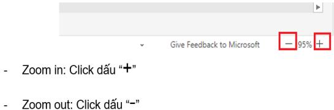

# Huóng dån su dung:

# Di den sheet có thong tin lièn ket:

Nhg idung  lién t d sheet chúa thng tinkhi dua chut d shi th u tuong:

Click chut vào ni dung dó se dân dén sheet chúa thông tin can tim.

Quay tr lai So dò ban dau

# HOME

Click vào biu tugng quay ve so do ban dau.

phía trèn cùng góc trái các sheet chúra thông tin de

# Zoom in / Zoom out

Nguòi dung có the zoom in (phóng to) /zoom out (thu nh) màn hinh dé thun tin xem các thông tin trong sheet bang cách:

Cách 1: Dé chut  vi trí cän zoom trên màn hinh:

- Zoom in: Gir phím Ctrl $^ +$ Lan chuôt lèn.   
Zoom out: Gi phím Ctr $^ +$ Ln chut xuöng.

Cách 2: Su dung chúc nng zoom ò góc phåi duói cung màn hình

Truòng hgp click chut vào màn hinh nhieu lan làm toàn màn hinh trng, khòng hin thi thông tin $\Rightarrow$ Nhân phím "ESC" dé hin thi lai thông tin.

<table><tr><td rowspan=1 colspan=1>MUC LUC(theo tharty PL1.1)</td><td rowspan=1 colspan=1>Ctick(We)hoc Click App ich chui dheet u thtrt </td></tr><tr><td rowspan=2 colspan=1>1.1.Hàng hóa nhp kháu vào VN vàtam nhap tai xuat</td><td rowspan=1 colspan=1>TIEN HANG NK VAO VN</td></tr><tr><td rowspan=1 colspan=1>TAM NHAP TAI XUAT</td></tr><tr><td rowspan=1 colspan=1>.Hng a mua bán theo hih thchuyén khau</td><td rowspan=1 colspan=1>CHUYEN KHAU</td></tr><tr><td rowspan=21 colspan=1>2.1.Chuyén tin nhap kháu dch vy</td><td rowspan=1 colspan=1>HOA HONG MOI GII</td></tr><tr><td rowspan=1 colspan=1>PHI MOI GIÓI VAN CHUYEN</td></tr><tr><td rowspan=1 colspan=1>CUC PHI VAN CHUYEN HANG</td></tr><tr><td rowspan=1 colspan=1>PHI THUE NGOAI LAM THU TUC XNK</td></tr><tr><td rowspan=1 colspan=1>PHI GIA CONG</td></tr><tr><td rowspan=1 colspan=1>TT HOA HONG/THU/CHI HQ CUC PHI VAN CHUYEN</td></tr><tr><td rowspan=1 colspan=1>MUAVAN CHUYEN LINH KIEN, VAT TU, HAI DO, XANG DAU..</td></tr><tr><td rowspan=1 colspan=1>PHI DAI LY LAM THU TUC CHO TAU TAI CANG NUÓC NGOAI</td></tr><tr><td rowspan=1 colspan=1>TCHO THUYEN TRUONG, THUYENVIEN THONG QUA DAILY</td></tr><tr><td rowspan=1 colspan=1>PHI THONG TIN LIEN LAC CUA TAU CHO NHA CUNG CAP DICH VU</td></tr><tr><td rowspan=1 colspan=1>PHI SUA CHOA CON TAU</td></tr><tr><td rowspan=1 colspan=1>CHI PHI LIEN QUAN HP TAC DU HQC</td></tr><tr><td rowspan=1 colspan=1>PHI/HOA HONG DICH VU/DAI LY DU LICH /BAN VÉ MAY BAY</td></tr><tr><td rowspan=1 colspan=1>TT HP DONG TÁI BAO HIEM</td></tr><tr><td rowspan=1 colspan=1>PHI CHUYEN GIAO CONG NGHE</td></tr><tr><td rowspan=1 colspan=1>THANH TOAN TIEN BAN QUYEN (SU DUNG PHAN MEM, PHAT HANH SACH, PHAT SONG PHIM ANH. ..)</td></tr><tr><td rowspan=1 colspan=1>TIEN LIEN QUAN DÉN KHAI THAC TRO CHOI DIEN TU</td></tr><tr><td rowspan=1 colspan=1>PHI CHUYEN NHUQNG BAN QUYEN SU&#x27; DUNG HINH ANH/LOGO / TRADEMARK</td></tr><tr><td rowspan=1 colspan=1>PHI NHUQNG QUYEN THUONG MAI</td></tr><tr><td rowspan=1 colspan=1>PHI MÒI DI TUYEN/DIEN VIEN/CA ST NUÓC NGOAI BIEU DIEN</td></tr><tr><td rowspan=1 colspan=1>CHAC(Kahh/GtuWc</td></tr><tr><td rowspan=10 colspan=1>2.2.Chuyén tn cσch/l ph/chi phkhác</td><td rowspan=1 colspan=1>CUC PHI GUI HANG MAU VE</td></tr><tr><td rowspan=1 colspan=1>HOA HONG MOI GIÓI XUAT KHAU LAO DONG</td></tr><tr><td rowspan=1 colspan=1>PHI CAP CHUNG CHI DI BIEN CHO THUYEN VIEN</td></tr><tr><td rowspan=1 colspan=1>PHI CαTAU</td></tr><tr><td rowspan=1 colspan=1>PHI QUA EO BIEN</td></tr><tr><td rowspan=1 colspan=1>CHI PHI C NGUI CONG TAC /HQC TAP /KHAO SAT /THAM DU HI THAO /CUQC HQP QUOC TE</td></tr><tr><td rowspan=1 colspan=1>TT PHI HQIVIEN CHO TO CHUC QUOC TE</td></tr><tr><td rowspan=1 colspan=1>CHI PH THAM GIA HOI CHQ/ TRIEN LAM DO DV NUÓC NGOAI TO CHUC</td></tr><tr><td rowspan=1 colspan=1>CHUYEN TIEN PHUC VU HOAT DONG CUA VP DAI DIEN  NUÓC NGOAI</td></tr><tr><td rowspan=1 colspan=1>PHI UY THAC TU PHAP RA NUÓC NGOAL</td></tr><tr><td rowspan=4 colspan=1>Chuyén tièn thanh toán các khoånai thug/honúgln quanXK, NK hàng hóa/ dich v</td><td rowspan=1 colspan=1>LAI PHAT /LI TRA CHAM THANH TOAN</td></tr><tr><td rowspan=1 colspan=1>BOI THUONG XUAT KHAU HH/DV</td></tr><tr><td rowspan=1 colspan=1>HOAN TRA TIEN UNG TRUÓC</td></tr><tr><td rowspan=1 colspan=1>TIEN PHAT BOC/DO HANG CHAM</td></tr><tr><td rowspan=5 colspan=1>Chuyén tiòn 1 chiu</td><td rowspan=1 colspan=1>CHUYEN THU NHAP VE NUÓC CHO NGUOI NUÓC NGOAI LAM VIEC TAI VN</td></tr><tr><td rowspan=1 colspan=1>TAI TRQ, VIEN TRQ THEO CAC CAM KT, THOA THUAN GIA NHA NUC, CHINH PHU, CAC CAP CHINH QUYENE</td></tr><tr><td rowspan=1 colspan=1>TAI TRO, VIEN TRQ KHAC PHUC HAU QUATHIEN TAI, DICH BENH, CHIEN TRANH.</td></tr><tr><td rowspan=1 colspan=1>TAI TRQ CHO CAC CHUONG TRINH, CAC QUY, DU AN DO TO CHUC TRONG NUC VAHOC TO CHUC &amp;NUCI</td></tr><tr><td rowspan=1 colspan=1>NGUON THU HQP PHAP CHO NGUI KHONG CU TRU TU SO DU TREN TAI KHOAN</td></tr><tr><td rowspan=2 colspan=1>CHUYEN TIEN LIEN QUAN VAY, TRA CHO NUÓC NGOAI VAYNQ</td><td></td></tr><tr><td rowspan=1 colspan=1>VAY. TRA NQ NUÓC NGOAI</td></tr><tr><td rowspan=2 colspan=1>CHUYEN TIEN LIEN QUAN HOATDONG DAU TU</td><td rowspan=1 colspan=1>DAU TU NUÓC NGOAI VAO VN</td></tr><tr><td rowspan=1 colspan=1>DAU TU RA NUÓC NGOAI</td></tr></table>

<table><tr><td>Nrtt au ni la elch</td><td>x Tichit dyg (Tcm c h sgi inu oy Sy C  t. 16 st0s kim t e0ns phà i IC12 duo fham p. on</td></tr><tr><td></td><td>Cg chac kh ig); can fech  6sanend Hh i  h y t nighe nghiee, sw at d, saitirmhien oin vie Nam d. Yiln sving fy dien ts sute ngeki cis oie di this hee cing bel W a. Co quan da die sgaw gio at qae da die arn αup dr sei aic ddime,b vk =</td></tr><tr><td></td><td>su, co quan des sn toi s6 chec gado f cio v d f. Chi sims N cie  thiskim mude ng ct rasike rqoii. </td></tr><tr><td></td><td>ds lv, w</td></tr><tr><td></td><td></td></tr><tr><td></td><td> n thy  </td></tr><tr><td></td><td></td></tr><tr><td></td><td></td></tr><tr><td></td><td></td></tr><tr><td></td><td></td></tr><tr><td></td><td></td></tr><tr><td></td><td></td></tr><tr><td></td><td></td></tr><tr><td></td><td>Nipusi king o e l9  Th i then6.</td></tr><tr><td></td><td></td></tr><tr><td></td><td></td></tr><tr><td></td><td>IVN.</td></tr><tr><td></td><td></td></tr><tr><td></td><td></td></tr><tr><td></td><td></td></tr><tr><td></td><td></td></tr><tr><td></td><td></td></tr><tr><td></td><td></td></tr><tr><td></td><td></td></tr><tr><td></td><td></td></tr><tr><td></td><td></td></tr><tr><td></td><td></td></tr><tr><td></td><td></td></tr><tr><td>8</td><td></td></tr><tr><td></td><td></td></tr><tr><td></td><td></td></tr><tr><td></td><td></td></tr><tr><td></td><td></td></tr><tr><td></td><td></td></tr><tr><td></td><td></td></tr><tr><td></td><td></td></tr><tr><td></td><td></td></tr><tr><td></td><td></td></tr><tr><td></td><td></td></tr><tr><td></td><td></td></tr><tr><td></td><td></td></tr><tr><td></td><td></td></tr><tr><td></td><td></td></tr><tr><td></td><td></td></tr><tr><td></td><td></td></tr><tr><td></td><td></td></tr><tr><td></td><td></td></tr><tr><td></td><td></td></tr><tr><td></td><td></td></tr><tr><td></td><td></td></tr><tr><td></td><td></td></tr><tr><td></td><td></td></tr><tr><td></td><td></td></tr><tr><td></td><td></td></tr><tr><td></td><td></td></tr><tr><td></td><td></td></tr><tr><td></td><td></td></tr><tr><td></td><td></td></tr><tr><td></td><td></td></tr><tr><td></td><td></td></tr><tr><td></td><td></td></tr><tr><td></td><td></td></tr><tr><td>chi</td><td></td></tr><tr><td></td><td></td></tr><tr><td></td><td></td></tr><tr><td></td><td></td></tr><tr><td></td><td></td></tr></table>

Chứng từ (\*) tại B10: Phiếu thu thập thông tin (BM-TTQT.TT.11)/Xác nhận của ĐV về việc KH đã được cấp tín dụng (mục đích bổ sung vốn lưu động/kinh doanh ngắn hạn)/Phiếu đề xuất hạn mức chuyển tiền ra nước ngoài (BM-TTQT.TT.06)/Phiếu đề xuất hạn mức chuyển tiền ra nước ngoài (Áp

# từng thời k

B1: Yêu cầu chuyển tiền của KH trên kênh giao dịch trực tuyến thay thế Lệnh chuyển tiền bản chính (BM_TTQT.TT.01)/LCT Moneygram (BM-TTQT.CTNNMG.01 theo QĐ 68/2019/QĐ-VBLQ và/hoặc các

văn bản sửa đổi bổ sung, thay thế trong từng thời kỳ).

tiền đi trên Agent Portal, xuất hóa đơn và lưu Omni (sau khi CKS kiểm tra hồ sơ phù hợp).

chuyển tiền ra nước ngoài qua Mone a đổi bổ sung, thay thế trong từng thời kỳ.

không phù hợp chính sách riêng của NHNNg, theo yêu cầu của người thụ hưởng…: ĐV được phân quyền/TT.NVNHGD thực hiện tại B15:

Cập nhật trạng thái hồ sơ trên Chương trình QLHSTT và ĐNTT theo quy định tại Phụ lục 1.4.   
ĐV xử lý ngoại tệ trả về (nếu có) theo Quy trình Kinh doanh tiền tệ.

<table><tr><td rowspan=1 colspan=1>Loai sai bit</td><td rowspan=1 colspan=1>Hinh thúc gii quyet</td></tr><tr><td rowspan=1 colspan=1>Chúng tù không thé hin/thé hin sai: sö/ngày Hgp döng,sö/ngày Hóa don, tên/dia chi nguòi XK/NK, tên/dia chi nguòichuyen tiën/nguòi thu huòng trên báo có quaVietcombank/ngân hàng khác, phuong thúc thanh toán, ...mà các sai bit nay không lam thay di bân chät hö so (mucdích, ni dung giao dich), nhäm lân vói hò so khác và cácthông tin còn lai khóp dúng.</td><td rowspan=3 colspan=1>Chäp nhn cn cú giái trinh hop ly cúa KH bång vnban (hoc trèn LCT/Giy de nghi/Giy yêu cäu/...).</td></tr><tr><td rowspan=1 colspan=1>Tri giá trên TKHQ, Chúng tù báo có, ... cao hon/thäp honso vói Lnh chuyen tin/Hóa don/Hp döng/Thòa thunhoàn tra tièn/... (hoc nguσc lai) do làm tròn s thâp phânhoc không quá 100 USD (hoc ngoai t khác tuongduong).</td></tr><tr><td rowspan=1 colspan=1>TKHQ b sung cho hô sσ TT trå truóc hàng hóa thé hinngay hoàn thanh kim tra và/hoc ngày thòng quan truócngày thanh toán tra truóc.</td></tr></table>