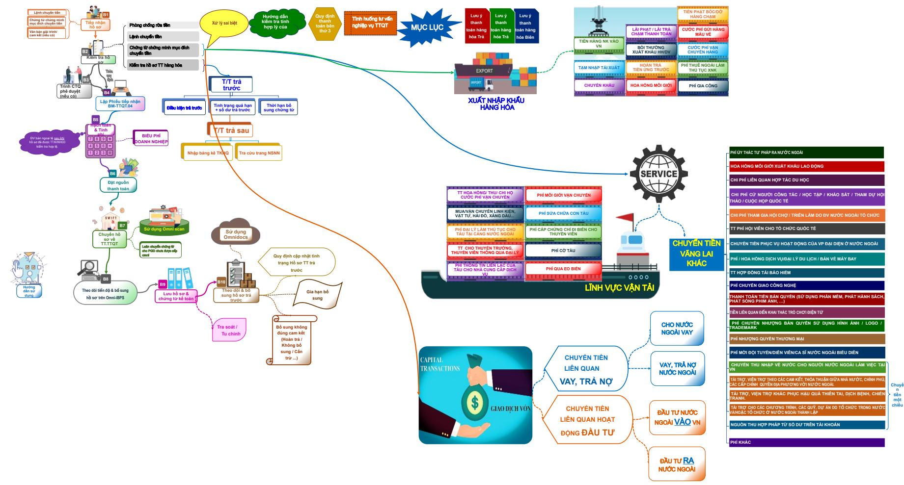
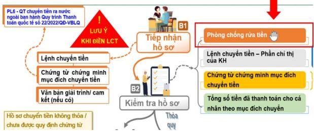
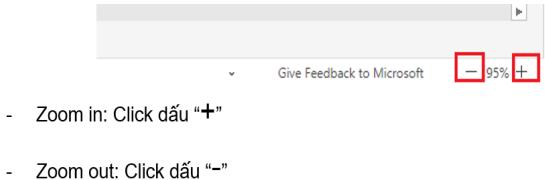
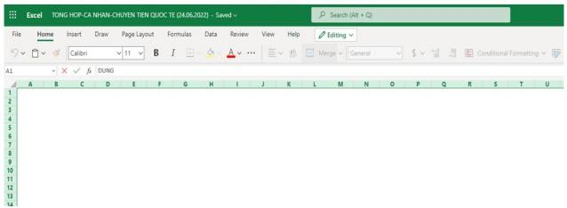

# Huóng dån su dung:

# Di den sheet có thong tin lièn ket:

Nhng ni dung có lién két dén sheet chúa thòng tin khi dua chut den s hin th biu tuong:

Click chut vào ni dung dó se dân dén sheet chúa thông tin can tim.

Quay tr lai So dò ban dau

# HOME

Click vào biu tugng quay ve so do ban däu.

pt cgóheet hút

# Zoom in / Zoom out

Nguòi dung có the zoom in (phóng to) /zoom out (thu nh) màn hinh dé thun tin xem các thông tin trong sheet bang cách:

Cách 1: Dé chut  vi trí cän zoom trên màn hinh:

- Zoom in: Gir phím Ctrl $^ +$ Lan chuot lèn.   
Zoom out: Gi phím Ctr $^ +$ Ln chut xuöng.

Cách 2: Su dung chúc nng zoom ò góc phåi duói cung màn hình

Truòng hgp click chut vào màn hinh nhieu lan làm toàn màn hinh trng, khòng hin thi thông tin $\Rightarrow$ Nhân phím "ESC" dé hién thi lai thông tin.

