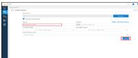

# Huóng dn su dung:

# 1Di dén sheet có thông tin lién két:

Nhüng ni dung có lièn két dën sheet chúa thòng tin khi dua chut dën s hin thi biu

tu'gng:

Click chut vào ni dung dó se dn dën sheet chúa thòng tin cän tim.

# Quay tr lai So do ban däu

# HOME

Click vào bieu tugng quay ve so do ban däu.

phía trên cung góc trái các sheet chúa thông tin de

# Zoom in / Zoom out

Nguòi dung có thé zoom in (phóng to) / zoom out (thu nh) màn hinh dê thun tin xem các thông tin trong sheet bang cách:

Cách 1: Dé chut  vi trí cän zoom trèn màn hình: Zoom in: Gi phím Ctr $^ +$ Ln chut lên. Zoom out: Gi phím Ctr $^ +$ Lan chut xuöng.

Cách 2: S dung chúc nng zoom  góc phái duói cùng màn hinh

4.Truòng hgp click chut vào màn hình nhieu làn làm toàn màn hình trång, khòng hien thj thông tin $= >$ Nhân phím "ESC" dé hiên thi lai thông tin.

<table><tr><td rowspan=2 colspan=1>MUC LUC(theo thúrty PL1.1)</td><td></td></tr><tr><td rowspan=1 colspan=1>ClcClcApchh</td></tr><tr><td rowspan=2 colspan=1>Hnvotnhap tai xuåt</td><td rowspan=1 colspan=1>TIEN HANG NK VAO VN</td></tr><tr><td rowspan=1 colspan=1>TAM NHAP TAI XUAT</td></tr><tr><td rowspan=1 colspan=1>1.2.Hàng hóa mua bán theo hinh thúcchuvén khau</td><td rowspan=1 colspan=1>CHUYEN KHAU</td></tr><tr><td rowspan=21 colspan=1>Cu</td><td rowspan=1 colspan=1>HOA HONG MOI GIOI</td></tr><tr><td rowspan=1 colspan=1>PHI MOI GIÓI VAN CHUYEN</td></tr><tr><td rowspan=1 colspan=1>CUÓC PHI VAN CHUYEN HANG</td></tr><tr><td rowspan=1 colspan=1>PHI THUE NGOAI LAM THU TUC XNK</td></tr><tr><td rowspan=1 colspan=1>PHI GIA CONG</td></tr><tr><td rowspan=1 colspan=1>TT HOA HONG/THU/CHIH CUC PHIVAN CHUYEN</td></tr><tr><td rowspan=1 colspan=1>MUAVAN CHUYEN LINH KIEN, VAT TU, HÄI DO, XANG DAU...</td></tr><tr><td rowspan=1 colspan=1>PHI DAI LY LAM THU TUC CHO TAU TAI CANG NUÓC NGOAI</td></tr><tr><td rowspan=1 colspan=1>TTCHO THUYEN TRUNG, THUYEN VIEN THONG QUA DAILY</td></tr><tr><td rowspan=1 colspan=1>PHI THONG TIN LIEN LAC CUA TAU CHO NHA CUNG CAP DICHVY</td></tr><tr><td rowspan=1 colspan=1>PHI SUA CHOA CON TAU</td></tr><tr><td rowspan=1 colspan=1>CHI PHI LIEN QUAN HP TAC DU HQC</td></tr><tr><td rowspan=1 colspan=1>PHI /HOA HONG DCH VU/DAI LY DU LCH /BAN VÉ MAY BAY</td></tr><tr><td rowspan=1 colspan=1>TTHP DONG TAI BAO HIEM</td></tr><tr><td rowspan=1 colspan=1>PHI CHUYEN GIAO CONG NGHE</td></tr><tr><td rowspan=1 colspan=1>THANH TOAN TIEN BAN QUYEN (SU DUNG PHAN MEM, PHAT HANH SACH, PHAT SONG PHIM ANH, ..)</td></tr><tr><td rowspan=1 colspan=1>TIEN LIEN QUAN DÉN KHAI THAC TRO CHOI DIEN TU</td></tr><tr><td rowspan=1 colspan=1>PHI CHUYÉN NHUQNG BÁN QUYEN SU DUNG HINH ANH /LOGO / TRADEMARK</td></tr><tr><td rowspan=1 colspan=1>PHI NHUQNG QUYEN THUONG MAI</td></tr><tr><td rowspan=1 colspan=1>PHI MÒI DI TUYÉN/DIÉN VIEN/CA SI NUÓC NGOAI BIEU DIÉN</td></tr><tr><td rowspan=1 colspan=1>HCHa</td></tr><tr><td rowspan=10 colspan=1>2.Chh/c</td><td rowspan=1 colspan=1>CUÓC PHI GUI HANG MAU VE</td></tr><tr><td rowspan=1 colspan=1>HOA HONG MOI GIØI XUÁT KHAU LAO DNG</td></tr><tr><td rowspan=1 colspan=1>PHI CAP CHUNG CHI DI BIEN CHO THUYEN VIEN</td></tr><tr><td rowspan=1 colspan=1>PH CTAU</td></tr><tr><td rowspan=1 colspan=1>PHI QUA EO BIEN</td></tr><tr><td rowspan=1 colspan=1>CHI PHI CU NGUÒI CONG TAC/HQC TAP /KHAO SAT/THAM DU HI THAO /CUC HQP QUOC TE</td></tr><tr><td rowspan=1 colspan=1>TT PHI HQIVIEN CHO TO CHUC QUOC TE</td></tr><tr><td rowspan=1 colspan=1>CHI PHI THAM GIA HQI CHQ / TRIEN LAM DO DV NUÓC NGOAI TO CHUC</td></tr><tr><td rowspan=1 colspan=1>CHUYEN TIEN PHUC VU HOAT DONG CUA VP DAI DIEN  NUÓC NGOAI</td></tr><tr><td rowspan=1 colspan=1>PHI U THAC TU PHAP RA NUC NGOAI</td></tr><tr><td rowspan=4 colspan=1>3.Chuyén tin thanh toán các khon låiahhonúln quanXK,Nhàng h6a/ dich vy</td><td rowspan=1 colspan=1>LAI PHAT /LAI TRA CHAM THANH TOAN</td></tr><tr><td rowspan=1 colspan=1>BOI THUONG XUAT KHAU HH/DV</td></tr><tr><td rowspan=1 colspan=1>HOAN TRA TIEN UNG TRUÓC</td></tr><tr><td rowspan=1 colspan=1>TIEN PHAT BOC/DO HANG CHAM</td></tr><tr><td rowspan=5 colspan=1>Chuyén tièn 1 chiu</td><td rowspan=1 colspan=1>CHUYEN THU NHAP VE NUÓC CHO NGUI NUC NGOAI LAM VIEC TAIVN</td></tr><tr><td rowspan=1 colspan=1>VIR THEO CAC CAM,  THUGIOAHA U, INH U, AC  CHIHQUDA UGNUC NGOAI.</td></tr><tr><td rowspan=1 colspan=1>TIVITRAQTHIA, CB CRAN.</td></tr><tr><td rowspan=1 colspan=1> CG</td></tr><tr><td rowspan=1 colspan=1>U THU HQP PHAP CHO GUI OG CU TRUTU S6 DU TREN TAIKHN</td></tr><tr><td rowspan=2 colspan=1>CHUYEN TIEN LIEN QUAN VAY, TRNQ</td><td rowspan=1 colspan=1>CHO NUC NGOAIVAY</td></tr><tr><td rowspan=1 colspan=1>VAY, TRA N NUC NGOAI</td></tr><tr><td rowspan=2 colspan=1>CHUYEN TIEN LIEN QUAN HOAT DNGDAU TU</td><td rowspan=1 colspan=1>DAU TU NUC NGOAIVAOVN</td></tr><tr><td rowspan=1 colspan=1>DAU TU RA NUC NGOAI</td></tr></table>

# HOME

Quy die chre t shung thi gie xicy Tht glan OV git Nl wThdl glan TT MMMHGCITT HVH88

Nigkan tn

ply sen vir dhe she cis nde sl

) ĐV thu thập đầy đủ chứng từ phù hợp với mục đích chuyển tiền/nhu cầu khác củ

văn bản yêu cầu/chỉ thị/phản hồi của KH đảm bảo phù hợp với bộ chữ ký hữu

chữ ký số đã đăng ký với Sacombank (cá nhân

hie sine 1 h

dịch, ĐV có thể sử dụng lại chứng từ không thay đổi và có giá trị giao dịch để dịch ở các

nhận trên Giấy đề nghị/Lệnh chuyển tiền/đề nghị chuyển tiền trên IB/...: “Đề nghị

twiling

ngày…. trị giá…” đồng thời yêu cầu KH bổ sung các chứng từ còn thiếu theo quy

đăng ký với Sa nk, phải thu thập thêm Giấy giới thiệu ký bởi người đại diện hợp pháp và Giấy tờ tùy thân của người nhận, scan lưu đầy đủ Giấy giới thiệu và

c. Hồ sơ/chứ

d. Người giao nhận hồ sơ/chứng từ TTQT/BLQT với KH phải là chuyên viên phụ trác TTQT/BLQT tại ĐV hoặc CV/NV Hỗ trợ tại TT.NVNHBB/NVNHGD. Các chức danh khá

cư trú...).

Tìm hiểu kỹ giao dịch, KH đảm bảo giao dịch than

h. Đối với hồ sơ TTQT/BLQT ngoài quy định, ĐV cần tư vấn hồ sơ

<table><tr><td rowspan="2"></td><td rowspan="2">Phan vikin ts</td><td colspan="2">Trich nhilem</td><td rowspan="2">Ghicho</td></tr><tr><td>oV</td><td>TT.NVNHGD</td></tr><tr><td colspan="5">Theg tin chung</td></tr><tr><td></td><td>Kales tre thling tin vi PORT. TTKB</td><td>x</td><td></td><td>Khadn 3 Mye N Quy dh chang nis Quy tein niby.</td></tr><tr><td>2</td><td>TTPGVKHDHL Xaie donh tf ech ey tri cia KH</td><td></td><td>x()</td><td>Mye I ele Phy lpe 1.</td></tr><tr><td></td><td>khalch hling cung Hs thing N chp:</td><td></td><td></td><td></td></tr><tr><td></td><td>The thire thing ti</td><td>*</td><td></td><td>Khoin 4 Mye N Gay drh chang cias Quy trinh ndly.</td></tr><tr><td>t2</td><td>Nepin ngil nie thing</td><td>*</td><td>×(</td><td>chang cis Quy tinh ndly. Khsin 8 Mye N Gry drh</td></tr><tr><td></td><td>Oi loge ehing ) thee myt dioh ohuydin ie</td><td></td><td>x()</td><td>Phy lue 1.1.</td></tr><tr><td></td><td>Tinh hop ligaias abc ehing s)</td><td>x()</td><td>(°)</td><td>- Khakn &amp; Muc It cia Phu lue - Diim 1.4 Kodn 1 Muc IV Quy riby</td></tr><tr><td></td><td>Tak khodn *i davng</td><td></td><td>x (′)</td><td>Khodin 5 Muc I ca Phy lc d shung ci Quy sinhy rikyp.</td></tr><tr><td>6</td><td>chuyin sin in quan Yiee cllu die blet k w, wi ng nule</td><td>x()</td><td>x (°)</td><td></td></tr></table>

đích bổ sung vốn lưu động/kinh doanh ngắn hạn)/Phiếu đề xuất hạn mức chuyển tiền ra nước ngoài (BMTTQT.TT.06)/Phiếu đề xuất hạn mức chuyển tiền ra nước ngoài (Áp dụng đối với KH do PGD giới thiệu) (BM-TTQT.TT.08)

(nếu phát sinh th

  
PHỤ LỤC 1 - I. GIẢI THÍCH TỪ NGỮ

n tiền trên IB về TT.NVNHGD và CV

ü Tài liệu: “Hướng dẫn sử – e.FT” B12: Trường hợp uyển tiền qua MG

# an o

dịch chuyển tiền đi trê

ü Tài liệu: Hướng dẫn sử dụng chương trình Agent Portal và QĐ 68/2019/QĐ-VBLQ v/v ban hành Dịch vụ chuyển tiền ra

Trường hợp Giao dịch không thành công: NHNNg hoàn trả tiền về do không đúng tên, số tài khoản, không phù hợp chín

Ng v s ứng với số r ủa hồ sơ đã chuyển ü Cập nhật trạng thái hồ sơ trên Chương trình QLHSTT và ĐNTT theo quy định tại Phụ lục 1.4.

ngoii dugic thinh likp, hoet dong tsi Viet Nam theo

shie kinh 16

h - nghà nghidp, 1t6 chano xs hoi, t6 chio xas hsi - uh

C    nii

hinh thi i iV  ud otam

<table><tr><td></td><td>Hps enis ohuyln sikn re rutdie ngoibl ein ci Tnding tix nguli thy nhan</td><td>B</td><td>x(∞</td><td>Difre 2.1 K0w Phy hye niby Didive 4.1 Kholin Phy has mbky. 4 Muc ll cila</td></tr><tr><td colspan="5">buaing i ruie agak 05 ylKH of chite</td></tr><tr><td>6</td><td>Oiu kidin thanh toin chuplin sin ras nudc regpabl ik qus hagt ding regoei thureng qpue bikn pipi</td><td></td><td></td><td>Khedln 1 Myc II cia Phy luc nky.</td></tr><tr><td></td><td>Oilu kiin thanh todin, chupkin sin sk sukc res murine neguiki dli vii KH of thive</td><td></td><td></td><td>Khedn 2 Mc II cia Phu luc nky.</td></tr><tr><td></td><td>thye hilen TY wi Hen mirc clip cho KOH trvils vih TT thark cb ln cun hopt tmin siken mae haing dirg ngoei thueng</td><td></td><td></td><td>Mue I cie Phuy luc nky. Thalt 3.2.1 Dilm 3.2 Kholn</td></tr><tr><td></td><td>qua biken gidi SE av khi dung cia THHD 46i wik Ni w chaplin sin hing</td><td></td><td></td><td>Mue It cin Phy hye miry, That 3.2.2 Difen 2.2 Khwoken</td></tr><tr><td></td><td>hde trsl su Taling tix ngull thy</td><td></td><td>x(¬</td><td>Difiv 4.2 Kholin 4 Muc 1 cia</td></tr><tr><td></td><td>Fuding d rus ngoak Hie war pien hen TT k</td><td>*</td><td>*</td><td>Phe los i Phe hee 1.4.</td></tr><tr><td>12</td><td>Hb sa id sung TT trvidle</td><td>x</td><td>x ()</td><td>Phy luc 1.4.</td></tr></table>

9 Nukhin or to a  T6 ci g th n 8.

<table><tr><td rowspan=1 colspan=1>Loai sai bit</td><td rowspan=1 colspan=1>Hinh thúc gii quyét</td></tr><tr><td rowspan=1 colspan=1>Chúng tù khòng thé hin/thé hin sai: s/ngày Hop döng, s/ngàyHóa don, tên/dia chi nguòi XK/NK, tén/dia chi nguòi chuyen tiën/nguòithu hung trèn báo có qua Vietcombank/ngân hàng khác, phuong thúcthanh toán, .. mà các sai bit nay không lam thay di bån chät h so(mc dích, ni dung giao dich), nhâm lân vói h so khác và các thòng tincòn lai khóp dúng.</td><td rowspan=3 colspan=1>Chäp nhn cn cú giài trinh hop ly cúa KH bng vn bân (hoctrèn LCT/Giy de nghi/Giáy yêu cäu/..)</td></tr><tr><td rowspan=1 colspan=1>Tri giá trên TKHQ, Chúng tù&#x27; báo có, . cao hon/thâp hon so vóiLnh chuyén tien/Hóa don/Hop döng/Thôa thun hoàn tra tien/... (hocnguc lai) do làm tròn s thâp phân hoc khòng quá 100 USD (hongoai te khác tuong duong).</td></tr><tr><td rowspan=1 colspan=1>TKHQ b sung cho hö sσ TT trå truóc hàng hóa thé hin ngay hoànth kim tra v/hoc ngày thông quan truócngày thanh toán ttr.</td></tr></table>

# Quy định chung - 3. Quy định về kiểm tra thông tin liên quan đến phòng, chống, rửa tiền, tài trợ khủng

bố, tài trợ phổ biến vũ khí hủy diệt hàng loạt a. ĐV, TT.NVNHBB kiểm tra thông tin trong hồ sơ TTQT trước/trong khi thực hiện giao dịch và hồ sơ KH bổ sung với thông tin mới trên cơ sở:

Đảm bảo thoả điều kiện về PCRT, TTKB, TTPBVKHDHL: đối tượng tham gia vào giao dịch và/hoặc bất kỳ thông tin có liên quan trong giao dịch (bao gồm nhưng không giới hạn các thông tin như: tên cá nhân/tổ chức có liên quan, ngân hàng, quốc gia, hàng hóa/dịch vụ, nơi/cảng đi, nơi/cảng đến, nguồn gốc xuất xứ của hàng hóa, tên con tàu/cờ tàu/quốc tịch tàu, …) đều không thuộc danh sách đen; danh sách trì hoãn giao dịch; danh sách cấm vận, trừng phạt và/hoặc bất kỳ danh sách nào khác có nội dung cấm/phong tỏa/ngăn chặn/hạn chế vì có liên quan đến PCRT, TTKB, TTPBVKHDHL được ban hành bởi cơ quan có thẩm quyền tại Việt Nam và/hoặc bởi các cơ quan/tổ chức quốc tế, quốc gia khác bao gồm nhưng không giới hạn: Liên Hợp Quốc (UN), Lực lượng đặc nhiệm tài chính quốc tế (FATF), Hoa Kỳ (US), Cộng đồng chung Châu Âu (EU) và bất kỳ các cơ quan/tổ chức khác mà Sacombank đã thực hiện cam kết tuân thủ trong từng thời kỳ.

b. ĐV/TT.NVNHGD/TT.NVNHBB kiểm tra hồ sơ trên cơ sở phù hợp Quy định PCRT, TTKB,

NGAN HANG THUONG MAI CO PHANSAI GON THUONG TINS6:3366 /2020/TB-TT

CONG HOA XA HOI CH NGHIA VIET NAM DOc lp - Ty do - Hanh phuc Tp.HCM, ngdx29 th4ng19 plm 2020

PHU LUC [DANH SACH QUOC GIAVUNG LANH TH B CAM VAN HOC HAN CHE GIAO DICH SANCTIONED COUNTRY (Ban hanh kémThong bd0 s55366/20200D-TB ngy/40/2020)   

<table><tr><td>STT</td><td>Quda gia</td><td>STT</td><td>Qudc gla</td></tr><tr><td>1.</td><td>Afghanistan</td><td>20.</td><td>Moldova</td></tr><tr><td>2.</td><td>Albania</td><td>21.</td><td>Montenegro</td></tr><tr><td>3.</td><td>Belarus</td><td>22.</td><td>Myanmar/Burma</td></tr><tr><td>4.</td><td>Bosnia and Herzegovina</td><td>23.</td><td>North Korea/ Democratic People&#x27;s Republic of Korea</td></tr><tr><td>5.</td><td>Burundi</td><td>24.</td><td>North Macedonia/Macedonia</td></tr><tr><td>6.</td><td>Central African Republic</td><td>25.</td><td>Republic of Guinea</td></tr><tr><td>7.</td><td>Croatia</td><td>26.</td><td>Republic of Nicaragua</td></tr><tr><td>8.</td><td>Cuba</td><td>27.</td><td>Russia</td></tr><tr><td>9.</td><td>Democratic Republic Congo of the</td><td>28.</td><td>Serbia</td></tr><tr><td>10.</td><td>Egypt</td><td>29.</td><td>Somalia</td></tr><tr><td>11.</td><td>Guinea-Bissau</td><td>30.</td><td>South Sudan</td></tr><tr><td>12.</td><td>Haiti</td><td>31.</td><td>Sudan</td></tr><tr><td>13.</td><td>Hong Kong</td><td>32.</td><td>Syrian Arab Republic (Syria)</td></tr><tr><td>14.</td><td>Iran</td><td>33.</td><td>Tunisia</td></tr><tr><td>15.</td><td>Iraq</td><td>34.</td><td>Turkey</td></tr><tr><td>16.</td><td>Kosovo</td><td>35.</td><td>Ukraine</td></tr><tr><td>17.</td><td>Lebanon</td><td>36.</td><td>Venezuela</td></tr><tr><td>18.</td><td>Liby8</td><td>37.</td><td>Yemen</td></tr><tr><td>19.</td><td>Mali</td><td>38.</td><td>Zimbabwe</td></tr></table>

# THONG BAO

V t y  e ua  d a an  b n o an

Can cir Quydt dinh a5 90201910D-vBLQ ngiy 31/712019 wiv ban hanh Quy dinh vi phong, chdng rih tin (a0 902019/0p-VeLQ):

TTPBVKHDHL hiện hành và/hoặc các văn bản sửa đổi, bổ sung, thay thế trong từng thời kỳ.   

<table><tr><td>5tt</td><td>Noi dung</td><td></td><td>Huding diln</td></tr><tr><td></td><td>Trach nhiem kiem tra</td><td>CN/PGD (TT.TTQT khOng hju kidm)</td><td>Chuong trinh AML Express (User Viewer)</td></tr><tr><td>2 3</td><td>Kénh ki6m tra Noi dung kiém tra</td><td>nhung khong gioi han:</td><td>Tat cà thong tin trén tait cà càc chung tu cua ho sd chuyéin tién ra nudc ngoài, bao göm Qu6c gia (nh&amp;p khdu, xudt khdu, trung chuyen, xudit xúr hang hoa. ...</td></tr><tr><td>4</td><td>Nguyén tic xir ly</td><td></td><td>T6 chuc/ca nhan: Ngudi mua/chuyein tien, nguoi ban/nhan tien, ngan hàng trung gian/nhan tian, hang van chuyén, nhà san xut. Con tau, co tau, ... Cang/Noi di/dén/trung chuyen Ten hang nhap khilu Kidm tra nhanh co bait ky thong tin nào trong chung tu lién quan dein qudc gia caim, han che giso dich theo Thong bao 806/2019/TB-KTrNB ngày 18/3/2019 và cac van</td></tr><tr><td></td><td></td><td>trong do co thém mdi/thay ddi caic thong tin vié qudc gia, to churc/cai nhàn, ..(nhu</td><td>ban s0ra d6i, bo sung. thay th6 trong tomg thoi ky hay khong? Neu co lien quan thi chuyen ho so vie Phong Tuin tho d6 tham muu ve PCRT. chte  ton   h omt Cu Neu khong co thong tin lien quan dein qudc gia caim, han che giao dich thi kiem tra AML Express: thyc hien giao dich theo quy dinh hien hanh: Neu ket quà kiém tra la &quot;KHONG TRUNG&quot;, CN/PGD chuyen ho sd ve TT.TTOT Neu ket quà kifm tra la TRUNG&quot; hodic CN/PGD khong co co sò d6 nh&amp;in dinh Ia *TRUNG&quot; hodc &quot;KHONG TRUNG&quot;, CN/PGD phdi chuyén h0 so v6 Phong Kt qàkidm ta hl co atrog gyhuyentie ao m kt quàkimr Tuàn Thú d4 tham muu ve PCRT: c0a CN/PGD và k6t quà ki6m tra c0a Phong Tuàn thG) Vi ly do niào do ma ho so chuylin tin thye hifn sau ngiy kilim tra PCRT, CNUPGD phal kidlim tra pCRT iai tren Chuong trinh AML Express vao ngay Su khi da co két quà kidm tra PCRT. ndu khach hang b sung/thay the chg t chuyein tien ra nude ngodi.</td></tr><tr><td>5</td><td>Tai li€u tham khào</td><td>Tuàn thi.</td><td>trinh AML Express , dam bdo ket quà kiém tra &quot;KHONG TRONG&quot; trudo khi chuyen ho sd ve TT.TTOT d6 chuyén tién ra nudc ngoia Quyét dinh 90/2019/QD-VBLQ nghy 31/07/2019 v/v ban hanh Quy dinh vie Phong. chong rüra tien; Hudng dan sú dung Chuong trinh AML Express và Compliance Link cia Phong (Hodic cac VB s0ra d6i, bd sung, thay the khac trong tong thoi ky)</td></tr></table>

QV BLT nghièmn tac tri@in khal va thyc hien cac ni dung sau:

tai kidm t thnhach len uan tron sg ch theo y din i   CRT c NH con/Cong ty con (ndu phat sinh t H con/Cong ty con).

kidchan unh anh sc ua/angh6mhohahéo hSanioned County tiét tai Phu luc dinh kèm Thong baio này). Ddn v luu y thyc hien nhu sau:

aTrong quà trinh mò mà kháich hàng và c8p nht thong tin khàch ha i. Trurdng hop ap dung:

M mà khàch hàng chudin/vang lai; hoc Cap nhat thong tin khach hang iDdn vi goi hò sd phap ty cúa khach hàng và cac thng tin b6 sung vè BP. PCRT - Phng Tudn thù d6 trinh Hi dOng Phòng. chOng rúra tièn duy€t thuin trudc khi thyfc hin.

# NGAN HANG THUONG MAI CO PHAN

# CONG HOA XA HOI CHU NGHIA VIÉT NAM

SAI GON THUONG TIN S6:373/2022/TB-TT

Dc lap - Ty do - Hanh phúc TP. H0 Chi Minh, pgàx-3 8tbáng?, päm 2022

#

Can c Thông bào s6 33662020/TB-TT ngay 29/10/2020 vv tuån thú quy djnh lén quan dén quc gia/vüng lnh jcám van hoic han ch6 giao djch,

V/v tuån thù càc quy dinh vè cám vn

Cuckhg hoåg chih r gia ga Ukraie dang din bién phúc tap.Do o,hâ äm bo tuân thcc quy dinh ve cám vn cua các cd quan t chúc quc té, Tóg Giám dc yéu càu ác Dn vi him tuc trién khai và thuc hien càc ni dung sau:

DcT c u y ua u ti Cpla LinkDh Don s cg t P.Tuàn th d dug tuvn trog tg truòg hgp cy héé c thng tn Li QUAN (\*) dén qu6c gia và/hoθc vùng lánh th6 sau:

() Belarus (ii) Russia (ii) Ukraine (iv) Donetsk (v) Luhansk (hoãc Lugansk)

# Ké tr ngày 28/02/2022, tr ch6i/khng thyc hi€n các giao dich có LIEN QUAN (\*) dén các DCTC sa

# THONG BAO

<table><tr><td>STT</td><td>Thong tin</td><td>Ca nhan</td><td>TO chitc</td></tr><tr><td></td><td>Tén dily d0</td><td>x</td><td>x</td></tr><tr><td>2</td><td>Dja chl tail Vst Nam</td><td>x</td><td>x</td></tr><tr><td>3</td><td>Dia chl tai qudc gia mà khach hång mang qudc tich</td><td>x</td><td></td></tr><tr><td>4</td><td>Nghà nghi¢p</td><td>x</td><td></td></tr><tr><td>5</td><td>Ngành nghà kinh doanh</td><td></td><td>x</td></tr><tr><td>6</td><td>Muc dich thiet l8p quan he voi Sacombank (thayic hiθn sdn phdim/dich v gl, bao gδm sdn phdm/dich vy c6 y dinh sr dung trong tuong lai)</td><td>x</td><td>x</td></tr><tr><td></td><td>Khàch hang c6 nhu càu thyc hien giao djich thanh toán qudc t6 (TTQT) khòng? Neu có, vui long neu rδ cac qudc gia lien quan, mdi quan he giha ngus chuydin và nguoi nhn, muc dich chuydlin tin</td><td>x</td><td>x</td></tr><tr><td>8</td><td>Neu ngubi thånh lp/ngubi dgi dien/ohà sd h0u huòng lol/thanh vi8n gop vn càa t5 chúc.. co thdng tin lien quan d6in quGc gia trong danh sach Sanctioned Country&quot;: thu thap them thdng tin cue chc ben lien quan, bao qudic tich/qudic gls not dang ky kinh doanh, dja chl gbm: ten diay do, s5 h chidu/sd dang ky kinh doanh, ngåy cp, noi cdip.</td><td></td><td></td></tr></table>

<table><tr><td>Tén t6 chüc tài chinh</td><td>Qu6c gia</td></tr><tr><td>Belarussian Bank of Development and Reconstruction Belinvestbank Joint Stock Company</td><td rowspan="3">Belarus</td></tr><tr><td>Limited Liability Company Belinvest-Engineering</td></tr><tr><td>CJSC Belbizneslizing</td></tr><tr><td>Bank Dabrabyt Joint-Stock Company (Bank Dabrabyt)</td><td></td></tr><tr><td>VTB Bank Public Joint Stock Company (VTB Bank)</td><td>Russia</td></tr></table>

lånh thó, tó chuc bj clim vin/ han ché giao djch.

Lécp  theP.Tnt/.Qvccu nn thà khi thuc hien giao dich TQT (Luu y: Kø t ngay 26/03/2022, các dinh ché tài chinh va tó chúc theo Phy luc 1 và Phy luc 2 dinh kòm Thông báo này sé chinh thúc bj cám ván/ han ché giao djch).

Kinh de nghi các Don vi nghièm tuc thyc hien theo ni dung Thông báo này.

Trong qud trinh thuc hièn giao dich mà khng bdit buc mò ma khdch hàng Dan vi thus hien tyong ty guy dinh tai Muc 2.a neu trén.

cTrong qud trinh cung clip sàn ph&m dich vy cho khách hång, dc biet la glao djch TTQT: Nu cd bit ky thong tin nbo trong h so/chámg tr nhu ngudi mua, ngui ba, don vi vn chuy@n. càng ngàn hàng chuydn tin/trug glan/thy huàng. phuang tin vn chuydn, hàng hda.co lin quan déin qudc gia trong danh sach Sanctioned Country. Don vi gri ban scan hd sa/chúmg tr v BP. PCRT - Phòng Tuån thà di dugc hδ trd kilm tra và tu van;

Quy dinh lin quan dn Hong Kong; Russla &Ukrainetri vüng Crimeav Sevastopol): D   o uy   c no ui  c hàng trong trurong hop khong bdit buc md Ma khach hàng:

". Trug hdp khach hàng có nhu àu s dung sán pham/djich vy theo quy djnh phàl mò Ma khdich hang chudin. Ddn vi thuc hien tuong tur nhu Muc 2.a ndu tren;

Rieng  sd T  thng tin lin uan dn Hong Kong. Da  chà dong kidm tra trudc khi chuyén hò sd v TT. TTQT dé xαr ly giao djch.

# MOt st lu 9:

- Quy djnh tai Muc 2.a khong ap dung trong truòng høp khách hàng c§p nh3t thong tin nhung khOng lam phat sinh mdi bdit ky qudc gia trong danh sách Sanctioned Country.   
Quy dinh tai Muc 2. khong dip dung di vi cac giao dich bao c tir nudc ngoài da dugc kim tra theo quy dinh tai Myc B.1.2 Phy luc chudng trinh phòng. chóng rúra ti@n cúa Q① 90/2019/QD-VBLQ & cac hò sd TTQT da dugc ki6m tra trèn chudng trinh Compllance Link.   
iiEon vi dac biet luu y d6 xác djinh o bdit ky thong tin lin quan dGn qudc gia trong danh sàch Sanctioned Country hay khOng và xr ly giao djch theo dung quy dinh hien hành trong mot s6 truòng hap sau: Tg in tr sa/chg u  th tn uc thay h n c m tir turdng durdng oó nghla rOng hdn (vi du; "Port of Loading; Any port in Persian Gul" Khu vy/c Persian Gulf bao göm nhibu qudc gia trong do co Iran, Iraq...); Thong tin trong hò sa/chúmg tir khòng néu day dò ten qudc gia dåin d6n nhàm In gl0a cdc qudc gia o6 ten gàn gidng nhau (vi du: "Korea": Republic of Korea và Democratic People's Republic of Korea, "Congo": Democratic Republic of the Congo và Republic of the Congo, ...).

Email: bp.port@sacombank.com; hoc

Kanh online:https:/quytrinhonline_sacombank.com (thdi gian trién khai cy th6 theo Thong bào còa TGng gidm d6c)   
2080208120822085

Thòng bao này có hiθu lyc k6 tir ngày ky và thay th6 cho Thòng bdo s5 806/2019/TB-KTrN ngày 18/03/2019 v/v tuån thò quy djnh li€n quan dén quQc gia/vúng lanh thδ bj cdim vn ho han ché glao dich.

Dinh kièm Phy luc Danh saich qusc gia/ving llinh thó bi caim vain hojic han chéi giao dich Tran trong.

# Din Phy luo 1 - Danh sdch cdo dinh chd tai chinh by clm vn hojc han chd giao djch k6 ti ngay 26/03/2022

Phy luc 2 - Danh sdch cdc t5 chic kinh t6 bj clim vfin hodic han ch giao djch ki tir ngdy 26/o32022.

#

- DV. NVNH, CN/PGD, |"des thye hidn"? Cong ty/ Ngan hång con   
Sao kinh gf:   
- HDQT, BKS, TGD "d6 bso cdo" Luu vån thu.

# PHU LUC 1

SACH CAC DNH HE TA CHIH B CA V  HA E GIAO CH  TUNGAY 26/03/2022 (Ban hanh kém Thong bao s3132022/TB-1T nay.28.1212022)

<table><tr><td></td><td></td><td></td></tr><tr><td>STT</td><td>Tén dnh ché tài chinh</td><td>Qubc gla</td></tr><tr><td>1</td><td>PUBLIC JOINT STOCK COMPANY SBERBANK OF RUSSIA GAZPROMBANK JOINT STOCK COMPANY</td><td rowspan="4">Russia</td></tr><tr><td>2</td><td></td></tr><tr><td>3 4</td><td>JOIN STOCK COMPANY ALFA-BANK</td></tr><tr><td>5</td><td>JOINT STOCK COMPANY RUSSIAN AGRICULTURAL BANK CREDIT BANK OF MOSCOW PUBLIC JOINT STOCK COMPANY</td></tr></table>

# PHU LUC 2

DANH SACH CAC TO CHúC KINH TE B! CAM VAN HOAC HAN CHE GIAO DICH KÉ TU NGAY 26/03/2022 (Ban hånh kém Thong bào s6S1:3.12022/TB-TT ngåy2A.12L./2022)

<table><tr><td>STT</td><td>Tén cng ty</td><td>Qutic glia</td></tr><tr><td>1.</td><td>ARIMERO HOLDING LIMITED</td><td colspan="3" rowspan="11">Russia</td></tr><tr><td>2. 3.</td><td>IKS JOINT STOCK COMPANY INSURANCE COMPANY SBERBANK INSURANCE LIMITED LIABILITY COMPANY</td></tr><tr><td>4.</td><td>INSURANCE COMPANY SBERBANK LIFE INSURANCE LIMITED LIABILITY COMPANY</td></tr><tr><td>5.</td><td>JOINT STOCK COMPANY RASCHETNIYE RESHENIYA</td></tr><tr><td></td><td></td></tr><tr><td>6.</td><td>JOINT STOCK COMPANY SBERBANK</td></tr><tr><td>7.</td><td>JOINT STOCK COMPANY SBERBANK AUTOMATED TRADE SYSTEM</td></tr><tr><td>8. 9.</td><td>JOINT STOCK COMPANY SBERBANK LEASING</td></tr><tr><td>10.</td><td>JOINT STOCK COMPANY SBERBANK PRIVATE PENSION FUND</td></tr><tr><td>11.</td><td>LIMITED LIABILITY COMPANY MARKET FUND ADMINISTRATION LIMITED LIABILITY COMPANY MARKET FUND ADMINISTRATION</td></tr><tr><td></td><td>LIMITED LIABILITY COMPANY PROMISING INVESTMENTS</td></tr><tr><td>12. 13.</td><td>LIMITED LIABILITY COMPANY SBERBANK CAPITAL</td></tr><tr><td></td><td></td></tr><tr><td>14.</td><td>LIMITED LIABILITY COMPANY SBERBANK CIB HOLDING</td></tr><tr><td>15.</td><td>LIMITED LIABILITY COMPANY SBERBANK FACTORING</td></tr><tr><td>16.</td><td>LIMITED LIABILITY COMPANY SBERBANK FINANCIAL COMPANY</td></tr><tr><td>17.</td><td>LIMITED LIABILITY COMPANY SBERBANK INSURANCE BROKER</td></tr><tr><td>18.</td><td>LIMITED LIABILITY COMPANY SBERBANK INVESTMENTS</td></tr><tr><td>19.</td><td>LIMITED LIABILITY COMPANY YOOMONEY</td></tr><tr><td>20.</td><td>OPEN JOINT STOCK COMPANY BPS-SBERBANK</td></tr><tr><td>21.</td><td>SB SECURITIES SA</td></tr><tr><td>22.</td><td>SBERBANK EUROPE AG</td></tr><tr><td>23.</td><td>SETELEM BANK LIMITED LIABILITY COMPANY</td></tr><tr><td></td><td></td></tr></table>

Quy định chung - 7.1. Lưu hồ sơ TTQT   

<table><tr><td rowspan=1 colspan=1></td><td rowspan=1 colspan=1>LC/tu chinh LC XK gc;BL/tu chinh BL gc;BCT LC/NT gc;BCT dòi tién theo BL göc;</td><td rowspan=1 colspan=1>Luu vào két sát/kho quy.</td><td rowspan=1 colspan=1>Cho dén khi giao cho KH hoc chuyéndën nguδi nhn tiép theo.</td></tr><tr><td rowspan=1 colspan=1>2</td><td rowspan=1 colspan=1>Bán gc Bién lai CPN gòi BCT di, có kynhn cua nhån vién CPN.</td><td rowspan=1 colspan=1>Tam luu vào fle rièng dé kiém tra, döi chiéu viHoa don doi tien cua Don vi CPN và x ly các phátsinh (néu có);Dugc phép húy sau thòi gian luu.</td><td rowspan=1 colspan=1>Cho den khi da thanh toán phi cho Donvi CPN.</td></tr><tr><td rowspan=1 colspan=1>3</td><td rowspan=1 colspan=1>Dien swift d/den</td><td rowspan=1 colspan=1>Luu tryc tiép trén h thng Swift</td><td rowspan=1 colspan=1>10 nm.</td></tr><tr><td rowspan=1 colspan=1>4</td><td rowspan=1 colspan=1>H sα TTQT/BLQT khác</td><td rowspan=1 colspan=1>Chúg ti glay ban chinht luu cung Chúng tkétoán (CTKT) theo quy dinh trong các luu do tácnghip, khoán 7.2 mc này, hoc lu Bia h so/filerièng, bao gm:T trinh de xuåttham muu v Phè duyt cuacTQ&quot;;Vn bån yéu cu/xác nhån/cam két/ky nhncua KH/NH khác.Trung hop TQ phé duyét chúg ti döng thoilà nguoi duyét giao dich lién quan trén üng dungdüng trong TTQT (T24, Omni,E-portal,Quytrinhonline .) thi khóng cn luu bán chinh.Chámg tir bån sao: Luu toàn b trênOmnidocs/E-potal.Chdmg tir dlQn tr (De nghi cua KH trén IB, Totrinh cap thám quyen, Báo cáo trên chuong trinhTàtrinh oline.): Luu tryc tiép trén h thg vluu file pdf tren Omnidocs.</td><td rowspan=1 colspan=1>10 nm.</td></tr><tr><td rowspan=1 colspan=1>5</td><td rowspan=1 colspan=1>Dieu khoán và dieu kien su dung dichv chuyén tièn quc té (BM-TTQT.TT.14)</td><td rowspan=1 colspan=1>Bán chinh lu Bia h so/file riéng; vàBán scan luu tren Omnidocs theo só ref h sd.</td><td rowspan=1 colspan=1>10 nåm.</td></tr></table>

Quy định chung - 7.2. Lưu chứng từ kế toán   

<table><tr><td colspan="4">-Cách thúc và thòi gian luu: Theo quy dinh Tái chinh ké toán.</td></tr><tr><td rowspan="2">Nghiep vy</td><td colspan="2">Chdmg tir luu</td></tr><tr><td>DV</td><td>TT.NVNHGD/TT.NVNHBB</td></tr><tr><td>Chuyeén ti8n ra nudc ngoàl ngoai te).</td><td>BKCT chuyén khoán ngoài han múc theo GDV (néu có bån</td><td>Bång ké các bút toán thanh toán h Chi nhánh (Dv chuyén tien bång din swift phát sinh tai DV</td></tr><tr><td rowspan="6">Chuyén tièn ra nuc ngoài</td><td>BKCT chuyén khoån (TTQT)</td><td>Bång kè bút tán chuyén tin 1H (Di vi chuyén tin Dng Dudng)</td></tr><tr><td>Bán chinh LCT/D nghj chuyén tièn trén IB/LCT</td><td>Bang ké giao dich chuyén tièn di qua MG (Di vi chuyén tièn MG)</td></tr><tr><td>Moneygram; Phiéu tiép nhn</td><td>BKCT chuyén khoán goài han múc giao dich theo GDV (Divi giao dich hoàn trà, chuyén tien h Lào/Cam), tra phi</td></tr><tr><td></td><td>cho NHNNg, ..)</td></tr><tr><td>Di vói h sα TT.TMBG, Sacombank CNBG luu:</td><td>Phiu chuyén khoân (Div gio dich hoan tr, chuyén tin h Lào/Cam, tra phi cho NHNNg, ..</td></tr><tr><td>Phiéu CK chuyén ngun vào TK NHNNg CBG; phiéu CK trå phi cho NHNNg CBG (néu có) •Bån dien thanh toán; bån din trà phi (néu có) trén web có ch ky cua TDV</td><td></td></tr><tr><td rowspan="3">Thu phi Tu chinh/tra soát/gia han</td><td>Truòng hqp hò sd CNPS khác Sacombank CNBG: Phiéu CK chuyén phi vè CNBG dé trà cho NHNNg CBG do TT.NVNHGD hach toán (néu co).</td><td></td></tr><tr><td>BKCT chuyén khoàn (TTQT)</td><td></td></tr><tr><td>Phiéu tiép nhån</td><td></td></tr><tr><td rowspan="3">Xác nhån mang</td><td>Bn chinh Giåy de nghiDè nghi tu chinh chuyén tien trèn IB.</td><td></td></tr><tr><td>Di vói h so TT.TMBG, Sacombank CNBG luu:</td><td></td></tr><tr><td>Dien tu chinh trén web có ch ky cua TDV BKCT chuyén khoån ngoåi han múc theo GDV</td><td></td></tr><tr><td rowspan="2">ngoai te mt, dong Viet Nam tièn mt ra nudc ngoài (XNMNT)</td><td>BKCT chuyén khoån (TTQT)</td><td></td></tr><tr><td>Giy de nghi XNMNT</td><td></td></tr></table>

Quy định chung - IV. HỒ SƠ LƯU   
CHUNG CHO CÁC NGHIỆP VỤ   
CHUYỂN TIỀN ĐI   

<table><tr><td></td><td></td></tr><tr><td>Bia h sα TTQT</td><td>BM-TTQT.01</td></tr><tr><td>Thu thng báo </td><td>BM-TTQT.02 BM-TTQT.03</td></tr><tr><td>Phiéu tiép nhån kiem chäp nhån bán ngoai t</td><td>BM-TTQT.04</td></tr></table>

<table><tr><td rowspan=1 colspan=1>Lenh chuyén tièn</td><td rowspan=1 colspan=1>BM-TTQT.TT.01</td></tr><tr><td rowspan=1 colspan=1>Bién bån lam vic</td><td rowspan=1 colspan=1>BM-TTQT.TT.02</td></tr><tr><td rowspan=1 colspan=1>[:itruhidu áp phép du tu]</td><td rowspan=1 colspan=1>BM-TTQT.TT.03</td></tr><tr><td rowspan=1 colspan=1>Giy de nghi xác nhn mang ngoai te, dng vit nam tien mt ra nuc ngoài</td><td rowspan=1 colspan=1>BM-TTQT.TT.04</td></tr><tr><td rowspan=1 colspan=1>G áchn mag ngoai t, dngvit amtnma ni</td><td rowspan=1 colspan=1>BM-TTQT.TT.05</td></tr><tr><td rowspan=1 colspan=1>Phiéu de xuåt han múc chuyén tien ra nuôc ngoài</td><td rowspan=1 colspan=1>BM-TTQT.TT.06.</td></tr><tr><td rowspan=1 colspan=1>P   KH  Gu</td><td rowspan=1 colspan=1>BM-TTQT.TT.07</td></tr><tr><td rowspan=1 colspan=1>Phiéu de xuåt han muc chuyén tien ra nuc ngoài [áp dung: döi vöiKH doPGD giöi thiu]</td><td rowspan=1 colspan=1>BM-TTQT.TT.08</td></tr><tr><td rowspan=1 colspan=1>Báo co kiém tra hoat dng</td><td rowspan=1 colspan=1>BM-TTQT.TT.09</td></tr><tr><td rowspan=1 colspan=1>Báo cáo danh sâch KH dugc cäp han múc chuyén tien ra nucngoai</td><td rowspan=1 colspan=1>BM-TTQT.TT.10</td></tr><tr><td rowspan=1 colspan=1> i </td><td rowspan=1 colspan=1>BM-TTQT.TT.13</td></tr><tr><td rowspan=1 colspan=1>Di khon v dieu kin s ung dich vchuyén tin quctl  y ichtien vå áp dung cho toån bö quá trinh giao dich sau.]</td><td rowspan=1 colspan=1>BM-TTQT.TT.14</td></tr></table>

# HOME

# Đối với hồ sơ TTQT/BLQT ngoài quy định, ĐV cần tư vấn hồ sơ

# (i) Trước khi gửi yêu cầu tư vấn, ĐV:

CN/PGD tạo mã TV trên chương trình S-Helpdesk, để

# Hồ sơ không thỏa / chưa được quy định chứng từ trong quy trình à ĐV lập tờ trình TT.TTQT tham mưu B.TGĐ phê duyệt ĐV thực hiện thông báo 1136/2022/TB-TTQT - V/v Triển khai Chương trình Tờ trình Thanh toán quốc tế trực tuyến

Tìm hiểu đầy đủ các thông tin về số tiền chuyển, người thụ hưởng, mục đích chuyển tiền… đảm bảo hiểu rõ nhu cầu của KH. Thu thập và kiểm tra chứng từ KH cung cấp với quy định/hướng dẫn hiện hành và chỉ gửi yêu cầu tư vấn đối với các trường hợp không thỏa quy định hoặc chưa được quy định/hướng dẫn.

# (i) Khi gửi yêu cầu tư vấn, ĐV ghi rõ:

Nhu cầu của KH;   
Vướng mắc/nội dung không phù hợp quy định của hồ sơ/chứng từ/giao dịch;   
Đánh giá, đề xuất sơ bộ của ĐV (nếu có).

(i) Khi nhận kết quả tư vấn, ĐV đảm bảo hiểu rõ nội dung tư vấn trước khi trao đổi, thông tin đến KH.

Đường dẫn: s-helpdesk.sacombank.com

# Sacombank DashboardsUng DungTim KiémBao caoTao Yeu Cau

#

Chuyên tièn thu nhap hop pháp có nguòn góc tù tài sân chung

#

# Chi tiét

<table><tr><td>Chi tiet</td><td></td><td></td><td></td></tr><tr><td>Loal Yeu Càu:</td><td>TTQT</td><td>Trang Thál:</td><td>HOAN TAT</td></tr><tr><td>Dien Thoal:</td><td>0971</td><td></td><td></td></tr><tr><td>Don Vi:</td><td>KV TP.HÒ CHI MINH - NGUYENVANTROI-CAUKIEU</td><td></td><td></td></tr><tr><td>Nghiép Vy TTQT-Loal Hinh:</td><td>CHUYÉN TIÉN DI - CHUYÉN THU NHÁP HQP PHÁP</td><td></td><td></td></tr><tr><td>Ni Dung Trich Yéu: Só Tham Chiéu:</td><td>Chuyen tièn thu nhap hop phap co nguòn góc tu tai san chung NONREF</td><td></td><td></td></tr><tr><td>Ten Nguòi Chuyén:</td><td></td><td></td><td></td></tr><tr><td>Ma Khach Hang:</td><td></td><td></td><td></td></tr><tr><td>Nguòi Huòng:</td><td></td><td></td><td></td></tr><tr><td>Só Tièn Chuyén:</td><td></td><td></td><td></td></tr><tr><td>Loai Tièn:</td><td>USD</td><td></td><td></td></tr><tr><td>Noi Dung Càn Tu Ván:</td><td>vOng</td><td>KIT (KHc u é tè10, aH </td><td></td></tr><tr><td></td><td></td><td>KIÉT,</td><td>TUAN vå HUY, tri gla tai sån</td></tr><tr><td></td><td>la</td><td>VND vå dugc chia dèu cho các dòng sò hu.</td><td></td></tr><tr><td></td><td></td><td>Theo nhu HD-346, PGD có hung dän KH Iap Cam két riéng tal PGD vè vléc xác nhn lol túcnhn dugc cúa các</td><td></td></tr><tr><td></td><td></td><td>chú s h0u néu trén và sé khng phát sinh tranh cháp, tuy nhién nl dung xác nhn khng dúng theo HD-346.</td><td></td></tr><tr><td></td><td></td><td></td><td></td></tr><tr><td></td><td></td><td>Kinh nhò BP Tuvan kiém tra ni dung cam két theo fle dinh kèm co phα hgp khg</td><td></td></tr></table>

Pham vi trién khai:   

<table><tr><td rowspan=1 colspan=1>Stt</td><td rowspan=1 colspan=1>Don vi tao tà trinh</td><td rowspan=1 colspan=1>Cáp duyt</td><td rowspan=1 colspan=1>Loai tò trinh</td></tr><tr><td rowspan=1 colspan=1>1</td><td rowspan=1 colspan=1>PGD duqc tryc tiép nhnhò so thanh toán quôc t(TTQT) và chuyn vTT.TTQT xú ly</td><td rowspan=1 colspan=1>Tng giám dóc/Nguài dugcphân quyèn</td><td rowspan=3 colspan=1>To trinh thanh toén T/Ttrå truóc ân dàu;Tò trinh thanh toán T/T(cd ché/tüng lan);Tò trinh dóng hò sd T/Ttrà trudc;Tò trinh PGD chuyén hösd tryc tiép vè TT.TTQTx ly;Tò trinh khác lién quanhò sd TTQT.Ghi chú: CN/PGD láp to</td></tr><tr><td rowspan=1 colspan=1>2</td><td rowspan=1 colspan=1>PGD khng dugc tryc tiépnhn hò sd TQt vàchuyén vè TT.TTQ xú ly</td><td rowspan=1 colspan=1>Giám dôc CN/ Nguòi dugcphân quyèn;Tóng giám döc/Nguòi dugcphån quyèn.</td></tr><tr><td rowspan=1 colspan=1>3</td><td rowspan=1 colspan=1>CN</td><td rowspan=1 colspan=1>Giám dôc CN/ Nguòi dugcphán quyèn;Tng giám döc/Nguài dugcphán quyèn.</td></tr><tr><td rowspan=1 colspan=1>4</td><td rowspan=1 colspan=1>TT.TTQT</td><td rowspan=1 colspan=1>Tng giám dc/Nguài dugcphân quyèn (có/không cótham muu t DV.NVNH)</td><td rowspan=1 colspan=1>trinh bång vn bán khichuong trinh gp su có.</td></tr></table>

# PHỤ LỤC 1.4 -

DV dugc phån quyèn/TT.NVNHGD kiém tra h so KH b sung theo Nguyén tác x ly sai bit thông tin trên chúng tù tai diém 1.4 khoàn 1 muc IV Quy dinh chung cùa Quy trinh này va Huóng dån kiém tra h sα chuyén tin ra nuác ngoài tai Phu luc 1.2

# GhI chú:

Nếu KH bổ sung chứng từ trong thời gian cam kết thì quy trình bắt đầu từ B7.

Nếu ĐV không được phân quyền kiểm tra hồ sơ, ĐV:

• Luân chuyển hồ sơ về TT.NVNHGD để phối hợp xử lý theo quy định từng thời kỳ; • Bổ sung thêm Phiếu tiếp nhận (BM-TTQT.04) đã được ký bởi TĐV trước khi thực hiện B13; Trong qua trình theo dõi, thu thập hồ sơ KH bổ sung, nếu KH không hợp tác giải trình hồ sơ/không bổ sung/bổ sung thiếu chứng từ/… : ĐV chủ động cân nhắc và áp dụng việc tạm ngưng cung cấp dịch vụ theo từng giao dịch phát sinh. Xem xét, đánh giá sau giao dịch, trường hợp nhận thấy thông tin, giao dịch của KH có dấu hiệu liên quan rửa tiền, lừa đảo, gian lận, vi phạm pháp luật, ĐV thực hiện các biện pháp phù hợp:

Nếu KH và giao dịch của KH có dấu hiệu gian lận, lừa đảo, vi phạm pháp luật khi sử dụng tài khoản thanh toán, ĐV thực hiện Báo cáo theo Công văn 3346/2024/CV-KVH ngày 01/11/2024 hoặc các văn bản sửa đổi, bổ sung, thay thế trong từng thời kỳ.

Nếu ĐV xác định KH và giao dịch của KH có dấu hiệu đáng ngờ về RT, TTKB, TTPBVKHDHL, ĐV thực hiện đánh giá tăng cường theo hướng dẫn trong từng thời kỳ. Trường hợp có cơ sở hợp lý để nghi ngờ tài sản trong giao dịch liên quan đến RT, TTKB, TTPBVKHDHL, ĐV gửi thông tin giao dịch đáng ngờ về TT.KSTT theo Quy định PCRT, TTKB, TTPBVKHDHL hiện hành.

PHIÉU TIÉP NHÁN KIÉM CHÁP NHÁN BÁN NGOAI TÉ   
1/2   

<table><tr><td colspan="2">Thång tin chung</td><td colspan="3">Thòng tin phi thu dy kién</td></tr><tr><td rowspan="9">Ten khách hàng Ma KH: Ma AO Sales ID (6 ky tu)</td><td rowspan="9"></td><td colspan="3">Tai khoán thu phi Ty giá quy doi (néu co):</td></tr><tr><td colspan="3">Loai phi</td></tr><tr><td rowspan="9"></td><td rowspan="9"></td><td rowspan="9">Ngoai te</td><td rowspan="9">Quy d6i VND (néu cb)</td></tr><tr><td>(..)</td></tr><tr><td>(Chua göm VAT)</td></tr><tr><td>Dich vy Dién phi</td></tr><tr><td>Phi OUR</td></tr><tr><td>Phi khác:</td></tr><tr><td>Dánh giá chung vè khách hàng</td></tr><tr><td></td></tr><tr><td colspan="3">Hò sd pháp ly cùa khach hàng (KH) còn hiu lyc, day du, hdp le Khac:</td></tr><tr><td colspan="5">Chi tiet  sd/c t tiép h TTr trà trudc</td></tr><tr><td rowspan="6">cua KH: □ C</td><td rowspan="10" colspan="3">•Hàng hóa mua bán vdi nudc ngoài phú hdp vdi ngành nghe, sPDV kinh doanh</td></tr><tr><td colspan="2"></td></tr><tr><td></td></tr><tr><td rowspan="2"></td></tr><tr><td>Khong KH  thuc  khng thuc nhóm KH có lién quan (cùng ch sd hu, cúng nguòi dai dien theo pháp lut, cung nguòi dai din giao dich) dang quá han</td></tr><tr><td colspan="3">b6 sung chúmg tù/bi dinh chI T/T trá truδc tai Sacombank Dieu kien chuyén tièn trà truδc:Thòa Chua thôa Hò sd T/T trå truòc quá han: </td></tr><tr><td colspan="3">Khong KH dä dugc clp tin dung (myc dich b sung vn luu dng/kih doanh ngn han) còn hi€u lyc:  </td></tr><tr><td colspan="3">Không Han múc TTr trà trudc: . Ngay cap:</td></tr><tr><td colspan="3">S6 du TTr trà trudc: (tinh dén ngày hien tai)</td></tr><tr><td colspan="3">S tn tátruc (Neu TTrva trtrud vù tà su)(&quot;):</td></tr><tr><td colspan="3">TTr thanh toán tièn Diu kin chuyén tièn ra nuóc ngoài lién quan hoat dong ngogai thuong qua mua hâng có lién bièn giói: Thòa Chua thòa</td></tr></table>

# Sacombank

M3 56 : BM-TTQT.04 Ban hanh: 8.0 (16/12/2024)

<table><tr><td>TTr cho Bén thúr 3 TTr KRW</td><td colspan="2">EV da tim hiéu thém thong tin Bén thú ba và xác nhn: Bén Bán và Bén thú ba có mδi quan h€ kinh doanh/hdp tac; hoãc Linh vyc kinh doanh/hoat dong cúa Bén thd ba có lièn quan déin hàng hóa mua bán/dich vu cung cáp. Tén/Quóc gia cúa Bén bán (&quot;):. NH Nostro là  Kookmin Bank, Korea  Woori Bank, Viet Nam</td></tr><tr><td>TTr du hoc (&quot;) TTr hàng hóa (&quot;)</td><td colspan="2">Tén/S6 PP cúa Du hoc sinh:.. Han múc chuyén tin Thòa Chua thôa Só tièn vay: Ngán han: Trung-dài han: Loai hinh NK:A11 G11 □C11</td></tr><tr><td></td><td colspan="2">Chuyén kháu, khong qua cúra kháu VN Khác (ghi mâ loai hinh/tén TKHQ): Hàng mua duqc giao tai KVBG VN - Trung Quc  Lào Cam Hang mua duqc xuåt bán tai KVBG VN -  Trung Quc  Lào  am S6 tièn báo có/se nhn báo có cho hång chuyén kháu:</td></tr><tr><td colspan="3">Thong tin bén ngoai t Chap nhan bán ngoai te theo de nghi cúa KH tai Lénh chuyén tièn ngay Cháp nhån bán ngoai te theo de nghi cúa KH tai Lénh chuyén tièn ngay </td></tr><tr><td colspan="4">TT.NVNHGD thOng báo dOng y cung cáp djch vu cho KH. Só ngoai te chuyén ra nudc ngoai s€ chuyén vào tai khoan s: 6. Khác DV xác nhan da kiém tra thong tin hò sd trén AML ngày Khác: ...</td></tr><tr><td colspan="4">Kinh chuyén TT.NVNHGD xem xét cung cap dich vu thanh toán qu6c t6 cho Khách hàng. Ngày....thán....nm.... LAP BIÉU</td></tr><tr><td colspan="4">TRUÖNG DON VI/ NGUÖI DUQC PHÁN QUYÉN</td></tr></table>

Ciát ucdi  Dho G dch phn qun cho DV tykiém t  s TT

Hợp đồng hàng hóa/dịch vụ và các Phụ lục (nếu có)   

<table><tr><td rowspan=1 colspan=1>Tiéu chí kiémtra</td><td rowspan=1 colspan=1>Ni dung kiém tra</td></tr><tr><td rowspan=1 colspan=1>Hinh thúc</td><td rowspan=1 colspan=1>Vn ban thòa thun gia các bên; hocDon dt hàng/Form dng ky theo mu cúa Bén nuóc ngoài/Hóa don tam tính; hocEmail thóa thun:Có các ni dung cn thit cúa 1 HD nhu: tén hàng hóa/dich vu, don giá, phuσng thúc thanh toán, .; vàDóng däu mc treo cúa KH trèn mi trang hoc dóng däu giáp lai (néu có nhieu trang).</td></tr><tr><td rowspan=1 colspan=1>Hiu luc</td><td rowspan=1 colspan=1>Thòi dim KH thuc hin thanh toán, HD còn hiu luc.Tg hp H dht h c ti t diha n, H n cg äp ho  (   ga ha i   hohúhB  n diem lp chúng tùyu cäu thanh toán và thòi diém KH thc hin thanh toán khng vut quá 30 ngay).</td></tr><tr><td rowspan=1 colspan=1>Sô trang</td><td rowspan=1 colspan=1>Kg bt bu cug p y h döng và ph luc (éu óm à pn hp dòg cug cäp d ó áctieu chí can kim tra.</td></tr><tr><td rowspan=1 colspan=1>Dia chi cuaBen</td><td rowspan=1 colspan=1>The hin dây d hoc it nhät thé hin duc tén quc gia trú dóng.Chäp nhn khòng thé hien dia chi neu chúng tù khác trong ho so có thé hien.</td></tr><tr><td rowspan=1 colspan=1>Tri giá</td><td rowspan=1 colspan=1>Phi phù hop vói sô tièn chuyen.</td></tr><tr><td rowspan=1 colspan=1>Mò t hànghóa/dich vu</td><td rowspan=1 colspan=1>Bät buc the hin.</td></tr><tr><td rowspan=1 colspan=1>Phuong thúcthanh toán</td><td rowspan=1 colspan=1>T hin cum  TTR/T/Telegraphic transer, By remittance, Funds transfer, Open Account, Payment toaccount no, cash .. hoc cum tu có y nghia tuong tu.Di vói TT tr truóc:H dng phi hhin thanh toántruóc bg nhg cum  TT inadvae, TR in adve&quot;Cash in advance&quot;, &quot;Down Payment&quot;, &quot;Deposi, &quot;TT against copy documents&quot;, &quot;Payment before shipment&quot;,Shment will be effected ight after/withindays after payment&quot; hoc cm u khác c nghia tu uNéu HD chua d co s xác dinh là trå truóc, NH chäp nhn thanh toán tra truóc néu: cung p thm Phu luc H diu chinh thành thanh toán t truóc ho chúng t chúng minh hàng hóachua duc thông quan (B/L, Thông báo hàng dén, TKHQ chua thông quan..)/dich v chua hoàn tät; hoc cam két tèn LT hng hóa chua giao/chuav dén Vit Nam/chua hont th Hi quan/dich chu&#x27;a hoàn tät.Châp nhn Hop döng khòng the hin phuong thúc thanh toán néu h so chuyen tin có kèm theo Hóadon/Hóa don tam hoc chúng tu khác cólièn quan thé hien phuong thúc thanh toán nhu nèu trèn.</td></tr><tr><td rowspan=1 colspan=1>Noi/cáng den</td><td rowspan=1 colspan=1>Truòg hp thanh tán tn chuyn khuhàng hóa chuyn thng u nuc XK dn nuóc NK khng qua cakhu VN: HD quy dinh oi hn/cng dën khác VN và có tính hp ly vóihp dng bán ng.Néu HD quy dinh noi/cng dén khác Vit Nam, tén LCT ca  sσ TT tr truóc KH khg cam kt b sungTQ,thay à k  ú bán thú</td></tr><tr><td rowspan=1 colspan=1>Ch ky</td><td rowspan=1 colspan=1>Vn bán thòa thun có dây du phän ch ky cua các bên, trong dó:Bên trong nuóc (KH): có du ch ky và con däu/ch ky sô.Bên nuóc ngoài: có ch ky (tay/däu/dánh máy) và/hoc däu mc.Don dt hàng/Form dng ky theo mu cúa Bén nuóc ngoà/Hóa don tam tính:Bên trong nuóc (KH): tuong tu Vn bán thóa thun.Bén nuóc ngoài: không bt buc.Email tha thuó hemail (email signatureth hin tèn/logo ca ácbén/ia chi email ói temail/tèn mièn là tèn cúa các bên hoãc KH ky và dóng däu trèn email.</td></tr></table>

Hóa đơn thương mại   

<table><tr><td rowspan=1 colspan=1>Tiéu chf kiémtra</td><td rowspan=1 colspan=1>Ni dung kiém tra</td></tr><tr><td rowspan=1 colspan=1>Ben dòi tièn</td><td rowspan=1 colspan=1>Lg n h B thtg Hgi à g tu/gu(Shipper/Consignor)/Nhà san xuät..</td></tr><tr><td rowspan=1 colspan=1>Bén tra tièn</td><td rowspan=1 colspan=1>Là Nguòi mua.</td></tr><tr><td rowspan=1 colspan=1>Mò t hànghóa/dich vu</td><td rowspan=1 colspan=1>Phù hp vói HD và TKHQ (nêu có)H so thanh toán hoa hng, thu chi  cuóc vn chuyn và chi phí khác lin quan vn chuyn: th hi /hútha tán hi phil an dn hu  o dl t  h   dào to, s luong du hoc sinh tham du và múc phí cho mi du hc sinh.</td></tr><tr><td rowspan=1 colspan=1>Tr! giá hóadon</td><td rowspan=1 colspan=1>Phù hp vói HD và TKHQ (néu có)</td></tr></table>

<table><tr><td rowspan=1 colspan=1>TI&amp;u chf kl6mtra</td><td rowspan=1 colspan=1>NI dung kl6m tra</td></tr><tr><td rowspan=2 colspan=1>Tinh trangthöngquan/Trangthái to khai</td><td rowspan=1 colspan=1>quan.nhial éo HunChn H  cu  KHQoNH tKH cugp tn HQnLC/cúgòm:S TKHQ;Ngay TKHQ;Må só DN;   TKHQ).</td></tr><tr><td rowspan=1 colspan=1> hhhodihi tngmtTHQ,cchi hi thahtánFO Du Hcungp thin TKHQ dé kiém tra.ThyQi(úHhú un Qui    quan,n hp nhi c hDthg quHothin hg   qun </td></tr><tr><td rowspan=1 colspan=1>Loai hinhTKHQ</td><td rowspan=1 colspan=1>u u h 2a hh     21, &quot;Nháp nguyén liéu våo kho båo thué” (E33).</td></tr><tr><td rowspan=1 colspan=1>Nguòi xuåtkháu</td><td rowspan=1 colspan=1>Tén v dia chi cúa Bén bán hång nuc ngoi (thé hin trén HD); hoc hoou/a/(upler.húgnhuyé B/AWB Delivy Orerho HD KnghóahocHa dont.</td></tr><tr><td rowspan=1 colspan=1>Nguòi nhpkhâu</td><td rowspan=1 colspan=1>Tnda chiau N.</td></tr><tr><td rowspan=1 colspan=1>S và ngayHóa don</td><td rowspan=1 colspan=1>Phù hqp vói Hóa don thuong mai; hoc B a K H  Q,n nuhi B.</td></tr><tr><td rowspan=1 colspan=1>Só và ngayHop dng(néu có)</td><td rowspan=1 colspan=1>Phù hqp vói HD.</td></tr><tr><td rowspan=1 colspan=1>Phuong thúrcthanh toán</td><td rowspan=1 colspan=1>hoTho e Accho  h, om than tán nghi thé phuthh  h/   h h  tai diém giao nhn hång giúa hai bn mua bán.HQ húho H    h hop dng phi thé hin hung x ly döi vi s tin cn tr.    o   H  hhthanh toán bång vn bån hoc trén LCT.Kng hâpn hu thúhatn N.</td></tr><tr><td rowspan=1 colspan=1>Tri giaTKHQ/Tngtri giá phån b</td><td rowspan=1 colspan=1>Pù hop vi tri g Hóa donthuong mai.h  uho  hi c phio hié hhuhaig ha(ree  harge)hng hu mi theo quy h a Hi qan; ho  ho    ho Ho   n  uhgiá, ngui bán giao hàng nhiu hon só lung hång hóa trén hóa don và min thanh toán..)Khi do chi thanh toán ra nuóc ngoài theo tri giá Hóa don.CQiDhyhe Hi é  khai báo VND và ty giá áp dung hoc cung cáp tò khai có tham ván giá. Tri giá hång hóa;Phí vn chuyén;Phi bão hiém; g    qu hép.(néu co).</td></tr><tr><td rowspan=1 colspan=1>Khai bo sungTKHQ</td><td rowspan=1 colspan=1>   Q  hh    u h cua KH.</td></tr><tr><td rowspan=1 colspan=1>Ngay hoànthånh kiémtra trènTKHQ</td><td rowspan=1 colspan=1>hptha tánho TKHQhn kimm th n th diémhanh tn KH n cpy(có xác nhn cúa KH) thé hin thng tin phu hop.Tp Hh iém Ch B</td></tr></table>

TKHQ NK phi mậu dịch   

<table><tr><td rowspan=1 colspan=1>Tiéu chí kiém tra</td><td rowspan=1 colspan=1>Ni dung kiém tra</td></tr><tr><td rowspan=1 colspan=1>a.Tò khai hàng hóa NKvói må loai hinh H11 (Bânchính/bân in tù h thöngkhai báo hi quan din tù</td><td rowspan=1 colspan=1>(Tham kháo huóng dn kim tra TKHQ NK tai mc 6.4)</td></tr><tr><td rowspan=1 colspan=1>b.Luu y</td><td rowspan=1 colspan=1>-Không chäp nhân phuong thúc thanh toán là &quot;KHONGTT&quot;.-Nu TKHQ khng thé hin s HD hoc s Hóa don, chi chäp nhn TKHQ tri gíá khng quá 1,000 USD (hoc hác tugdugvóhhi AWB/Cour Recpt (H cung äp thAWB/Cour Rept).</td></tr></table>

<table><tr><td rowspan=1 colspan=1>Tiéu chf kiémtra</td><td rowspan=1 colspan=1>Ni dung kiém tra</td></tr><tr><td rowspan=1 colspan=2>PHAN KHAI HANG NHAP KHO</td></tr><tr><td rowspan=1 colspan=1>Nguòi thuèkho ngoaiquan</td><td rowspan=1 colspan=1>Nguòi NK.</td></tr><tr><td rowspan=1 colspan=1>Mô ta hànghóa</td><td rowspan=1 colspan=1>Phu hop vói Hóa don.</td></tr><tr><td rowspan=1 colspan=1>Lu&#x27;ong hàng</td><td rowspan=1 colspan=1>Phu hop vói Hóa don</td></tr><tr><td rowspan=1 colspan=1>Tri giá</td><td rowspan=1 colspan=1>Phu hop vói Hóa don</td></tr><tr><td rowspan=1 colspan=1>Nguòi khaihai quan</td><td rowspan=1 colspan=1>Nguòi thué kho hoc ch kho ngoai quan néu nguòi thué kho úy quyèn (có ky tèn và dóng däu)</td></tr></table>

# PHẦN DÀNH CHO CƠ QUAN HẢI QUAN

# PHẦN THEO DÕI HÀNG XUẤT KHO NGOẠI QUAN

<table><tr><td rowspan=1 colspan=1>Tèn hàng</td><td rowspan=1 colspan=1>Phù hp vói mò tá hàng hóa tai Phân khai nhåp kho.</td></tr><tr><td rowspan=1 colspan=1>Lu&#x27;gng hàng</td><td rowspan=1 colspan=1>Pùhói m thng hóa tai Pn khai nhp kho. Tuy nhin u lug hng t hot hn lg g ko, DV luhugnH cam kt b sung n the dg t kho g quan holugngchua xuåt kho (chäp nhn KH b sung TKHQ NK néu hàng xuät kho NK vào ni dia).</td></tr><tr><td rowspan=1 colspan=1>Hai quan xácnhn xuâtkho.</td><td rowspan=1 colspan=1>C ky tén và dóng däu cúa công chúc Hái quan (néu hàng hóa då xuãt kho tai thòi diém chuyn tin).</td></tr><tr><td rowspan=1 colspan=1>Thanh khoånhàng nhp,xuât khongoai quan.</td><td rowspan=1 colspan=1>C k tn vàdóng däu cúa cng chúc Hi quan (nu lug hàng nhp kho duc xut ht xét tai thò dimchuyen tien).</td></tr></table>

b.Tờ khai hàng hóa NK với mã loại hình C11 (Bản chính/Bản in từ hệ thống khai báo hải quan điện tử)   

<table><tr><td rowspan=1 colspan=1>Tiéu chf kiémtra</td><td rowspan=1 colspan=1>Ni dung kiém tra</td></tr><tr><td rowspan=1 colspan=1>Tiéu de tòkhai</td><td rowspan=1 colspan=1>Tò khai hàng hóa NK kho ngoai quan (cho phép dua hàng vào kho).</td></tr><tr><td rowspan=1 colspan=1>Nguòi nhâpkhåu</td><td rowspan=1 colspan=1>Tén và dia chi cúa nguòi NK; hocTén và dia chi cúa chú kho ngoai quan; hocTen cua dai ly làm thu tuc hái quan.</td></tr><tr><td rowspan=1 colspan=1>Nguòi xuâtkhu</td><td rowspan=1 colspan=1>Tén và dja chi cúa nguòi XK; hocTen và dia chi cua chú hàng nuóc ngoài.</td></tr><tr><td rowspan=1 colspan=1>Trang tháitò khai</td><td rowspan=1 colspan=1>Tuong tu muc 6.4 cúa Phu luc này.</td></tr></table>

Tờ khai vận chuyển   

<table><tr><td colspan="1" rowspan="1">Tiéu chf kiémtra</td><td colspan="1" rowspan="1">Ni dung kim tra</td></tr><tr><td colspan="1" rowspan="1">Tièu de tòkhai</td><td colspan="1" rowspan="1">Thông tin phê duyt khai báo vn chuyn/Thông tin phê duyt lai khai báo vn chuyn.Dvói xuät kho ngoai quan: Néu KH khng cung cäp tò khai vn chuyn, KH có th cung cäp Biénbn Bangiaohang hóa vn chuyén có s giám sát cúa Hai quan (Mu 10/BBBG/GSQL ban hành kèm theo Thông tu38/2015/T-C gy 25/03/2015 và cácvn bn a d b sungclè quan dup ht the tùg thòk) cóác nhn cúa Chi cuc HQ noi hàng hóa vn chuyn divà Chi c HQ noi hàng hóa vn chuyn dën.</td></tr><tr><td colspan="1" rowspan="1">Trang thái tòkhai</td><td colspan="1" rowspan="1">Bán giáy: Có ch ky và dóng däu cúa công chúc Hái quan.Bn in tu chuong trinh: Tuong tu muc 6.4 cúa Phu luc này.</td></tr><tr><td colspan="1" rowspan="1">Muc díichvan chuyen</td><td colspan="1" rowspan="1">Phù hop vói giao dich.</td></tr><tr><td colspan="1" rowspan="1">Nguòi xuätkhu</td><td colspan="1" rowspan="1">Tén và dja chi cúa KH - nguòi XK; hocTén và dia chi cua chú hàng nuóc ngoài.</td></tr><tr><td colspan="1" rowspan="1">Nguòi nhpkhu</td><td colspan="1" rowspan="1">Nguò mua l hàng (khng châp nhn truòg hp tái xuät cho chnh Nguòi XK).</td></tr><tr><td colspan="1" rowspan="1">Giá tièn</td><td colspan="1" rowspan="1">Phu hgp vói hóa don bán hàng.</td></tr><tr><td colspan="1" rowspan="1">Ghi chú</td><td colspan="1" rowspan="1">Divói NK kho ngoi quan: Néu trn b mt TKHQ khòng ác dinh duc s gn kt gia tò khai hàng nhpkho ngoai quan và tò khai vn chuyn, KH có th ác nhn bng vn bn/trèn LCT ni dung Tò khai vnchuyn s .. lièn quan dën hàng nhp kho theo Tò khai hàng nhp kho ngoai quan s .." (hoc tuong tu).</td></tr><tr><td colspan="1" rowspan="1">Tiéu chf kimtra</td><td colspan="1" rowspan="1">Ni dung kim tra</td></tr><tr><td colspan="2" rowspan="1">PHAN KHAI BAO CUA CU DAN</td></tr><tr><td colspan="1" rowspan="1">Hàng hóa</td><td colspan="1" rowspan="1">.</td></tr><tr><td colspan="1" rowspan="1">Nguòi khaiHQ</td><td colspan="1" rowspan="1">Ho tn cu dån, S giy thòng hành/CMND, ky và ghi r h tn.</td></tr><tr><td colspan="2" rowspan="1">PHAN KIEM TRA VA TINH THUE CUA HAI QUAN</td></tr><tr><td colspan="1" rowspan="1">Tinh trangcua tò khai</td><td colspan="1" rowspan="1">Truòng hp do Chi cuc Hi quan cúa kháuxác nhn:u chgú Han ka th , du c gút thuTrg hp g äu/chy ca cg chú iuan h vthu théD th chp n Qytrèn cσ s thué suät thé hin trèn TKHQ bng khng (khòng có thue).</td></tr></table>

Chứng từ báo có (liên quan cung ứng hàng hóa/dịch vụ)   

<table><tr><td rowspan=1 colspan=1>Tiéu chí kiémtra</td><td rowspan=1 colspan=1>Ni dung kiém tra</td></tr><tr><td rowspan=1 colspan=1>Hinh thúc</td><td rowspan=1 colspan=1>S phu/Báo có v Sacombank (in tù Swift/T24/lB); hocV bn ác nhn báo có cúa NH khác (có dóng däu mc cúa H)/KH in s phu/báo có tù IB cúa NH kháccó dóng däu mc cúa KH.</td></tr><tr><td rowspan=1 colspan=1>Ngu&#x27;àichuyen tièn</td><td rowspan=1 colspan=1>Là Bn mua/Bn s dung dich vu hoc Bén thú 3 dugc chi dinh trong Hp döng/Vn bån thòa thun liènquan.Di vói TT thanh toán tn mua hàng hóa duói hinh thúc &quot;Tam nhp sau dó xuãt bán qua bin gió™/nhpkho ngoai quan sau dó xuåt bán qua bièn giói, chäp nhn thêm bén thú 3 là:Bn thúba u Bén mua tn hp ög ut khúy qun bng v bn  cóthé hin va ò Bén thú ba; hocTrung täm thanh toán (T chúc duc cäp phép kinh doanh dc bit hi doái ngoai te) theo quy dinh cúanuóc nhâp khâu (DV kim tra vå ky xác nhn bng vn bån hoc trén Phiéu tiép nhn.</td></tr><tr><td rowspan=1 colspan=1>So tien</td><td rowspan=1 colspan=1>Phu hop giao dich.</td></tr><tr><td rowspan=1 colspan=1>Loai ten t</td><td rowspan=1 colspan=1>Bán àng cho nucngongoi t/gtn n chug bin gii theo quy div tha tán bin mu.Bán hàng trong nuóc: VND.Bán hàng cho DNCX: ngoai t/VND.Tròg h thah tánng hóa li quan Tvchun khu theohih thúc ng hóa qu uV vavoogoi quan, a ó ua ngog óaquaa h  ug g ivokho ngoai quan: khòng chäp nhn VND (ngoai tru bán hàng cho DNCX) và döng tin chung bin giói.</td></tr><tr><td rowspan=1 colspan=1>Chi tit thanhtoán</td><td rowspan=1 colspan=1>Th hin s Hop döng bán hàng/cung äp dich v hoc s tham chiu cúa chúng tu khác mà chúng tù nyc thé hin s Hp döng bán hàng/cung úng dich vu.Truòng hp chúng tù báo có khòng th hin/thé hin sai s Hop döng/s tham chiu, KH có vn bn xácchúgáy àhah táno Hgáng/cugúg dichvcam ktch tách truóc pháp lut ve ni dung xác nhn.</td></tr></table>

# Biên lai chuyển phát nhanh

-Bản chính/bản in từ trang web/hệ thống công ty chuyển phát nhanh.   
-Có thông tin bên gửi, bên nhận, tên hàng nói chung, trị giá hàng hóa phù hợp với hồ sơ thanh toán. Trường hợp Biên lai không thể hiện/thể hiện sai thông tin trên, KH cung cấp thêm thỏa thuận giữa các bên, xác nhận lại nội dung sai sót này.

Thỏa thuận vay nước ngoài   

<table><tr><td rowspan=1 colspan=1>Tiéu chf kiémtra</td><td rowspan=1 colspan=1>Ni dung kiém tra</td></tr><tr><td rowspan=1 colspan=1>Hinh thúc</td><td rowspan=1 colspan=1>Vn ban thoa thun gia các bên.</td></tr><tr><td rowspan=1 colspan=1>Thài diemgiao két</td><td rowspan=1 colspan=1>Làthdim bn sau cug ky vàovn bån hay bng hih thúchp nhn khác duc th hin trn vn bn thacác dieu kin duói day:Truóc ngày rút vön khoån vay nuóc ngoãi; hocVào ngày rút vn khoån vay nuóc ngoài chi dugc thuc hin trong các truòng hgp sau:Kho vay ngån han nuóc ngovói dieu kinvic gii ngån khon vay th hin sau khi ác bn giao ktthôa thun vay;Khon vay nuóc ngoi phát sinh  chuyn stn thc hin chun  u ucúa ccdán duc G húg h ng u tt nvay nugoi theo quy di a php l unoihi di vói hoat dng vay t ng nuc ngoi và hoat dng dau tu trc tiép nuóc ngoi vo Vit Nam.Kho vy nucngo nn han phát si tácnghi v thu dung c t chúc  dng, chingån hàng nuóc ngoài</td></tr><tr><td rowspan=1 colspan=1>Döng tiènvay nuócngoài</td><td rowspan=1 colspan=1>Ngoai t;Döng Vit Nam, chi duc thc hin trong các truòng hp sau:Bên di vay là tô chúc tài chính vi m.Biy doa h yg n hoat g u  h th  Namcua bên cho vay là NDTNN góp vön tai bên di vay.Bn divay t, tg bng dng ngoai vnghia v gcua khon vy duc c dinh bng dng VitNam.</td></tr><tr><td rowspan=1 colspan=1>Ben di vay</td><td rowspan=1 colspan=1>KH/bén dugc dam bâo (trong truòng hop thanh toán lièn quan nghia vu dam báo).</td></tr><tr><td rowspan=1 colspan=1>Bén cho vay</td><td rowspan=1 colspan=1>Nguòi không cu trú</td></tr><tr><td rowspan=1 colspan=1>Muc dich vay</td><td rowspan=1 colspan=1>Ngán han:Co cáu lai khoãn ng nuóc ngoài.Thanh toán ác khon g ngán han phi t: bng tin (khòng bao gm các khon ng göc cúa khon vaytrong nuóc).Phvhoat dng ghiv a bnivay ti han dg v khg qu12 tháng ttdi vn (bn divay thuc di tung phi dåm båo các chi tu ti chính theo pháp lut chuyén ngành).Trung, dåi han:Thuc hin dy án dau tu cua bên di vay.Thuc hin ké hoach sân xut, kinh doanh, du án khác cua bn di vay.Co câu lai khoân ng nuóc ngoãi cua bên di vay.Vay nuóc ngoãi dé thanh toán hop döng nhp khu hàng hóa trá chm phuc vy thc hin dy án däu tuho kéhoach sn xut kih doanh, dán kháccua bn i vay phùhp vói quy dinh v m dich vay ngnhan/ trung, dåi hanVay nuóc ngoi dé thanh tán hgp dòng nhp khu hàng hóa (bao gm  vi t ng bt bucdöivói ngnhàng phát hånh) theo thu tin dung dugc phát hành böi ngån hàng phát hanh</td></tr><tr><td rowspan=1 colspan=1>Tri giá khoanvay</td><td rowspan=1 colspan=1>Khoan vay ngán han:Cu aionvay go a bn ivay: Stay nua vt u tng   hhua tha tán aho h h  h xác dinh tai thòi diém cα câu, phu hp Phuong án cd cu lai khon vay nuóc ngoãi.Tha tán c khon g ngn han phi tbng:T g khon vay phuhp Bng  nhu u dungvón vay ngán han nuóc ngoãi.Ph v hoat dng hi v a bn ivay thu di tg ph m o c hiu i hih theo plut chuyên ngành: Tri giá khon vay phu hp Bang ké nhu cäu su dung vön vay ngán han nuóc ngoãi.Khoán vay trung dài han: phu hop Vn bån xác nhn dng ky/dng ky thay di khon vay cúa NHNN.</td></tr><tr><td rowspan=1 colspan=1>Lai suât vay,chi phi vaykhác</td><td rowspan=1 colspan=1>Th thoa thun cua ác ben hoc Quyt dinh cúa Thng döc Ngån hàng Nhà nuóc Vit Nam lién quan múctn chi phí vay nuóc ngoãi trong tùng thòi ky (néu có).</td></tr><tr><td rowspan=1 colspan=1>Thôi han vay</td><td rowspan=1 colspan=1>Phu hop thòa thun vay và/hoc Vn bån xác nhn dng ky/dng ky thay di khon vay cua NHNN.</td></tr><tr><td rowspan=1 colspan=1>Ch ky</td><td rowspan=1 colspan=1>Vn bán thoa thun có dày du phân ch ky cua các bên, trong dó:Bn trong nuc (KH): cód chy v con dåu hoc ch k s theo quy dinh tai khon 4 mc IV Quy dinhchung Quy trinh này.Bén nuóc ngoài: có ch ky (tay/dáu/dánh máy) và/hoc dáu mc.</td></tr></table>

Phương án sử dụng vốn vay đối với bên đi vay không phải TCTD (đối với khoản vay nước ngoài ngắn hạn)   

<table><tr><td rowspan=1 colspan=1>Tiéu chí kiém tra</td><td rowspan=1 colspan=1>Ni dung kiém tra</td></tr><tr><td rowspan=1 colspan=1>Thông tin ve bèn divay</td><td rowspan=1 colspan=1>Tén doanh nghiép.Loai hinh doanh nghiép.Vön dieu le.Dia chi.Giy phép thành lap/Giy chúng nhn dng ky doanh nghiep/Giy chúng nhn dng ky kinh doanh/Giáy, l  otri tuong du&#x27;ong.Pham vi ngành ngh sn xuät, kinh doanh hp pháp lièn quan dn mc dích s dung vön vay cúa bên divay.</td></tr><tr><td rowspan=1 colspan=1>Thông tin vè khonvay du kin thuc hin</td><td rowspan=1 colspan=1>Tén bèn cho vay.Dia chi.S/ngày thòa thun/hp döng vay (néu có).S tien vay.</td></tr><tr><td rowspan=1 colspan=1>Muc dích và quy mòvay nuóc ngoài</td><td rowspan=1 colspan=1>Thé hin muc dich vay ngán han:Tha toán ác khon ng ngn han phi t phc v thc hin duán du tu/ké hoach sn xut kih doanh,dnhá iy:gt (kg bao gm ckhn a hony rog , h önhâp khâu hàng hóa trå chm;Thanh toán hop döng nhp khâu hàng hóa theo thu tín dung dugc phát hành bi ngân hàng phát hành;  uign g hát h theo thdugu hát hnh i ng phát n linquan hop döng nhp khâu hàng hóa;v hoat dg hiv a bivy thhan g vn g q12 hgtù t divön (bén di vay thuc döi tung phi dåm båo các chi tiéu tài chính theo pháp lut chuyèn ngành).Có dính kèm Bång ké nhu cäu su dung vön theo mu quy dinh tai Phu luc ban kèm theo Thông tu08/2023/TT-NHNN và các vn bân súa döi b sung, thay thé trong tùng thòi ky.Khòng chäp nhn muc dich vay nq nuóc ngoài dé trâ nq vay trong nuóc.</td></tr><tr><td rowspan=1 colspan=1>Bin pháp quan tr! riro phát sinh tù khoånvay</td><td rowspan=1 colspan=1>The hin néu ó</td></tr><tr><td rowspan=1 colspan=1>Thm quyèn phèduyt Phuong an su</td><td rowspan=1 colspan=1>Cäp có thäm quyèn phè duyt.Cn cu xác dinh thäm quyen phe duyet.</td></tr><tr><td rowspan=1 colspan=1>Cam kët cúa bên divay</td><td rowspan=1 colspan=1>T h ;,ncngoi; và quy dinh khác cólin quan khi k và thc hin khon vay nuóc ngoi.Moi thông tin trong Phuong án vay là chính xác.Phg an vay  duc ä óth qun ph duyt theo quy dinh tai D ca Bén ivay v quy dinc lien quan ca pháp lut Vit Nam v dieu kin vay, tr n nuc ngoi.</td></tr></table>

Phương án cơ cấu lại khoản nợ nước ngoài đối với bên đi vay không phải TCTD   

<table><tr><td rowspan=1 colspan=1>Tiéu chf kiém tra</td><td rowspan=1 colspan=1>Ni dung kiém tra</td></tr><tr><td rowspan=1 colspan=1>Thông tin ve bên di vay</td><td rowspan=1 colspan=1>Tên doanh nghip.Loai hinh doanh nghip.Vön dieu l.Dia chi.G phép thành lp/Giy chúg nhn dng ky kinh doanh/Giydng ky hop tác x, léèn hip hop tác vàcác vn bn súa di b sung (néu có) hoc các giy tò khác có giá tri tuong duong.Pham vi ngành ngh sn xut, kinh doanh hp pháp lièn quan dn mc dich s dung vön vay cúa bên ivay.</td></tr><tr><td rowspan=1 colspan=1>Thông tin ve khoãn vayvà du ng khoân vaynuóc ngoài hin hu</td><td rowspan=1 colspan=1>Tén bèn cho vay.Dia chi.Sö/ngày thóa thun/hp döng vay (néu có).Só tièn vay.Döng tièn vay.Thòi han vay.Chi phí vay.Muc dich vay.Tinh hinh rút vön, tr n.Du ng cúa khon vay tai thòi dim lap Phuong án co cäu ng (göc, lai).Giá tri du kiên co cäu.Må sô khoán vay (áp dung döi vói khoán vay nuóc ngoai hin hu là khoán vay trung, dài han).Bg k vi s dung vn vay ngn han cúa khon vay nuóc ngo hn hu (áp dng di vói khon vaynuóc ngoai hien hu làa khoån vay ngán han).</td></tr><tr><td rowspan=1 colspan=1>Thông tin ve khon vaynuóc ngoài mói</td><td rowspan=1 colspan=1>Tên bên cho vay.Dia chi.S/ngày thòa thun/hσp döng vay (néu có).Só tin vay.Döng tièn vay.Thòi han vay.Chi phí vay.Ké hoach rút vön.Ké hoach thanh toán du ng khoãn vay nuóc ngoài hien hüu.</td></tr><tr><td rowspan=1 colspan=1>Thm quyèn phê duyêtPhuong an co cäu nd</td><td rowspan=1 colspan=1>Cäp thm quyèn phé duyt.Cn cú xác dinh thm quyen phê duyet.</td></tr><tr><td rowspan=1 colspan=1>Cam két cúa bên di vay</td><td rowspan=1 colspan=1>Ti  ph i ;vivnq nuóc ngoài; và quy dinh khác có lièn quan khi ky và thuc hin khoân vay nuóc ngoài.Moi thông tin trong Phuong án co câu là chính xác.Phg an c câu a duc cäp có thm quyn phè duyt theo quy dinh tai Diu l cúa Bn i vay v quydinh có lién quan cua pháp lut Vit Nam ve dieu kin vay, trâ nq nuóc ngoài.</td></tr></table>

Bảng kê nhu cầu sử dụng vốn đối với bên đi vay không phải TCTD   

<table><tr><td rowspan=1 colspan=1>Tiéu chf kiémtra</td><td rowspan=1 colspan=1>Ni dung kiém tra</td></tr><tr><td rowspan=1 colspan=1>Hinh thúc</td><td rowspan=1 colspan=1>Chúng tù duc lp theo mu Bng ké nhu cu s dung vn quy dinh tai Ph luc ban kèm theo Tng tu08/2023/TT-NHNN v cácvn bn sa di b sung.</td></tr><tr><td rowspan=1 colspan=1>Ni dung</td><td rowspan=1 colspan=1>Các thòng tin tugúng vói m dich vay vn duc din dy d theo Huóg dn p tai Bng k nhu cusdng vn quy dih tai Phu lc ban kèm theo Thng tu 08/2023/TT-H v các n bn sa dbsung.</td></tr></table>

Báo cáo tình hình vay trả nợ nước ngoài ngắn hạn   

<table><tr><td rowspan=1 colspan=1>Tiéu chf kimtra</td><td rowspan=1 colspan=1>Ni dung kiém tra</td></tr><tr><td rowspan=1 colspan=1>Hinh thúc</td><td rowspan=1 colspan=1>Chúng tu bao göm 2 màn hinh chup: Màn hinh các báo cáo dä thuc hin (Màn hinh 1) và Báo cáo tinh hihvay trå ng ngån han không dugc chính phù båo länh (Màn hinh 2).</td></tr><tr><td rowspan=1 colspan=1>Màn hinh 1</td><td rowspan=1 colspan=1>Tén KH.Tinh trang: Då kim soát/Chò kim soát/Chua kim soát.</td></tr><tr><td rowspan=1 colspan=1>Màn hinh 2</td><td rowspan=1 colspan=1>T  Báooti h thhinay,tugogn han g uhí pholh,  báocáo gän nhät.</td></tr><tr><td rowspan=1 colspan=2>Luuy:k/cän màn hinh chun báo cáo.KH.</td></tr></table>

# Khi chuyển tiền thanh toán biên mậu với Trung Quốc, NH Trung Quốc yêu cầu Lệnh chuyể

# tiền phải thể hiện:

Tén nguòi chuyén: TiEng Anh/Ti6ng Viét khng dau.

Ngin hàng thy huång: Tiéng Anh/Ting Viet khng dau va Ti€ng Trung (bát buc T t u iT Vi u T r a

Phí TTQT: Share 50% phí dịch vụ thu được (không bao gồm VAT, điện phí) cho ĐỐI TÁC NGÂN HÀNG NƯỚC NGOÀI vào mục PHÍ OUR.

# Phụ lục 1.2 - II. HƯỚNG DẪN KIỂM TRA

gioi Viét Nam-Trung Quòc/Campuchia/Lao

dugc hiéu là bao gòm

<table><tr><td colspan="3">Quy dinh chung 8. Khung thdi gian x ly hò s0</td></tr><tr><td></td><td>H sar Ching tir</td><td>Thàl gian DV gint hb ad TT.NVNHGDITT.NVNHBB hoan chinh 4in</td><td>Thdl gian TT.NVNHGD/TT.NVNHBB hò sd hoin chinh tir ev</td></tr><tr><td rowspan="3"></td><td rowspan="3">H0 so chuyln 5bn i TMBO TT</td><td>Ngly lm vic tir thir 2 d6n thir 6, trude 14h30</td><td>Ij trong ngly lam vifc. Trudc 15h30 =&gt; Sacombank CNBG x0</td></tr><tr><td>Ngy lim vic irthr 2 thir 5, sau 14h30</td><td>Ngiky liem vic tikip theo =&gt; Sacombank CNBG xi Ij trudc 9h ngiy lim victip teeo.</td></tr><tr><td>Ngy lam vi€c thir 6, sau 14h30</td><td>Ngay lam vic dau tin cia tuan tHp Sh ca ngy lam vi dau tn theo =&gt; Sacombank CNBG x0 Ij trudc</td></tr></table>

TT TMBG: thanh toán thương mại biên giới

a. Mua hång qua bién gidi dudi hinh thúc Nh¢p khdu, trong do Nguòi ban hång hóa la thuong nhan cìa nudc co chung bien gidi, cu dan bien gidi;   
  
c. Mua hång qua bién gidi dudi hinh thúc Tam nh¢p  Tai xudit/Chuyéin khdu (ngoei tru hinh thürc qui cainh);   
Tam hp ang/ang i  kho

# 1.2. Dieu kien

Sacombank CN BG: CN của Sacombank có trụ sở hoạt động tại vùng biên giới, khu kinh tế cửa khẩu VN – Trung Quốc hoặc tỉnh biên giới của VN - Campuchia được phép thực hiện thanh toán thương mại biên giới (TT TMBG) theo Thông báo của TGĐ trong từng thời kỳ.

Lưu ý: Đơn vị thường xuyên cập nhật email từ TT.NVNHGD về "Cập nhật Danh sách KH bị chặn giao dịch TK/CQNN yêu cầu cung cấp thông tin", theo đó: 1. Không cung cấp dịch vụ TTQT cho KH thuộc DS chặn giao dịch TK; 2. Chỉ cung cấp dịch vụ thanh toán thương mại biên giới cho KH thuộc DS CQNN yêu cầu cung cấp thông tin khi GĐCN đã đánh giá KH và quyết định tiếp tục giao dịch theo quy định tại CV 1684/2024/CV-TT.PTSPDN-TT.TTQT - V/v thực hiện giao dịch thanh toán thương mại biên giới và T/T trả trước.

# Một số quy định trích từ CV 1684/2024/CV-TT.PTSPDN-TT.TTQT - V/v thực hiệ

ịch thanh toán thương mại biên giới và T/T trả trước. PHU LUC

<table><tr><td>Tidu chi Khach hang</td><td>Dibu kiθn xem xét</td></tr><tr><td></td><td>KH da dutdc DV danh gid va tim hi6u cac thóng tin lién quan den KH, chi cung cap dich vy sau khi hieu rö hoat dng kinh doanh, bain chait giao djch, quy mo kinh doanh phú hop doanh s6 chuyén tibn ra nudc ngoài cua KH. KH KHONG thu§c nhóm KH co lién quan (cung chú sò h0u, cung nguöi dai dien theo phap luit, cung nguoi dai dien giao dich) dang qua han b6 sung chúmng tu/bj dinh chi TT trai trudic tqi Sacombenk. KH KHONG thuc danh sasich CQNN guri den Ngin hang yeu càu ngiin chan giao dich tai khoin, ydlu càu ngung/tam dumg/phong tda hodic cac cum tr c6 y nghia tuong ty (dGi vdi bait ky tai khodin nào hodic dGi vdi chinh KH); hoijc danh sach KH bj dinh chi TT trai trudc dudc cdp nht trén Chuong trinh quin ly hδ sα TT và dat ngun thanh toan.</td></tr><tr><td>Hang hoa</td><td>Các di@u kin khéc lidn quan giao dich thanh toán thuong mei bién gidi duge Tóng giaim döc ban hanh trong thòi ky. Khdng thuφc hång cdim NK hoic tam ngung NK. Phai c6 Giay phep NK/Han ngach NK doi vdi mit hang NK theo giay phép/han ngech.</td></tr><tr><td>Mpc dich giao dich</td><td>Muc dich thanh toain pha hop vdi loei hinh doanh nghiep/nganh nghè kinh doenh/pham vi hoøt dong/nhu chu hop phap oua DN</td></tr><tr><td>Ban thu hudng (nhan tièn)</td><td>Lá Bén ban tren HE mua ban hàng hda/Ban thúr 3 theo quy dinh tei diém 4.2 khoan 4 myc IIl cúa Phu luc này.</td></tr></table>

HUONG DAN CUNG CAP DICH VU TT.TMBG VA T/T TRA TRUOC   

<table><tr><td colspan="2">STT Hang myc</td><td colspan="2">Hung d cug dp dch vy TT.TMBG vàT/T tràtruc: TT.TMBG</td></tr><tr><td></td><td>Phem vi &amp;p dyng</td><td colspan="2">T/T trà trudc M KH chl glao dch TT.MBG vàhoc T/T tr tudc ti m DV. D vdi giao djch TT.TMBG. DV chi cung cdp dich vy d6i voi KH co try sd</td></tr><tr><td rowspan="7"></td><td rowspan="6"></td><td colspan="2">   e </td></tr><tr><td colspan="2"></td></tr><tr><td colspan="2">i png dei d. Trudng hdp KH khac de bén c nhu cu giao djch, DV id</td></tr><tr><td colspan="2">  ahi hSanon</td></tr><tr><td colspan="2">do d thun tin trong viec xc minh, glam sat hoat dng. T/T trà trudc</td></tr><tr><td colspan="2">TT.TMBG</td></tr><tr><td rowspan="8">Nhdm KH doanh s thdp</td><td colspan="2">KH oò doenh s6 TT.TMBG (bao gm</td></tr><tr><td>trå tuc v trá sau) ≤ 5 triu USD tai</td><td>KH ob s6 du T/T trà trudc (bao gm TT.TMBG tra trudc) chua b6</td></tr><tr><td>Sacombank trong nåm tai chinh (tinh</td><td>sung chámg t° ≤ 2 trieu USD: DV</td></tr><tr><td>tr 01/01 den 31/12): DV danh gia KH</td><td>danh gió KH dya vào Tieu chi</td></tr><tr><td>và làp Phidu thu thip thong tin (BM-</td><td>danh già giao dich chuyeén tièn trd</td></tr><tr><td>TTQT.TT.10e) cho giao dich (an dau</td><td>truòc và l9p Phieu thu thàp thong</td></tr><tr><td>hoc KH ngumg giao dich TT.TMBG</td><td>tin (BM-TTQT.TT.10e) cho giao</td></tr><tr><td colspan="2"></td><td>tn1 n ol r hH djch lan dau ho§ic KH ngung glao</td></tr><tr><td rowspan="7">4.2.2</td><td rowspan="8">Nhom KH co doanh sσ</td><td>d p tin   dch b sung vn luu dng/kinh doanh ngán i phidu nay tren cd s danh già quy m</td><td>dich T/T tàtru ren 1 nd, ni hop  KH  dup</td></tr><tr><td></td><td></td></tr><tr><td></td><td>tin dung (myc dich b sung vn luu</td></tr><tr><td></td><td>dong/ kinh doanh nglin han) cbn</td></tr><tr><td>chuyfn tièn phú hop quy mò kinh</td><td>hiu lyc hoc Gi) KH da phat sinh</td></tr><tr><td>doanh cia KH trudc khi tidp tuc thyc</td><td>T uuu </td></tr><tr><td>hien giao dich.</td><td>cia Cong vin này.</td></tr><tr><td>KH cò doanh s TT.TMBG vuot mæ trèn: DV xhc dinh dugc nhu càu KH</td><td>Nhom KH o6 s6 du T/T tra trudo vurqt múc trèn: EV xatc dinh durpc</td></tr><tr><td rowspan="7">a</td><td rowspan="8">Phan lubng xi ly hen mürc nhóm KH 8</td><td>trong quà trinh thu th§p thong tin</td><td></td></tr><tr><td></td><td>nhu cλu KH trong quà trinh thu</td></tr><tr><td>hoc vào bait k thdi dilim nào khi l0y</td><td>thap thng tin hodic vào bdit ky thdi</td></tr><tr><td>k già ti giao dch (rong nd t</td><td>diem nào khi s5 du T/T traà trudc</td></tr><tr><td>chinh) càa KH cham ngudng xdkc</td><td>cua KH cham nguèng xàc dinh nhom doanh s6 cao, DV de xult</td></tr><tr><td>dinh nhom doanh s cao, DV © xulit han múc TT.TMBG nhu sau:</td><td></td></tr><tr><td colspan="2">hen moc T/T trà trudc nhu sau: + TruOng hop hb sd tilip nhn tai CN: P.DN lp Phidu d® xuat han múc chuyfn tÜn ra nudc ngoài (BM-TTQT.TT.10), trinh GDCN/ngubi dugc</td></tr><tr><td colspan="2">cao KiGm tra fInh treng b6 sung hò sd TT.TMBG tr&amp; trudc: B&amp;t ky_trudng hgp nào ch&amp;m b6 sung TkHQ so vdi ca k&amp;t thi DVnimg cung p dich u TT.TMBG (bao göm trà sau v</td><td colspan="2">phan quytn phe duyet han muc. scti a GGD la dh h (BM-TTQT.TT.10a), chuyén P.DN lap Phifu d xut han múc chuyén tn r nudc ngoài (Hb sd PGD gicl thiu) (BM-TTQT.1T.10b), trinh GDCN/nguoi duoc phin quyen phe duyeét han murc. Han mu phé duyt chl oo hieu liyc trong ndm tai chinh.</td></tr><tr><td></td><td colspan="2">d@y do theo cam ket. TKHQ: +</td><td>chm b sung TKHQ so vot cam kst thi DV nging cung clip dich v T/T trd trudc cho din khi KH tàtrudc cho din khi KH b6 sung b sung dty dà theo cam kfit. + Thàt gian KH cam kidligla han Ngby hoæn thành kifm te oe b6 sung chimg ti T/T tr trudc (beo gbm TT.TMBG trs + Chi thuc hien thanh todn i i trude): Thai han cam két b6 TKHQ oo ngily hodn thanh kifm sung cháng ti: theo cach tinh tr ≤ 1 nam tinh dn tho dim s0 ngby cam ket b6 sung chúng tir ti QT.TTQTu edi vdi TKHQ co ngiby hoàn t6i da khong qua 120 ngay. thanh kddm tra &gt; 1 ndim tinh dn Thai gian gia han b6 sung th diem thanh todn, KH cln chimg t0r: 6i da 90 ngay cung clip: Ban chup man hinh Tu hop vugt thbi han nu Boco tinhinh y t tr, DV chuydin  sd vè ngoai ngdntrungidai hen  k TT.TTQT dé tham muu trinh bdo cdo gin nhdt tren Trang din P.TGD phu trach K.VH. t0r (od xac nhàn càa KH) thd hin Neu thòl gian cam keit b6 sung chúng tinthòi gian gia han tren 90 ngay, dinh kj 3 thang DV trao d5i voi KH va tinh brang hò sd, thu thap va luu Omnidoc chimg tir t0r KH nhu: email KH phan hbi DV v tinh trang hò so, hodc email trao di vdi ddi tac/chp nht thong tin vè tinh trang giao hàng/hodn tra tèn, hoc chöng tir giao hang. ... d6 dam bào KH vn dang hoet dng và theo ddi sidn do d6 b5 sung chúng to cho Ngan</td></tr></table>

a.Theo chi thi thanh toán trên chúng tù chúng minh muc dích chuyen tien b.Truòng hop thanh toán cho bên thú ba không phåi là Bén bán/cung cäp dich vu trèn HD mua bán hàng hóa/dich vu:

Chi nhn xú ly TT Bén thú ba khác vói Bén bán/Bén cung câp dich vu khi:

(Hò so/chúng tù thé hien vai trò/mi quan he cúa Bén thú ba có lièn quan dën hàng hóa mua bán/dich vy dugc cung úng:

<table><tr><td>Di vói thanh toán hàng hóa</td><td>Di vói thanh toán dich vu</td></tr><tr><td>Nguòi giao/vân chuyén hàng; hoc Nguòi xuåt kháu/cung câp hàng hóa; hoc</td><td>Bén thuc té cung câp dich vu; hoc Dai ly cua Bén cung cäp dich vu trên Hop döng; hoc</td></tr><tr><td>Nhà sn xuät; hoc • • Dai ly cùa Bén bán/Nhà sàn xut/Nguòi xuåt khâu/cung câp hàng</td><td>• T chúc có mi quan hê Me - Con/cùng group vói Bên cung cäp dich vu trên Hop döng; hoc</td></tr><tr><td>hóa; hoc T chúc có mi quan hê Me - Con/cùng group vói Bén bán/Nhà san xuåt/Nguòi xuât kháu/cung cap hàng hóa; hoc</td><td>•Nguòi dai din hp pháp cúa Bên cung cäp dich vu (Representative) ky tén trén Hgp döng cung cäp dich vu.</td></tr></table>

(ii)DV tim hieu thèm thòng tin Bén thú ba tù nhiu ngun khác nhau (khách hàng, Sacombank Lào/Cam, các website, ...) và xác dinh dugc:

Bén Bán và Bén thú ba có môi quan hé kinh doanh/hgp tác; hoc Linh vuc kinh doanh/hoat dng cua Bên thú ba có lièn quan dën hàng hóa mua bán/dich vu cung câp. Nham han ché tinh trang thanh toán không dúng nguòi nhn tien do hacker tän công, di vói các truòng hgp thanh toán cho (i) Bén thú 3 hoc (i) Bén bán/cung câp dich vu nhung có TK tai NH khác quôc gia vói Bén bán/cung cäp dich vu, DV luu y KH kiém tra phát hien các thay di bät thuòng cua dja chi email trong quá trinh trao di thòng tin vói döi tác, goi din thoai cho di tác dé xác minh các thay di thông tin thanh toán.

- Chúng tù thé hin vai trò cùa Bén thú ba bao göm nhung không giói han:

(i) Hgp döng mua bán hàng hóa/Hgp döng cung câp dich vu; hoc (ii)B chúng tù giao hàng/cung cäp dich vu: Hóa don, Chúng tù vn chuyén hàng, Chúng nhn xuät xú, Chúng nhn chät lung/s lung; hoc (iiTò khai hàng hóa nhp khâu/Bién ban ban giao dich vu.

# HOME

\*\*\* Đối với các hồ sơ do TT.NVNHGD kiểm bổ sung: Sau khi thu thập đủ chứng từ bổ sung, Đơn vị gửi chứng từ lên TT.NVNHGD xử lý thông qua

+ Chọn Business Type: FT_Supple ment và, + Nhập thông tin vào trường Transaction ID theo cú pháp: SỐ REF.BS (Lưu ý: TT.NVNHGD sau khi xử lý gia hạn/bổ sung sẽ cập nhật trên chương tr

<table><tr><td>QT TTQT</td><td>Trerg this cikp rehs</td></tr><tr><td>86 sung</td><td>ia lo sung h bet</td></tr><tr><td></td><td></td></tr><tr><td></td><td></td></tr></table>

<table><tr><td rowspan=1 colspan=4>Loai chúng tù</td><td rowspan=1 colspan=1>The thúrc</td></tr><tr><td rowspan=1 colspan=4>a. Chi      thi/yèu</td><td rowspan=10 colspan=1>Ban giây có ch ky và däu mc truc tiép (ngoai trù chúng tù cuakhách hàng cá nhân không bat buc phâi có däu mc hoc cóquy dinh khác); hocBan din t có ch ky sô cua KH (döi vói KH ky hgp döng su dung&quot;Dich vu giao dich qua email kèm chúng tù da dugc ky sô theoThông báo 548/2022/TB-CS&amp;PTsPDN, hoc các vn bân suadi, b sung, thay the). DV gui Bân chup màn hinh kêt quà kiémtra chúng tù có trang thái d duyt ve TT.NVNHGD/TT.NVNHBB,thé hin thông tin ve hiu luc cúa ch ky s trên he thöng Qunly giao dich qua fax (DV dåm båo tät cå các chúng tu KH cungcâp có chu ky só deu dugc kiém tra hop lé truóc khi gui chúng tuvè TT.NVNHGD/TT.NVNHBB).</td></tr><tr><td rowspan=1 colspan=4>càu/de nghi hoc</td></tr><tr><td rowspan=1 colspan=4>phn hi bang</td></tr><tr><td rowspan=1 colspan=2>vn bân cua KH</td><td rowspan=1 colspan=2>vn bân cua KH</td></tr><tr><td rowspan=3 colspan=2></td><td></td><td></td></tr><tr><td rowspan=2 colspan=2></td><td></td></tr><tr><td rowspan=1 colspan=2></td></tr><tr><td rowspan=1 colspan=4></td></tr><tr><td rowspan=1 colspan=4></td></tr><tr><td rowspan=1 colspan=4></td></tr><tr><td rowspan=1 colspan=4>b. Chúng tù chúng</td><td rowspan=2 colspan=1>Bân chính/bân sao y (ngoai trù có quy dinh khác). Khi tiép nhnchúng tù, DV kiém tra nôi dung và thé thúc chúng tù KH cungcâp, dam bâo dúng quy dinh truóc khi scan hö so dé luu tru; hocBan din t có s dung ch ky sô thay vi ch ky tay và dóng däumc công ty. DV luu y kiem tra thông tin KH và hiu luc ch kysô trèn chúng tù KH cung cäp.</td></tr><tr><td rowspan=1 colspan=4>minh muc díchgiao dich</td></tr></table>

# Quy định chung - 5. Ngôn ngữ của chứng từ xuất trình

5.1 Chứng từ KH xuất trình phải bằng tiếng Việt hoặc tiếng Anh hoặc song ngữ (trong đó có 01 ngôn ngữ là tiếng Việt hoặc tiếng Anh).

5.2 Nếu Chứng từ KH cung cấp khác các ngôn ngữ nêu trên:

a. ĐV hướng dẫn KH xuất trình bản dịch thuật được công chứng/chứng thực bởi cơ quan/tổ chức có thẩm quyền tại VN; hoặc KH tự dịch thuật và xác nhận bản dịch này là đúng và chính xác với chứng từ gốc (ký, ghi rõ họ tên, ngày, nếu tổ chức phải đóng dấu mộc). KH chỉ xuất trình bản dịch lần đầu tiên đối với mỗi mục đích giao dịch. b. Trường hợp chứng từ dưới 2 trang, KH không xuất trình được các chứng từ theo yêu cầu tại mục (a) và ĐV được phân quyền/TT.NVNHGD/TT.NVNHBB có đủ cơ sở để hiểu, kiểm soát toàn bộ nội dung của chứng từ: ĐV được phân quyền/TT.NVNHGD/TT.NVNHBB xử lý hồ sơ cho KH và không cần dịch thuật.

# Phụ lục 1.4 -

Truòng hqp KH chua thé b sung chúng tù cho hò sα TT trà truóc vì ly do khách quan, DV /TT.NVNHGD x l trên co s:

<table><tr><td rowspan=1 colspan=1>Tiêu chí</td><td rowspan=1 colspan=1>Yêu câu</td></tr><tr><td rowspan=1 colspan=1>Dieu kien KH</td><td rowspan=1 colspan=1>DV tim hiéu dam bão:- KH còn hoat dng.- KH còn tài khoãn tai Sacombank.- Ly do và thòi gian de ngh! gia han hop ly.</td></tr><tr><td rowspan=1 colspan=1>Chúng tù</td><td rowspan=1 colspan=1>- Giáy dë ngh! gia han hö so (BM-TTQT.03); và- Chúng tù/tài liéu chúng minh (Ví du: Phu luc Hgp döng/Email thòa thunkéo dài thòi gian giao hàng/hoàn trà tien ve, ...).</td></tr><tr><td rowspan=1 colspan=1>Thm quyen xétduyet gia han</td><td rowspan=1 colspan=1>DV dugc phân quyen /TT.NVNHGD duc xét duyét gia han töi da 90 ngày.Vuot thòi gian néu trên, DV chuyen hö so ve TT.NVNHGD dé tham muutrình P.TGD phu trách Khi vân hành theo quy dinh tùng thòi ky.</td></tr><tr><td rowspan=1 colspan=1>Giám sát sau taiDV</td><td rowspan=1 colspan=1>Néu thòi gian cam kët b sung chúng tù/thòi gian gia han trên 90 ngày:dinh ky 3 tháng, DV trao di vói KH ve tinh trang hö so, thu thâp và luuOmnidoc cùng Thu thông báo, email nhâc KH các chúng tù dugc KHcung cäp nhu: email KH phân höi DV ve tinh trang hö so, hoc emailtrao di vói dôi tác/cap nht thông tin ve tinh trang giao hàng/hoàn tratien, hoc chúng tù giao hàng, . dé dam båo KH vân dang hoat dngvà theo döi tin d dé b sung chúng tù cho Ngân hàng nhu da cam két.Khi KH b sung chúng tù/b sung khác cam kët/gia han/không b sungchúng tù, DV thuc hin theo Quy trinh theo döi và xú ly hò sα TT trtruóc tai khoãn 3 Muc II Phu luc 1 Quy trinh này.</td></tr></table>

Só ngày cam kët b sung chúng tù dugc tính nhu sau và tôi da khòng quá 120 ngày. Truòng hop cam kët b sung chúng tù trèn 120 ngày, DV chuyen hò so vè TT.NVNHGD dé tham muu trinh P.TGD phu trách Khöi vn hành:

<table><tr><td colspan="2">S ngày tính tù ngày</td><td>Thòi gian</td><td>vn</td><td></td></tr><tr><td>S ngày cam</td><td rowspan="3">chuyen tien den ngay giao hàng/cung câp dich vu chm nhät</td><td></td><td>chuyén + thòi gian</td><td></td></tr><tr><td>kêt b sung</td><td>thông quan/tái xuât</td><td></td><td></td></tr><tr><td>chúng tù (A) quy dinh trong hô so</td><td>hàng/thòi gian giao nhn dich vu (C)</td><td></td><td></td></tr></table>

$\mathrm { ( C ) } \leq 6 0$ ngày. Truàng hop $\left( \mathsf { C } \right) > 6 0$ ngày và/hoc (B) không xác dinh duc do ho so chuyén tien khòng thé hien ngày giao hàng/cung câp dich vu chm nhât, DV huóng dân KH ghi rö co s tính (A) trên LCT (muc "Khác") néu KH cam kêt b sung chúng tù trên 90 ngày.

# Gồm các điều kiện nêu tại điểm 1.2 khoản 1 mục II của Phụ lục 1.2 như sau:

# Ngoài các điều kiện nêu tại điểm 1.2 khoản 1 mục II của Phụ lục này, bổ sung thêm các quy định sau:

Phụ lục 1.2 - II. 2. Điều kiện thanh toán, chuyển tiền trả trước ra nước ngoài đối với KH là tổ chức   
2.1. Điều kiện đối với KH lần đầu giao dịch   

<table><tr><td rowspan=1 colspan=1>Tiu chí</td><td rowspan=1 colspan=1>Dieu kin xem xét</td></tr><tr><td rowspan=1 colspan=1>Kháchhàng</td><td rowspan=2 colspan=1>aQuy m, doanh s, thòi gian thành lap DN dam båo phù hop vói tri giá giaodich và só tin thanh toán trå truác.b. Có kinh nghim thanh toán, chuyén tièn trå truóc/XNK dua trèn co s:-KH d và dang giao dich TTQT vói Sacombank tù 03 tháng tr lén; hoc- KH da có kinh nghim thanh toán TT trå truóc ti thiéu 01 làn (da bó sungdudc chúng tu cho h so TT trà truóc thanh toán qua NH ban); hoäcBan Lnh dao DN có kinh nghim XNK hång hóa/dich vu töi thiéu 03 tháng.c. KH da dugc cáp tin dung (muc dich bó sung vön luu dng/kinh doanh ngánhan) còn hiu luc* Truòng hop DV chua dánh giá duσc kinh nghim cúa KH theo tièu chí nèutrèn, DV dánh giá uy tin, khå näng bó sung chúng tu cua KH và lap Phiéuthu thåp thông tin dé GDCN/nguòi duc phân quyen xem xét và quyét dinh.</td></tr><tr><td rowspan=1 colspan=1></td></tr><tr><td rowspan=1 colspan=1>Muc dích</td><td rowspan=2 colspan=1>Khng thyc hin TT trå truóc dé thanh toán tin mua hàng hóa theo các hinhthúc sau:a. Tam nhp, sau dó tái xuåt qua biên giói Trung Quôc/Campuchia/Lào.b. Hàng gui kho ngoai quan, sau dó xuât bán qua biên giói TrungQuóc/Campuchia/Lào.</td></tr><tr><td rowspan=1 colspan=1>giao dich</td></tr><tr><td rowspan=1 colspan=1>Bénbán/Béncung cäpdichvu(di tac)</td><td rowspan=1 colspan=1>aLà döi tác mói hay thuòng xuyén cua KH? Néu là döi tác mói, DV tim hiéuthem:KH tim duc thông tin ve Bén bán/cung câp dich vy tu nguòn nào? Ngunthông tin này có dáng tin cy không?Bén bán/cung câp dich vu da có thuong hiu/uy tín trên thi truòng không?Ngành nghè kinh doanh/Dich vu cúa Bén bán/cung câp dich vu có phuhop mt hàng NK/dich vu không?DV han ché nhn hò so TT trå truóc néu KH ln dau thanh toán TT tråtruôc, mua hàng hóa/dich vu qua internet, qua trung gian môi giói, giaodich vói các quôc gia thuòng xåy ra lua dåo/gian ln thuong mai/tinhhinh chính tri không ón dinh.b. Kiém tra tinh trang Bén bán có thuc KH han ché giao dich cp nht trênChuong trinh QLHSTT&amp;DNTT không? Néu thuc danh sách, DV Tu vânKH ve uy tin Bén bán, dam båo khà nng bó sung chúng tù.</td></tr><tr><td rowspan=1 colspan=1>Hànghóa/dichvy nhpkháu</td><td rowspan=1 colspan=1>a.Hàng hóa:Tuong t tiu chi hàng hóa tai diém 1.2 khon 1 mcII cúa Phy luc ny.bDich vu: khng bj câm s dung trên lånh thó VN.</td></tr><tr><td rowspan=1 colspan=2>Cam két aCam két bâng vn bån (hoc trên LCT), bao gòm: tèn chúng t và s ngyb sung   b sungchúng tùb. S ngày cam kët bó sung chúng tu dugc tính nhu sau và ti da không quá120 ngày. Truòng hdp cam két b sung chúng tu trên 120 ngày, DV chuyénh so vè TT.NVNHGD dé tham muu trinh P.TGD phy trách Khöi vn hånh:Só ngày tinh tu ngàyThòi gian vnchuyén tièn dén ngàySó ngày cam                  chuyén + thòi giangiao hàng/cung cäpkét b sung =              + thông quan/tái xuätdich vu chm nhâtchúng tù (A)                   hàng/thòi gian giaoquy dinh trong hò sdnhn dich vy (C)chuyén tièn (B)(C) ≤ 60 ngày. Truàng hqp (C) &gt; 60 ngày và/hoc (B) khng xác dinh duqcdo hò so chuyén tièn khòng thé hin ngày giao hàng/cung câp dich vy chmnht, DV huóng dân KH ghi r co sò tính (A) trèn LCT (muc &quot;Khác&quot;) néu KHcam két bó sung chúng tù trén 90 ngày.</td></tr></table>

# 2.2. Điều kiện đối với KH giao dịch từ lần 2 trở lên

DV dánh giá:

(iKH KHNG thuc nhóm KH có liên quan (cùng chú s hu, cùng nguòi dai din theo pháp lut, cung nguòi dai din giao dich) dang quá han bó sung chúng tu/bi dinh chi TT tra truóc tai Sacombank;   
Khng dang phát sinh ho so quá han b sung chúng tu TT tr truóc theo nhu cam két vi NH;   
(ii)Không bi dinh chi TT trå truóc cua Sacombank;   
ivMt hàng/dich vu nhåp kháu, döi tác, bén thy huòng nhm dam båo khà nng bó sung chúng tu sau thanh toán.

<table><tr><td>Tiêu chi Khách hàng</td><td>Dièu kin xem xét KH da dugc DV dánh giá và tim hiéu các thông tin lièn quan dén KH, chi</td></tr><tr><td></td><td>cung câp dich vu sau khi hiéu r hoat dng kinh doanh, bån cht giao dich, quy mò kinh doanh phù hop doanh só chuyén tièn ra nuóc ngoài cua KH. KH KHôNG thuc nhóm KH có lién quan (cùng chú sà hu, cung nguòi dai din theo pháp lut, cung nguòi dai din giao dich) dang quá han bó sung chúng tù/bj dinh chi TT trå truóc tai Sacombank. KH KHóNG thuc danh sách CQNN gúi dén Ngân hàng yêu càu ngän</td></tr><tr><td>Hàng hóa</td><td>câp thông tin h tr dieu tra xác minh vói dåu hiu vn chuyén trái phép tièn qua bièn giói, buòn lu, rua tièn, tài tr khung bó, tài tr phó bién v khi hùy dit hàng loat hoc các thông tin bât lqi khác vè KH nhung không có ni dung trên (sau dày goi tât là danh sách CQNN yêu càu cung câp thông tin) thi KH phâi dugc GDCN/nguòi dugc phân quyèn quyét dinh tiép tuc giao dich theo quy dinh hin hành trong tüng thòi ky. Các dieu kin khác lièn quan giao dich thanh toán thuong mai bièn giói duc Tóng giám döc ban hành trong thòi ky.</td></tr><tr><td></td><td>Không thuc hàng câm NK hoc tam ngùng NK. Phâi có Giây phép NK/Han ngach NK döi vói mt hàng NK theo giáy phép/han ngach. Giá NK không quá cao/quá thâp so vói giá thi truòng</td></tr><tr><td>Muc dich giao dich Bén thy huòng (nhn tièn)</td><td>Muc dich thanh toán phù hgp vói loai hinh doanh nghip/ngành ngh kinh doanh/pham vi hoat dng/nhu cu hop pháp cua DN Là Bén bán trén HD mua bán hàng hóa/Bén thú 3 theo quy dinh tai</td></tr></table>

# HƯỚNG DẪN ĐV KIỂM TRA THÔNG TIN KHÁCH HÀNG CÓ THUỘC DANH SACH BỊ ĐÌNH CHỈ/HẠN CHẾ GIAO DỊCH:

# NHẬP TÊN KHÁCH HÀNG / TÊN NGƯỜI BÁN (CHỮ HOA,KHÔNG DẤU) ĐỂ KIỂM TRA TRẠNG THÁI: DANH SACH KHACH HANG

# Them mói Xuât Excel

<table><tr><td rowspan=1 colspan=1>å khách hàng</td><td rowspan=1 colspan=1>Loai khách hàng</td><td rowspan=1 colspan=1>Tén khách hàng chuyén/mang NT</td><td rowspan=1 colspan=1>Da chi</td><td rowspan=1 colspan=1>Må don vi</td><td rowspan=1 colspan=1>Tén don vi</td><td rowspan=1 colspan=1>Trang thál KH</td><td rowspan=1 colspan=1>Tinh trang</td></tr><tr><td rowspan=1 colspan=1>2359744</td><td rowspan=1 colspan=1>Nguòi mua</td><td rowspan=1 colspan=1>CONG TY TNHH VAN TAI VA DICH VUNam Phu</td><td rowspan=1 colspan=1></td><td rowspan=1 colspan=1>VN0012541</td><td rowspan=1 colspan=1>CHI NHANH HAT PHONG</td><td rowspan=1 colspan=1>KH bi dinh chi</td><td rowspan=1 colspan=1>Då duyét</td></tr><tr><td rowspan=1 colspan=1>5429088</td><td rowspan=1 colspan=1>Nguòl mua</td><td rowspan=1 colspan=1>CONG TY CO PHAN DAU TU PHAT TRIENTHUONG MAI VA DICH VU KINH BAC</td><td rowspan=1 colspan=1></td><td rowspan=1 colspan=1>VN0011855</td><td rowspan=1 colspan=1>PGD LY NAMDE</td><td rowspan=1 colspan=1>Binh Thuàng</td><td rowspan=1 colspan=1>Dä duyét</td></tr><tr><td rowspan=1 colspan=1>532899</td><td rowspan=1 colspan=1>Nguöi mua</td><td rowspan=1 colspan=1>CONG TY TNHH THUONG MAI VA DICHVU PHUONG HOAN</td><td rowspan=1 colspan=1></td><td rowspan=1 colspan=1>VN0012483</td><td rowspan=1 colspan=1>PGD HA TAY</td><td rowspan=1 colspan=1>KH bi dinh chi</td><td rowspan=1 colspan=1>D duyt</td></tr></table>

Dng nhp theo duöng dn: http:/thanhtoanquocte.sacombank.com

Lu: M/g h chug trinh,  tinh n u i t phn mm Intert exploer 8 su dung mang ni b.

# Däng ky nguòn ngoai t FT

- Chon "DANG KY NGUòN" → "Däng ky ngun ngoai té FT - Chon Loai hinh thanh toán: Cá nhån

Nhp d các truòng thng tin bát bu (duc

Sau khi chon "Ngoai t", he thg s hién thi "Ngày git", day là ngày ngoai t dang ky duc cháp nhn.

→ Chon "Lyy vih thém mor d6 hoin shit dat noubn

tin cúa khdch hàng sang UsD theo ty gié do Phàng Kinh doanh ngoai hdi ben hành)

CAUDADCHF EUBPJYG

Tt   gieo ich dang y  thdng udn  inh trang thi "Dng  Noiy ngiky. Neiu NV daing kj:

\~Lúc 15h10 ngày 05/12/2012 → h thng mic dinh trang thai "Dng " và ngày giá tj 07/12/2012.

xem xét"

gii tri la "08/12/201 Neu P.KDV:

"05/12/2012"

EGi vói ngoai t6 khng qui dinh giò Cut-off time (CNY, HKD, KHR, LAK, NZD, THB):

+ ahéCm . n   Dy

2. Tra cúu ngun di ding ky

a Cin nbit pouön di ding ki

Hiy nguon da dang ky

→  n → 5. Xubit do liu nguòn da dang ky

m → he thng dua ra kit quà → chon Excel → he thding xudit du lieu ra fle Excel

<table><tr><td></td><td></td><td></td><td></td><td></td><td></td><td></td><td></td><td></td><td></td><td></td><td></td></tr><tr><td></td><td>CHIMHAN TRUIO TAM POD CMTI</td><td></td><td></td><td></td><td></td><td>8201415:00</td><td></td><td></td><td></td><td></td><td></td></tr><tr><td></td><td>THE CHENLA TUNO TAM DN</td><td></td><td></td><td></td><td></td><td></td><td></td><td></td><td></td><td></td><td></td></tr><tr><td></td><td></td><td>CHE ROLUH TENO TAM RD LACH DUND</td><td></td><td></td><td></td><td>1132100</td><td></td><td>L8D</td><td></td><td></td><td></td></tr><tr><td></td><td></td><td></td><td></td><td></td><td></td><td></td><td></td><td></td><td></td><td></td><td></td></tr></table>

3. Theo tic 1e tharmuc ku to ching 1   
31 The diee die tyrgus (Thirs che

<table><tr><td rowspan=1 colspan=1>29:</td></tr><tr><td rowspan=1 colspan=1></td></tr></table>

a2 Tk

Phụ lục 1.2. Hạn mức chuyển tiền TT trả trước và mua hàng có liên quan ngoại thương qua biên giới

Tra cu Hb so TT tri trudc Vao Muc "H0 sa ta trudc→ hot dng goi hudng qu bil idi Vie Nam-rung udc/Campuchia/Là()

<table><tr><td rowspan=1 colspan=1>5tt</td><td rowspan=1 colspan=1>Loai hinh TT</td><td rowspan=1 colspan=1>Han muc cliptKhach hàng</td><td rowspan=1 colspan=1>Caip thaim quyènphe duyit</td></tr><tr><td rowspan=1 colspan=1>1</td><td rowspan=1 colspan=1>TT tri trudic (bao gòm TT thanhtodn tin mue hàng oo lien quand6in hoet dng ngoei thuong quebien gid)</td><td rowspan=1 colspan=1>S6 du TT ti trudc (*) &gt; triku USD (hodc ngoei tkhdc tuong duong)</td><td rowspan=2 colspan=1>Giimd6c chinhénh/nquoi dupcphdn quyèn</td></tr><tr><td rowspan=1 colspan=1>2</td><td rowspan=1 colspan=1> hanh toin sin mus hàng clien quan dein hoet dong ngoaithurong qua bien gioi (beo gδmTT tra trudo) (***)</td><td rowspan=1 colspan=1>Doanh s6 tai Sacombanktrong ndm tai chinh (tinh01/01 d6in 31/12) &gt; 5 triuUSD (hoc ngoei t khdc</td></tr></table>

# nămtàichính

Đối với trường hợp Mua hàng qua biên giới dưới hình thức NK, trong đó Người hang hd th n cia c qudc gikdc nudcu bi gi DV can tan cudng nhdn bid dan gidtdn tin K va banchat gio dich giGa cac t

()C T

# (\*\*) Số dư TT trả trước là Số dư TT trả trước chưa bổ sung chứng từ

# KH đề nghị chuyển lần này.

(\*\*) DV tao bdo cdo doanh sd thanh todn cia KH trdn MIS (hto:limis sacombank com) theo duong ddn: Dashboard |RBI Sacombank 1 TAI TRG THUONG MAI | CHUYEN TIN BIÉN MAU.

# ĐV tuân thủ quy định tại CV 1684/2024/CV-TT.PTSPDN-TT.TTQT - V/v thực

#

# dịch thanh toán thương mại biên giới và T/T trả trước. PHU LUC

# HUING DAN CUNG CAP DICH VU TT-TMBG VA T/T TRA TRUOC

hàng nhur diai m kt

# Quy định chung - 1.3. Thu phí TTQT

# Đối với phí thu KH:

ĐV tính phí theo quy định của Biểu phí hoặc phê duyệt của CTQ;   
ĐV thu hoặc chuyển chứng từ ghi nhận thông tin phí về TT.NVNHGD/TT.NVNHBB thu theo quy định trách nhiệm trong từng Quy trình tác nghiệp của Quy trình này.   
Các phát sinh thu phí mà Quy trình này chưa đề cập (nếu có) do ĐV thực hiện.

# Đối với phí thu từ phía nước ngoài:

TT.NVNHGD/TT.NVNHBB tính phí theo quy định của Biểu phí. Nếu ĐV áp dụng mức phí khác Biểu phí, ĐV ghi số phí cần thu trên chứng từ chuyển về TT.NVNHGD/TT.NVNHBB;

TT.NVNHGD/TT.NVNHBB thu ngay khi xử lý giao dịch thanh toán (trừ vào giá trị thanh toán);

Trường hợp được xem xét miễn phí thu KH/Bên liên quan trong giao dịch:

(i) Điện phí tra soát lần 1 đối với thanh toán/chấp nhận thanh toán BCT;   
(ii) Điện phí tra soát cho các giao dịch TTQT Sacombank đã thực hiện nhưng KH thông báo phía đối tác của KH hoặc NHĐL vẫn chưa nhận;   
(iii) Điện phí tra soát với NHĐL nhằm làm rõ giao dịch;   
(iv) Điện phí phản hồi các yêu cầu làm rõ thông tin giao dịch của NHĐL;   
(v) Phí xử lý phát sinh do sai sót tác nghiệp của NHĐL và NHĐL đề nghị không thu phí;   
(vi) Phí hoàn trả báo có về qua MT910/940/950 và không có thông tin ĐVH hoặc MT103 yêu cầu chuyển tiếp qua ngân hàng khác trong nước.

Điện phí tra soát do không xác định được Đơn vị hưởng (ĐVH) trên điện báo có đến từ nước ngoài/không thể báo có do thông tin ĐVH chưa chính xác trên cơ sở ĐVH có tài khoản tại Sacombank.

# TK hạch toán thu phí TTQT

(i) Trừ khi có quy định khác, thu phí TTQT từ KH phải được ghi nợ từ TKTT của KH;

(ii) ĐV/TT.NVNHGD/TT.NVNHBB có trách nhiệm hạch toán ghi có phí TTQT vào đúng các mã phí (charge Code) hoặc PL phí dành cho nghiệp vụ TTQT theo quy định/hướng dẫn hiện hành.

PHỤ LỤC 4 - BIỂU PHÍ DỊCH VỤ CHUYỂN TIỀN NƯỚC NGOÀI (KHDN) Ban hành kèm theo Quyết định số 2979/2024/QĐ-KDN ngày 08/10/2024   
HUNG DAN CHI TIÉT   

<table><tr><td>M ph</td><td>STT</td><td>DICH VU</td><td>MUC PHI</td></tr><tr><td></td><td>L</td><td></td><td></td></tr><tr><td></td><td>1</td><td>Cuin C</td><td></td></tr><tr><td></td><td>1.1</td><td>gui thu hung ti Sacombank</td><td>0,05%, Min 2 USD + phi tra ngan hang</td></tr><tr><td>C001</td><td>1.2</td><td></td><td>khac/ dien phi (nfu co) 0,05%, Min 6 USD</td></tr><tr><td>C002</td><td></td><td> thhuhiVt N</td><td>10 USD/mn +dien phi + phi trángan</td></tr><tr><td>C003</td><td>2</td><td>Tholil hal, re sofit</td><td>hang khác (néu c6)</td></tr><tr><td></td><td>ⅢI 1</td><td>Chuydin tiàan d nudo ngoi Chuydn tian d nudo ngoil</td><td>Min 10 USD + dien phi</td></tr><tr><td>C004</td><td></td><td>Chuyén ten hanh toán hang hóa (bao gm T thi id</td><td>0,20%</td></tr><tr><td></td><td>1.1</td><td>vå Lao)</td><td></td></tr><tr><td>C005</td><td>1.2</td><td>Chuyén tin than tanic</td><td>0,25% 0,15%</td></tr><tr><td>C006</td><td>1.3</td><td>Chén sang Lo/C</td><td>0.15%</td></tr><tr><td>C007</td><td>1.4</td><td>Chuyén tièn di nudc ngoai truc tuyén (eFT)</td><td>Min 250.000 VND + dién phi</td></tr><tr><td></td><td>2</td><td> t  bT </td><td></td></tr><tr><td>C008</td><td>2.1</td><td>Chuyén tièn thanh toán trá truc Chéhn</td><td>0.30% 0,25%</td></tr><tr><td>C009</td><td>22 3</td><td>Phf khlc</td><td></td></tr><tr><td>C010</td><td>3.1</td><td>Phi Swift Go</td><td>15 USD/lénh</td></tr><tr><td></td><td></td><td></td><td>Tkai h an thú 6 rl, thu</td></tr><tr><td>C011</td><td>3.2</td><td>Xha t</td><td>them 2 USD/to</td></tr><tr><td>C012 C013</td><td>3.3 3.4</td><td>X g t TQ t Pi chám b sung chig tir</td><td>Min 10 USD/b h sd Min 20 USD/an</td></tr><tr><td>C014</td><td></td><td></td><td>EUR: 25 EUR; GBP: 25 GBP: JPY: 0,05%, Min 5.00 JPY;</td></tr><tr><td></td><td>3.5</td><td>(OUR) sat  n h t</td><td>Ngoai te khác: 25 USD/lenh 50 USD/h sd</td></tr><tr><td>C015</td><td>3.6</td><td>truòc</td><td>10 USD/an + dien phi + phi trágn</td></tr><tr><td>C016</td><td>3.7</td><td></td><td>hang khác (néu có)</td></tr><tr><td>C017</td><td>ⅢII</td><td>Dtn phl Dié phiuyti thu tir kach ang</td><td>8 USD/dien</td></tr><tr><td></td><td>1</td><td> uhi h</td><td></td></tr><tr><td>C018</td><td>2</td><td>hang, thu nudc ngoai</td><td>15 USD/dien</td></tr><tr><td></td><td>N</td><td>Phf doh vy khido Buu phi</td><td>Thu theo thy tévà quy dinh in a</td></tr><tr><td>C019</td><td>1</td><td></td><td>(néu có) Gidi test: 10 USD/Bn. Giditest và chuyén tép din dén ngn</td></tr><tr><td>C020</td><td></td><td>Phi giai test</td><td>nh 25 USD/ +in i</td></tr><tr><td>C021</td><td>3</td><td>Phi khâc</td><td>20 USD - 1.000 USD + din phi + phi phát sinh (néu co)</td></tr></table>

<table><tr><td></td><td></td><td rowspan=2 colspan=1>Hung dãnKhi chuyén tièn/nhn tiãn gia Viet Nam - Lào - Campuchia, Don vi KHONG áp dyngbiéu phi djich vu chuyén tiìèn quc té khu vyc Dòng Duong theo Thông báo s4108/2017/TB-KDN ngày 21/12/2017 v/v chinh sách phi djch vu chuy6n tiån Thanh toánquc t6 khu vyc Dong Dudng vi bi€u phi này da dugc hùy bò theo TB s6 3098/2022/TB-KDN ngåy 12/12/2022.</td></tr><tr><td rowspan=1 colspan=1>1.</td><td rowspan=1 colspan=1></td></tr><tr><td rowspan=1 colspan=1>2.</td><td rowspan=1 colspan=1>C001;C002;</td><td rowspan=1 colspan=1>Mien phi di óac phi báo co thap hon mác phi ti thi@u.Don vi chà dong áp dung phi tδi da nhumg khòng thap 200 USD.Luu y: he thOng dang mc dinh múc phi và phi t6i da 200 UD theo khug, truòng hopDdn vi ap dung khàc múc này càn khai bao trèn core dé Hi sà chuyén báo có vò Donvi hach toan và thu phi theo thòa thun voi KH.</td></tr><tr><td rowspan=1 colspan=1>3.</td><td rowspan=1 colspan=1>C001</td><td rowspan=1 colspan=1>Ei vói truòng høp thu phi ngàn hàng chuyén (OUR)- Truòng hop ngan hàng chuyén khòng hoàn trà phi cho Sacombank, TT.NVNHGD gi éD  th ic nquy@t dinh min/glàm phi trong truòng hqp này (néu càn thiét).- Truròng hop Ngàn hàng chuyéin trà phi tháp hon mútc phi cúa Sacombank,TT.NvNHGD hach toån vào thu nhap cúa Don vi theo murc phi ngån hàng nudc ngoài tra.</td></tr><tr><td rowspan=1 colspan=1>4.</td><td rowspan=1 colspan=1>C003</td><td rowspan=1 colspan=1>Thoái hδi- Già trj chuyén tièn ≤ 2 usD/dien: khng thoái hδi và hach toán vào thu nhp.- Giá trj chuyén tièn &lt; 12 USD/din: thu phi 2 USD.- Giá tri chuyén tiàn ≥ 12 UsD/dién: thu theo bidu phi.Tra soat: Thu mt lan cho mot dien tra soåt (thue hien cho mt hoc nhiu dien dén).</td></tr><tr><td rowspan=1 colspan=1>5.</td><td rowspan=1 colspan=1>C004-C007</td><td rowspan=1 colspan=1>Don v chà dng ap dung phi toi da nhumg khòng thåp hon:+D6i vói thanh toán thuong mai bien gidi vdi Campuchia và Lào: 1.0oo usD/lenh.Khác: 500 USD/lnh.</td></tr><tr><td rowspan=1 colspan=1>7.</td><td rowspan=1 colspan=1>COO8-C009</td><td rowspan=1 colspan=1>Don vi chà dng ap dung phi tδi da nhumg khòng thap hon 1.0oo USD/lnh.T l chia phi voi Ngàn hàng Trung Quc: 50% ph1 chuyén tiàn thu tir khách hàngs chia sè cho Ngàn hàng Trung Quc dang cung cåp djch vy thanh toán thudngmai bièn giói theo thòa thun song phuong.Ddn vi Ngan hång bién gidi co trach nhim cung caip/cåp nht khi có thay dδi thongtin chia sé phi gi0a Sacombank và Ngan hàng bién gioi theo Thδa thun hqp tac vèKhδi doanh nghip d6 làm can cú thong bào dén các Don vi phát sinh thyic hi€n.</td></tr><tr><td rowspan=1 colspan=1>8.</td><td rowspan=1 colspan=1>C010;C014</td><td rowspan=1 colspan=1>Dièn phi, phi djch vy: theo các muc phi chuyén tièn di nudc ngoài Coo5 - Coo8.</td></tr><tr><td rowspan=1 colspan=1>9.</td><td rowspan=1 colspan=1>C011</td><td rowspan=1 colspan=1>Hò sd có túr 21 TKHQ trò lèn: Don vi chù dng áp dung phi tδi da nhumg khòng thaphon 40 USD/lnh.</td></tr><tr><td rowspan=1 colspan=1>10.</td><td rowspan=1 colspan=1>C013</td><td rowspan=1 colspan=1>Cn cú tinh trèn 1 hò sd chuyén tiìèn (mt diθn chuy@n tièn). Cån c ly do gia hanvà thyc t@ khách hàng vào mi (an phát sinh, Dan vi duqc quyèn min phi phat chokhách hàng vào 2 làn gia han dàu tièn, tør làn thú 3 bát buc phåi thu phi. Truànghop co thu phi, tay theo múc do phúc tap cúa hò sd, múrc phi thu theo timg làn giahan có th6 ap dung càc múc khàc nhau nhung khòng tháp hdn 2o usD/làn.</td></tr><tr><td rowspan=1 colspan=1>11.</td><td rowspan=1 colspan=1>C014</td><td rowspan=1 colspan=1>Chuyén di bàng JPY: truòng hqp tai khoán thu huòng tai Sumitomo Mitsui BankingCoporation, Ddn vj duoic thu múrc c6 djnh 5.o0o JPY.</td></tr><tr><td rowspan=1 colspan=1>12.13.</td><td rowspan=1 colspan=1>C015C021</td><td rowspan=1 colspan=1>Tinh trèn mt h sα chuyén tìèn (mot dien chuyén tiàn). Dan vi có thé thu múc phinày xét theo mt hδ sa chuyén tièn có nhièu tà khai hài quan/chúmg tr dóng hò so.Tuy theo múrc do phúc tap ca djch vy, Truòng Don vi chù dng thδa thun våi kháchhàg dé thu múc phi hú h v ti u h lgi nhun.</td></tr><tr><td rowspan=1 colspan=1>14.</td><td rowspan=1 colspan=1>All</td><td rowspan=1 colspan=1>Phi trà ngan hàng khác (néu có) thu theo thyfc té giao dich và Bi6u phi tài khoánNostro do Khδi Thi truòng tài chinh ban hånh trong tung thδi ky.No ác loai phi dich vy ugcié yt tai phy luc y, Dan v liénh TT.SPDNucu dn di v càc djch v phúhq vl qu dnh pháp u, qy dinh nib Sacombank.</td></tr></table>

Luu ; Muc phi dudc to den là phi có huáng dån chi tiet.

PHULUC1.4 - II. X LY CHUNG TÜ B SUNG Hò SO TT TRÁTRUÓC   
Néu phát sinh truàng hgp KH b sung chúng tù khác cam kêt thì x ly nhu sau   

<table><tr><td rowspan=1 colspan=1>Stt</td><td rowspan=1 colspan=1>Truàng hqp</td><td rowspan=1 colspan=1>Thu thp chúng tù thay thé</td></tr><tr><td rowspan=1 colspan=1>1</td><td rowspan=1 colspan=1>Bénbán/cungcâpdich vukhòng thuc hinHop döng vàhoàn trà tien.</td><td rowspan=1 colspan=1>a. Vn ban cùa KH:Giài trinh ly do không b sung chúng tu nhu cam kt.(iiDe nghi NH cp nht b sung hò sα trên ca sò b sungchúng tù hoàn trà tièn ve.b. Vn bån/Email thòa thun hoàn trà tièn gia KH và Bén bán/Béncung cáp dich vu.c.Chúng t báo có hoàn trà tien.</td></tr><tr><td rowspan=1 colspan=1>2</td><td rowspan=1 colspan=1>KH và Bèn bán/bèn cung câpdich vu thòathun can trù stièn da úng truócsang Hop döngkhác.</td><td rowspan=1 colspan=1>a. Vn bàn cùa KH:Gii trinh ly do khng b sung chúng t nhu cam kt.iiDe nghi NH cp nht b sung hò sα trén ca sò b sungchúng tù cán trù s tien da úng truóc sang Hgp dòng khác.iCam kët không thanh toán phn giá trj cân tru qua bät kyNH nào (hoc tuong ty).b.Vn bàn thòa thun cân trù s tièn da úng truóc gia KH vàBén bán/Bén cung câp dich vu. Truàng hgp KH và Bén bán/Béncung câp dich vy thòa thun cán trù só tien då úng truóc choBên thú 3 dóng vai trò là Bén bán/Bén cung câp dich mói,DV/TT.NVNHGD có thé châp nhn trên co sò Vn bân thòathun cân trù có thèm ch ky xác nhn cùa Bén thú 3.c.Hgp dòng, Hóa don và TKHQ cua lò hàng cán trù (truàng hgpcán trù sang Hgp döng NK hàng hóa).d.Hgp dòng, Hóa don và Chúng tù chúng minh dich vy da dugccung cáp (truòng hgp cán trù sang Hop dòng dich vy).</td></tr><tr><td rowspan=1 colspan=1>3</td><td rowspan=1 colspan=1>KH cung câpcho NH chúngtù b sung làTKHQ phi mâudich thay viTKHQ mu dich</td><td rowspan=1 colspan=1>a. Vn bån cúa KH:Giài trinh ly do khai loai hình phi mu dich thay vi mu dich,nêu các sai sót néu có.(ii)Xác nhn hàng NK là hàng da thanh toán và các sai sótnêu tai muc (i) không thé chinh sua theo quy dinh/phan hicua Co quan Hai quan.iiDe nghi NH cp nht b sung h so trèn co sò b sung TKHQphi mu dich.b. TKHQ phi mu dich: châp nhn phuong thúc thanh toán là&quot;KHONGTT&quot;.cHóa don thuong mai.</td></tr><tr><td rowspan=1 colspan=1>4</td><td rowspan=1 colspan=1>KH thay di hìnhthúc mua bánhàng hóa (ví du:tù chuyén khâusang mua bántam nhâp taixut,...)</td><td rowspan=1 colspan=1>aVn bàn cúa KH:Giài trinh ly do không b sung chúng tù nhu cam két.(De nghi NH cp nht b sung hò so lièn quan trèn co s bsung chúng tù theo hinh thúc mua bán hàng hóa mói.bCác chúng tù mua bán hàng theo quy dinh ve chúng tù chúngminh muc dích chuyén tien &quot;Thanh toán tien mua hàng theo hinhthúc nhp khâu vào VN/tam nhp tái xut/chuyén kháu&quot;.</td></tr><tr><td rowspan=1 colspan=1>5</td><td rowspan=1 colspan=1>KH b sungBién lai chuyénphát nhanh thayvi TKHQ</td><td rowspan=1 colspan=1>a.Vn bàn cùa KH:Giài trinh ly do b sung Bièn lai chuyén phát nhanh thay vib sung TKHQ, neu các sai sót neu có.iiXác nhn hàng NK theo Bien lai chuyén phát nhanh là hàngNK da thanh toán.(ii)D nghi NH cp nht bó sung hò so trên co s b sung Biènlai chuyén phát nhanh.b.Bièn lai chuyén phát nhanh.c.Hóa don thuong mai.</td></tr><tr><td rowspan=1 colspan=1>6</td><td rowspan=1 colspan=1>KH b sungchúng tù khòngdúng cam këtnhung phù hgpvói quy dinh vchúng tù chúngminh myc díchchuyen tièn</td><td rowspan=1 colspan=1>a. Vn ban cùa KH:Giài trinh ly do không b sung chúng tù nhu cam két.iD nghi NH cp nht b sung hò so liên quan trén co sò bsung chúng tù khác theo quy dinh.b. Chúng tù theo quy dinh ve chúng tù chúng minh muc díchchuyén tin.</td></tr></table>

81 Medo ity tydeo ris s ktel M a

# Sacombank

hhiling u da TT.

#

Sacombank

#

# Sacombank

buing dlo air ar (thuong t

T

Pahg hie TT hu

e o thah toin tho ph hinh lidn oi sh thich bd

D

# Sacombank

toinh s ay thenh tois mit TH4C

Sacombank

Sacombank

  
Bude 2:

  
Hướng dẫn trường hợp File excel hiển thị lỗi format

  
  
Nle this n TKHO Ma ad thusi, S6 to nut "Trwy yir

SaCombank THU NGAN SACH NHA NUOC HOI SO SACOMBAN gky imnvi 232201 - Khách hàng khòng càn xuãt trinh "Phuong an su dung vón hy aH dong mua hàng hoc Phy luc hop dong mua hàng dugc ky két tinga 15/08/2023.

<table><tr><td colspan="10"></td></tr><tr><td></td><td></td><td>:</td><td></td><td></td><td></td><td></td><td></td><td></td><td></td><td></td></tr><tr><td colspan="3"></td><td colspan="8"></td></tr><tr><td></td><td></td><td></td><td></td><td></td><td></td><td></td><td></td><td></td><td></td><td></td></tr><tr><td></td><td></td><td></td><td></td><td></td><td></td><td></td><td></td><td></td><td></td><td></td></tr><tr><td></td><td colspan="8">sfr quk ma Ci noM T 1ow sd edu</td><td></td></tr><tr><td></td><td></td><td colspan="2"></td><td></td><td></td><td></td><td></td><td></td><td></td><td></td></tr><tr><td></td><td></td><td></td><td>HH</td><td>ww</td><td>bqpts </td><td>MK</td><td></td><td></td><td>.</td><td></td></tr><tr><td></td><td></td><td></td><td></td><td></td><td>J04</td><td></td><td></td><td></td><td></td><td></td></tr><tr><td></td><td></td><td></td><td>#I &quot;</td><td></td><td></td><td></td><td></td><td></td><td></td><td></td></tr><tr><td></td><td></td><td></td><td></td><td></td><td></td><td></td><td></td><td></td><td></td><td></td></tr><tr><td></td><td></td><td></td><td></td><td></td><td></td><td></td><td></td><td></td><td></td><td></td></tr><tr><td></td><td></td><td></td><td></td><td></td><td></td><td></td><td></td><td></td><td></td><td></td></tr><tr><td></td><td></td><td></td><td></td><td></td><td></td><td></td><td></td><td></td><td></td><td></td></tr><tr><td></td><td></td><td></td><td></td><td></td><td></td><td></td><td></td><td></td><td></td><td></td></tr><tr><td></td><td></td><td></td><td></td><td></td><td></td><td></td><td></td><td></td><td></td><td></td></tr><tr><td></td><td></td><td></td><td></td><td></td><td></td><td></td><td></td><td></td><td></td><td></td></tr><tr><td></td><td></td><td></td><td></td><td></td><td></td><td></td><td></td><td></td><td></td><td></td></tr><tr><td></td><td></td><td></td><td></td><td></td><td></td><td></td><td></td><td></td><td></td><td></td></tr><tr><td></td><td></td><td></td><td></td><td></td><td></td><td></td><td></td><td></td><td></td><td></td></tr><tr><td></td><td></td><td></td><td></td><td></td><td></td><td></td><td></td><td></td><td></td><td></td></tr></table>

  
Chon v cooy toin bo thong tn co trong sheet ia file bao cio via xut (hotc nhfin t hop phim   
sheet "Data"

<table><tr><td></td><td></td><td colspan="6"></td></tr><tr><td colspan="2"></td><td colspan="8"></td></tr><tr><td rowspan="2">o</td><td rowspan="2"></td><td rowspan="2"></td><td colspan="4"></td><td rowspan="2"></td><td rowspan="2"></td></tr><tr><td></td><td></td><td></td><td></td></tr><tr><td></td><td colspan="8"></td></tr><tr><td></td><td></td><td></td><td>m</td><td></td><td></td><td></td><td></td><td></td><td rowspan="3"></td></tr><tr><td></td><td></td><td></td><td></td><td></td><td>1On</td><td>N</td><td></td><td></td></tr><tr><td></td><td></td><td></td><td></td><td></td><td></td><td></td><td></td><td></td></tr><tr><td></td><td></td><td></td><td></td><td></td><td></td><td></td><td></td><td></td><td></td></tr><tr><td></td><td></td><td></td><td></td><td></td><td></td><td></td><td></td><td></td><td></td></tr><tr><td></td><td></td><td></td><td></td><td></td><td></td><td></td><td></td><td></td><td></td></tr><tr><td></td><td></td><td></td><td></td><td></td><td></td><td></td><td></td><td></td><td></td></tr><tr><td></td><td></td><td></td><td></td><td></td><td></td><td></td><td></td><td></td><td></td></tr><tr><td></td><td></td><td></td><td></td><td></td><td></td><td></td><td></td><td></td><td></td></tr><tr><td></td><td></td><td></td><td></td><td></td><td></td><td></td><td></td><td></td><td></td></tr><tr><td></td><td></td><td></td><td></td><td></td><td></td><td></td><td></td><td></td><td></td></tr><tr><td></td><td>Ev</td><td></td><td></td><td></td><td></td><td></td><td></td><td></td><td></td></tr><tr><td></td><td></td><td></td><td></td><td></td><td></td><td></td><td></td><td></td><td></td></tr><tr><td></td><td></td><td></td><td></td><td></td><td></td><td></td><td></td><td></td><td></td></tr></table>

  
-Phàn mèm tu dong loc do lieu va chuyen thong tin sang sheet "Report", ngubi dung vao sheet na   
Data Report

<table><tr><td rowspan=1 colspan=1>Tiéu chikiém tra</td><td rowspan=1 colspan=1>Ni dung kiém tra</td></tr><tr><td rowspan=1 colspan=1>Hinh thúc</td><td rowspan=1 colspan=1>Chúg t bao gòm  màn hinh chup: Man hinh cac báo co da thychin (Man hinh  và Báo cáo hinh y anhan khng dug chinh phuanh Man hinh</td></tr><tr><td rowspan=1 colspan=1>Màn hinh 1</td><td rowspan=1 colspan=1>Tén KH.Tinh trang: D kiém soát/Chd kiem soat/Chua kiém soat.</td></tr><tr><td rowspan=1 colspan=1>Man hinh 2</td><td rowspan=1 colspan=1>hhyini ky báo cáo gàn nhät.</td></tr><tr><td rowspan=1 colspan=2>Luu y:Truòng hgp KH chua tüg phát sihkhoan vay, trang nuc ngoài dën ky báo cào gn nhät truc thòi diémtha tán tai Sacombankhoc KH khg còn du ng vay nucngoåi hin hu: tai än ut vön/tàng qua ngån, KH cVän a am kétvi tu há s vay,tguáancnung vay nuóc ngoài hién húu và khóng cung cap màn hinh chup bao cáio. t han cua KH.</td></tr></table>

# PHUONG AN SU' DUNG VON VAY NUÓC NGOAI' NGAN HAN

# Thng tin vè bén di vay:

Tén doanh nghiep:   
Giy chúng nhn dng ky doanh nghip/ Giy chúng nhn däng ky kinh doanh s:   
.Dia chi:

IIThong tin ve bén cho vay:

# III. Thông tin ve khoân vay:

nuónoãi cua bên divay /Ca cáu iai các khon guc ngoi cúa bén divay mà khgàm täng chi phi vay / Sú dung hàng hóa nháp kháu dé phuc vy sán xut ngán han, kinh doanh ngán han ...)

# IV.Cam két cúa bén di vy:

Tun th các quy djnh cúa pháp luàt v qun ly ngoai hi di vói vic vay, trà ng nuc ngoài;   
các quy dinh khác cua pháp luat có lien quan khi ky và thuc hièn khoån vay nuóc ngoài;   
Moi thòng tin trong Phuong án nây là chinh xác;   
Phuong án này dà dugc câp có thám quyn phé duyt theo quy dinh tai Dièu le cùa Ben di vay và quy dinh có lién quan cúa pháp lut Viet Nam v diu kin vay, trá ng nuc ngoài.

# BEN DI VAY

(Ky vå ghi r h tén, dóng dáu)

# BÄN CHUP MAN HINH BAO CÁO TINH HINH VAY TRÁ N NUC NGOAI

  
Màn hinh 1

# HOME

Chuyén tien lién quan xuât khâu, nhap khâu hàng hóa

.Hang hóa nhap khâu vào VN và tam nhap tai xuåt

# 1.1.1.Danh muc chúng tù

<table><tr><td rowspan=1 colspan=1>STT</td><td rowspan=1 colspan=1>CHUNG TÜ YÉU CÀU</td></tr><tr><td rowspan=1 colspan=1>1</td><td rowspan=1 colspan=1>Hop döng mua hàng vói nuóc ngoài.</td></tr><tr><td rowspan=1 colspan=1>2</td><td rowspan=1 colspan=1>Hop döng uy thác NK (truàng hgp NK uy thác).</td></tr><tr><td rowspan=1 colspan=1>3</td><td rowspan=1 colspan=1>Hóa don/Giáy báo ng.</td></tr><tr><td rowspan=1 colspan=1>4</td><td rowspan=1 colspan=1>Ban chup màn hinh Báo cáo tinh hinh vay trà ng nuóc ngoài ngán han cúa ky báocáo gàn nhât trén Trang dien tu có xác nhn cua KH (truòng hgp thanh toán khoanvay nuóc ngoài ngán han).</td></tr><tr><td rowspan=1 colspan=1>5</td><td rowspan=1 colspan=1>Chúng tù chúng minh viec Bén båo dam då thuc hien nghia vu bào dam lièn quankhoan vay: chúng tù chuyén tiën hoc tài liu khác có giá tri tuong duong. KH camkét bang vn ban (hoc trén LCT) néu không có phát sinh vic Bén bào dam da thuchien nghia vu bâo dam (truòng hgp da phát sinh khoãn vay).</td></tr><tr><td rowspan=1 colspan=1>6</td><td rowspan=1 colspan=1>Hò so chúng minh loai hình NK hàng hóa (quy dinh tai tiét 1.1.2).</td></tr></table>

Luuy.   
- Truòng hgp thanh toán TT trà truóc, các chúng tù 3, 6 có thé bó sung sau loai trù Hgp döng bán hàng vói nuóc ngoài/Doanh nghiép ché xut (DNcx) (dói vói loai hinh tam nhap tái xuåt quy dinh tai tiét 1.1.2).   
- Chúng tu (4) không cän cung cáp vói KH là h kinh doanh.

1.1.2.Chúng tù chúng minh loai hình nhâp kháu hàng hóa   

<table><tr><td colspan="2">LOAI HìNH</td><td>CHUNG TÜ YÉU CAU</td></tr><tr><td rowspan="2">NK vào VN</td><td>KH dúng tén NK vào VN KH bán hàng cho Bén thú</td><td>a. TKHQ NK.</td></tr><tr><td>3 trong nuóc và Bén thú 3 làm thù tuc NK (không áp dung vói KH la DN có vón däu tu nuóc - Nêu bán hàng cho DNCX: ngoài)</td><td>a. TKHQ NK thé hién bén NK là bén thú 3 trong nuóc. b. Hop döng bán hàng. c.HD VAT (do KH ky phát) hoc Báo có trong nuóc Luu: Chúng tù (c) là HD VAT/Hóa don bán hàng và Báo có trong nuóc; Cung câp thêm chúng tù chúng minh nguòi mua là DNCX (Giáy chúng nhn däng ky dau tu/Giáy phép däu tu ...). Truàng hgp KH tam nhâp kho ngoai quan sau dó bán vào trong nuóc, KH cung cáp thém TKHQ NK</td></tr></table>

1. Chuyén tien lién quan xuát kháu, nhp kháu hàng hóa .1. Hang hóa nhâp kháu vào VN và tam nhâp tái xuát

# 1.1.1.Danh muc chúng tù

<table><tr><td rowspan=1 colspan=1>STT</td><td rowspan=1 colspan=1>CHUNG TÜ YÉU CÄU</td></tr><tr><td rowspan=1 colspan=1>1</td><td rowspan=1 colspan=1>Hop dòng mua hàng vói nuóc ngoài.</td></tr><tr><td rowspan=1 colspan=1>2</td><td rowspan=1 colspan=1>Hgp döng uy thác NK (truòng hgp NK uy thác).</td></tr><tr><td rowspan=1 colspan=1>3</td><td rowspan=1 colspan=1>Hóa don/Giáy báo ng.</td></tr><tr><td rowspan=1 colspan=1>4</td><td rowspan=1 colspan=1>Ban chup màn hình Báo cáo tinh hình vay trà ng nuóc ngoài ngán han cua ky báocáo gän nhät trén Trang dien tu có xác nhn cua KH (truòng hgp thanh toán khoanvay nuóc ngoài ngán han).</td></tr><tr><td rowspan=1 colspan=1>5</td><td rowspan=1 colspan=1>Chúng tù chúng minh viec Bén bâo dåm då thuc hien nghia vu bão dåm lièn quankhoan vay: chúng tù chuyén tien hoc tài liu khác có giá tri tuong duong. KH camkét bang vn ban (hoc trén LCt) néu khòng có phát sinh viec Bén bào dam da thuchien nghia vu bào dam (truòng hp da phát sinh khoan vay).</td></tr><tr><td rowspan=1 colspan=1>6</td><td rowspan=1 colspan=1>Hò sα chúng minh loai hình NK hàng hóa (quy dinh tai tiêt 1.1.2).</td></tr></table>

# Luuy.

- Truòng hgp thanh toán TT tra truóc, các chúng tu 3, 6 có thé b6 sung sau loai tru Hgp döng bán hàng vói nuóc ngoài/Doanh nghiép ché xuat (DNcx) (dói vói loai hinh tam nhâp tái xuát quy dinh tai tiét 1.1.2). - Chúng tu (4) không cän cung cäp vói KH là h kinh doanh.

1.1.2.Chúng tù chúng minh loai hình nhâp khâu hàng hóa   

<table><tr><td>LOAI HINH</td><td>CHúNG TÜ YÉU CÄU</td></tr><tr><td>Tam nhâp - tái xuát (TN-TX) (không áp dung vói KH là DN có vón dau tu nuóc ngoài)</td><td>a. TKHQ NK theo loai hinh tam nhp. b. TKHQ XK theo loai hinh tái xuät. Hgp döng bán hàng vói nuóc ngoài/DNcx. d. Chúng tù báo có nuóc ngoài/DNcx. Truàng hop tam nhâp sau dó xuåt bán qua bièn giói: báo có phâi ve Sacombank.</td></tr></table>

# HOME

1.2. Hang hóa mua bán theo hình thúc chuyén kháu

# 1.2.1.Danh muc chúng tù

<table><tr><td rowspan=1 colspan=1>STT</td><td rowspan=1 colspan=1>CHUNG TÜ YÉU CAU</td></tr><tr><td rowspan=1 colspan=1>1</td><td rowspan=1 colspan=1>Hgp döng mua hàng vói nuóc ngoài.</td></tr><tr><td rowspan=1 colspan=1>2</td><td rowspan=1 colspan=1>Hóa don/Giáy báo ng.</td></tr><tr><td rowspan=1 colspan=1>3</td><td rowspan=1 colspan=1>Hgp döng bán hàng vói nuóc ngoài (có ni dung phù hgp chúng tù 1).</td></tr><tr><td rowspan=1 colspan=1>4</td><td rowspan=1 colspan=1>Chúng tù báo có nuóc ngoài ve TK cua KH mò tai Sacombank.</td></tr><tr><td rowspan=1 colspan=1>5</td><td rowspan=1 colspan=1>Chúng tù chúng minh loai hình chuyén khâu (theo tit 1.2.2).</td></tr><tr><td rowspan=1 colspan=2>Luuy.- KHóNG áp dung dói vói DN có vón däu tu nuóc ngoai.- KHôNG áp dung döi vói truòng hgp KH ky hgp dòng mua, bán hàng hóa vói döi tác trèncung mt quôc gia.- Truòng hqp thanh toán TT trå truóc, chúng tù 2, 4, 5 có thé bó sung sau.</td></tr></table>

1.2.2.Chúng tù chúng minh loai hình chuyén kháu

<table><tr><td rowspan=1 colspan=1>LOAI HINH</td><td rowspan=1 colspan=1>CHUNG TU YÉU CAU</td></tr><tr><td rowspan=1 colspan=1>Thanh toán hàng hóa chuyén thang tùnuóc XK dén nuóc NK không qua cuakháu VN.</td><td rowspan=1 colspan=1>a.Chúng tù vn tài (bån chính/bàn sao/bàn Non-negotiable, Surrender Bill, Telex release Bill...).</td></tr><tr><td rowspan=1 colspan=1>Thanh toán hàng hóa có qua cua khâuViet Nam và dua vào kho ngoai quan,sau dó xuât ra nuóc ngoài.</td><td rowspan=1 colspan=1>aTà khai hàng hóa nhp, xuåt kho ngoai quanhoc Tà khai hàng hóa NK kho ngoai quan kèmtheo Tò khai vn chuyén.</td></tr><tr><td rowspan=1 colspan=1>Thanh toán hàng hóa có qua cúa kháuVN nhung không gùi vào kho ngoaiquan.</td><td rowspan=1 colspan=1>aBan sao Tà khai vn chuyén thé hièn hàng quácanh Hoc Vn ban de nghi chuyen kháu hànghóa có xác nhan cua co quan hai quan.b. Chúng tù vn tài (bàn chính/bån sao/bån Non-negotiable, Surrender Bill, Telex release Bill...).</td></tr></table>

3. Chuyén tien thanh toán các khoãn lai phatbi thuòng/hoàn úng lièn quan XK, NK hàng hóal dich vu

<table><tr><td>Stt</td><td>Muc dích</td><td>Chúng tù yéu cäu</td></tr><tr><td>1</td><td>Thanh toán lai phat/lai tra chm do cham thanh toán tien hàng NK</td><td>1. Hgp dòng mua hàng vói nuóc ngoài. 2. TKHQ NK. 3. Vn bân thòa thun gia 2 bên có ni dung: - Kéo dài thòi han thanh toán/Chm thanh toán tien mua hàng; Quy dinh múc/phuong pháp tính läi phat/läi trà chm.</td></tr></table>

3. Chuyén tien thanh toán các khoãn lai phat/bi thuòng/hoàn úng lièn quan XK, NK hàng hóal dich vu   

<table><tr><td>Stt</td><td>Muc dích</td><td>Chúng tù yéu cäu</td></tr><tr><td>2</td><td>Böi thuòng lién quan bán hàng hóa/cung cap dich vu</td><td>1. Hgp döng bán hàng/cung câp dich vu cho nuóc ngoài. 2. Chúng tù báo có nuóc ngoài/TKHQ XK hàng hóa. 3. Vn bn thòa thun böi thuòng, thé hién ly do böi thuòng và s tien böi thuòng hoc Quyét dinh cua Co quan thäm quyen (trong nuóc/nuóc ngoài) yéu cäu KH phâi bi thuòng cho Bên mua hàng/Bén su dung dich vu. 4. Hóa don/Giáy báo ng (trong truòng hgp chúng tù (3) không the hien s tien bi thuòng), có dân chiéu dén s cua chúng tù (3). Luu y; Nguài thu huòng là Bén mua hàng/Bén su dung dich vu trên</td></tr></table>

3. Chuyén tien thanh toán các khoån lai phat/bi thuàng/hoàn úng lién quan XK, NK hàng hóal dich vu   

<table><tr><td>Stt</td><td>Muc dích</td><td>Chúng tù yéu cäu</td></tr><tr><td>3</td><td>Hoàn trà toàn</td><td>1. Hgp dòng bán hàng/cung cäp dich vu cho nuóc ngoài.</td></tr><tr><td rowspan="7"></td><td>b/mt phän</td><td>2Chúng tù báo có nuóc ngoai.</td></tr><tr><td>tien úng truóc</td><td>3. Vn bn thòa thun hoàn trà mt phn/toàn b tien úng truóc</td></tr><tr><td>do không the</td><td>thé hin ly do yéu cäu hoàn tra và só tièn hoàn tr.</td></tr><tr><td>XK hàng/cung</td><td>4.Hóa don/Giáy báo ng (trong truòng hgp chúng tù (3) không thé</td></tr><tr><td>úng dich vu</td><td>hien s tien hoàn trå), có dn chiéu dén s cua chúng tù (3).</td></tr><tr><td>hoc tièn dat</td><td>5. TKHQ lièn quan hàng hóa XK (chi cung cäp trong truòng hgp</td></tr><tr><td>coc khác lièn</td><td>KH có thuc hién XK hàng hóa).</td></tr><tr><td>dich vu</td><td>quan quan XK hàng/cung úng</td><td>Luu ; Nguòi thu huòng là Bén mua hàng/Bén su dung dich vu trén chúng tù (1) hoc Bén thú 3 dugc chi dinh rö vói vai trò hgp ly trén</td></tr></table>

2Chuyén tien lién quan xuát khu, nhp khu dich vu

2.Chuyén tin nhâp khâu dich vu

# 2.1.1.Danh muc chúng tù

<table><tr><td rowspan=1 colspan=1>STT</td><td rowspan=1 colspan=1>CHUNG TÜ YÉU CAU</td></tr><tr><td rowspan=1 colspan=1>1</td><td rowspan=1 colspan=1>Hgp döng/thòa thun.</td></tr><tr><td rowspan=1 colspan=1>2</td><td rowspan=1 colspan=1>Hóa don/Giáy báo ng.</td></tr><tr><td rowspan=1 colspan=1>3</td><td rowspan=1 colspan=1>Chúng tù chúng minh giao dich da dugc thuc hien (tùy muc dích thu thâp chúng tutheo quy dinh tai tiêt 2.1.2).</td></tr><tr><td rowspan=1 colspan=2>Luu y. Truòng hgp thanh toán TT trå truóc, chúng tu 2, 3 có thé bó sung sau ngoai tru Vänbån/Giåy phép do co quan có thäm quyën VN cäp (chi cho phép bó sung trong mt s truònghop dugc quy dinh cu thé tai tiét 2.1.2).</td></tr></table>

# 2.1.2.Chúng tu chúng minh giao dich da dugc thuc hien

aChúng tù chúng minh mi giói thành công:

<table><tr><td rowspan=1 colspan=1>Truòng hop</td><td rowspan=1 colspan=1>Chúng tù</td></tr><tr><td rowspan=1 colspan=1>Môi giói XK hànghóa/dich vu.</td><td rowspan=1 colspan=1>- Hop döng bán hàng/cung úng dich vucho nuóc ngoài.- TKHQ XK/Chúng tù báo có nuóc ngoài.</td></tr><tr><td rowspan=1 colspan=1>Môi giói NK hànghóa/dich vu.</td><td rowspan=1 colspan=1>- Hop döng mua hàng/su dung dich vucua nuóc ngoài; và- Truàng hgp môi giói NK hàng hóa:•TKHQ NK.Hóa don/Giáy báo ng.- Truàng hgp môi giói NK dich vu: Bièn bàn xác nhn cùa 02 bèn vviec da cung úng và nhn dich vu;hoc Bién ban thanh ly Hgp dönghoc Chúng thu do Bén cung cäpdich vu xác nhân dich vu da dugcthuc hién.</td></tr><tr><td rowspan=1 colspan=1>Môi giói chuyénkhäu hàng hóa(không áp dung divói doanh nghiép cóvón däu tu nuócngoài).</td><td rowspan=1 colspan=1>- Chúng tù thanh toán tin mua, bánhàng theo hình thúc chuyen khâu theoquy dinh.</td></tr><tr><td rowspan=1 colspan=1>Môi giói lièn quantrong nuóc.</td><td rowspan=1 colspan=1>- Hgp döng hàng hóa/dich vu trong nuóc.hàng hóa/dich vu - HDVAT/Chúng tù báo có trong nuóc.</td></tr></table>

Luu y: Chúng tù (a) và Hóa don/Giåy báo ng dich vu mói giói phai thé hién thóng tin có lién quan dén nhau.

3. Chuyén tien thanh toán các khoån lai phatbi thuòng/hoàn úng lién quan XK, NK hàng hóal dich vy   

<table><tr><td rowspan=1 colspan=1>Stt</td><td rowspan=1 colspan=1>Muc dích</td><td rowspan=1 colspan=1>Chúng tù yéu cäu</td></tr><tr><td rowspan=2 colspan=1>4</td><td rowspan=2 colspan=1>Thanh   toántièn phat do</td><td rowspan=1 colspan=1>a) Thanh toán cho bén cho thué phuong tien vân chuyén nuóc</td></tr><tr><td rowspan=1 colspan=1>ngoài do KH (Bén thué phuong tin vân chuyén) bôc/d hàng</td></tr><tr><td rowspan=2 colspan=2>bc/d hàngchm</td><td rowspan=1 colspan=1></td></tr><tr><td rowspan=1 colspan=1>nhiém thué phuong tién vân chuyén) do KH bôc/dö hàng châm:1. Hgp döng mua bán hàng hóa vói nuóc ngoài (có dièu khoãnphat böc/d hàng chm) hoc Vn bân thòa thun vic phatböc/d hàng chm.2. Hóa don/Giáy báo ng ky phát bi Nguòi XK/Nguòi NK nuócngoài, dòi tien KH tien phat böc/d hàng chm.3. Chúng tù do chù/dai dien chu phuong tin vn chuyen (hocnhà chuyén ch, dai ly nhà chuyén chò), thuyen truòng/dai dienthuyen truòng lap cho thây vic böc/d hàng chm.4. TKHQ XK/NK.Luu y: Chäp nhn chúng tu (4) là Chúng tú vân chuyén (B/L,AWB...) trong truòng hgp KH kinh doanh chuyên khâu và KH cungcâp thêm: Hgp döng mua hàng, bán hâng vói nuóc ngoài (KHôNGáp dung dói vói DN có vön däu tu nuóc ngoài).</td></tr></table>

# 2.2. Chuyén tièn cuóc phílé phí/chi phí khác

<table><tr><td rowspan=1 colspan=1>Stt</td><td rowspan=1 colspan=1>Muc dích</td><td rowspan=1 colspan=1>Chúng tù yéu cau</td></tr><tr><td rowspan=1 colspan=1>1</td><td rowspan=1 colspan=1>phí gùi hàng mâu tùnuc ngoài ve VNcho chù hàng</td><td rowspan=1 colspan=1>Thanh toán cuóc 1. Hóa don/Giáy báo ng/Hóa don tam (Proforma Invoice) théhien hàng mâu vói giá tri hàng bàng 0 và cuóc phí vnchuyén.2.TKHQ phi mu dich, TKHQ tri giá thäp hoc Chúng tù giaohàng (BL, AWB, Biên lai chuyén phát nhanh).</td></tr><tr><td rowspan=1 colspan=3>Luu y: Néu KH cung cáp thém hgp döng có thé hien dieu khoån trà truóc, chúng tù (2) cóthé bó sung sau</td></tr></table>

Chun tn lién quan xut khu, hp khu dich vu

.Chuyén tien nhp khu dich vu

# 2.1.1.Danh myc chúng tù

<table><tr><td rowspan=1 colspan=1>STT</td><td rowspan=1 colspan=1>CHUNG TÜ YÉU CAU</td></tr><tr><td rowspan=1 colspan=1>1</td><td rowspan=1 colspan=1>Hgp döng/thòa thun.</td></tr><tr><td rowspan=1 colspan=1>2</td><td rowspan=1 colspan=1>Hóa don/Giáy báo ng.</td></tr><tr><td rowspan=1 colspan=1>3</td><td rowspan=1 colspan=1>Chúng tù chúng minh giao dich da dugc thuc hien (tùy muc dích thu thp chúng tùtheo quy dinh tai tiêt 2.1.2).</td></tr><tr><td rowspan=1 colspan=2>Luu y. Truòng hgp thanh toán TT trå truóc, chúng tù 2, 3 có thé bó sung sau ngoai tru Vnbån/Giáy phép do co quan có thäm quyèn VN cäp (chi cho phép bó sung trong mt s truònghop dugc quy dinh cu thé tai tiét 2.1.2).</td></tr></table>

# 2.1.2.Chúng tu chúng minh giao dich da dugc thyc hien

<table><tr><td>Stt</td><td>Muc dích</td><td>Chúng tù yéu cäu</td></tr><tr><td>2</td><td>Thanh toán cuóc phí vn chuyen và các chi phí khác liên quan vn chuyen hàng cho Nhà chuyên ch nuóc ngoài.</td><td>a. Chúng tù vn chuyén ( (Ban chính/Ban sao/ban Non- negotiable/Surrender Bill/Telex release Bill) hoc Biên ban thanh ly (hoc tuong tu). Luu y: Néu Hóa don/Giáy báo ng có dân chiéu dén só cua chúng tú vân chuyén, châp nhân Chúng tu vân chuyén duòng bién/duòng hàng khóng/duòng thùy thé hién dugc phát hành bôi Bén thú 3 khác Nhà chuyén chò nuóc ngoài trén Hgp döng vân chuyén hàng hóa. Néu chúng tu (a) là Bién bån thanh ly giüa các bén trén Hgp</td></tr></table>

Chuyén tn én quan ut kh, hp khu ic

.Chuyén tien nhap khâu dich vu

# 2.1.1.Danh muc chúng tù

<table><tr><td rowspan=1 colspan=1>STT</td><td rowspan=1 colspan=1>CHUNG TÜ YÉU CÀU</td></tr><tr><td rowspan=1 colspan=1>1</td><td rowspan=1 colspan=1>Hgp döng/thòa thun.</td></tr><tr><td rowspan=1 colspan=1>2</td><td rowspan=1 colspan=1>Hóa don/Giáy báo ng.</td></tr><tr><td rowspan=1 colspan=1>3</td><td rowspan=1 colspan=1>Chúng tù chúng minh giao dich da dugc thuc hien (tuy muc dích thu thap chúng tutheo quy dinh tai tiêt 2.1.2).</td></tr><tr><td rowspan=1 colspan=2>Luu y. Truòng hqp thanh toán TT trå truóc, chúng tu 2, 3 có thé bó sung sau ngoai tru Vnbån/Giåy phép do co quan có thäm quyèn VN cäp (chi cho phép bó sung trong mt s truònghgp dugc quy dinh cu thé tai tiét 2.1.2).</td></tr></table>

2.1.2.Chúng tù chúng minh giao dich da dugc thyc hien   

<table><tr><td rowspan=1 colspan=1>Stt</td><td rowspan=1 colspan=1>Muc dích</td><td rowspan=1 colspan=3>Chúng tù yéu cäu</td></tr><tr><td rowspan=1 colspan=1>3</td><td rowspan=1 colspan=1>Thanh toán các</td><td rowspan=1 colspan=3>a. Chúng tù chúng minh Don vi nuóc ngoài hoàn thành dich vu</td></tr><tr><td rowspan=1 colspan=1></td><td rowspan=1 colspan=1>chi phí thué don vi</td><td rowspan=1 colspan=1></td><td rowspan=1 colspan=1>Truòng hop</td><td rowspan=1 colspan=1>Chúng tù yéu cäu</td></tr><tr><td rowspan=1 colspan=1></td><td rowspan=1 colspan=1>nuóc ngoà làm</td><td rowspan=1 colspan=1></td><td rowspan=3 colspan=1>Bán hàng cho nuóc ngoàitheo giá DDP.</td><td rowspan=3 colspan=1>- TKHQ XK; và- Chúng tù báo có nuóc ngoài(ngoai trù truòng hp hàng hóaXK là hàng mâu).</td></tr><tr><td rowspan=2 colspan=1></td><td rowspan=2 colspan=1>thù tuc NK hàng(truòng hop báncho nuóc ngoài</td><td rowspan=1 colspan=1></td></tr><tr><td rowspan=1 colspan=1></td></tr><tr><td rowspan=5 colspan=1></td><td rowspan=1 colspan=1>theo giá DDP)</td><td rowspan=1 colspan=1></td><td rowspan=2 colspan=1>Mua hàng cua nuóc ngoàitheo giá EXW.</td><td rowspan=2 colspan=1>TKHQ NK.</td></tr><tr><td rowspan=1 colspan=1>hoc thù tuc XK</td><td rowspan=1 colspan=1></td></tr><tr><td rowspan=1 colspan=1>hàng (truòng hop</td><td rowspan=3 colspan=3>Luuy:Chúng tu (a) và Hóa don/Giay báo ng phai thé hien thông tin cóliên quan vói nhau (Vi dy: só container, só B/L, só hgp döng dichvu, ...).</td></tr><tr><td rowspan=1 colspan=1>mua cùa nuóc</td></tr><tr><td rowspan=1 colspan=1>ngoài theo giáEXW).</td></tr></table>

# HOME

Chuénn n quan t ,

.Chuyén tien nhp khâu dich vu

# 2.1.1.Danh muc chúng tù

<table><tr><td rowspan=1 colspan=1>STT</td><td rowspan=1 colspan=1>CHUNG TÜ YÉU CÄU</td></tr><tr><td rowspan=1 colspan=1>1</td><td rowspan=1 colspan=1>Hgp döng/thòa thun.</td></tr><tr><td rowspan=1 colspan=1>2</td><td rowspan=1 colspan=1>Hóa don/Giáy báo ng.</td></tr><tr><td rowspan=1 colspan=1>3</td><td rowspan=1 colspan=1>Chúng tù chúng minh giao dich då dugc thuc hin (tùy muc dích thu thap chúng tutheo quy dinh tai tiêt 2.1.2).</td></tr><tr><td rowspan=1 colspan=2>Luu y. Truòng hgp thanh toán TT tra truóc, chúng tù 2, 3 có thé b sung sau ngoai tru Vänbån/Giåy phép do co quan có thäm quyèn VN cäp (chi cho phép bó sung trong mt s truànghop dugc quy dinh cu thé tai tiêt 2.1.2).</td></tr></table>

2.1.2.Chúng tù chúng minh giao dich da dugc thyc hin   

<table><tr><td>Stt</td><td>Muc dích</td><td>Chúng tù yéu cäu</td></tr><tr><td>4</td><td>Thanh toán phí gia công.</td><td>a. TKHQ XK theo loai hinh &quot;Xuât nguyén liu, vt tu thué gia công à nuóc ngoà&quot; (E82) hoc TKHQ NK theo loai hình &quot;Nhp sn phm thué gia công à nuóc ngoà&quot; (E41).</td></tr></table>

# HOME

Chu n  ,  h

.Chuyén tien nhap khâu dich vu

# 2.1.1.Danh muc chúng tù

<table><tr><td rowspan=1 colspan=1>STT</td><td rowspan=1 colspan=1>CHUNG TÜ YÉU CAU</td></tr><tr><td rowspan=1 colspan=1>1</td><td rowspan=1 colspan=1>Hop döng/thòa thun.</td></tr><tr><td rowspan=1 colspan=1>2</td><td rowspan=1 colspan=1>Hóa don/Giay báo n.</td></tr><tr><td rowspan=1 colspan=1>3</td><td rowspan=1 colspan=1>Chúng tù chúng minh giao dich då dugc thuc hin (tùy muc dích thu thâp chúng tùtheo quy dinh tai tiét 2.1.2).</td></tr><tr><td rowspan=1 colspan=2>Luu y. Truòng hgp thanh toán TT trå truóc, chúng tu 2, 3 có thé b sung sau ngoai tru Vanbån/Giay phép do co quan có thäm quyèn VN cäp (chi cho phép bó sung trong mt só truònghgp dugc quy dinh cu thé tai tiét 2.1.2).</td></tr></table>

2.1.2.Chúng tù chúng minh giao dich da dugc thyc hien   

<table><tr><td>Stt 5</td><td>Muc dích</td><td>Chúng tù yéu cäu</td></tr><tr><td></td><td>Thanh toán hoa höng, tien thu h cuóc phí vn chuyén và chi phí khác liên quan vn chuyen hàng hóa theo hop</td><td>a. Chúng tù vn chuyén (Ban chính/ban sao/ban Non-negotiable, Surrender Bill/Telex release Bill): Duòng biên: House BL và/hoc Master BL; Chartered Party BL; Duòng hàng không: House AWB và/hoc Master AWB; Courier Receipt; Duòng st: House RWB và/hoc Master RWB;</td></tr></table>

Chun tn lién quan ut khu, hp khu dch v

Chuyén tin nhp khu dich v

# 2.1.1.Danh myc chúng tù

<table><tr><td rowspan=1 colspan=1>STT</td><td rowspan=1 colspan=1>CHUNG TÜ YÉU CAU</td></tr><tr><td rowspan=1 colspan=1>1</td><td rowspan=1 colspan=1>Hgp döng/thòa thun.</td></tr><tr><td rowspan=1 colspan=1>2</td><td rowspan=1 colspan=1>Hóa don/Giáy báo n.</td></tr><tr><td rowspan=1 colspan=1>3</td><td rowspan=1 colspan=1>Chúng tù chúng minh giao dich da dugc thuc hin (tùy muc dích thu thp chúng tutheo quy dinh tai tiêt 2.1.2).</td></tr><tr><td rowspan=1 colspan=2>Luu y. Truòng hgp thanh toán TT trå truóc, chúng tu 2, 3 có thé bó sung sau ngoai tru Vnbån/Giay phép do co quan có thäm quyèn VN cäp (chi cho phép bó sung trong mt s truònghop dugc quy dinh cu thé tai tiét 2.1.2).</td></tr></table>

2.1.2.Chúng tù chúng minh giao dich da dugc thuc hien   

<table><tr><td rowspan=1 colspan=1>Stt</td><td rowspan=1 colspan=1>Muc dích</td><td rowspan=1 colspan=1>Chúng tù yéu cäu</td></tr><tr><td rowspan=3 colspan=1>6</td><td rowspan=1 colspan=1>Thanh toán tien</td><td></td></tr><tr><td rowspan=1 colspan=1>mua/vn chuyen</td><td></td></tr><tr><td rowspan=1 colspan=1>linh kien, vt tu,</td><td></td></tr><tr><td rowspan=2 colspan=1></td><td rowspan=1 colspan=1>hi dô, nhu yéu</td><td></td></tr><tr><td rowspan=1 colspan=1>phâm,    xng</td><td></td></tr><tr><td rowspan=10 colspan=1></td><td rowspan=1 colspan=1>dau,..   (hàng</td><td></td></tr><tr><td rowspan=1 colspan=1>hóa cho hoat</td><td></td></tr><tr><td rowspan=1 colspan=1>dng phuong tiên</td><td></td></tr><tr><td rowspan=1 colspan=1>vn    chuyen</td><td></td></tr><tr><td rowspan=1 colspan=1>không có TKHQ</td><td></td></tr><tr><td rowspan=1 colspan=1>NK hàng hóa, do</td><td></td></tr><tr><td rowspan=1 colspan=1>hàng dugc giao</td><td></td></tr><tr><td rowspan=1 colspan=1>truc tiêp lên tàu</td><td></td></tr><tr><td rowspan=1 colspan=1>dang hoat dng</td><td></td></tr><tr><td rowspan=1 colspan=1>tai nuóc ngoàitheo hgp döngmua/vn chuyenhàng.</td><td></td></tr></table>

Chuén tn li qan t khu, h kh

Chuyén tèn hp khu dich v

# 2.1.1.Danh muc chúng tù

<table><tr><td rowspan=1 colspan=1>STT</td><td rowspan=1 colspan=1>CHUNG TÜ YÉU CAU</td></tr><tr><td rowspan=1 colspan=1>1</td><td rowspan=1 colspan=1>Hgp döng/thòa thun.</td></tr><tr><td rowspan=1 colspan=1>2</td><td rowspan=1 colspan=1>Hóa don/Giay báo ng.</td></tr><tr><td rowspan=1 colspan=1>3</td><td rowspan=1 colspan=1>Chúng tù chúng minh giao dich da dugc thuc hin (tùy muc dích thu thâp chúng tùtheo quy dinh tai tiêt 2.1.2).</td></tr><tr><td rowspan=1 colspan=2>Luu y. Truòng hqp thanh toán TT trå truóc, chúng tu 2, 3 có thé bó sung sau ngoai tru Vanbån/Giay phép do co quan có thäm quyèn VN cäp (chi cho phép bó sung trong mt s truònghop dugc quy dinh cu thé tai tiét 2.1.2).</td></tr></table>

2.1.2.Chúng tù chúng minh giao dich da dugc thuc hien   

<table><tr><td rowspan=1 colspan=1>Stt</td><td rowspan=1 colspan=1>Muc dích</td><td rowspan=1 colspan=1>Chúng tù yéu cäu</td></tr><tr><td rowspan=1 colspan=1>7</td><td rowspan=1 colspan=1>Thanh toán cho</td><td></td></tr><tr><td rowspan=7 colspan=1></td><td rowspan=1 colspan=1>dai ly chi phí làm</td><td></td></tr><tr><td rowspan=1 colspan=1>thù tuc cho con</td><td></td></tr><tr><td rowspan=1 colspan=1>tàu tai cang nuóc</td><td></td></tr><tr><td rowspan=1 colspan=1>ngoai (phí câp bò,</td><td></td></tr><tr><td rowspan=1 colspan=1>ròi càng, lê phí</td><td></td></tr><tr><td rowspan=1 colspan=1>hai quan tai cang,</td><td></td></tr><tr><td rowspan=1 colspan=1>phí bom nuc...).</td><td></td></tr></table>

Chuén tn lién quan ut khu, hp khu dic

.Chuyén tien nhap kháu dich vu

# 2.1.1.Danh muc chúng tù

<table><tr><td rowspan=1 colspan=1>STT</td><td rowspan=1 colspan=1>CHUNG TÜ YÉU CÄU</td></tr><tr><td rowspan=1 colspan=1>1</td><td rowspan=1 colspan=1>Hgp döng/thòa thun.</td></tr><tr><td rowspan=1 colspan=1>2</td><td rowspan=1 colspan=1>Hóa don/Giáy báo ng.</td></tr><tr><td rowspan=1 colspan=1>3</td><td rowspan=1 colspan=1>Chúng tù chúng minh giao dich da dugc thuc hin (tùy muc dích thu thp chúng tutheo quy dinh tai tiét 2.1.2).</td></tr><tr><td rowspan=1 colspan=2>Luu y. Truòng hgp thanh toán TT trå truóc, chúng tu 2, 3 có thé bó sung sau ngoai tru Vnbån/Giay phép do co quan có thäm quyèn VN cäp (chi cho phép bó sung trong mt s truònghop dugc quy dinh cu thé tai tiét 2.1.2).</td></tr></table>

2.1.2.Chúng tù chúng minh giao dich da dugc thuc hien   

<table><tr><td rowspan=1 colspan=1>Stt</td><td rowspan=1 colspan=1>Muc ích</td><td rowspan=1 colspan=1>Chúng tù yéu cäu</td></tr><tr><td rowspan=2 colspan=1>8</td><td rowspan=1 colspan=1>Thanh toán tien</td><td></td></tr><tr><td rowspan=1 colspan=1>chi phí  cuathuyen truòng,thuyen vièn thongqua dai ly (khônglièn quan dén chiphí luong).</td><td></td></tr></table>

# HOME

Chuén tn lién quan ut khu, hp khu dic

.Chuyén tien nhap kháu dich vu

# 2.1.1.Danh muc chúng tù

<table><tr><td rowspan=1 colspan=1>STT</td><td rowspan=1 colspan=1>CHUNG TÜ YÉU CÄU</td></tr><tr><td rowspan=1 colspan=1>1</td><td rowspan=1 colspan=1>Hgp döng/thòa thun.</td></tr><tr><td rowspan=1 colspan=1>2</td><td rowspan=1 colspan=1>Hóa don/Giáy báo nq.</td></tr><tr><td rowspan=1 colspan=1>3</td><td rowspan=1 colspan=1>Chúng tù chúng minh giao dich da dugc thuc hin (tùy muc dích thu thp chúng tutheo quy dinh tai tiét 2.1.2).</td></tr><tr><td rowspan=1 colspan=2>Luu y. Truòng hgp thanh toán TT trå truóc, chúng tu 2, 3 có thé bó sung sau ngoai tru Vnbån/Giay phép do co quan có thäm quyèn VN cäp (chi cho phép bó sung trong mt s truònghop dugc quy dinh cu thé tai tiét 2.1.2).</td></tr></table>

2.1.2.Chúng tù chúng minh giao dich da dugc thuc hien   

<table><tr><td>Stt</td><td>Muc ích</td><td>Chúng tù yéu cäu</td></tr><tr><td>9</td><td>Thanh toán phí thông tin lièn lac cùa tàu cho nhà cung cäp dich vu</td><td>a. Bang liét ké chi tit cuc goi do Nhà cung câp dich vu lap.</td></tr></table>

# HOME

2.Chuyén tien lién quan xut khu, nhâp khâu dich vu

.Chuyén tièn nhâp khâu dich vu

# 2.1.1.Danh myc chúng tù

<table><tr><td rowspan=1 colspan=1>STT</td><td rowspan=1 colspan=1>CHUNG TÜ YÉU CAU</td></tr><tr><td rowspan=1 colspan=1>1</td><td rowspan=1 colspan=1>Hgp döng/thòa thun.</td></tr><tr><td rowspan=1 colspan=1>2</td><td rowspan=1 colspan=1>Hóa don/Giáy báo ng.</td></tr><tr><td rowspan=1 colspan=1>3</td><td rowspan=1 colspan=1>Chúng tù chúng minh giao dich da dugc thuc hien (tùy muc dích thu thâp chúng tùtheo quy dinh tai tiét 2.1.2).</td></tr><tr><td rowspan=1 colspan=2>Luu y. Truòng hgp thanh toán TT trå truóc, chúng tu 2, 3 có thé bó sung sau ngoai tru Vänbån/Giåy phép do co quan có thäm quyën VN cäp (chi cho phép bó sung trong mt s truònghop dugc quy dinh cu thé tai tiét 2.1.2).</td></tr></table>

# 2.1.2.Chúng tù chúng minh giao dich da dugc thyc hien

aChúng tuchúng minh mi giói thành cng:

<table><tr><td>Truàng hop</td><td>Chúng tù</td></tr><tr><td>Môi giói vn chuyen.</td><td>- Hgp döng vân chuyén/Vân don. - HDVAT/Báo có gia Bén cung cäp và Bén su dung dich vu vn chuyen.</td></tr></table>

Luu y: Chúng tu (a) và Hóa don/Giáy báo ng dich vu mói giói phåi thé hién thóng tin có lién quan dén nhau.

# HOME

Chuén tn lién quan ut khu, hp khu dic

.Chuyén tièn nhp khu dich vu

# 2.1.1.Danh muc chúng tù

<table><tr><td rowspan=1 colspan=1>STT</td><td rowspan=1 colspan=1>CHUNG TÜ YÉU CÄU</td></tr><tr><td rowspan=1 colspan=1>1</td><td rowspan=1 colspan=1>Hgp döng/thòa thun.</td></tr><tr><td rowspan=1 colspan=1>2</td><td rowspan=1 colspan=1>Hóa don/Giáy báo ng.</td></tr><tr><td rowspan=1 colspan=1>3</td><td rowspan=1 colspan=1>Chúng tù chúng minh giao dich da dugc thuc hin (tùy muc dich thu thp chúng tùtheo quy dinh tai tiét 2.1.2).I</td></tr><tr><td rowspan=1 colspan=2>Luu y. Truòng hgp thanh toán TT trå truóc, chúng tu 2, 3 có thé bó sung sau ngoai tru Vanbån/Giåy phép do co quan có thäm quyen VN cäp (chi cho phép bó sung trong mt s truònghop dugc quy dinh cu thé tai tiét 2.1.2).</td></tr></table>

# 2.1.2.Chúng tù chúng minh giao dich da dugc thyc hin

<table><tr><td rowspan=1 colspan=1>Stt</td><td rowspan=1 colspan=1>Muc dích</td><td rowspan=1 colspan=1>Chúng tù yêu cu</td></tr><tr><td rowspan=1 colspan=1>10</td><td rowspan=1 colspan=1>phí sua cha contau.</td><td rowspan=1 colspan=1>Thanh toán chi a. Bién bân nghim thu dugc ky gia Don vj sua chüa vàKH/Thuyen truòng/Dai dién con tàu.</td></tr></table>

# 2.2. Chuyén tièn cuóc phílé phílchi phí khác

<table><tr><td rowspan=1 colspan=1>Stt</td><td rowspan=1 colspan=1>Muc dích</td><td rowspan=1 colspan=1>Chúng tù yéu cäu</td></tr><tr><td rowspan=1 colspan=1>2</td><td rowspan=1 colspan=1>bien cho thuyenvièn</td><td rowspan=1 colspan=1>Thanh toán chi phí 1. Hóa don do don vi câp chúng chi phát hành.câp chúng chi di 2. Chúng chi di bièn cua thuyèn viên.</td></tr><tr><td rowspan=1 colspan=3>Luu y: Néu KH cung cäp thêm hgp döng có thé hièn dieu khoån trà truóc, chúng tù (2) cóthé bó sung sau</td></tr></table>

# 2.2. Chuyén tièn cuóc phílé phí/chi phí khác

<table><tr><td rowspan=1 colspan=1>Stt</td><td rowspan=1 colspan=1>Muc dích</td><td rowspan=1 colspan=1>Chúng tùr yéu cu</td></tr><tr><td rowspan=1 colspan=1>3</td><td rowspan=1 colspan=1>tàu</td><td rowspan=1 colspan=1>Thanh toán phí cò 1. Hóa don yéu cäu thanh toán phí dang ky do Don vi cäp dngky phát hành thé hin tên con tàu.2Giy chúng nhn thé hien ten con tàu dng ky.</td></tr><tr><td rowspan=1 colspan=3>Luu y: Néu KH cung cáp thém hgp döng có thé hién dieu khoãn trà truóc, chúng tù (2) cóthé bó sung sau</td></tr></table>

# HOME

2.2. Chuyén tièn cuóc phílé phí/chi phí khác

<table><tr><td rowspan=1 colspan=1>Stt</td><td rowspan=1 colspan=1>Muc dích</td><td rowspan=1 colspan=1>Chúng tù yéu cäu</td></tr><tr><td rowspan=1 colspan=1>4</td><td rowspan=1 colspan=1>eo bien</td><td rowspan=1 colspan=1>Thanh toán phí qua 1. Hóa don dòi tien cua co quan quàn ly eo bién nuóc ngoài.</td></tr></table>

<table><tr><td>Stt 1</td><td>Muc ích</td><td>Chúng tù yéu cäu</td></tr><tr><td></td><td>Chuyen thu nhap Vè nuóc cho nguòi nuóc ngoài làm viec tai VN</td><td>1. Giây phép lao dng/Giây xác nhan không thuc dién cäp giay phép lao dng do Co quan thâm quyen VN cäp. 2. Bâng luong có xác nhn cúa KH (thòi han ti da 3 nm den thòi diém chuyén tien). 3. Vn bån cua nguòi lao dng uy quyèn cho KH duc phép chuyén thu nhâp cua nguòi lao dng ve nuóc. Luuy: Bén thu huòng là nguòi lao dng: Ni dung diên giâi trén Lénh chuyén tiën ghi rô &quot;Chuyén thu nhp tù ….(vd luong/thuông/trg câp...tháng...) cúa Óng/Bå ... vë nuóc theo VB uy quyen cua óng/baà ... cho cóng ty .. ngay...)&quot;. Bén thu hung khóng phåi là nguòi lao dng: Ni dung dién giài trén Lénh chuyén tien ghi rö &quot;Chuyén thu nhp cua Öng/Ba ... v nuóc theo VB uy quyën cua óng/bà ... cho công</td></tr></table>

# HOME

2Chuyén tien lién quan xuát khu, nhp khu dich vu

.1Chuyén tien nhap khâu dich vu

2.1.1.Danh muc chúng tù

<table><tr><td rowspan=1 colspan=1>STT</td><td rowspan=1 colspan=1>CHUNG TÜ YÉU CAU</td></tr><tr><td rowspan=1 colspan=1>1</td><td rowspan=1 colspan=1>Hop döng/thòa thun.</td></tr><tr><td rowspan=1 colspan=1>2</td><td rowspan=1 colspan=1>Hóa don/Giáy báo nç.</td></tr><tr><td rowspan=1 colspan=1>3</td><td rowspan=1 colspan=1>Chúng tù chúng minh giao dich da dugc thuc hien (tùy muc dích thu thâp chúng tùtheo quy dinh tai tiêt 2.1.2).</td></tr><tr><td rowspan=1 colspan=2>Luu y. Truòng hgp thanh toán TT trå truóc, chúng tu 2, 3 có thé bó sung sau ngoai tru Vnban/Giáy phép do co quan có thäm quyën VN cäp (chi cho phép bó sung trong mt s truònghop dugc quy dinh cu thé tai tiét 2.1.2).</td></tr></table>

# 2.1.2.Chúng tù chúng minh giao dich da dugc thyc hin

aChúng tù chúng minh mi giói thành còng:

<table><tr><td>Truòng hop</td><td>Chúng tù</td></tr><tr><td>Môi giói XK lao dng (KH là DN XK lao dng).</td><td>- Giây phép hoat dng dich vu dua nguòi lao dng di làm vic  nuóc ngoài do B Lao dng - Thuong binh và Xä hi cäp. - Hop döng cung úng lao dng dugc ky két vói nuóc ngoài. Hop döng dua nguòi lao dng di làm vic  nuóc ngoài (ky két vói nguòi di XK lao dng).</td></tr></table>

Luu y: Chúng tu (a) và Hóa don/Giáy báo ng dich vu mói giói phai thé hien thông tin có lién quan dén nhau.

Chuén tèn lin quan xut khu, hp kh dich

Chuén tièn nhp khu dich vu

# 2.1.1.Danh muc chúng tù

<table><tr><td rowspan=1 colspan=1>STT</td><td rowspan=1 colspan=1>CHUNG TÜ YÉU CÄU</td></tr><tr><td rowspan=1 colspan=1>1</td><td rowspan=1 colspan=1>Hgp döng/thòa thun.</td></tr><tr><td rowspan=1 colspan=1>2</td><td rowspan=1 colspan=1>Hóa don/Giáy báo nq.</td></tr><tr><td rowspan=1 colspan=1>3</td><td rowspan=1 colspan=1>Chúng tù chúng minh giao dich da dugc thuc hin (tùy muc dích thu thp chúng tutheo quy dinh tai tiét 2.1.2).</td></tr><tr><td rowspan=1 colspan=2>Luu y. Truòng hgp thanh toán TT trå truóc, chúng tu 2, 3 có thé bó sung sau ngoai tru Vnbån/Giay phép do co quan có thäm quyèn VN cäp (chi cho phép bó sung trong mt s truònghop dugc quy dinh cu thé tai tiét 2.1.2).</td></tr></table>

2.1.2.Chúng tù chúng minh giao dich da dugc thyc hien   

<table><tr><td>Stt 11</td><td>Muc dích</td><td>Chúng tù yéu cäu</td></tr><tr><td></td><td>Thanh toán chi phí lièn quan dén hop tác du hc, trao dôi hc sinh/lièn két dào tao (tièn hoc, tien n δ, chi phí dua dón, tham quan, ...) c. Giáy tò uy quyen cua du hc sinh/thân nhân/nguòi dai din hgp</td><td>a. Giáy chúng nhn dng ky kinh doanh dich vu tu ván du hoc do Sò Giáo duc -Dào tao cåp/Giáy chúng nhn dang ky hoat dng lién két dào tao/Quyét dinh phé duyet de an lién két dào tao/Vn ban cam két v/v không thuc truòng hgp phåi phé duyét de an lién két dào tao. b. Thu mòi/Thu châp nhn/Thu thông báo cua don vi dào tao nuóc ngoài/bén hgp tác du hoc thé hien tén du hc sinh và tén</td></tr></table>

2.2. Chuyén tien cuóc phí/l phí/chi phí khác   

<table><tr><td>Stt 5</td><td>Muc ích</td><td>Chúng tù yéu cu</td></tr><tr><td></td><td>Thanh toán chi phí 1. Hóa don/Giáy báo nç. cù nguòi công tác, hoc tâp, khào sát, tham du hi tho, cuc hop quc té tai</td><td>lièn quan dén viêc 2. Quyét dinh cu nguòi công tác, hoc tp, khåo sát, tham du hi thào, ... hoc Giây tò chúng minh nguòi di công tác, hc tap, kho sát, hi thào... là chù DN/dai dién pháp lut. 3. H chiéu cúa nguòi duc c di; hoc giây tò tùy thân khác néu hi thâo tai VN/tham du online. VN hoc nuóc ngoài 4. Visa/The APEC cua nguòi dugc c di (néu quc gia dén phai xin visa).</td></tr></table>

2.2. Chuyén tin cuóc phí/lé phíl/chi phí khác   

<table><tr><td>Stt</td><td>Muc dích</td><td colspan="3">Chúng tù yéu cäu</td></tr><tr><td>7</td><td rowspan="2">Thanh toán chi phí liên quan dén tham gia hi ch/trien lam dien ra  nuóc ngoài hoc tai VN nhung do don vi</td><td>Stt 1</td><td>Thanh toán tien thué gian hàng cho Don vi tó chúc hi ch/trién läm hoc Bén thú 3 do Don vi tô chúc hi chq/trién läm chi dinh Hgp döng dich vu/Thu mòi/Thu</td><td>Thanh toán các chi phí khác Hop döng dich vu/Thu</td></tr><tr><td>nuóc ngoài tô chúc (tièn thuê gian hàng, phí bão hiem gian hàng, phí trang trí gian hàng, tien din/nuóc, ...)</td><td>gian tô chúc, ...).</td><td>thông báo tô chúc/Dng ky/Xác nhn dng ky tham du hi ch/trin läm/Thông tin quàng bá v hi ch/trién läm trén website, báo chí. (Không cän cung cäp néu chúng tù s (2) the hien thông tin ve hi Hóa don/Giáy báo ng.</td><td>dng ky s dung dich vu/Xác nhn dng ky s dung dich vu (th hin có lièn quan dén hi ch/trién läm).</td></tr><tr><td rowspan="3"></td><td></td><td>chq/trién läm (Tèn/chù de cua hi ch/trién läm, dia diém, thòi</td><td colspan="2"></td></tr><tr><td>2 3</td><td colspan="3">Vn bn xác nhn/châp nhn cua Don vi tô chúc hi</td></tr><tr><td></td><td>trí gian hàng.</td><td colspan="2">ch/trién läm ve vic cung câp gian hàng hoc So dò b Luu y: Truòng hop thanh toán TT trå truóc: chúng tu (2) (3) có</td></tr></table>

# HOME

2.2. Chuyén tien cuóc phí/lé phí/chi phí khác   

<table><tr><td>Stt 6</td><td>Muc dích</td><td>Chúng tù yéu cäu</td></tr><tr><td></td><td>vièn cho các tô chúc quôc te 3.</td><td>Thanh toán phí hi 1. Thu däng ky/xác nhân dng ky tham gia hi viên tô chúc quc té. Thông báo phí hi vièn do tô chúc quc té ky phát. Giy chúng nhn/Email cua tô chúc quc té xác nhn KH là thành viên hoc Email cua tô chúc quc té thông báo cung câp user/password dng nhâp vào website cua tô chúc hoc Màn hình chup website cùa tô chúc quöc té thé hin user dng nhâp là KH (hoc chúng tù khác chúng minh KH dang</td></tr></table>

2.2. Chuyén tièn cuóc phílé phí/chi phí khác   

<table><tr><td>Stt 8</td><td>Muc dích Chúng tù yéu cäu</td></tr><tr><td>Chuyén tièn vào TK cúa DN mò tai nuóc ngoài de phuc vu cho hoat dng cua Vn nuóc ngoài</td><td>1. Thông báo ve viec lap vn phòng dai dien da dugc gui tói Co quan thäm quyen và Bién lai chuyn phát thành công; hoc Vn bân xác nhn cua Co quan thm quyèn ve vic da nhn dugc thông báo thành lap vn phòng dai dien  nuóc ngoà cúa DN. phòng dai din  2. Quyét dinh phé duyt chi phíBang ké chi phí cho hoat dng cua Vn phòng dai dien  nuóc ngoài do DN lap. 3. Giáy phép mò và su dung TK ngoai t  nuóc ngoài do NHNN</td></tr></table>

Chuén tn lién quan xut kh, hp khu dich vu

.Chuyén ten nhp khu dich vu

# 2.1.1.Danh muc chúng tù

<table><tr><td rowspan=1 colspan=1>STT</td><td rowspan=1 colspan=1>CHUNG TÜ YÉU CAU</td></tr><tr><td rowspan=1 colspan=1>1</td><td rowspan=1 colspan=1>Hop döng/thòa thun.</td></tr><tr><td rowspan=1 colspan=1>2</td><td rowspan=1 colspan=1>Hóa don/Giáy báo ng.</td></tr><tr><td rowspan=1 colspan=1>3</td><td rowspan=1 colspan=1>Chúng tù chúng minh giao dich da dugc thuc hin (tuy muc dích thu thp chúng tùtheo quy dinh tai tiét 2.1.2).</td></tr><tr><td rowspan=1 colspan=2>Luu y. Truòng hgp thanh toán TT trå truóc, chúng tù 2, 3 có thé bó sung sau ngoai tru Vnbån/Giay phép do co quan có thäm quyèn VN cäp (chi cho phép bó sung trong mt s truònghop dugc quy dinh cu thé tai tiét 2.1.2).</td></tr></table>

2.1.2.Chúng tù chúng minh giao djich da dugc thyc hien   

<table><tr><td>Stt</td><td>Muc ích</td><td>Chúng tù yéu cäu</td></tr><tr><td>12</td><td>Thanh toán phíhoa höng dich vu/dai ly du lich/bán vé máy bay.</td><td>a. H chiéu hoc Visa/Thè APEC cua tùng thành vién trong doàn du lich hoc Danh sách các thành viên trong doàn du lich do KH lâp, thé hien ho tên, ngày sinh, s h chiéu, quôc tich (neu LCT trên USD100,000) (di vói dich vu/dai ly du lich). b.Vé máy bay hoc Danh sách vé máy bay do KH låp thé hin mä vé hoc m dt ch (di vói dich vu/dai ly bán vé máy bay).</td></tr><tr><td></td><td></td><td>Luuy: Chúng tu (a), (b) không cän cung câp néu Hóa don/Giåy báo ng da liét ké/dính kèm Danh sách các thành vién trong doån du lich/Danh sách vé máy bay vói ni dung nhu quy dinh trong chúng tu (a), (b).</td></tr></table>

# HOME

Chuyén tin lién quan xut kh, hp khu dich vu

.Chuyén tien nhap kháu dich vu

# 2.1.1.Danh muc chúng tù

<table><tr><td rowspan=1 colspan=1>STT</td><td rowspan=1 colspan=1>CHUNG TÜ YÉU CAU</td></tr><tr><td rowspan=1 colspan=1>1</td><td rowspan=1 colspan=1>Hgp döng/thòa thun.</td></tr><tr><td rowspan=1 colspan=1>2</td><td rowspan=1 colspan=1>Hóa don/Giáy báo nq.</td></tr><tr><td rowspan=1 colspan=1>3</td><td rowspan=1 colspan=1>Chúng tù chúng minh giao dich da dugc thuc hin (tùy muc dích thu thâp chúng tùtheo quy dinh tai tiêt 2.1.2).</td></tr><tr><td rowspan=1 colspan=2>Luu y. Truòng hqp thanh toán TT trå truóc, chúng tu 2, 3 có thé bó sung sau ngoai tru Vanbån/Giåy phép do co quan có thäm quyen VN cäp (chi cho phép bó sung trong mt s truònghgp dugc quy dinh cu thé tai tiét 2.1.2).</td></tr></table>

# 2.1.2.Chúng tù chúng minh giao dich da dugc thuc hien

<table><tr><td rowspan=1 colspan=1>Stt</td><td rowspan=1 colspan=1>Muc ích</td><td rowspan=1 colspan=1>Chúng tù yéu cau</td></tr><tr><td rowspan=1 colspan=1>13</td><td rowspan=1 colspan=1>Thanh toán hopdöng tai bàohiem.</td><td rowspan=1 colspan=1>a. Bang ké chi tiét các hóa don båo hiem phát sinh do KH lap.</td></tr></table>

Chuén tn lién quan xut khu, hp kh dich

Chuyén tin nhp khu dich vu

# 2.1.1.Danh muc chúng tù

<table><tr><td rowspan=1 colspan=1>STT</td><td rowspan=1 colspan=1>CHUNG TÜ YÉU CAU</td></tr><tr><td rowspan=1 colspan=1>1</td><td rowspan=1 colspan=1>Hgp döng/thòa thun.</td></tr><tr><td rowspan=1 colspan=1>2</td><td rowspan=1 colspan=1>Hóa don/Giáy báo ng.</td></tr><tr><td rowspan=1 colspan=1>3</td><td rowspan=1 colspan=1>Chúng tù chúng minh giao dich da dugc thuc hin (tùy muc dích thu thâp chúng tùtheo quy dinh tai tiét 2.1.2).</td></tr><tr><td rowspan=1 colspan=2>Luu y. Truòng hqp thanh toán TT trå truóc, chúng tu 2, 3 có thé bó sung sau ngoai tru Vanbån/Giay phép do co quan có thäm quyèn VN cäp (chi cho phép bó sung trong mt s truònghop dugc quy dinh cu thé tai tiét 2.1.2).</td></tr></table>

2.1.2.Chúng tù chúng minh giao dich da dugc thuc hien   

<table><tr><td rowspan=1 colspan=1>Stt</td><td rowspan=1 colspan=4>Muc dích</td><td rowspan=1 colspan=1>Chúng tù yéu câu</td></tr><tr><td rowspan=1 colspan=1>14</td><td rowspan=1 colspan=4>Thanh toán phí</td><td></td></tr><tr><td rowspan=2 colspan=1></td><td rowspan=1 colspan=4>chuyen   giao</td><td></td></tr><tr><td rowspan=1 colspan=4>công nghe theo</td><td></td></tr><tr><td rowspan=2 colspan=1></td><td rowspan=1 colspan=4>hgp     dong</td><td></td></tr><tr><td rowspan=1 colspan=4>chuyengiao</td><td></td></tr><tr><td rowspan=1 colspan=1></td><td rowspan=1 colspan=4>công nghe.</td><td></td></tr><tr><td rowspan=1 colspan=1></td><td rowspan=1 colspan=4></td><td></td></tr><tr><td rowspan=3 colspan=1></td><td rowspan=3 colspan=2></td><td></td><td></td><td></td></tr><tr><td rowspan=2 colspan=2></td><td></td><td></td></tr><tr><td rowspan=1 colspan=2></td><td></td></tr><tr><td rowspan=1 colspan=1></td><td rowspan=1 colspan=4></td><td></td></tr></table>

# Chuyén tien lién quan xuát kháu, nhp kháu dich vy

# .1.Chuyén tien nhâp kháu dic

# 2.1.1.Danh muc chúng tù

<table><tr><td rowspan=1 colspan=1>STT</td><td rowspan=1 colspan=1>CHUNG TÜ YÉU CAU</td></tr><tr><td rowspan=1 colspan=1>1</td><td rowspan=1 colspan=1>Hgp döng/thoa thun.</td></tr><tr><td rowspan=1 colspan=1>2</td><td rowspan=1 colspan=1>Hóa dan/Giáy báo ng.</td></tr><tr><td rowspan=1 colspan=1>3</td><td rowspan=1 colspan=1>Chúng tù chúng minh giao dich då dugc thy&#x27;c hin (tùy muc dich thu thâp chúng tùtheo quy dinh tai tiét 2.1.2).</td></tr><tr><td rowspan=1 colspan=2>Luu y. Truòng hgp thanh toán TT trà truóc, chúng tù 2, 3 có thé bó sung sau ngoai tru Vänban/Giáy phép do ca quan có thám quyèn VN cap (chi cho phép bó sung trong mt só truònghgp dugc quy dinh cy thé tai tiét 2.1.2).</td></tr></table>

2.1.2.Chúng tù chúng minh giao dich da dugc thuc hién   

<table><tr><td rowspan=1 colspan=1>Stt</td><td rowspan=1 colspan=1>Muc ích</td><td rowspan=1 colspan=1>Chúng tù yêu cu</td></tr><tr><td rowspan=9 colspan=2>15Thanh toán tienbàn quyen (sudung phn mem,phát hành sach,phát sóng phimanh, ..)Luuy:</td><td rowspan=1 colspan=1>Thanh toán tien bàn quyen ban dàu:a. Vn bån/Email xác nhn da chuyén giao bân quyen hoc Vnban/Email cung cáp user/password s dung san phâm/dich vulièn quan dén bàn quyèn mua hoc Chúng tù chúng minh danhn sàn phám/dich vy lièn quan dën ban quyen mua (TKHQ,Bién lai nhn hàng, ...).Luuy:Dói vói thanh toán ban quyen phát sóng phim:</td></tr><tr><td rowspan=1 colspan=1>Chúng tr (a)</td></tr><tr><td rowspan=1 colspan=1>TKHQ NK.</td></tr><tr><td rowspan=1 colspan=1>Vn bån/Email gia KH và dóitác, xác nhån da chuyén giaobån quyen phim;Cam két bång vn bån vè nidung phim khóng vi pham quydinh vè ni dung và hành vi bjnghiém cám trong hoat dngdién ánh (KH gui B Vn hóa,Thé thao vå Du lich);Giáy phép phán loaiphim/Quyét dinh phát sóng/vn bån trå lòi cua B Vn hóa,Thé thao va Du lich ve tó chúcdu dièu kiên phân loai phimtrên khóng gian mang (tùy vàohinh thúc phó bién phim).</td></tr><tr><td rowspan=1 colspan=1>Giáy phép NK vn hóa phám doSò/Bó Vän hóa, thé thao và Dulich cáp</td></tr><tr><td rowspan=1 colspan=1>Tòg h thah tán TT ttruócchúgtu)c thébgsau.Thanh toán tien ban quyen theo doanh thu dat dugc:a. Bang ké doanh thu do KH lap.b. Vn bån xác nhn/Quyét dinh phê duyt/Giáy chúng nhn(hoc Giây tà tuong ty: TKHQ, ...) ve vic nhp/cung câp sanphám/dich vy lièn quan dén bàn quyen mua. Vi dy:</td></tr><tr><td rowspan=1 colspan=1>Chúng tùr (b)</td></tr><tr><td rowspan=1 colspan=1>Xác nhn dng ky NK xuåt ban phám dekinh doanh/Xác nhn däng ky xuåt ban doB Thông Tin và Truyèn Thông cáp chotác phám lièn quan.</td></tr><tr><td rowspan=1 colspan=1>Cam kët bàng vn bân vè ni dungphim khòng vi pham quy dinh vè nidung và hành vi bi nghiêm cám tronghoat dng din anh (KH gùi B Vänhóa, Thé thao và Du lich).Giáy phép phân loai phim/Quyét dinhphát sóng/Vn bàn trà lòi cùa B Vnhóa, Thé thao và Du lich ve tô chúc dudieu kien phân loai phim trên khônggian mang (tùy vào hinh thúc phó biénphim).</td></tr></table>

Chuén tn lién quan ut hu, hp khu dic

Chuyén tièn nhp kh dich v

# 2.1.1.Danh muc chúng tù

<table><tr><td rowspan=1 colspan=1>STT</td><td rowspan=1 colspan=1>CHUNG TÜ YÉU CAU</td></tr><tr><td rowspan=1 colspan=1>1</td><td rowspan=1 colspan=1>Hgp döng/thòa thun.</td></tr><tr><td rowspan=1 colspan=1>2</td><td rowspan=1 colspan=1>Hóa don/Giáy báo n.</td></tr><tr><td rowspan=1 colspan=1>3</td><td rowspan=1 colspan=1>Chúng tù chúng minh giao dich da dugc thuc hin (tùy muc dích thu thp chúng tutheo quy dinh tai tiêt 2.1.2).</td></tr><tr><td rowspan=1 colspan=2>Luu y. Truòng hgp thanh toán TT trå truóc, chúng tu 2, 3 có thé bó sung sau ngoai tru Vnbån/Giay phép do co quan có thäm quyèn VN cäp (chi cho phép bó sung trong mt s truònghop dugc quy dinh cu thé tai tiét 2.1.2).</td></tr></table>

2.1.2.Chúng tù chúng minh giao dich da dugc thyc hin   

<table><tr><td>Stt 18</td><td>Muc ích</td><td>Chúng tù yéu cu</td></tr><tr><td></td><td>Thanh toán phí chuyen nhugng bn quyèn s dung hình anh, logo, trademark, thiét ké cua dôi</td><td>a. Giáy chúng nhn/Bièn bân xác nhn cua Bén nhugng quyen, thé hién ni dung: Bén chuyén nhugng cho phép KH dugc su dung hình anh, logo, thòi gian, pham vi su dung, ... (áp dung trong truòng hgp Hgp döng chuyén nhugng ban quyen không thé hin ni dung này).</td></tr></table>

Chuén n lién quan xut khu, h khu dch

Chuén tièn nhp khu dich vu

# 2.1.1.Danh muc chúng tù

<table><tr><td rowspan=1 colspan=1>STT</td><td rowspan=1 colspan=1>CHUNG TÜ YÉU CAU</td></tr><tr><td rowspan=1 colspan=1>1</td><td rowspan=1 colspan=1>Hgp döng/thòa thun.</td></tr><tr><td rowspan=1 colspan=1>2</td><td rowspan=1 colspan=1>Hóa don/Giáy báo ng.</td></tr><tr><td rowspan=1 colspan=1>3</td><td rowspan=1 colspan=1>Chúng tù chúng minh giao dich da dugc thuc hin (tùy muc dích thu thp chúng tutheo quy dinh tai tiêt 2.1.2).</td></tr><tr><td rowspan=1 colspan=2>Luu y. Truòng hgp thanh toán TT trå truóc, chúng tu 2, 3 có thé bó sung sau ngoai tru Vnbån/Giåy phép do co quan có thäm quyèn VN cäp (chi cho phép bó sung trong mt s truònghop dugc quy dinh cu thé tai tiét 2.1.2).</td></tr></table>

2.1.2.Chúng tù chúng minh giao dich da dugc thyc hin   

<table><tr><td>Stt</td><td>Muc ích</td><td>Chúng tù yéu cu</td></tr><tr><td>19</td><td>Thanh toán phí lièn quan den nhugng quyen thuong mai</td><td>a. Thông báo châp thun dng ky hoat dng nhugng quyen thuong mai cho Bén nhugng quyen do Co quan có thám quyen VN cäp (hien nay là B Công thuong). b. Bang ké doanh thu bán hàng do KH lap (cung cäp khi thanh toán phí nhugng quyen dugc tính theo doanh thu).</td></tr></table>

Chuyén ten lèn quan xut kh, hp khu dich vu

Chuén tièn nhp khu dich vu

# 2.1.1.Danh muc chúng tù

<table><tr><td rowspan=1 colspan=1>STT</td><td rowspan=1 colspan=1>CHUNG TÜ YÉU CAU</td></tr><tr><td rowspan=1 colspan=1>1</td><td rowspan=1 colspan=1>Hgp döng/thoa thun.</td></tr><tr><td rowspan=1 colspan=1>2</td><td rowspan=1 colspan=1>Hóa don/Giay báo ng.</td></tr><tr><td rowspan=1 colspan=1>3</td><td rowspan=1 colspan=1>Chúng tù chúng minh giao dich da dugc thuc hin (tùy muc dích thu thap chúng tutheo quy dinh tai tiêt 2.1.2).</td></tr><tr><td rowspan=1 colspan=2>Luu y. Truòng hgp thanh toán TT trå truóc, chúng tu 2, 3 có thé bó sung sau ngoai tru Vnbån/Giay phép do co quan có thäm quyèn VN cäp (chi cho phép bó sung trong mt s truònghgp dugc quy dinh cu thé tai tiét 2.1.2).</td></tr></table>

2.1.2.Chúng tu chúng minh giao dich da dugc thyc hién   

<table><tr><td rowspan=1 colspan=1>Stt</td><td rowspan=1 colspan=1>Muc dích</td><td rowspan=1 colspan=1>Chúng tù yéu cäu</td></tr><tr><td rowspan=1 colspan=1>20</td><td rowspan=1 colspan=1>Thanh toán chi</td><td></td></tr><tr><td rowspan=1 colspan=1></td><td rowspan=1 colspan=1>phímòi di</td><td></td></tr><tr><td rowspan=2 colspan=1></td><td rowspan=1 colspan=1>tuyen     the</td><td></td></tr><tr><td rowspan=1 colspan=1>thao/dienvièn/ca s nuócngoài ve VN thidåu/biéu dien</td><td></td></tr></table>

2.2. Chuyén tièn cuóc phílé phí/chi phí khác   

<table><tr><td>Stt</td><td>Muc dích</td><td>Chúng tù yéu cäu</td></tr><tr><td>9</td><td>Thanh toán phí y nuóc ngoài</td><td>a) Nguòi chuyén là tó chúc: thác tu pháp ra 1. Thông báo np phí uy thác tu pháp do Tòa án nhân dån Tinh/thành phô cp. b) Nguòi chuyén la Cuc thi hanh án dån su tinh/thanh ph: 1.Thông báo cúa Tòa án nhân dân Tinh/thành ph yéu cäu Cuc thi hành án dân su thanh toán khoan phí uy thác, có thé hien</td></tr><tr><td></td><td></td><td>có các thông tin chuyén tien, KH cän xuât trinh chúng tù khác có các thông tin này dé có co sò chuyén tien; 2. Bièn lai thu tièn tam úng chi phíle phí y thác tu pháp thé hien tên nguòi np tien là nguyén don/bi don de cåp tai chúng tù (1), s tien thu ti thiéu bàng só tièn cän thanh toán cho nuóc ngoài. Luu y: Dói vói truòng hgp (b) châp nhân thay thé chúng tù (1) bng Cóng vn Cuc thi hånh án gúi B tu pháp và phån höi cúa B tu pháp lién quan dén viéc thanh toán phí uy thác.</td></tr></table>

Chun tn lién quan ut khu, hp khu dch v

.Chuyén tien nhap khâu dich vu

# 2.1.1.Danh myc chúng tù

<table><tr><td rowspan=1 colspan=1>STT</td><td rowspan=1 colspan=1>CHUNG TÜ YÉU CAU</td></tr><tr><td rowspan=1 colspan=1>1</td><td rowspan=1 colspan=1>Hgp döng/thòa thun.</td></tr><tr><td rowspan=1 colspan=1>2</td><td rowspan=1 colspan=1>Hóa don/Giáy báo ng.</td></tr><tr><td rowspan=1 colspan=1>3</td><td rowspan=1 colspan=1>Chúng tù chúng minh giao dich då dugc thyc hin (tùy muc dích thu thp chúng tutheo quy dinh tai tiêt 2.1.2).</td></tr><tr><td rowspan=1 colspan=2>Luu y. Truòng hgp thanh toán TT tra truóc, chúng tù 2, 3 có thé b sung sau ngoai tru Vnbån/Giay phép do co quan có thäm quyèn VN cäp (chi cho phép bó sung trong mt s truònghop dugc quy dinh cu thé tai tiét 2.1.2).</td></tr></table>

2.1.2.Chúng tù chúng minh giao djich da dugc thyc hien   

<table><tr><td rowspan=1 colspan=1>Stt</td><td rowspan=1 colspan=1>Muc dích</td><td rowspan=1 colspan=3>Chúng tù yéu cu</td></tr><tr><td rowspan=1 colspan=1>21</td><td rowspan=1 colspan=1>Thanh toán phí</td><td rowspan=1 colspan=3>Thanh toán phí a. Giáy tò chúng minh dich vu dä dugc thuc hin. Ví du:</td></tr><tr><td rowspan=7 colspan=3>dich vu khácLuuy:</td><td rowspan=1 colspan=1></td><td rowspan=1 colspan=1>Dich vu</td></tr><tr><td rowspan=1 colspan=1>Kiém tra chätlugng hàng</td><td rowspan=1 colspan=1>Giáy chúng nhn chát lung/Thông báo kétquà kiém tra chåt lung cua Don vi kiém trachât lugng.</td></tr><tr><td rowspan=1 colspan=1>Danh giá Hthng quan lychât lugng</td><td rowspan=1 colspan=1>Giáy chúng nhân ISO do Don vi dánh giácáp hoc Bièn ban làm viec gia 2 bên vekët quà dánh giá He thng quan ly chtlugng.</td></tr><tr><td rowspan=1 colspan=1>Giám dinh töntht hàng</td><td rowspan=1 colspan=1>Báo cáo giám dinh cua Don vi giám dinh.</td></tr><tr><td rowspan=1 colspan=1>Quàng cáo DNtrènwebsite/poster à nucngoài</td><td rowspan=1 colspan=1>Hinh anh poster quàng cáo/Giao din webvói thông tin quàng cáo ve DN.</td></tr><tr><td rowspan=1 colspan=1>Khác</td><td rowspan=1 colspan=1>Tùy theo tùng loai dich vu, NH có thé chäpnhn:Bién ban nghiem thu/xác nhân gia cácbén ve dich vu da dugc thuc hien; hocBién ban thanh ly Hgp döng dich vu giacác bên; hocGiáy chúng nhân cua Bén cung câp dichvU.</td></tr><tr><td rowspan=1 colspan=3>Luuy:Truòng hgp chúng tu (a) có bên thú 3 tham gia (cáp phát/ky nhän/...) vân châp nhn néu Hgp döng/hóa don thé hién vai trò cúa Bénthú 3 (là nguòi sú dung dich vu cuói cùng/nguòi cung úng dichvu/...), hoc KH cung cäp dugc Hgp döng dich vu vói Bén thú 3.</td></tr></table>

4. Chuyén tien mt chieu

<table><tr><td rowspan=1 colspan=1>Stt</td><td rowspan=1 colspan=1>Muc dích</td><td rowspan=1 colspan=1>Chúng tù yéu cäu</td></tr><tr><td rowspan=1 colspan=1>2</td><td rowspan=1 colspan=1>Chuyén tièn ra</td><td rowspan=1 colspan=1>a) Ngun tài trg, vin trg là các khoan kinh phí tù ngân sách:</td></tr><tr><td rowspan=1 colspan=1></td><td rowspan=1 colspan=1>nuóc ngoài dé tài</td><td rowspan=8 colspan=1>1.Cam kêt thòa thun gia Nhà nuóc, Chính phu, các câpchính quyen dia phuong vói nuóc ngoai.2Chúng tù tù câp thm quyen ve vic KH dugc phép chuyentièn vin trg ra nuóc ngoài.3.Chúng tù báo có ve vic KH thu các khoân kinh phí tù ngånsách di vói truòng hgp nguön vien trq tù ngân sách nhànuóc.b) Nguòn tài trg, vién trg là nguòn tien cua chính tó chúc tài tro,</td></tr><tr><td rowspan=1 colspan=1></td><td rowspan=1 colspan=1>trq, vin trg theo</td></tr><tr><td rowspan=1 colspan=1></td><td rowspan=1 colspan=1>các cam kêt, thòa</td></tr><tr><td rowspan=1 colspan=1></td><td rowspan=1 colspan=1>thun gia Nhà</td></tr><tr><td rowspan=1 colspan=1></td><td rowspan=1 colspan=1>nuóc, Chính phu,</td></tr><tr><td rowspan=1 colspan=1></td><td rowspan=1 colspan=1>các câp chính</td></tr><tr><td rowspan=10 colspan=1></td><td rowspan=1 colspan=1>quyen dia phuong</td></tr><tr><td rowspan=1 colspan=1>vói nuóc ngoài.</td></tr><tr><td rowspan=1 colspan=1>Nguön tài tr, vin</td><td rowspan=9 colspan=1>vien tro:1. Cam kët thòa thun gia Nhà nuóc, Chính phu, các cäpchính quyen dia phuong vói nuóc ngoài.2.Chúng tù tù câp thâm quyen ve vic KH dugc phép chuyentièn vién trq ra nuóc ngoài.3. Chúng tù chúng minh muc dích tài trg.4. Chúng tù chúng minh nguön tài tro.5. Quyét dinh phé duyet múc tài trg cua nguòi dai dien hoppháp cua KH.6. Vn ban cam két ve tính hp pháp cua nguòn tien.</td></tr><tr><td rowspan=1 colspan=1>tro là các khoãn</td></tr><tr><td rowspan=1 colspan=1>kinh phí tù ngn</td></tr><tr><td rowspan=1 colspan=1>sách hoc nguòn</td></tr><tr><td rowspan=1 colspan=1>tien cua chính t</td></tr><tr><td rowspan=1 colspan=1>chúc tài tro, vièn</td></tr><tr><td rowspan=1 colspan=1>tro</td></tr><tr><td rowspan=1 colspan=1></td></tr><tr><td rowspan=1 colspan=1></td><td rowspan=1 colspan=1></td></tr></table>

4. Chuyén tien mt chièu

<table><tr><td>Stt</td><td>Muc dích</td><td>Chúng tù yéu cäu</td></tr><tr><td>3</td><td>Chuyen ngoai t ra nuóc ngoài de tài trq, vin tro khäc phuc hu quà thién tai, dich bnh, chién tranh. Nguön tài tr, vin tro là nguòn tien</td><td>a) Nguòn tài trg, vien trg là nguon tien dóng góp tu nguyén tù các tô chúc, cá nhân trong nuóc: 1. Vn ban ve viec huy dng, tiép nhn tien dóng góp tu nguyen dé tài trg, vien trg, trong dó bao göm các ni dung chính: Muc dích tài trq, vien trg; di tung huòng tài trq, vin trg; thòi diem bat dau và két thúc nhn tien dóng góp tu nguyen; cách thúc tiép nhn tien dóng góp là chuyén khoan và/hoc tien mt, döng tièn dóng góp là döng Vit Nam; thông tin tài</td></tr></table>

4. Chuyén tien mt chieu

<table><tr><td rowspan=1 colspan=1>Stt</td><td rowspan=1 colspan=1>Muc dích</td><td rowspan=1 colspan=1>Chúng tù yéu cäu</td></tr><tr><td rowspan=1 colspan=1>4</td><td rowspan=1 colspan=1>Chuyén ngoai t</td><td></td></tr><tr><td rowspan=1 colspan=1></td><td rowspan=1 colspan=1>ra nuóc ngoài dé</td><td></td></tr><tr><td rowspan=1 colspan=1></td><td rowspan=1 colspan=1>tài trg cho các</td><td></td></tr><tr><td rowspan=1 colspan=1></td><td rowspan=1 colspan=1>chuong trinh, các</td><td></td></tr><tr><td rowspan=1 colspan=1></td><td rowspan=1 colspan=1>quy, du an do t</td><td></td></tr><tr><td rowspan=2 colspan=1></td><td rowspan=1 colspan=1>chúc trong nuóc</td><td></td></tr><tr><td rowspan=1 colspan=1>và/hoc t chúc</td><td></td></tr><tr><td rowspan=8 colspan=1></td><td rowspan=1 colspan=1>nuóc ngoài thành</td><td rowspan=1 colspan=1>Luu : Tó da khón</td></tr><tr><td rowspan=1 colspan=1>làp nhàm muc</td><td></td></tr><tr><td rowspan=1 colspan=1>dích h tro và</td><td></td></tr><tr><td rowspan=1 colspan=1>khuyén khích</td><td></td></tr><tr><td rowspan=1 colspan=1>phát trin trong</td><td></td></tr><tr><td rowspan=1 colspan=1>các linh vuc: vn</td><td></td></tr><tr><td rowspan=1 colspan=1>hóa, giáo duc (tàitrg hc bng), yt. Nguön tài tr lànguòn tièn cùa</td><td></td></tr><tr><td rowspan=1 colspan=1>chính t chúc tàitro.</td><td></td></tr></table>

4. Chuyén tien mt chieu

<table><tr><td>Stt</td><td>Muc dích</td><td>Chúng tù yéu cäu</td></tr><tr><td>5</td><td>Chuyen nguön thu hop pháp cho nguòi không cu</td><td>1. S phu TK cùa KH mò tai Sacombank. Luuy: DV tu chju trách nhiém ve viéc mò và sú dung (thu, chi) tài</td></tr></table>

# Tu chinh/tra soát hò sd chuyén tièn ra nuóc ngoài

LƯU Ý: 1 SỐ NGÂN HÀNG THỤ HƯỞNG (BANK OF CHINA, HSBC HONGKONG ...); HOẶC 1 SỐ ĐỒNG NGOẠI TỆ (CAD, EUR, GBP...) SAU KHI TU CHỈNH CÓ THỂ THU THÊM PHÍ $\Rightarrow$ ĐƠN VỊ TƯ VẤN CHO KHÁCH HÀNG ĐỒNG Ý CHỊU PHÍ PHÁT SINH THÊM (NẾU CÓ) TRƯỚC KHI TU CHỈNH / TRA SOÁT.

# Lưu ý khi tu chỉnh qua Nostro Citibank:

Citibank chỉ chấp nhận tu chỉnh: hoặc NH trung gian, hoặc NH người thụ hưởng, hoặc người thụ hưởng. Nếu điều chỉnh nhiều hơn 1 yếu tố (thuộc về các trường của bên được ghi có như đề cập), thì lệnh điều chỉnh sẽ bị từ chối, và NH chuyển tiền hoặc là yêu cầu đòi tiền về, hoặc hủy lệnh nếu lệnh chưa được xử lý.

# OMNI CHỌN BUSINESS TYPE:FT_TRACER/AMEND/EXTEND

# ụ lục 1.2 - 7.

g đăng ký tha

ản vay n c ngoài, trường hợp phải thực hi đổi với NHNN, sử dụng Tài khoản thực hiện khoản vay…: Theo quy định tại Phụ lục 6.5 Hướng dẫn mở, sử dụng và quản lý tài khoản vay và trả nợ nước ngoài của Quy định Nghiệp vụ huy động vốn và các văn bản sửa đổi, bổ sung, thay thế trong từng

Văn bản xác nhận đăng ký, xác nhận đăng ký thay đổi của NHNN hết hiệu lực trong trường hợp quá thời hạn 06 tháng kể từ ngày cuối cùng của kỳ rút vốn đã được NHNN xác nhận mà KH không rút vốn và không đăng ký thay đổi kế hoạch rút vốn.

Các thỏa thuận 3 có hiệu lực thi hành hực hiện theo các thỏa

số 14/2023/QĐ-VBLQ ngày 28/04/2023 của Tổng giám đốc về việc sửa đổi, bổ sung Quy trình Thanh toán quốc tế cho đến khi

kết thúc khoản vay nước ngoài.

Trepe tubne hoo od u cung cấp thê hứng từ vận tả hàng hóa trả chậm căn cứ vào ngày phát hành chứng từ vận tải.

Nếu tại thời điểm rút vốn, khoản vay được ghi có vào TKTT tại S bank thay vì TK Vay, trả nợ nước ngoài/TK Vốn đầu tư i vào VN do chứng từ báo có không thể hiện rõ nội dung diễn giải liên quan đến khoản vay, việc trả nợ chỉ

trực tiếp nước được thực hiện thông qua TK Vay trả nợ nước ngoài/TK Vốn đầu tư trực tiếp nước ngoài vào VN trên cơ sở KH cung cấp thêm: Văn bản cam kết thể hiện rõ “Giao dịch báo có trị giá … là khoản rút vốn cho khoản vay theo thỏa thuận vay số … ngày …”.

# Phụ lục 6.5

#

<table><tr><td rowspan=1 colspan=1>viynuocngoai</td><td rowspan=1 colspan=1>Ngilnhan</td><td rowspan=1 colspan=1>Trungdai han</td><td rowspan=1 colspan=1>TK VDTTT</td><td rowspan=1 colspan=1></td></tr><tr><td rowspan=1 colspan=1>Nglnhen</td><td rowspan=1 colspan=1>X</td><td rowspan=1 colspan=1></td><td rowspan=1 colspan=1></td><td rowspan=1 colspan=1>£di ydi khodn vay ngdin han oondu no gdic tsi thas dilm tron 1mki tiyt n way se thuic haein trài ng trong thoigien 30 ngily lim vibc tinh t0nghy trtn 1 ndm k§ t0r nghy n0tvn, bn di vy tik nd que khodn vay, t ng dang so dungcho khodn vay nly.</td></tr><tr><td rowspan=1 colspan=1>Trungdai han</td><td rowspan=1 colspan=1></td><td rowspan=1 colspan=1>X (°)</td><td rowspan=1 colspan=1></td><td rowspan=1 colspan=1>(&quot;) chi lip dung trong truing hopdong tnvy o ha siln cie TKVDTTT (mò tainbank). bein di vay duocmd TIVTNNN khàc di hye hilnkhoiln vaynudc ngoli teiSacombank,</td></tr><tr><td rowspan=1 colspan=1>Nglinhen</td><td rowspan=1 colspan=1>x</td><td rowspan=1 colspan=1></td><td rowspan=1 colspan=1></td><td rowspan=1 colspan=1></td></tr><tr><td rowspan=1 colspan=1>Trungdai han</td><td rowspan=1 colspan=1></td><td rowspan=1 colspan=1></td><td rowspan=1 colspan=1></td><td rowspan=1 colspan=1></td></tr></table>

TAI LIEU THAM KHA

#

ThOng ty a6 12/2022/TT-NHNN noby 30/09/2022 Hudng din vib guln Iy ngoai h6i d0i voi

hoat dong diu tu truc tihp nudc ngoii vao Viet Nam

# Phụ lục 1.2 - 7. Yêu cầu đặc biệt khi chuyển tiền liên quan đến Khoản vay, trả nợ nước ngoài và đầu tư

7.2 Liên quan hoạt động đầu tư ra nước ngoài (ngoại trừ đầu tư lĩnh vực dầu khí)

Theo quy định tại Phụ lục 6.1 Hướng dẫn mở, sử dụng và quản lý tài khoản đầu tư ra nước ngoài của Quy định Nghiệp vụ huy động vốn và các văn bản sửa đổi, bổ sung, thay thế trong từng thời kỳ

Xử lý tình huống liên quan đến đăng ký thay đổi vốn đầu tư trên Giấy xác nhận của NH

<table><tr><td rowspan=1 colspan=1>Stt</td><td rowspan=1 colspan=1>Tinh hung cy thé</td><td rowspan=1 colspan=1>Huóng xir ly</td></tr><tr><td rowspan=1 colspan=1>1</td><td rowspan=1 colspan=1>Giáy xác nhn cúa NHNNthé hin tiën d chuyénvn:Dot 1: $100,000Dot 2: $200,000Dot 3: $300,000KH thy/c hi€n:Dot 1: $50,000Dot 2: $200,000Dot 3: $350,000</td><td rowspan=1 colspan=1>Dqt 1, 2: KH không phâi däng ky thay dói vói NHNN;Dqt 3: KH phái dång ky thay dδi vói NHNN và dugcNHNN xác nhn truδc khi chuyén tien.Nguyén nhân: s tièn chuyén vuqt múc däng ky trongky.</td></tr><tr><td rowspan=1 colspan=1>2</td><td rowspan=1 colspan=1>Giây xác nhn cua NHNNthé hien tiën d chuyénvn:- Dot 1: $100,000Dot 2: $200,000- Dot 3: $300,000KH thyc hin:Dot 1: $50,000Dqt 2: chua chuyénDot 3: $300,000</td><td rowspan=1 colspan=1>Dt 1: KH không phåi däng ky thay dôi vói NHNN;Dot 3: Cháp nhn chuyén tièn (khng yéu càu vnbån xác nhn dng ky thay di cua NHNN) trén co sòKH cung câp vän bán cam kët/cam kët tren LCT neur:(i) Só tièn chuyén dot này là theo tién d da dugcNHNN xác nhån; và(i) KH khóng thyc hin giám vön dàu tu; và(ii) KH dang thyc hin thù tyc däng ky thay dôi tiend gop vön và s tiep tuc chuyén vic chuyén tin gopvón trong tuong lai.</td></tr></table>

  
Phụ lục 6.1

# II QUY DINH CHUNG

<table><tr><td rowspan=2 colspan=1>12</td><td rowspan=2 colspan=1>DN FDI chuyén loinhunvaàcácngun thu hopphap t hoat dngdau tu tryc tiép taiVN cúa Nhà dau tunuóc ngoài (thóngqua TK Vön däu tutryc tiép bång ngoaitéVND cia DNFDI)DN FDI chuyén tièntù viec chuyénnhuong vn dautu/giàm vn dau tu(giàm vn diu le)cho Nhà du tunuóc ngoài (Thöngqua TK Vön dau tutrye tiép bang ngoaitéVND cia DNFDI)</td><td rowspan=1 colspan=1>Báo cáo tài chinh cua näm gn nhat da duqc kiém toán.Vn bàn phn chia li hun cóáchn cùa DN (Vn bncua Hi dng quàn tri/Hi dng thành vién/Chù sò hüu/Bandiu phi v vic phân chia lqi nhun hoc chia doanhthu...).3Thång báo v viéc chuyén loi nhun ra nuóc ngoài (theomu quy dinh cua B tài chinh, ky bòi Nhà dàu tu hoc biDai din hqp pháp cúa DN FDI và có xác nhn cùa Ca quanthu v/v dä nhn Thng báo).Chúg t chúg mih DN FDI dà hoàn thành nghia vu thuTNDN vói Nhà nuóc cùa näm gàn nhát hoc näm phát sinhlqi nhun.Luuy:Lgi nhun dugcchia ti da = (bäng) lgihun sau thué chua</td></tr><tr><td rowspan=1 colspan=1>phán phói.Chúng tu s6 (1): Truòng hgp chuyén lgi nhuãn cua nhiòunäm truóc thi cung chp báo cho tài chinh cúa näm cänchuyén lgi nhun và näm gàn nhat.Chúng ti s6 (4) c6 thé la:Cgt s1) théhi D  théTNDCh  hChúng tù s6 (1) (thé hién à Ban thuyét minh báo cáotchihpn thut mih v thuévà cáckhoan phainöp Nhä nuóc dé xác dinh phn ng thué TNDN).Bién ban/Quyét dinh thanh tra thué mói nhát thé hiénsó thué TNDN còn ng kèm theo chúng tú nöp thué cuaphn ng thué.Sacombank chi thyc hién chuyén sau 7 ngày låm vi§c ké t&#x27;ngày Ca quan thué xác nhån v/v dä nhån Thöng báo.Truòng hop KH chi chuyén tTKVDTTT bång VND: DV luuy dam bao nguòn ngoai té chuyén ra nuóc ngoài dugc chimua tir TKVDTTT bång VND cua KH.Giy chúng nhn däng ky DN và/hoc S6 däng ky c dònggnnht c théhin thng tin Nhàu tunuo truckhi thay dit  gópvn/thay di Nà u tu.Giáy chúng nhan däng ky dau tu/Giáy phép dau tu/Giaychúng nhn du tu hoc Thng báo v vic dáp úng diukin góp vn/mua c phn/mua lai phn vn góp cüa nàdàu tu nuóc ngoãi (Thng báo góp vn) truc khi thay it lvn gp àu tu/thay di Nà dàu tunuc i.3. Hgp döng chuyén nhuqng vn (truàng hqp chuyén nhugngvn) có xác nhn cùa DN; hoãc Vän ban cua Hi dòng thànhvién/Chù sà hu/Dai hi dng c dòng ve vic giàm Vndiu l (truàng hgp giàm vn du tu).y ch hn ä  h ä  sau khi thay di ty  gópvn/thay di Nhà du tu.5Báo có tien chuyén nhugng vn (trong truòng hgp chuyénungoài bàng VND.Chúngtù chúng minh Nhà dàu tu nuócngoà dä hoàn thànhnghia vy thué döi vói Nhà nuóc VN lién quan dën khoanchuyén nhung c6 phn/vn góp mà nhà dau tu nuóc ngoàichuyén ra nuóc ngoài, bao gm nhung khng han ch:Tà khai thué TN/Thng báo np thué kèm theo Giáy nptièn vào Ngån sách Nhà nuóc; hocXác nhn cua DN FDI v/v thyc hin day dùnghia v tàichính cùa nhà dau tu di vói Nhà nuóc Vit Nam; hocXác nhn cùa Co quan thué v/v da hoàn thành day du v tài chí dvói Nhà nu Vit Nam.Luu:Trògh chúg ts ()làthbáo góp n,cú phåi thé hién DN có nhà dàu tu nuócngoài sò hüu ti 51%vón diòu lé trò lén cúa DN.Khöng ap dung d6i vói truòng hgp chuyén nhugng c6 phän,pän vón góp giÜa càc nhà dau tu là nguòi khóng cu trihoi ác hà dau tu àuòi  .Truòng hgp KH chi chuyén ti&#x27; TKVDTTT bång VND: DV luuy dam bao ngun ngoai té chuyén ra nuóc ngoài dugc chimua tir TKVDTTT bäng VND cua KH.</td></tr><tr><td rowspan=1 colspan=1>3</td><td rowspan=1 colspan=1>Nhà dau tu nudcngoài chuyén vndu   tryctiép/ngun thu hqppháp khác ra nuócngoài trong truànghop DN FDI phàidóng TK vn dàu tutruc tiép do giài the,phá sàn, chám dúttn tai cùa DN(thng qua TKTTcúa nhà dàu tunuóc ngoai)</td><td rowspan=1 colspan=1>1.Giay chúng nhn däng ky DN và/ho S6 dang ky c6 dònggn nhåt c thé hien thng tin Nhàdau tu nuóc ngoài.Chúg thhin   h hsnut icùa DN do co quan có thäm quyen cáp.3.Vn bån cùa HDQT/HDTV/Chù sò hu v vic  ly s tincòn lai trong TK cua DN FDI.Chúng tù báo có vào TKTT cúa Nhà dàu tu nuóc ngoài tùTK cúa DN FDI.Luu y: DV dam bao DN FDI mò TK VDTTT tai Sacombank vàdä hoan tåt thu tyc dóng TK này.</td></tr></table>

# Chuyén tien lién quan dau tu gián tiép

8.1Chuyén tièn lién quan dàu tu gián tiép nuóc ngoài vào VN   

<table><tr><td>Myc dich Chuyén vn, lqi nhun và</td><td>Chúng tir yéu cäu 1. S phu TK Vn dau tu gián tiép bång VND cua Nhà dau</td></tr><tr><td>các ngun thu hqp pháp tù hoat dng dau tu gián tiep nuóc ngoài vào VN (thng qua TK Vn dàu tu gián tiép bàng dng VN)</td><td>tu tai Sacombank. Luu: Truòng hgp Nhå däu tu nuóc ngoài uy quyën cho cá nhän/tó chúc khác chuyén ti€n thi ngoài chúng ti néu trén, KH cung chip thém Gisy tò üy quyån. DV dam bao nguòn ngoai té chuyén ra nuóc ngoãi dugc chi mua tir TKVDTGT bång VND cua KH.</td></tr></table>

L : Các  dich chuén tn uy dinh ti  Iap ung di vói K  NCT ogi tri càc dich cuyén tin p dg di vi KHT a NKT quy dinh cy thé taio 4 (stt), diém 7.1 (stt 3) khoan 7 vaà diém 8.1 khoan 8.

# ..Chuyén tien lién quan dau tu ra nuóc ngoài

<table><tr><td>Stt 1</td><td>Muc dích</td><td>Chúng tù yêu cäu</td></tr><tr><td></td><td>Chuyén chi phí cho hoat dng hình thành dy an dau tu (không bao göm linh vuc dàu khi à nuóc ngoài truóc khi dugc cp phép dau tu (thông qua TK ngoai te truóc khi dugc cap Giay chúng nhan dng ky dau tu ra nuóc ngoài</td><td>1. Giáy cam kêt cua nhà dàu tu (theo biéu mâu BM- TTQT.TT.03). 2. Van ban thòa thun giúa Nhà dau tu và Don vi cung úng nuóc ngoài. 3. Hóa don dòi tien. 4. Chúng tù chúng minh giao dich hoàn thành (tuong úng vói so tien da chuyen ra nuóc ngoài). Luuy: Chúng tù só (2) phâi có ni dung lièn quan dén hoat dng hinh thành dy án dåu tu dugc quy dinh tai Khoan 2 Dièu 82 Nghi dinh 31/2021/ND-CP quy dinh ve däu tu ra nuóc ngoài vàhoc vn ban súa dói, bó sung, thay thé theo tùng thòi ky. Han múc chuyén khóng vut quá 5% tóng vón däu tu ra</td></tr><tr><td>2</td><td>Chuyén vôn dau tu ra nuóc ngoài (không bao gòm dàu tu linh vuc dau khí cùa nguài cu trú là t chúc</td><td>Chúng tù só (4) có thé b6 sung sau trong truòng hop chuyén tièn trå truóc. 1. Vn ban cua NHNN xác nhn dng ky giao dich ngoai hi lién quan dén hoat dng dâu tu ra nuóc ngoài. 2. Giáy chúng nhn dng ky dau tu ra nuóc ngoài do co quan có thâm quyen cäp. Luuy: Truòng hgp hò so chuyén tièn cúa KH phát sinh ni dung thay dói so vói ni dung da dugc NHNN xác nhn tai chúng tù só (1) néu trén, DV thu thp thém: (i) Dói vói truòng hgp phåi dng ky thay dói vói NHNN: Vn bån cúa NHNN xác nhn dng ky thay dói giao dich ngoai hói lién quan dén hoat dông däu tu ra nuóc ngoài. (ii) Dói vói truòng hgp chi cän gúi thông báo, KHôNG phai dang ky thay dói vói NHNN: Vn bån thông báo v/v thay dói thé hién: &gt;Ni dung thay dói. &gt;Cam két da gui thông báo thay dói dén NHNN. •Ban sao vn ban dièu chinh vn ban cho phép dau tu ra nuóc ngoài cua co quan có thám quyèn (do B/Sà KHDT cäp hoc Ban trích xut dü liéu tu Công thông tin quôc gia vè dau tu (website &quot;fdi.gov.vn&quot;) thé hién KH da cáp nht thay dói. Dói vói truòng hgp däu tu ra nuóc ngoåi, viéc chuyén tien</td></tr></table>

.Chuyén tien lién quan dau tu gián tiép ra nuóc ngoài   

<table><tr><td>Stt</td><td>Muc dích</td><td>Chúng tù yèu cu</td></tr><tr><td>1</td><td>Chuyén vn dàu tu ra gián tiêp nuóc ngoài (không bao göm dàu tu linh vuc dàu khi cùa nguòi cu trú là tô chúc</td><td>1. Vn bån cùa NHNN xác nhn ve vic dng ky han múc dau tu (dôi vói dau tu gián tiép). 2. Vn ban cho phép dàu tu gián tiép ra nuóc ngoài cua co quan có thåm quyen (Giáy chúng nhan dang ky hoat dng nhn uy thác dau tu gián tiép ra nuóc ngoài/Giåy chúng nhn däng ky dau tu gián tiép ra nuóc ngoài ...). Luuy: Viéc chuyén tiën dugc thuc hién thông qua TK Vón tu doanh</td></tr></table>

ph trukn khub a6 Lib khokin way rundio ngou

c    dan thay d su  NHN

nude ngaki nude ngoal

chong s  1 p cng c bing sin (hding bao chaing a2 (a) dilu chish tuong gbm aic khoin no gfe ing tuie  din oie khodin vay tromg thaey dol

Phus r hoat 4ong . Phueng dn as dung yfn yerd ty lit chinh

ngan

qu2 ing he i o m vofin Ahodg vomy andg hag

Cách xác định khoản vay nước ngoài, trường hợp phải thực hiện đăng ký/không đăng ký/đăng ký thay đổi/không đăng ký thay đổi với NHNN, sử dụng Tài khoản thực hiện khoản vay…: Theo quy định tại Phụ lục 6 . 5 Hướng dẫn mở, sử dụng và quản lý tài khoản vay và trả nợ nước ngoài của Quy định Nghiệp vụ huy động vốn và các văn bản sửa đổi, bổ sung, thay thế trong từng thời kỳ .   
Văn bản xác nhận đăng ký, xác nhận đăng ký thay đổi của NHNN hết hiệu lực trong trường hợp quá thời hạn 06 tháng kể từ ngày cuối cùng của kỳ rút vốn đã được NHNN xác nhận mà KH không rút vốn và không đăng ký thay đổi kế hoạch rút vốn .   
Các thỏa thuận vay nước ngoài được ký kết trước ngày Thông tư số 08 /2023/TT -NHNN ngày 30 / 6 /2023 có hiệu lực thi hành (15 /08 /2023 ) và không có nội dung sửa đổi, bổ sung kể từ ngày 15 /08/2023 , bên đi vay được tiếp tục thực hiện theo các thỏa thuận đã ký và các văn bản xác nhận đăng ký, xác nhận đăng ký thay đổi khoản vay nước ngoài của NHNN (nếu có) cho đến khi kết thúc khoản vay nước ngoài. Do đó, ĐV tiếp tục thu thập và kiểm tra chứng từ KH cung cấp theo Phụ lục 6 – Quyết định số 14 /2023/QĐ - VBLQ ngày 28 /04 /2023 của Tổng giám đốc về việc sửa đổi, bổ sung Quy trình Thanh toán quốc tế cho đến khi kết thúc khoản vay nước ngoài.   
Trong trường hợp yêu cầu cung cấp thêm chứng từ vận tải, ngày rút vốn của khoản vay nước ngoài dưới hình thức nhập khẩu hàng hóa trả chậm căn cứ vào ngày phát hành chứng từ vận tải.   
Nếu tại thời điểm rút vốn, khoản vay được ghi có vào TKTT tại Sacombank thay vì TK Vay, trả nợ nước ngoài/TK Vốn đầu tư trực tiếp nước ngoài vào VN do chứng từ báo có không thể hiện rõ nội dung diễn giải liên quan đến khoản vay, việc trả nợ chỉ được thực hiện thông qua TK Vay trả nợ nước ngoài/TK Vốn đầu tư trực tiếp nước ngoài vào VN trên cơ sở KH cung cấp thêm : Văn bản cam kết thể hiện rõ “Giao dịch báo có trị giá … là khoản rút vốn cho khoản vay theo thỏa thuận vay số … ngày … ” .

- Tudng hap as ay thay att v cang

haden nghin vy babo d

hpn. Th Mhoun thyre righ

KOuling thye hifo thdng quar TH vany, tal ngr nude ngo ∞

d sile c Bn ad sikn Bhain bak

hinh thie thue has th  e

Has ding thuk ti a awy dish sin B4 t

# Phụ lục 1.2 - 7. Yêu cầu đặc biệt khi chuyển tiền liên quan đến Khoản vay, trả nợ nước ngoài và đầu tư 7.1 Liên quan Khoản vay, trả nợ nước ngoài

( pthu d t dan ja t

lyfe vilin bskn xdic nh

d qu koin y iu t

dim (thay the

NCT ho dhuy in

thuhidn ngh y b

un v

5. Van bin xsic nhdin daing kj, daing kj thay d6i khoilin vay rudc ay dim dii  hn simg har hhodn ve

tung, dhhen sntu shi chin)

Chugi Andng duge md tyr Sacombank, trang thdr glan d7 ngaky sam

v tih i gdy chagydin s, Sacombank gur tdng b

T thv tk

Chimes

cdc van bain xc nan dang k thay d bd sung cia NHN

n  t

So nge

Chimng ti chig minh vic Bn bilo dim ds thyc hiln hla

huchitn nghi v...

oie ten of yer do

6.Chuyén tien lién quan dén cho vay ra nuóc ngoà/bo lanh cho nguòi không cu trú

6.1. Chuyén tien cho vay ra nuóc ngoai

<table><tr><td>Muc dích</td><td>Chúng tù yêu cu</td></tr><tr><td>Chuyen tien cho vay ra nuc ngoài cua nguòi cu trú là tô chúc kinh t</td><td>Hop döng cho vay. 2Vn ban cua NHNN xác nhn dng ky khoãn cho vay ra nuóc ngoài và vn ban xác nhn dang ky thay dôi b sung cùa NHNN (neu phát sinh thay doi). Luuy: Viéc chuyén tien dugc thuc hien thóng qua TK cho vay ra nuóc ngoài. Truòng hgp KH - Bén cho vay la Nhà däu tu cho chính pháp nhân thuc hien du án däu tu à nuóc ngoài vay, viéc chuyén tien dugc thuc hién thông qua TK Vón däu tu ra nuóc ngoài.</td></tr></table>

# .2.Chuyén tien thuc hin nghia vy båo länh

<table><tr><td>Muc dích</td><td>Chúng tù yêu cäu Bén bâo lanh 1. Thòa thun phát hành båo länh gia Bén bâo länh và Bén dugc bào</td></tr><tr><td>chuyén tièn thuc hien nghia vu 2. Vn bn cam két båo länh. Bén dugc bâo länh là nguòi không cu trú (không bao göm bo länh khoãn vay nuóc ngoài)</td><td>länh. bào lanh cho 3. Vn ban yéu cäu thuc hien nghia vu bào länh tù Bén nhn bào lanh. 4.Vn ban xác nhn ve viéc dng ky khoan thu höi ng båo länh cua NHNN và các vn bn xác nhn dng ky thay dôi b sung cua NHNN, (néu phát sinh thay döi). 5.Chúng tù báo có cua Bén dugc bào länh thanh toán cho Bén bào länh. Luu: - Viéc chuyén tin dugc thuc hién thông qua TK thuc hiên båo länh. Néu Bén båo länh là Nhà däu tu båo länh cho chính pháp nhán thuc hién du án däu tu å nuóc ngoài (Bén dugc båo länh) thi phåi chuyén tièn thông qua TK Vôn däu tu ra nuóc ngoài. Truòng hgp chúng tu (1) thé hién Bén dugc båo länh thanh toán cho Bén båo länh trong thài han 30 ngày ké tú ngày thuc hin nghia vu båo länh: • KH phåi cam két bâng vn bån (hoc trén LCT) v viéc bó sung Báo</td></tr></table>